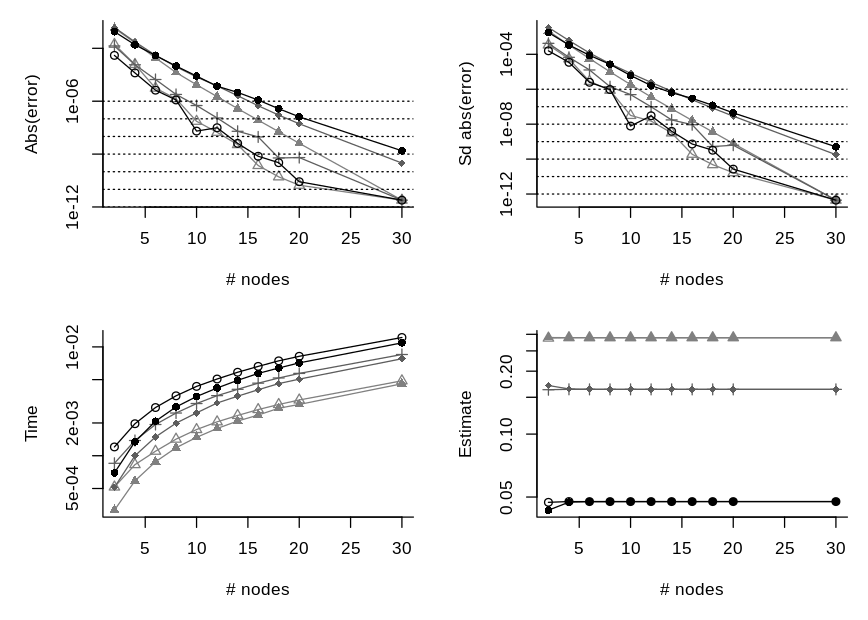
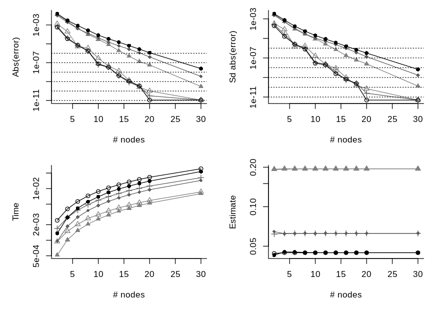
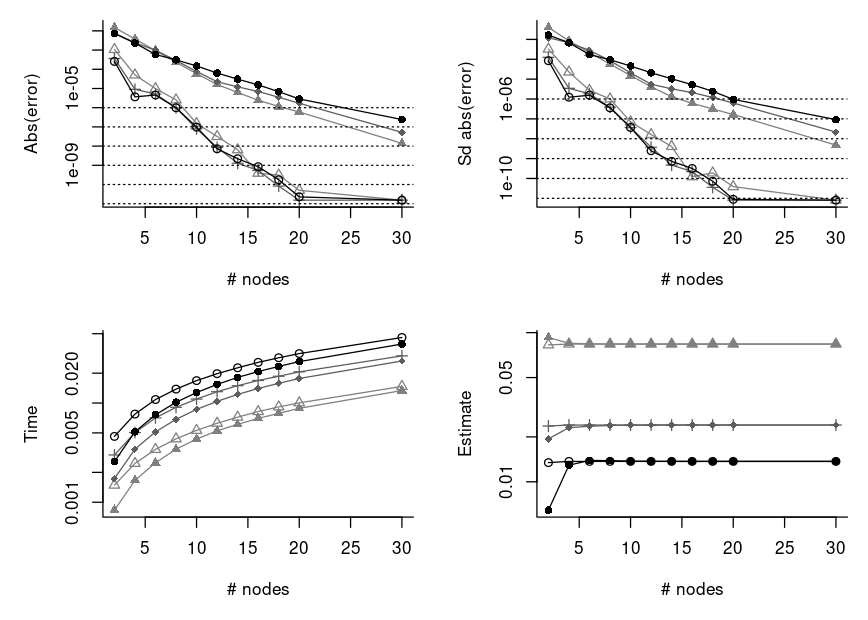
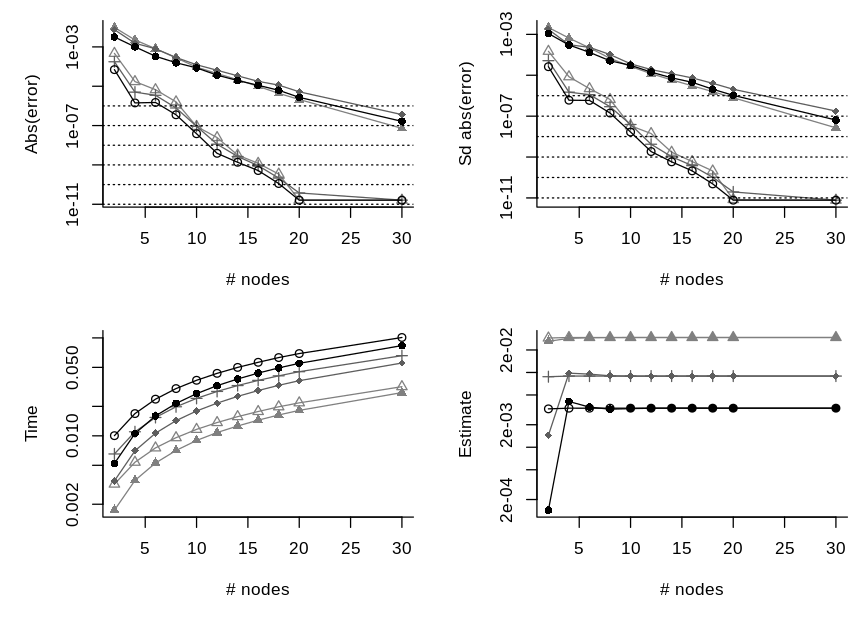

Mixed Models with a Probit Link
===============================

We make a comparison below of making an approximation of a marginal
likelihood factor that is typical in many mixed effect models with a
probit link function. The particular model we use here is mixed probit
model where the observed outcomes are binary. In this model, a marginal
factor, , for a given
cluster is

![\\begin{align\*}
L &= \\int \\phi^{(p)}(\\vec u; \\vec 0, \\Sigma)
  \\prod\_{i = 1}^n 
  \\Phi(\\eta\_i + \\vec z\_i^\\top\\vec u)^{y\_i} 
  \\Phi(-\\eta\_i-\\vec z\_i^\\top\\vec u)^{1 - y\_i}
  d\\vec u \\\\
\\vec y &\\in \\{0,1\\}^n \\\\
\\phi^{(p)}(\\vec u;\\vec \\mu, \\Sigma) &= 
  \\frac 1{(2\\pi)^{p/2}\\lvert\\Sigma\\rvert^{1/2}}
  \\exp\\left(-\\frac 12 (\\vec u - \\vec\\mu)^\\top\\Sigma^{-1}
                      (\\vec u - \\vec\\mu)\\right), 
  \\quad \\vec u \\in\\mathbb{R}^p\\\\
\\Phi(x) &= \\int\_0^x\\phi^{(1)}(z;0,1)dz
\\end{align\*}](https://latex.codecogs.com/svg.latex?%5Cbegin%7Balign%2A%7D%0AL%20%26%3D%20%5Cint%20%5Cphi%5E%7B%28p%29%7D%28%5Cvec%20u%3B%20%5Cvec%200%2C%20%5CSigma%29%0A%20%20%5Cprod_%7Bi%20%3D%201%7D%5En%20%0A%20%20%5CPhi%28%5Ceta_i%20%2B%20%5Cvec%20z_i%5E%5Ctop%5Cvec%20u%29%5E%7By_i%7D%20%0A%20%20%5CPhi%28-%5Ceta_i-%5Cvec%20z_i%5E%5Ctop%5Cvec%20u%29%5E%7B1%20-%20y_i%7D%0A%20%20d%5Cvec%20u%20%5C%5C%0A%5Cvec%20y%20%26%5Cin%20%5C%7B0%2C1%5C%7D%5En%20%5C%5C%0A%5Cphi%5E%7B%28p%29%7D%28%5Cvec%20u%3B%5Cvec%20%5Cmu%2C%20%5CSigma%29%20%26%3D%20%0A%20%20%5Cfrac%201%7B%282%5Cpi%29%5E%7Bp%2F2%7D%5Clvert%5CSigma%5Crvert%5E%7B1%2F2%7D%7D%0A%20%20%5Cexp%5Cleft%28-%5Cfrac%2012%20%28%5Cvec%20u%20-%20%5Cvec%5Cmu%29%5E%5Ctop%5CSigma%5E%7B-1%7D%0A%20%20%20%20%20%20%20%20%20%20%20%20%20%20%20%20%20%20%20%20%20%20%28%5Cvec%20u%20-%20%5Cvec%5Cmu%29%5Cright%29%2C%20%0A%20%20%5Cquad%20%5Cvec%20u%20%5Cin%5Cmathbb%7BR%7D%5Ep%5C%5C%0A%5CPhi%28x%29%20%26%3D%20%5Cint_0%5Ex%5Cphi%5E%7B%281%29%7D%28z%3B0%2C1%29dz%0A%5Cend%7Balign%2A%7D "\begin{align*}
L &= \int \phi^{(p)}(\vec u; \vec 0, \Sigma)
  \prod_{i = 1}^n 
  \Phi(\eta_i + \vec z_i^\top\vec u)^{y_i} 
  \Phi(-\eta_i-\vec z_i^\top\vec u)^{1 - y_i}
  d\vec u \\
\vec y &\in \{0,1\}^n \\
\phi^{(p)}(\vec u;\vec \mu, \Sigma) &= 
  \frac 1{(2\pi)^{p/2}\lvert\Sigma\rvert^{1/2}}
  \exp\left(-\frac 12 (\vec u - \vec\mu)^\top\Sigma^{-1}
                      (\vec u - \vec\mu)\right), 
  \quad \vec u \in\mathbb{R}^p\\
\Phi(x) &= \int_0^x\phi^{(1)}(z;0,1)dz
\end{align*}")

where
 can
be a fixed effect like

for some fixed effect covariate

and fixed effect coefficients

and 
is an unobserved random effect for the cluster.

The [quick comparison](#quick-comparison) section may be skipped unless
you want to get a grasp at what is implemented and see the definitions
of the functions that is used in this markdown. The [more rigorous
comparison](#more-rigorous-comparison) section is the main section of
this markdown. It contains an example where we vary the number of
observed outcomes, `n`, and the number of random effect, `p`, while
considering the computation time of various approximation methods for a
fixed relative error. A real data application is provided in
[examples/salamander.md](examples/salamander.md).

Quick Comparison
----------------

First, we assign a few functions that we are going to use.

``` r
aprx <- within(list(), {
  #####
  # returns a function to perform Gaussian Hermite quadrature (GHQ).
  #
  # Args:
  #   y: n length logical vector with for whether the observation has an 
  #      event.
  #   eta: n length numeric vector with offset on z-scale.
  #   Z: p by n matrix with random effect covariates. 
  #   S: n by n matrix with random effect covaraites.
  #   b: number of nodes to use with GHQ.
  get_GHQ_R <- function(y, eta, Z, S, b){
    library(fastGHQuad)
    library(compiler)
    rule <- gaussHermiteData(b)
    S_chol <- chol(S)
    
    # integrand
    f <- function(x)
      sum(mapply(pnorm, q = eta + sqrt(2) * drop(x %*% S_chol %*% Z),
               lower.tail = y, log.p = TRUE))
    
    # get all permutations of weights and values
    idx <- do.call(expand.grid, replicate(p, 1:b, simplify = FALSE))
    xs <- local({
      args <- list(FUN = c, SIMPLIFY = FALSE)
      do.call(mapply, c(args, lapply(idx, function(i) rule$x[i])))
    })
    ws_log <- local({
      args <- list(FUN = prod)
      log(do.call(mapply, c(args, lapply(idx, function(i) rule$w[i]))))
    })
    
    # final function to return
    out <- function()
      sum(exp(ws_log + vapply(xs, f, numeric(1L)))) / pi^(p / 2)
    f   <- cmpfun(f)
    out <- cmpfun(out)
    out
  }
  
  #####
  # returns a function to perform Gaussian Hermite quadrature (GHQ) using 
  # the C++ implemtation.
  # 
  # Args:
  #   y: n length logical vector with for whether the observation has an 
  #      event.
  #   eta: n length numeric vector with offset on z-scale.
  #   Z: p by n matrix with random effect covariates. 
  #   S: n by n matrix with random effect covaraites.
  #   b: number of nodes to use with GHQ.
  #   is_adaptive: logical for whether to use adaptive GHQ.
  get_GHQ_cpp <- function(y, eta, Z, S, b, is_adaptive = FALSE){
    mixprobit:::set_GH_rule_cached(b)
    function()
      mixprobit:::aprx_binary_mix_ghq(y = y, eta = eta, Z = Z, Sigma = S,
                                      b = b, is_adaptive = is_adaptive)
  }
  get_AGHQ_cpp <- get_GHQ_cpp
  formals(get_AGHQ_cpp)$is_adaptive <- TRUE
  
  #####
  # returns a function that returns the CDF approximation like in Pawitan 
  # et al. (2004).
  #
  # Args:
  #   y: n length logical vector with for whether the observation has an 
  #      event.
  #   eta: n length numeric vector with offset on z-scale.
  #   Z: p by n matrix with random effect covariates. 
  #   S: n by n matrix with random effect covaraites.
  #   maxpts: maximum number of function values as integer. 
  #   abseps: absolute error tolerance.
  #   releps: relative error tolerance.
  get_cdf_R <- function(y, eta, Z, S, maxpts, abseps = 1e-5, releps = -1){
    library(compiler)
    library(mvtnorm)
    p <- NROW(Z)
    
    out <- function(){
      dum_vec <- ifelse(y, 1, -1)
      Z_tilde <- Z * rep(dum_vec, each = p)
      SMat <- crossprod(Z_tilde , S %*% Z_tilde)
      diag(SMat) <- diag(SMat) + 1
      pmvnorm(upper = dum_vec * eta, mean = rep(0, n), sigma = SMat,
              algorithm = GenzBretz(maxpts = maxpts, abseps = abseps, 
                                    releps = releps))
    }
    out <- cmpfun(out)
    out
  }
  
  #####
  # returns a function that returns the CDF approximation like in Pawitan 
  # et al. (2004) using the C++ implementation.
  #
  # Args:
  #   y: n length logical vector with for whether the observation has an 
  #      event.
  #   eta: n length numeric vector with offset on z-scale.
  #   Z: p by n matrix with random effect covariates. 
  #   S: n by n matrix with random effect covaraites.
  #   maxpts: maximum number of function values as integer. 
  #   abseps: bsolute error tolerance.
  #   releps: relative error tolerance.
  get_cdf_cpp <- function(y, eta, Z, S, maxpts, abseps = -1, 
                          releps = 1e-3)
    function()
      mixprobit:::aprx_binary_mix_cdf(
        y = y, eta = eta, Z = Z, Sigma = S, maxpts = maxpts,
        abseps = abseps, releps = releps)
  
  #####
  # returns a function that uses the method from Genz & Monahan (1999).
  #
  # Args:
  #   y: n length logical vector with for whether the observation has an 
  #      event.
  #   eta: n length numeric vector with offset on z-scale.
  #   Z: p by n matrix with random effect covariates. 
  #   S: n by n matrix with random effect covaraites.
  #   maxpts: maximum number of function values as integer. 
  #   abseps: bsolute error tolerance.
  #   releps: relative error tolerance.
  #   is_adaptive: logical for whether to use adaptive method.
  get_sim_mth <- function(y, eta, Z, S, maxpts, abseps = 1e-5, releps = -1, 
                          is_adaptive = FALSE)
    # Args: 
    #   key: integer which determines degree of integration rule.
    function(key)
      mixprobit:::aprx_binary_mix(
        y = y, eta = eta, Z = Z, Sigma = S, maxpts = maxpts, key = key, 
        abseps = abseps, releps = releps, is_adaptive = is_adaptive)
  get_Asim_mth <- get_sim_mth
  formals(get_Asim_mth)$is_adaptive <- TRUE
  
  #####
  # returns a function that uses Quasi-monte carlo integration to 
  # approximate the integrals. 
  # 
  # Args:
  #   y: n length logical vector with for whether the observation has an 
  #      event.
  #   eta: n length numeric vector with offset on z-scale.
  #   Z: p by n matrix with random effect covariates. 
  #   S: n by n matrix with random effect covaraites.
  #   maxpts: integer with maximum number of points to use. 
  #   is_adaptive: logical for whether to use an adaptive method.
  #   releps: relative error tolerance.
  #   n_seqs: number of randomized sobol sequences.
  #   abseps: unused.
  get_qmc <- function(y, eta, Z, S, maxpts, is_adaptive = FALSE, 
                      releps = 1e-4, n_seqs = 10L, abseps)
    function(){
      seeds <- sample.int(2147483646L, n_seqs)
      mixprobit:::aprx_binary_mix_qmc(
        y = y, eta = eta, Z = Z, Sigma = S, n_max = maxpts, 
        is_adaptive = is_adaptive, seeds = seeds, releps = releps)
    }
  get_Aqmc <- get_qmc
  formals(get_Aqmc)$is_adaptive <- TRUE
})
```

Then we assign a function to get a simulated data set for a single
cluster within a mixed probit model with binary outcomes.

``` r
#####
# returns a simulated data set from one cluster in a mixed probit model 
# with binary outcomes.
# 
# Args:
#   n: cluster size.
#   p: number of random effects.
get_sim_dat <- function(n, p){
  out <- list(n = n, p = p)
  within(out, {
    Z <- do.call(                        # random effect design matrix
      rbind, c(list(sqrt(1/p)), 
               list(replicate(n, rnorm(p - 1L, sd = sqrt(1/p))))))
    eta <- rnorm(n)                      # fixed offsets/fixed effects
    n <- NCOL(Z)                         # number of individuals
    p <- NROW(Z)                         # number of random effects
    S <- drop(                           # covariance matrix of random effects
      rWishart(1, 5 * p, diag(1 / p / 5, p)))
    S_chol <- chol(S)
    u <- drop(rnorm(p) %*% S_chol)       # random effects
    y <- runif(n) < pnorm(drop(u %*% Z)) # observed outcomes
  })
}
```

The variance of the linear predictor given the random effect is
independent of the random effect dimension, `p`.

``` r
var(replicate(1000, with(get_sim_dat(10, 2), u %*% Z + eta)))
#> [1] 2.08
var(replicate(1000, with(get_sim_dat(10, 3), u %*% Z + eta)))
#> [1] 2.014
var(replicate(1000, with(get_sim_dat(10, 4), u %*% Z + eta)))
#> [1] 2.023
var(replicate(1000, with(get_sim_dat(10, 5), u %*% Z + eta)))
#> [1] 2.02
var(replicate(1000, with(get_sim_dat(10, 6), u %*% Z + eta)))
#> [1] 2.081
var(replicate(1000, with(get_sim_dat(10, 7), u %*% Z + eta)))
#> [1] 2.025
var(replicate(1000, with(get_sim_dat(10, 8), u %*% Z + eta)))
#> [1] 1.995
```

Next we perform a quick example.

``` r
set.seed(2)

#####
# parameters to change
n <- 10L              # cluster size
p <- 4L               # number of random effects
b <- 15L              # number of nodes to use with GHQ
maxpts <- p * 10000L  # factor to set the (maximum) number of
                      # evaluations of the integrand with
                      # the other methods

#####
# variables used in simulation
dat <- get_sim_dat(n = n, p = p)

# shorter than calling `with(dat, ...)`
wd <- function(expr)
  eval(bquote(with(dat, .(substitute(expr)))), parent.frame())

#####
# get the functions to use
GHQ_R    <- wd(aprx$get_GHQ_R   (y = y, eta = eta, Z = Z, S = S, b = b))
#> Loading required package: Rcpp
GHQ_cpp  <- wd(aprx$get_GHQ_cpp (y = y, eta = eta, Z = Z, S = S, b = b))
AGHQ_cpp <- wd(aprx$get_AGHQ_cpp(y = y, eta = eta, Z = Z, S = S, b = b))

cdf_aprx_R   <- wd(aprx$get_cdf_R  (y = y, eta = eta, Z = Z, S = S, 
                                    maxpts = maxpts))
cdf_aprx_cpp <- wd(aprx$get_cdf_cpp(y = y, eta = eta, Z = Z, S = S, 
                                    maxpts = maxpts))

qmc_aprx <- wd(
  aprx$get_qmc(y = y, eta = eta, Z = Z, S = S, maxpts = maxpts))
qmc_Aaprx <- wd(
  aprx$get_Aqmc(y = y, eta = eta, Z = Z, S = S, maxpts = maxpts))

sim_aprx <-  wd(aprx$get_sim_mth(y = y, eta = eta, Z = Z, S = S, 
                                 maxpts = maxpts))
sim_Aaprx <- wd(aprx$get_Asim_mth(y = y, eta = eta, Z = Z, S = S, 
                                  maxpts = maxpts))

#####
# compare results. Start with the simulation based methods with a lot of
# samples. We take this as the ground truth
truth_maybe_cdf <- wd( 
  aprx$get_cdf_cpp (y = y, eta = eta, Z = Z, S = S, maxpts = 1e7, 
                    abseps = 1e-11))()
truth_maybe_cdf
#> [1] 6.184e-05
#> attr(,"inform")
#> [1] 0
#> attr(,"error")
#> [1] 3.471e-08

truth_maybe_qmc <- wd(
  aprx$get_qmc(y = y, eta = eta, Z = Z, S = S, maxpts = 1e7, 
               releps = 1e-11)())
truth_maybe_qmc
#> [1] 6.184e-05
#> attr(,"intvls")
#> [1] 10000000
#> attr(,"error")
#> [1] 6.227e-10

truth_maybe_Aqmc <- wd(
  aprx$get_Aqmc(y = y, eta = eta, Z = Z, S = S, maxpts = 1e7, 
                releps = 1e-11)())
truth_maybe_Aqmc
#> [1] 6.184e-05
#> attr(,"intvls")
#> [1] 10000000
#> attr(,"error")
#> [1] 3.495e-10

truth_maybe_Amc <- wd(
  aprx$get_Asim_mth(y = y, eta = eta, Z = Z, S = S, maxpts = 1e7, 
                    abseps = 1e-11)(2L))
truth_maybe_Amc
#> [1] 6.184e-05
#> attr(,"error")
#> [1] 1.082e-09
#> attr(,"inform")
#> [1] 1
#> attr(,"inivls")
#> [1] 9999991

truth <- wd(
  mixprobit:::aprx_binary_mix_brute(y = y, eta = eta, Z = Z, Sigma = S, 
                                    n_sim = 1e8, n_threads = 6L))

c(Estiamte = truth, SE = attr(truth, "SE"),  
  `Estimate (log)` = log(c(truth)),  
  `SE (log)` = abs(attr(truth, "SE") / truth))
#>       Estiamte             SE Estimate (log)       SE (log) 
#>      6.184e-05      2.566e-10     -9.691e+00      4.149e-06

tr <- c(truth)
all.equal(tr, c(truth_maybe_cdf))
#> [1] "Mean relative difference: 5.269e-05"
all.equal(tr, c(truth_maybe_qmc))
#> [1] "Mean relative difference: 2.435e-05"
all.equal(tr, c(truth_maybe_Aqmc))
#> [1] "Mean relative difference: 9.696e-06"
all.equal(tr, c(truth_maybe_Amc))
#> [1] "Mean relative difference: 1.157e-05"

# compare with using fewer samples and GHQ
all.equal(tr,   GHQ_R())
#> [1] "Mean relative difference: 2.226e-05"
all.equal(tr,   GHQ_cpp())
#> [1] "Mean relative difference: 2.226e-05"
all.equal(tr,   AGHQ_cpp())
#> [1] "Mean relative difference: 2.068e-06"
comp <- function(f, ...)
  mean(replicate(10, abs((tr - c(f())) / tr)))
comp(cdf_aprx_R)
#> [1] 9.598e-05
comp(qmc_aprx)
#> [1] 0.001256
comp(qmc_Aaprx)
#> [1] 0.0002439
comp(cdf_aprx_cpp)
#> [1] 0.0001169
comp(function() sim_aprx(1L))
#> [1] 0.05793
comp(function() sim_aprx(2L))
#> [1] 0.03377
comp(function() sim_aprx(3L))
#> [1] 0.0103
comp(function() sim_aprx(4L))
#> [1] 0.02776
comp(function() sim_Aaprx(1L))
#> [1] 0.002089
comp(function() sim_Aaprx(2L))
#> [1] 0.001733
comp(function() sim_Aaprx(3L))
#> [1] 0.0008932
comp(function() sim_Aaprx(4L))
#> [1] 0.002019

# compare computations times
system.time(GHQ_R()) # way too slow (seconds!). Use C++ method instead
#>    user  system elapsed 
#>   1.412   0.000   1.412
microbenchmark::microbenchmark(
  `GHQ (C++)` = GHQ_cpp(), `AGHQ (C++)` = AGHQ_cpp(),
  `CDF` = cdf_aprx_R(), `CDF (C++)` = cdf_aprx_cpp(),
  QMC = qmc_aprx(), `QMC Adaptive` = qmc_Aaprx(),
  `Genz & Monahan (1)` = sim_aprx(1L), `Genz & Monahan (2)` = sim_aprx(2L),
  `Genz & Monahan (3)` = sim_aprx(3L), `Genz & Monahan (4)` = sim_aprx(4L),
  `Genz & Monahan Adaptive (2)` = sim_Aaprx(2L),
  times = 10)
#> Unit: microseconds
#>                         expr     min      lq    mean  median      uq     max
#>                    GHQ (C++) 35097.6 35444.0 36035.5 35736.6 36363.7 38062.2
#>                   AGHQ (C++) 35889.2 36418.0 37586.4 37584.3 38926.4 39055.3
#>                          CDF 21157.2 21633.1 22548.7 23205.8 23269.6 23325.2
#>                    CDF (C++) 11227.5 11277.2 11659.7 11460.2 12117.6 12245.2
#>                          QMC 27550.9 28034.7 28829.9 28748.4 29823.2 29997.9
#>                 QMC Adaptive 29233.7 29452.1 30568.5 30780.9 31565.2 31756.5
#>           Genz & Monahan (1)   682.7   785.2   850.8   877.9   916.6   957.5
#>           Genz & Monahan (2)   699.8   715.8   738.3   719.9   762.8   793.4
#>           Genz & Monahan (3)   690.7   698.3   712.8   709.3   730.3   737.5
#>           Genz & Monahan (4)   735.2   760.0   801.7   808.7   844.8   845.5
#>  Genz & Monahan Adaptive (2)   727.8   747.0   775.6   777.0   802.4   824.0
#>  neval
#>     10
#>     10
#>     10
#>     10
#>     10
#>     10
#>     10
#>     10
#>     10
#>     10
#>     10
```

More Rigorous Comparison
------------------------

We are interested in a more rigorous comparison. Therefor, we define a
function below which for given number of observation in the cluster,
`n`, and given number of random effects, `p`, performs a repeated number
of runs with each of the methods and returns the computation time (among
other output). To make a fair comparison, we fix the relative error of
the methods before hand such that the relative error is below `releps`,
.
Ground truth is computed with brute force MC using `n_brute`,
,
samples.

Since GHQ is deterministic, we use a number of nodes such that this
number of nodes or `streak_length`, 4, less value of nodes with GHQ
gives a relative error which is below the threshold. We use a minimum of
4 nodes at the time of this writing. The error of the simulation based
methods is approximated using `n_reps`, 20, replications.

``` r
# default parameters
ex_params <- list(
  streak_length = 4L, 
  max_b = 25L, 
  max_maxpts = 2500000L, 
  releps = 2.5e-4,
  min_releps = 1e-6,
  key_use = 3L, 
  n_reps = 20L, 
  n_runs = 5L, 
  n_brute = 1e7, 
  n_brute_max = 1e8, 
  n_brute_sds = 4, 
  qmc_n_seqs = 10L)
```

``` r
# perform a simulations run for a given number of observations and random 
# effects. First we fix the relative error of each method such that it is
# below a given threshold. Then we run each method a number of times to 
# measure the computation time. 
# 
# Args:
#   n: number of observations in the cluster.
#   p: number of random effects. 
#   releps: required relative error. 
#   key_use: integer which determines degree of integration rule for the 
#            method from Genz and Monahan (1999).
#   n_threads: number of threads to use.
#   n_fail: only used by the function if a brute force estimator cannot
#           get within the precision.
sim_experiment <- function(n, p, releps = ex_params$releps, 
                           key_use = ex_params$key_use, n_threads = 1L, 
                           n_fail = 0L){
  # in some cases we may not want to run the simulation experiment
  do_not_run <- FALSE
  
  # simulate data
  dat <- get_sim_dat(n = n, p = p)
  
  # shorter than calling `with(dat, ...)`
  wd <- function(expr)
    eval(bquote(with(dat, .(substitute(expr)))), parent.frame())
  
  # get the assumed ground truth
  if(do_not_run){
    truth <- SE_truth <- NA_real_
    n_brute <- NA_integer_
    find_brute_failed <- FALSE
    
  } else {
    passed <- FALSE
    n_brute <- NA_integer_
    find_brute_failed <- FALSE
    
    while(!passed){
      if(!is.na(n_brute) && n_brute >= ex_params$n_brute_max){
        n_brute <- NA_integer_
        find_brute_failed <- TRUE
        break
      }
      
      n_brute <- if(is.na(n_brute))
        ex_params$n_brute 
      else 
        min(ex_params$n_brute_max, 
            n_brute * as.integer(ceiling(1.2 * (SE_truth / eps)^2)))
      
      truth <- wd(mixprobit:::aprx_binary_mix_brute(
        y = y, eta = eta, Z = Z, Sigma = S, n_sim = n_brute, 
        n_threads = n_threads))
      
      SE_truth <- abs(attr(truth, "SE") / c(truth))
      eps <- ex_params$releps / ex_params$n_brute_sds * abs(log(c(truth)))
      passed <- SE_truth < eps
    }
      
    truth <- c(truth)
  }
  
  if(find_brute_failed){
    # we failed to find a brute force estimator within the precision. 
    # We repeat with a new data set
    cl <- match.call()
    cl$n_fail <- n_fail + 1L
    return(eval(cl, parent.frame()))
  }
  
  # function to test whether the value is ok
  is_ok_func <- function(vals){
    test_val <- (log(vals) - log(truth)) / log(truth) 
    if(!all(is.finite(test_val)))
      stop("non-finite 'vals'")
    sqrt(mean(test_val^2)) < releps / 2
  }
      
  # get function to use with GHQ
  get_b <- function(meth){
    if(do_not_run)
      NA_integer_
    else local({
      apx_func <- function(b)
        wd(meth(y = y, eta = eta, Z = Z, S = S, b = b))()
      
      # length of node values which have a relative error below the threshold
      streak_length <- ex_params$streak_length
      vals <- rep(NA_real_, streak_length)
      
      b <- streak_length
      for(i in 1:(streak_length - 1L))
        vals[i + 1L] <- apx_func(b - streak_length + i)
      repeat {
        vals[1:(streak_length - 1L)] <- vals[-1]
        vals[streak_length] <- apx_func(b)
        
        if(all(is_ok_func(vals)))
          break
        
        b <- b + 1L
        if(b > ex_params$max_b){
          warning("found no node value")
          b <- NA_integer_
          break
        }
      }
      b
    })
  }
  
  is_to_large_for_ghq <- n > 16L || p >= 5L
  b_use <- if(is_to_large_for_ghq)
    NA_integer_ else get_b(aprx$get_GHQ_cpp)
  ghq_func <- if(!is.na(b_use))
    wd(aprx$get_GHQ_cpp(y = y, eta = eta, Z = Z, S = S, b = b_use))
  else
    NA
  
  # get function to use with AGHQ
  b_use_A <- get_b(aprx$get_AGHQ_cpp)
  aghq_func <- if(!is.na(b_use_A))
    wd(aprx$get_AGHQ_cpp(y = y, eta = eta, Z = Z, S = S, b = b_use_A))
  else
    NA
  
  # get function to use with CDF method
  get_releps <- function(meth){
    if(do_not_run)
      NA_integer_
    else {
      releps_use <- releps * 1000
      repeat {
        func <- wd(meth(y = y, eta = eta, Z = Z, S = S, 
                        maxpts = ex_params$max_maxpts, 
                        abseps = -1, releps = releps_use))
        if("key" %in% names(formals(func)))
          formals(func)$key <- ex_params$key_use
        vals <- replicate(ex_params$n_reps, {
          v <- func()
          inivls <- if("inivls" %in% names(attributes(v)))
            attr(v, "inivls") else NA_integer_
          c(value = v, error = attr(v, "error"), inivls = inivls)
        })
        
        inivls_ok <- all(
          is.na(vals["inivls", ]) | 
            vals["inivls", ] / ex_params$max_maxpts < .999999)
        
        if(all(is_ok_func(vals["value", ])) && inivls_ok)
          break
        
        releps_use <- if(!inivls_ok) 
          # no point in doing any more computations
          ex_params$min_releps / 10 else 
            releps_use / 2
        if(releps_use < ex_params$min_releps){
          warning("found no releps for CDF method")
          releps_use <- NA_integer_
          break
        }
      }
      releps_use
    }
  }
  
  cdf_releps <- get_releps(aprx$get_cdf_cpp)
  cdf_func <- if(!is.na(cdf_releps))
    wd(aprx$get_cdf_cpp(y = y, eta = eta, Z = Z, S = S, 
                        maxpts = ex_params$max_maxpts, abseps = -1, 
                        releps = cdf_releps))
  else 
    NA
  
  # get function to use with Genz and Monahan method
  # sim_releps <- if(is_to_large_for_ghq) 
  #   NA_integer_ else get_releps(aprx$get_sim_mth)
  sim_releps <- NA_integer_ # just do not use it. It is __very__ slow in  
                            # some cases
  sim_func <- if(!is.na(sim_releps))
    wd(aprx$get_sim_mth(y = y, eta = eta, Z = Z, S = S, 
                        maxpts = ex_params$max_maxpts, abseps = -1, 
                        releps = sim_releps))
  else 
    NA
  if(is.function(sim_func))
    formals(sim_func)$key <- key_use
  
  # do the same with the adaptive version
  Asim_releps <- get_releps(aprx$get_Asim_mth)
  Asim_func <- if(!is.na(Asim_releps))
    wd(aprx$get_Asim_mth(y = y, eta = eta, Z = Z, S = S, 
                         maxpts = ex_params$max_maxpts, abseps = -1, 
                         releps = Asim_releps))
  else 
    NA
  if(is.function(Asim_func))
    formals(Asim_func)$key <- key_use
  
  # get function to use with QMC
  formals(aprx$get_qmc)$n_seqs <- ex_params$qmc_n_seqs
  qmc_releps <- if(is_to_large_for_ghq)
    NA_integer_ else get_releps(aprx$get_qmc)
  qmc_func <- if(!is.na(qmc_releps))
     wd(aprx$get_qmc(y = y, eta = eta, Z = Z, S = S, 
                     maxpts = ex_params$max_maxpts, abseps = -1,
                     releps = qmc_releps, 
                     n_seqs = ex_params$qmc_n_seqs))
  else 
    NA

  # get function to use with adaptive QMC
  Aqmc_releps <- get_releps(aprx$get_Aqmc)
  formals(aprx$get_Aqmc)$n_seqs <- ex_params$qmc_n_seqs
  Aqmc_func <- if(!is.null(Aqmc_releps))
    wd(aprx$get_Aqmc(y = y, eta = eta, Z = Z, S = S, 
                     maxpts = ex_params$max_maxpts, abseps = -1,
                     releps = Aqmc_releps, 
                     n_seqs = ex_params$qmc_n_seqs))
  else 
    NA
    
  # perform the comparison
  out <- sapply(
    list(GHQ = ghq_func, AGHQ = aghq_func, CDF = cdf_func, 
         GenzMonahan = sim_func, GenzMonahanA = Asim_func, 
         QMC = qmc_func, QMCA = Aqmc_func), 
    function(func){
      if(!is.function(func) && is.na(func)){
        out <- rep(NA_real_, 7L)
        names(out) <- c("mean", "sd", "mse", "user.self", 
                        "sys.self", "elapsed", "rel_rmse")
        return(out)
      }
      
      # number of runs used to estimate the computation time, etc.
      n_runs <- ex_params$n_runs
      
      # perform the computations to estimate the computation times
      ti <- system.time(vals <- replicate(n_runs, {
        out <- func()
        if(!is.null(err <- attr(out, "error"))){
          # only of of the two methods needs an adjustment of the sd! 
          # TODO: this is very ad hoc...
          is_genz_mona <- !is.null(environment(func)$is_adaptive)

          sd <- if(is_genz_mona)
            err else err / 2.5
          
          out <- c(value = out, sd = sd)
        }
        out
      }))
      
      # handle computation of sd and mse
      is_ghq <- !is.null(b <- environment(func)$b)
      if(is_ghq){
        # if it is GHQ then we alter the number of nodes to get an sd 
        # estiamte etc.
        sl <- ex_params$streak_length
        other_vs <- sapply((b - sl + 1):b, function(b){
          environment(func)$b <- b
          func()
        })
        
        vs <- c(other_vs, vals[1])
        sd_use <- sd(vs)
        mse <- mean((vs - truth)^2)
        rel_rmse <- sqrt(mean(((log(vs) - log(truth)) / log(truth))^2))
        
      } else {
        # we combine the variance estimators
        sd_use <- sqrt(mean(vals["sd", ]^2))
        vals <- vals["value", ]
        mse <- mean((vals - truth)^2)
        rel_rmse <- sqrt(mean(((log(vals) - log(truth)) / log(truth))^2))
        
      }
      
      c(mean = mean(vals), sd = sd_use, mse = mse, ti[1:3] / n_runs, 
        rel_rmse = rel_rmse)            
    })
  
  structure(list(
    b_use = b_use, b_use_A = b_use_A, cdf_releps = cdf_releps, 
    sim_releps = sim_releps, Asim_releps = Asim_releps, 
    qmc_releps = qmc_releps, Aqmc_releps = Aqmc_releps,
    ll_truth = log(truth), SE_truth = SE_truth, n_brute = n_brute, 
    n_fail = n_fail, vals_n_comp_time = out), 
    class = "sim_experiment")
}
```

Here is a few quick examples where we use the function we just defined.

``` r
print.sim_experiment <- function(x, ...){
  old <- options()
  on.exit(options(old))
  options(digits = 6, scipen = 999)
  
  cat(
    sprintf("         # brute force samples: %13d", x$n_brute),
    sprintf("                  # nodes  GHQ: %13d", x$b_use),
    sprintf("                  # nodes AGHQ: %13d", x$b_use_A),
    sprintf("                    CDF releps: %13.8f", x$cdf_releps), 
    sprintf("         Genz & Monahan releps: %13.8f", x$sim_releps),
    sprintf("Adaptive Genz & Monahan releps: %13.8f", x$Asim_releps), 
    sprintf("                    QMC releps: %13.8f", x$qmc_releps),
    sprintf("           Adaptive QMC releps: %13.8f", x$Aqmc_releps), 
    sprintf("  Log-likelihood estiamte (SE): %13.8f (%.8f)", x$ll_truth, 
            x$SE_truth), 
    "", sep = "\n")
  
  xx <- x$vals_n_comp_time["mean", ]
  print(cbind(`Mean estimate (likelihood)`     = xx, 
              `Mean estimate (log-likelihood)` = log(xx)))
  
  mult <- 1 / ex_params$releps
  cat(sprintf("\nSD & RMSE (/%.2f)\n", mult))
  print(rbind(SD   = x$vals_n_comp_time ["sd", ],  
              RMSE = sqrt(x$vals_n_comp_time ["mse", ]), 
              `sqrt rel RMSE` = x$vals_n_comp_time["rel_rmse", ]) * mult)
  
  cat("\nComputation times\n")
  print(x$vals_n_comp_time["elapsed", ])
}

set.seed(1)
sim_experiment(n = 3L , p = 2L, n_threads = 6L)
#>          # brute force samples:      10000000
#>                   # nodes  GHQ:             9
#>                   # nodes AGHQ:             6
#>                     CDF releps:    0.25000000
#>          Genz & Monahan releps:            NA
#> Adaptive Genz & Monahan releps:    0.25000000
#>                     QMC releps:    0.00048828
#>            Adaptive QMC releps:    0.00097656
#>   Log-likelihood estiamte (SE):   -3.20961388 (0.00000229)
#> 
#>              Mean estimate (likelihood) Mean estimate (log-likelihood)
#> GHQ                           0.0403714                       -3.20963
#> AGHQ                          0.0403721                       -3.20962
#> CDF                           0.0403757                       -3.20953
#> GenzMonahan                          NA                             NA
#> GenzMonahanA                  0.0403761                       -3.20952
#> QMC                           0.0403691                       -3.20969
#> QMCA                          0.0403657                       -3.20978
#> 
#> SD & RMSE (/4000.00)
#>                     GHQ      AGHQ       CDF GenzMonahan GenzMonahanA       QMC
#> SD            0.0582161 0.0153066 0.0376894          NA    0.0181005 0.0243636
#> RMSE          0.0547709 0.0154601 0.0220619          NA    0.0178214 0.0340133
#> sqrt rel RMSE 0.4225473 0.1193230 0.1702429          NA    0.1375231 0.2625160
#>                    QMCA
#> SD            0.0507975
#> RMSE          0.0687086
#> sqrt rel RMSE 0.5303909
#> 
#> Computation times
#>          GHQ         AGHQ          CDF  GenzMonahan GenzMonahanA          QMC 
#>       0.0000       0.0000       0.0002           NA       0.0004       0.0090 
#>         QMCA 
#>       0.0012
sim_experiment(n = 10L, p = 2L, n_threads = 6L)
#>          # brute force samples:      10000000
#>                   # nodes  GHQ:            11
#>                   # nodes AGHQ:             5
#>                     CDF releps:    0.25000000
#>          Genz & Monahan releps:            NA
#> Adaptive Genz & Monahan releps:    0.25000000
#>                     QMC releps:    0.00390625
#>            Adaptive QMC releps:    0.25000000
#>   Log-likelihood estiamte (SE):  -11.55264857 (0.00000296)
#> 
#>              Mean estimate (likelihood) Mean estimate (log-likelihood)
#> GHQ                       0.00000960532                       -11.5532
#> AGHQ                      0.00000961055                       -11.5526
#> CDF                       0.00000961070                       -11.5526
#> GenzMonahan                          NA                             NA
#> GenzMonahanA              0.00000961173                       -11.5525
#> QMC                       0.00000960932                       -11.5528
#> QMCA                      0.00000961052                       -11.5527
#> 
#> SD & RMSE (/4000.00)
#>                        GHQ         AGHQ           CDF GenzMonahan  GenzMonahanA
#> SD            0.0000437314 0.0000437451 0.00000394220          NA 0.00000373715
#> RMSE          0.0000444839 0.0000453557 0.00000307299          NA 0.00000524796
#> sqrt rel RMSE 0.4010852146 0.4090345915 0.02767760409          NA 0.04726314259
#>                        QMC         QMCA
#> SD            0.0000518479 0.0000283780
#> RMSE          0.0000728948 0.0000183886
#> sqrt rel RMSE 0.6574987982 0.1656303332
#> 
#> Computation times
#>          GHQ         AGHQ          CDF  GenzMonahan GenzMonahanA          QMC 
#>       0.0002       0.0002       0.0112           NA       0.0008       0.0052 
#>         QMCA 
#>       0.0012

sim_experiment(n = 3L , p = 5L, n_threads = 6L)
#>          # brute force samples:      10000000
#>                   # nodes  GHQ:            NA
#>                   # nodes AGHQ:             6
#>                     CDF releps:    0.25000000
#>          Genz & Monahan releps:            NA
#> Adaptive Genz & Monahan releps:    0.25000000
#>                     QMC releps:            NA
#>            Adaptive QMC releps:    0.00048828
#>   Log-likelihood estiamte (SE):   -4.76466838 (0.00001055)
#> 
#>              Mean estimate (likelihood) Mean estimate (log-likelihood)
#> GHQ                                  NA                             NA
#> AGHQ                         0.00852566                       -4.76468
#> CDF                          0.00852554                       -4.76469
#> GenzMonahan                          NA                             NA
#> GenzMonahanA                 0.00852345                       -4.76493
#> QMC                                  NA                             NA
#> QMCA                         0.00852509                       -4.76474
#> 
#> SD & RMSE (/4000.00)
#>               GHQ       AGHQ        CDF GenzMonahan GenzMonahanA QMC       QMCA
#> SD             NA 0.00920489 0.00753213          NA    0.0121605  NA 0.00605441
#> RMSE           NA 0.00964111 0.00731891          NA    0.0186877  NA 0.00838645
#> sqrt rel RMSE  NA 0.23740942 0.18014818          NA    0.4601260  NA 0.20646310
#> 
#> Computation times
#>          GHQ         AGHQ          CDF  GenzMonahan GenzMonahanA          QMC 
#>           NA       0.0024       0.0002           NA       0.0004           NA 
#>         QMCA 
#>       0.0090
sim_experiment(n = 10L, p = 5L, n_threads = 6L)
#>          # brute force samples:      10000000
#>                   # nodes  GHQ:            NA
#>                   # nodes AGHQ:             6
#>                     CDF releps:    0.25000000
#>          Genz & Monahan releps:            NA
#> Adaptive Genz & Monahan releps:    0.25000000
#>                     QMC releps:            NA
#>            Adaptive QMC releps:    0.00195312
#>   Log-likelihood estiamte (SE):  -10.40723480 (0.00000930)
#> 
#>              Mean estimate (likelihood) Mean estimate (log-likelihood)
#> GHQ                                  NA                             NA
#> AGHQ                       0.0000302131                       -10.4072
#> CDF                        0.0000302140                       -10.4072
#> GenzMonahan                          NA                             NA
#> GenzMonahanA               0.0000301999                       -10.4077
#> QMC                                  NA                             NA
#> QMCA                       0.0000302202                       -10.4070
#> 
#> SD & RMSE (/4000.00)
#>               GHQ         AGHQ           CDF GenzMonahan GenzMonahanA QMC
#> SD             NA 0.0000416097 0.00000640883          NA  0.000118039  NA
#> RMSE           NA 0.0000411398 0.00000802066          NA  0.000166304  NA
#> sqrt rel RMSE  NA 0.1308868550 0.02550709488          NA  0.529231058  NA
#>                       QMCA
#> SD            0.0000722274
#> RMSE          0.0000624192
#> sqrt rel RMSE 0.1984394328
#> 
#> Computation times
#>          GHQ         AGHQ          CDF  GenzMonahan GenzMonahanA          QMC 
#>           NA       0.0060       0.0120           NA       0.0008           NA 
#>         QMCA 
#>       0.0054

sim_experiment(n = 3L , p = 7L, n_threads = 6L)
#>          # brute force samples:      10000000
#>                   # nodes  GHQ:            NA
#>                   # nodes AGHQ:             6
#>                     CDF releps:    0.25000000
#>          Genz & Monahan releps:            NA
#> Adaptive Genz & Monahan releps:    0.00048828
#>                     QMC releps:            NA
#>            Adaptive QMC releps:    0.00048828
#>   Log-likelihood estiamte (SE):   -2.12486178 (0.00000790)
#> 
#>              Mean estimate (likelihood) Mean estimate (log-likelihood)
#> GHQ                                  NA                             NA
#> AGHQ                           0.119449                       -2.12487
#> CDF                            0.119450                       -2.12486
#> GenzMonahan                          NA                             NA
#> GenzMonahanA                   0.119452                       -2.12484
#> QMC                                  NA                             NA
#> QMCA                           0.119455                       -2.12481
#> 
#> SD & RMSE (/4000.00)
#>               GHQ      AGHQ       CDF GenzMonahan GenzMonahanA QMC     QMCA
#> SD             NA 0.0367776 0.0142816          NA     0.090112  NA 0.075966
#> RMSE           NA 0.0377371 0.0133565          NA     0.106489  NA 0.101288
#> sqrt rel RMSE  NA 0.1486933 0.0526231          NA     0.419552  NA 0.399018
#> 
#> Computation times
#>          GHQ         AGHQ          CDF  GenzMonahan GenzMonahanA          QMC 
#>           NA       0.0958       0.0004           NA       0.0032           NA 
#>         QMCA 
#>       0.0086
sim_experiment(n = 10L, p = 7L, n_threads = 6L)
#>          # brute force samples:      10000000
#>                   # nodes  GHQ:            NA
#>                   # nodes AGHQ:             7
#>                     CDF releps:    0.25000000
#>          Genz & Monahan releps:            NA
#> Adaptive Genz & Monahan releps:    0.00195312
#>                     QMC releps:            NA
#>            Adaptive QMC releps:    0.00195312
#>   Log-likelihood estiamte (SE):   -7.54258790 (0.00003314)
#> 
#>              Mean estimate (likelihood) Mean estimate (log-likelihood)
#> GHQ                                  NA                             NA
#> AGHQ                        0.000529991                       -7.54265
#> CDF                         0.000529996                       -7.54264
#> GenzMonahan                          NA                             NA
#> GenzMonahanA                0.000529996                       -7.54264
#> QMC                                  NA                             NA
#> QMCA                        0.000529725                       -7.54315
#> 
#> SD & RMSE (/4000.00)
#>               GHQ        AGHQ         CDF GenzMonahan GenzMonahanA QMC
#> SD             NA 0.000236334 0.000304065          NA   0.00160484  NA
#> RMSE           NA 0.000363601 0.000280131          NA   0.00141847  NA
#> sqrt rel RMSE  NA 0.090963191 0.070073959          NA   0.35485150  NA
#>                     QMCA
#> SD            0.00151911
#> RMSE          0.00301927
#> sqrt rel RMSE 0.75587775
#> 
#> Computation times
#>          GHQ         AGHQ          CDF  GenzMonahan GenzMonahanA          QMC 
#>           NA       0.6512       0.0106           NA       0.0250           NA 
#>         QMCA 
#>       0.0172
sim_experiment(n = 20L, p = 7L, n_threads = 6L)
#>          # brute force samples:      10000000
#>                   # nodes  GHQ:            NA
#>                   # nodes AGHQ:             6
#>                     CDF releps:    0.25000000
#>          Genz & Monahan releps:            NA
#> Adaptive Genz & Monahan releps:    0.25000000
#>                     QMC releps:            NA
#>            Adaptive QMC releps:    0.00781250
#>   Log-likelihood estiamte (SE):  -25.73334145 (0.00002055)
#> 
#>              Mean estimate (likelihood) Mean estimate (log-likelihood)
#> GHQ                                  NA                             NA
#> AGHQ                0.00000000000667019                       -25.7334
#> CDF                 0.00000000000667064                       -25.7333
#> GenzMonahan                          NA                             NA
#> GenzMonahanA        0.00000000000667716                       -25.7323
#> QMC                                  NA                             NA
#> QMCA                0.00000000000666100                       -25.7348
#> 
#> SD & RMSE (/4000.00)
#>               GHQ               AGHQ                 CDF GenzMonahan
#> SD             NA 0.0000000000221298 0.00000000001086987          NA
#> RMSE           NA 0.0000000000229577 0.00000000000570693          NA
#> sqrt rel RMSE  NA 0.1338732496841358 0.03324246182402630          NA
#>                     GenzMonahanA QMC               QMCA
#> SD            0.0000000000588823  NA 0.0000000000583463
#> RMSE          0.0000000000541107  NA 0.0000000000849527
#> sqrt rel RMSE 0.3150246154268006  NA 0.4964247973959923
#> 
#> Computation times
#>          GHQ         AGHQ          CDF  GenzMonahan GenzMonahanA          QMC 
#>           NA       0.3948       0.0358           NA       0.0016           NA 
#>         QMCA 
#>       0.0048
```

Next, we apply the method a number of times for a of combination of
number of observations, `n`, and number of random effects, `p`.

``` r
# number of observations in the cluster
n_vals <- 2^(1:5)
# number of random effects
p_vals <- 2:7
# grid with all configurations
gr_vals <- expand.grid(n = n_vals, p = p_vals)
# number of replications per configuration
n_runs <- 10L

ex_output <- (function(){
  # setup directory to store data
  cache_dir <- file.path("README_cache", "experiment")
  if(!dir.exists(cache_dir))
    dir.create(cache_dir)
  
  # setup cluster to use
  library(parallel)
  
  # run the experiment
  mcmapply(function(n, p){
    cache_file <- file.path(cache_dir, sprintf("n-%03d-p-%03d.Rds", n, p))
    if(!file.exists(cache_file)){
      message(sprintf("Running setup with   n %3d and p %3d", n, p))
      
      # create file to write progress to
      prg_file <- file.path(getwd(), 
                            sprintf("progress-n-%03d-p-%03d.txt", n, p))
      file.create(prg_file)
      message(sprintf("Follow progress in %s", sQuote(prg_file)))
      on.exit(unlink(prg_file))
      
      set.seed(71771946)
      sim_out <- lapply(1:n_runs, function(...){
        seed <- .Random.seed
        out <- sim_experiment(n = n, p = p)
        attr(out, "seed") <- seed
        
        cat("-", file = prg_file, append = TRUE)
        out
      })
      
      sim_out[c("n", "p")] <- list(n = n, p = p)
      saveRDS(sim_out, cache_file)
    } else
      message(sprintf("Loading results with n %3d and p %3d", n, p))
      
    
    readRDS(cache_file)
  }, n = gr_vals$n, p = gr_vals$p, SIMPLIFY = FALSE, 
  mc.cores = 4L, mc.preschedule = FALSE)
})()
```

We create a table where we summarize the results below. First we start
with the average computation time, then we show the mean scaled RMSE,
and we end by looking at the number of nodes that we need to use with
GHQ. The latter shows why GHQ becomes slower as the cluster size, `n`,
increases. The computation time is in 1000s of a second,
`comp_time_mult`. The mean scaled RMSE is multiplied by
,
`err_mult`.

``` r
comp_time_mult <- 1000 # millisecond
err_mult <- 1e5
```

``` r
#####
# show number of complete cases
.get_nice_names <- function(x){
  x <- gsub(
    "^GenzMonahan$", "Genz & Monahan (1999)", x)
  x <- gsub(
    "^GenzMonahanA$", "Genz & Monahan (1999) Adaptive", x)
  # fix stupid typo at one point
  x <- gsub("^ADHQ$", "AGHQ", x)
  x <- gsub("^QMCA$", "Adaptive QMC", x)
  x
}

local({
  comp_times <- sapply(ex_output, function(x)
    sapply(x[!names(x) %in% c("n", "p")], `[[`, "vals_n_comp_time", 
           simplify = "array"), 
    simplify = "array")
  comp_times <- comp_times["elapsed", , , ]
  n_complete <- apply(!is.na(comp_times), c(1L, 3L), sum)
  
  # flatten the table. Start by getting the row labels
  meths <- rownames(n_complete)
  n_labs <- sprintf("%2d", n_vals)
  rnames <- expand.grid(
    Method = meths, n = n_labs, stringsAsFactors = FALSE)
  rnames[2:1] <- rnames[1:2]
  rnames[[2L]] <- .get_nice_names(rnames[[2L]])
  
  # then flatten
  n_complete <- matrix(c(n_complete), nrow = NROW(rnames))
  n_complete[] <- sprintf("%4d", n_complete[])
  
  # combine computation times and row labels
  table_out <- cbind(as.matrix(rnames), n_complete)
  
  keep <- apply(
    matrix(as.integer(table_out[, -(1:2), drop = FALSE]), 
           nr = NROW(table_out)) > 0L, 1, any)
  table_out <- table_out[keep, , drop = FALSE]
  
  nvs <- table_out[, 1L]
  table_out[, 1L] <- c(
    nvs[1L], ifelse(nvs[-1L] != head(nvs, -1L), nvs[-1L], NA_integer_))
  
  # add header 
  p_labs <- sprintf("%d", p_vals)
  colnames(table_out) <- c("n", "method/p", p_labs)
  
  cat("**Number of complete cases**\n")
  
  options(knitr.kable.NA = "")
  print(knitr::kable(
    table_out, align = c("l", "l", rep("r", length(p_vals)))))
})
```

**Number of complete cases**

| n   | method/p                       |    2|    3|    4|    5|    6|    7|
|:----|:-------------------------------|----:|----:|----:|----:|----:|----:|
| 2   | GHQ                            |   10|   10|   10|    0|    0|    0|
|     | AGHQ                           |   10|   10|   10|   10|   10|   10|
|     | CDF                            |   10|   10|   10|   10|   10|   10|
|     | Genz & Monahan (1999) Adaptive |   10|    9|    9|   10|   10|   10|
|     | QMC                            |   10|   10|   10|    0|    0|    0|
|     | Adaptive QMC                   |   10|   10|   10|   10|   10|   10|
| 4   | GHQ                            |   10|   10|   10|    0|    0|    0|
|     | AGHQ                           |   10|   10|   10|   10|   10|   10|
|     | CDF                            |   10|   10|   10|   10|   10|   10|
|     | Genz & Monahan (1999) Adaptive |   10|   10|   10|   10|   10|   10|
|     | QMC                            |   10|   10|   10|    0|    0|    0|
|     | Adaptive QMC                   |   10|   10|   10|   10|   10|   10|
| 8   | GHQ                            |   10|   10|   10|    0|    0|    0|
|     | AGHQ                           |   10|   10|   10|   10|   10|   10|
|     | CDF                            |   10|   10|   10|   10|   10|   10|
|     | Genz & Monahan (1999) Adaptive |   10|   10|   10|   10|   10|   10|
|     | QMC                            |   10|   10|   10|    0|    0|    0|
|     | Adaptive QMC                   |   10|   10|   10|   10|   10|   10|
| 16  | GHQ                            |    8|   10|   10|    0|    0|    0|
|     | AGHQ                           |   10|   10|   10|   10|   10|   10|
|     | CDF                            |   10|   10|   10|   10|   10|   10|
|     | Genz & Monahan (1999) Adaptive |   10|   10|   10|   10|   10|   10|
|     | QMC                            |   10|   10|   10|    0|    0|    0|
|     | Adaptive QMC                   |   10|   10|   10|   10|   10|   10|
| 32  | AGHQ                           |   10|   10|   10|   10|   10|   10|
|     | CDF                            |   10|   10|   10|   10|   10|   10|
|     | Genz & Monahan (1999) Adaptive |   10|   10|   10|   10|   10|   10|
|     | Adaptive QMC                   |   10|   10|   10|   10|   10|   10|

``` r

#####
# table with computation times
# util functions
.get_cap <- function(remove_nas, na.rm = FALSE, sufix = ""){
  stopifnot(!(remove_nas && na.rm))
  cap <- if(remove_nas && !na.rm)
    "**Only showing complete cases"
  else if(!remove_nas && na.rm)
    "**NAs have been removed. Cells may not be comparable"
  else 
    "**Blank cells have at least one failure"
  paste0(cap, sufix, "**")
}

.show_n_complete <- function(is_complete, n_labs, p_labs){
  n_complete <- matrix(
    colSums(is_complete), length(n_labs), length(p_labs), 
    dimnames = list(n = n_labs, p = p_labs))
  
  cat("\n**Number of complete cases**")
 print(knitr::kable(n_complete, align = rep("r", ncol(n_complete))))
}

# function to create the computation time table
show_run_times <- function(remove_nas = FALSE, na.rm = FALSE, 
                           meth = rowMeans, suffix = " (means)"){
  # get mean computations time for the methods and the configurations pairs
  comp_times <- sapply(ex_output, function(x)
    sapply(x[!names(x) %in% c("n", "p")], `[[`, "vals_n_comp_time", 
           simplify = "array"), 
    simplify = "array")
  comp_times <- comp_times["elapsed", , , ]
  
  is_complete <- apply(comp_times, 3, function(x){
    if(remove_nas){
      consider <- !apply(is.na(x), 1L, all)
      apply(!is.na(x[consider, , drop = FALSE]), 2, all)
    } else 
      rep(TRUE, NCOL(x))
  })
  
  comp_times <- lapply(1:dim(comp_times)[3], function(i){
    x <- comp_times[, , i]
    x[, is_complete[, i]]
  })
  comp_times <- sapply(comp_times, meth, na.rm  = na.rm) * 
    comp_time_mult
  comp_times[is.nan(comp_times)] <- NA_real_
  
  # flatten the table. Start by getting the row labels
  meths <- rownames(comp_times)
  n_labs <- sprintf("%2d", n_vals)
  rnames <- expand.grid(
    Method = meths, n = n_labs, stringsAsFactors = FALSE)
  rnames[2:1] <- rnames[1:2]
  rnames[[2L]] <- .get_nice_names(rnames[[2L]])
  
  # then flatten
  comp_times <- matrix(c(comp_times), nrow = NROW(rnames))
  na_idx <- is.na(comp_times)
  comp_times[] <- sprintf("%.2f", comp_times[])
  comp_times[na_idx] <- NA_character_
  
  # combine computation times and row labels
  table_out <- cbind(as.matrix(rnames), comp_times)
  
  if(na.rm){
    keep <- apply(!is.na(table_out[, -(1:2), drop = FALSE]), 1, any)
    table_out <- table_out[keep, , drop = FALSE]
  }
  
  nvs <- table_out[, 1L]
  table_out[, 1L] <- c(
    nvs[1L], ifelse(nvs[-1L] != head(nvs, -1L), nvs[-1L], NA_integer_))
  
  # add header 
  p_labs <- sprintf("%d", p_vals)
  colnames(table_out) <- c("n", "method/p", p_labs)
  
  cat(.get_cap(remove_nas, na.rm, sufix = suffix))
    
  options(knitr.kable.NA = "")
  print(knitr::kable(
    table_out, align = c("l", "l", rep("r", length(p_vals)))))
  
  if(remove_nas)
    .show_n_complete(is_complete, n_labs, p_labs)
}

show_run_times(FALSE)
```

**Blank cells have at least one failure (means)**

| n   | method/p                       |       2|       3|       4|       5|       6|       7|
|:----|:-------------------------------|-------:|-------:|-------:|-------:|-------:|-------:|
| 2   | GHQ                            |    0.00|    0.20|    1.08|        |        |        |
|     | AGHQ                           |    0.08|    0.12|    0.60|    4.18|   17.92|  185.32|
|     | CDF                            |    0.04|    0.02|    0.06|    0.06|    0.06|    0.06|
|     | Genz & Monahan (1999)          |        |        |        |        |        |        |
|     | Genz & Monahan (1999) Adaptive |  137.88|        |        |  181.02|   11.14|   61.50|
|     | QMC                            |    5.82|   14.48|   19.94|        |        |        |
|     | Adaptive QMC                   |  177.28|  110.92|  153.64|   92.06|   16.04|   95.18|
| 4   | GHQ                            |    0.10|    0.26|    1.56|        |        |        |
|     | AGHQ                           |    0.08|    0.18|    0.78|    5.20|   26.66|  182.42|
|     | CDF                            |    0.44|    0.46|    0.44|    0.48|    0.42|    0.44|
|     | Genz & Monahan (1999)          |        |        |        |        |        |        |
|     | Genz & Monahan (1999) Adaptive |   24.92|   11.36|   23.70|   69.22|   16.08|   44.32|
|     | QMC                            |    8.62|   16.98|   30.80|        |        |        |
|     | Adaptive QMC                   |   46.08|   30.82|   34.70|   36.46|   14.92|   82.90|
| 8   | GHQ                            |    0.14|    1.08|    5.46|        |        |        |
|     | AGHQ                           |    0.08|    0.24|    1.36|    9.84|   48.16|  315.14|
|     | CDF                            |    4.64|    4.48|    4.68|    4.66|    4.62|    4.60|
|     | Genz & Monahan (1999)          |        |        |        |        |        |        |
|     | Genz & Monahan (1999) Adaptive |    2.00|   12.74|   56.08|   27.14|   12.60|   28.88|
|     | QMC                            |   17.52|   55.16|   63.38|        |        |        |
|     | Adaptive QMC                   |   10.78|   47.16|   41.38|   27.88|   17.00|   25.10|
| 16  | GHQ                            |        |    6.64|   29.46|        |        |        |
|     | AGHQ                           |    0.12|    0.40|    2.72|   12.92|   59.14|  554.60|
|     | CDF                            |   34.42|   32.00|   33.96|   32.82|   33.10|   30.42|
|     | Genz & Monahan (1999)          |        |        |        |        |        |        |
|     | Genz & Monahan (1999) Adaptive |    1.44|    9.14|   44.78|   19.90|   13.18|   18.96|
|     | QMC                            |  117.54|  259.38|  620.70|        |        |        |
|     | Adaptive QMC                   |    2.94|   27.58|   41.52|   20.78|   12.32|   21.48|
| 32  | GHQ                            |        |        |        |        |        |        |
|     | AGHQ                           |    0.18|    0.44|    3.10|   17.22|  123.08|  518.66|
|     | CDF                            |   68.28|   68.48|   71.90|   70.54|   71.32|   59.88|
|     | Genz & Monahan (1999)          |        |        |        |        |        |        |
|     | Genz & Monahan (1999) Adaptive |    2.30|    2.48|    9.88|    4.90|    4.44|    6.76|
|     | QMC                            |        |        |        |        |        |        |
|     | Adaptive QMC                   |    2.92|    3.58|   29.92|    7.24|    8.00|    7.44|

``` r
show_run_times(na.rm = TRUE)
```

**NAs have been removed. Cells may not be comparable (means)**

| n   | method/p                       |       2|       3|       4|       5|       6|       7|
|:----|:-------------------------------|-------:|-------:|-------:|-------:|-------:|-------:|
| 2   | GHQ                            |    0.00|    0.20|    1.08|        |        |        |
|     | AGHQ                           |    0.08|    0.12|    0.60|    4.18|   17.92|  185.32|
|     | CDF                            |    0.04|    0.02|    0.06|    0.06|    0.06|    0.06|
|     | Genz & Monahan (1999) Adaptive |  137.88|   20.96|   23.96|  181.02|   11.14|   61.50|
|     | QMC                            |    5.82|   14.48|   19.94|        |        |        |
|     | Adaptive QMC                   |  177.28|  110.92|  153.64|   92.06|   16.04|   95.18|
| 4   | GHQ                            |    0.10|    0.26|    1.56|        |        |        |
|     | AGHQ                           |    0.08|    0.18|    0.78|    5.20|   26.66|  182.42|
|     | CDF                            |    0.44|    0.46|    0.44|    0.48|    0.42|    0.44|
|     | Genz & Monahan (1999) Adaptive |   24.92|   11.36|   23.70|   69.22|   16.08|   44.32|
|     | QMC                            |    8.62|   16.98|   30.80|        |        |        |
|     | Adaptive QMC                   |   46.08|   30.82|   34.70|   36.46|   14.92|   82.90|
| 8   | GHQ                            |    0.14|    1.08|    5.46|        |        |        |
|     | AGHQ                           |    0.08|    0.24|    1.36|    9.84|   48.16|  315.14|
|     | CDF                            |    4.64|    4.48|    4.68|    4.66|    4.62|    4.60|
|     | Genz & Monahan (1999) Adaptive |    2.00|   12.74|   56.08|   27.14|   12.60|   28.88|
|     | QMC                            |   17.52|   55.16|   63.38|        |        |        |
|     | Adaptive QMC                   |   10.78|   47.16|   41.38|   27.88|   17.00|   25.10|
| 16  | GHQ                            |    0.30|    6.64|   29.46|        |        |        |
|     | AGHQ                           |    0.12|    0.40|    2.72|   12.92|   59.14|  554.60|
|     | CDF                            |   34.42|   32.00|   33.96|   32.82|   33.10|   30.42|
|     | Genz & Monahan (1999) Adaptive |    1.44|    9.14|   44.78|   19.90|   13.18|   18.96|
|     | QMC                            |  117.54|  259.38|  620.70|        |        |        |
|     | Adaptive QMC                   |    2.94|   27.58|   41.52|   20.78|   12.32|   21.48|
| 32  | AGHQ                           |    0.18|    0.44|    3.10|   17.22|  123.08|  518.66|
|     | CDF                            |   68.28|   68.48|   71.90|   70.54|   71.32|   59.88|
|     | Genz & Monahan (1999) Adaptive |    2.30|    2.48|    9.88|    4.90|    4.44|    6.76|
|     | Adaptive QMC                   |    2.92|    3.58|   29.92|    7.24|    8.00|    7.44|

``` r
show_run_times(TRUE)
```

**Only showing complete cases (means)**

| n   | method/p                       |       2|       3|       4|       5|       6|       7|
|:----|:-------------------------------|-------:|-------:|-------:|-------:|-------:|-------:|
| 2   | GHQ                            |    0.00|    0.20|    0.93|        |        |        |
|     | AGHQ                           |    0.08|    0.11|    0.53|    4.18|   17.92|  185.32|
|     | CDF                            |    0.04|    0.02|    0.07|    0.06|    0.06|    0.06|
|     | Genz & Monahan (1999)          |        |        |        |        |        |        |
|     | Genz & Monahan (1999) Adaptive |  137.88|   20.96|   23.96|  181.02|   11.14|   61.50|
|     | QMC                            |    5.82|   12.09|   15.80|        |        |        |
|     | Adaptive QMC                   |  177.28|   28.53|   78.89|   92.06|   16.04|   95.18|
| 4   | GHQ                            |    0.10|    0.26|    1.56|        |        |        |
|     | AGHQ                           |    0.08|    0.18|    0.78|    5.20|   26.66|  182.42|
|     | CDF                            |    0.44|    0.46|    0.44|    0.48|    0.42|    0.44|
|     | Genz & Monahan (1999)          |        |        |        |        |        |        |
|     | Genz & Monahan (1999) Adaptive |   24.92|   11.36|   23.70|   69.22|   16.08|   44.32|
|     | QMC                            |    8.62|   16.98|   30.80|        |        |        |
|     | Adaptive QMC                   |   46.08|   30.82|   34.70|   36.46|   14.92|   82.90|
| 8   | GHQ                            |    0.14|    1.08|    5.46|        |        |        |
|     | AGHQ                           |    0.08|    0.24|    1.36|    9.84|   48.16|  315.14|
|     | CDF                            |    4.64|    4.48|    4.68|    4.66|    4.62|    4.60|
|     | Genz & Monahan (1999)          |        |        |        |        |        |        |
|     | Genz & Monahan (1999) Adaptive |    2.00|   12.74|   56.08|   27.14|   12.60|   28.88|
|     | QMC                            |   17.52|   55.16|   63.38|        |        |        |
|     | Adaptive QMC                   |   10.78|   47.16|   41.38|   27.88|   17.00|   25.10|
| 16  | GHQ                            |    0.30|    6.64|   29.46|        |        |        |
|     | AGHQ                           |    0.12|    0.40|    2.72|   12.92|   59.14|  554.60|
|     | CDF                            |   34.42|   32.00|   33.96|   32.82|   33.10|   30.42|
|     | Genz & Monahan (1999)          |        |        |        |        |        |        |
|     | Genz & Monahan (1999) Adaptive |    1.40|    9.14|   44.78|   19.90|   13.18|   18.96|
|     | QMC                            |  139.63|  259.38|  620.70|        |        |        |
|     | Adaptive QMC                   |    3.00|   27.58|   41.52|   20.78|   12.32|   21.48|
| 32  | GHQ                            |        |        |        |        |        |        |
|     | AGHQ                           |    0.18|    0.44|    3.10|   17.22|  123.08|  518.66|
|     | CDF                            |   68.28|   68.48|   71.90|   70.54|   71.32|   59.88|
|     | Genz & Monahan (1999)          |        |        |        |        |        |        |
|     | Genz & Monahan (1999) Adaptive |    2.30|    2.48|    9.88|    4.90|    4.44|    6.76|
|     | QMC                            |        |        |        |        |        |        |
|     | Adaptive QMC                   |    2.92|    3.58|   29.92|    7.24|    8.00|    7.44|

**Number of complete cases**

|     |    2|    3|    4|    5|    6|    7|
|-----|----:|----:|----:|----:|----:|----:|
| 2   |   10|    9|    9|   10|   10|   10|
| 4   |   10|   10|   10|   10|   10|   10|
| 8   |   10|   10|   10|   10|   10|   10|
| 16  |    8|   10|   10|   10|   10|   10|
| 32  |   10|   10|   10|   10|   10|   10|

``` r

# show medians instead
med_func <- function(x, na.rm)
  apply(x, 1, median, na.rm = na.rm)
show_run_times(meth = med_func, suffix = " (median)", FALSE)
```

**Blank cells have at least one failure (median)**

| n   | method/p                       |      2|      3|       4|      5|       6|       7|
|:----|:-------------------------------|------:|------:|-------:|------:|-------:|-------:|
| 2   | GHQ                            |   0.00|   0.20|    0.90|       |        |        |
|     | AGHQ                           |   0.00|   0.20|    0.50|   3.60|   13.60|   90.50|
|     | CDF                            |   0.00|   0.00|    0.00|   0.00|    0.00|    0.00|
|     | Genz & Monahan (1999)          |       |       |        |       |        |        |
|     | Genz & Monahan (1999) Adaptive |   6.50|       |        |   7.40|    1.90|   12.90|
|     | QMC                            |   5.20|  12.20|   15.20|       |        |        |
|     | Adaptive QMC                   |  18.50|  26.70|    7.90|  25.10|   14.10|   27.40|
| 4   | GHQ                            |   0.10|   0.20|    1.60|       |        |        |
|     | AGHQ                           |   0.00|   0.20|    0.60|   4.40|   20.00|  130.00|
|     | CDF                            |   0.40|   0.40|    0.40|   0.40|    0.40|    0.40|
|     | Genz & Monahan (1999)          |       |       |        |       |        |        |
|     | Genz & Monahan (1999) Adaptive |   1.90|   0.60|    2.10|   1.00|    2.20|    0.70|
|     | QMC                            |   6.90|  10.80|   26.80|       |        |        |
|     | Adaptive QMC                   |   6.30|   4.40|    6.30|   7.30|    7.70|    7.40|
| 8   | GHQ                            |   0.20|   1.00|    4.20|       |        |        |
|     | AGHQ                           |   0.00|   0.20|    1.40|  12.10|   34.50|  225.10|
|     | CDF                            |   4.70|   4.40|    4.50|   4.60|    4.60|    4.50|
|     | Genz & Monahan (1999)          |       |       |        |       |        |        |
|     | Genz & Monahan (1999) Adaptive |   0.80|   5.70|    7.60|  10.20|    7.20|   20.60|
|     | QMC                            |  13.10|  39.70|   49.00|       |        |        |
|     | Adaptive QMC                   |   5.50|   7.60|    6.00|  20.40|   11.50|   23.80|
| 16  | GHQ                            |       |   4.70|   26.20|       |        |        |
|     | AGHQ                           |   0.20|   0.40|    3.30|  10.50|   63.80|  393.10|
|     | CDF                            |  33.80|  32.40|   32.80|  32.60|   33.10|   31.20|
|     | Genz & Monahan (1999)          |       |       |        |       |        |        |
|     | Genz & Monahan (1999) Adaptive |   1.30|   1.40|   20.90|   3.90|    3.10|    7.80|
|     | QMC                            |  34.10|  81.50|  341.90|       |        |        |
|     | Adaptive QMC                   |   2.00|   5.30|   32.40|   9.80|    7.90|    9.30|
| 32  | GHQ                            |       |       |        |       |        |        |
|     | AGHQ                           |   0.20|   0.40|    3.30|  19.20|  121.70|  614.80|
|     | CDF                            |  68.30|  67.30|   68.00|  68.90|   69.60|   59.00|
|     | Genz & Monahan (1999)          |       |       |        |       |        |        |
|     | Genz & Monahan (1999) Adaptive |   2.30|   2.40|    2.60|   2.60|    2.80|    2.40|
|     | QMC                            |       |       |        |       |        |        |
|     | Adaptive QMC                   |   2.90|   3.40|    4.50|   4.30|    6.50|    4.80|

``` r
show_run_times(meth = med_func, suffix = " (median)", na.rm = TRUE)
```

**NAs have been removed. Cells may not be comparable (median)**

| n   | method/p                       |      2|      3|       4|      5|       6|       7|
|:----|:-------------------------------|------:|------:|-------:|------:|-------:|-------:|
| 2   | GHQ                            |   0.00|   0.20|    0.90|       |        |        |
|     | AGHQ                           |   0.00|   0.20|    0.50|   3.60|   13.60|   90.50|
|     | CDF                            |   0.00|   0.00|    0.00|   0.00|    0.00|    0.00|
|     | Genz & Monahan (1999) Adaptive |   6.50|   9.00|    0.60|   7.40|    1.90|   12.90|
|     | QMC                            |   5.20|  12.20|   15.20|       |        |        |
|     | Adaptive QMC                   |  18.50|  26.70|    7.90|  25.10|   14.10|   27.40|
| 4   | GHQ                            |   0.10|   0.20|    1.60|       |        |        |
|     | AGHQ                           |   0.00|   0.20|    0.60|   4.40|   20.00|  130.00|
|     | CDF                            |   0.40|   0.40|    0.40|   0.40|    0.40|    0.40|
|     | Genz & Monahan (1999) Adaptive |   1.90|   0.60|    2.10|   1.00|    2.20|    0.70|
|     | QMC                            |   6.90|  10.80|   26.80|       |        |        |
|     | Adaptive QMC                   |   6.30|   4.40|    6.30|   7.30|    7.70|    7.40|
| 8   | GHQ                            |   0.20|   1.00|    4.20|       |        |        |
|     | AGHQ                           |   0.00|   0.20|    1.40|  12.10|   34.50|  225.10|
|     | CDF                            |   4.70|   4.40|    4.50|   4.60|    4.60|    4.50|
|     | Genz & Monahan (1999) Adaptive |   0.80|   5.70|    7.60|  10.20|    7.20|   20.60|
|     | QMC                            |  13.10|  39.70|   49.00|       |        |        |
|     | Adaptive QMC                   |   5.50|   7.60|    6.00|  20.40|   11.50|   23.80|
| 16  | GHQ                            |   0.20|   4.70|   26.20|       |        |        |
|     | AGHQ                           |   0.20|   0.40|    3.30|  10.50|   63.80|  393.10|
|     | CDF                            |  33.80|  32.40|   32.80|  32.60|   33.10|   31.20|
|     | Genz & Monahan (1999) Adaptive |   1.30|   1.40|   20.90|   3.90|    3.10|    7.80|
|     | QMC                            |  34.10|  81.50|  341.90|       |        |        |
|     | Adaptive QMC                   |   2.00|   5.30|   32.40|   9.80|    7.90|    9.30|
| 32  | AGHQ                           |   0.20|   0.40|    3.30|  19.20|  121.70|  614.80|
|     | CDF                            |  68.30|  67.30|   68.00|  68.90|   69.60|   59.00|
|     | Genz & Monahan (1999) Adaptive |   2.30|   2.40|    2.60|   2.60|    2.80|    2.40|
|     | Adaptive QMC                   |   2.90|   3.40|    4.50|   4.30|    6.50|    4.80|

``` r
show_run_times(meth = med_func, suffix = " (median)", TRUE)
```

**Only showing complete cases (median)**

| n   | method/p                       |      2|      3|       4|      5|       6|       7|
|:----|:-------------------------------|------:|------:|-------:|------:|-------:|-------:|
| 2   | GHQ                            |   0.00|   0.20|    0.80|       |        |        |
|     | AGHQ                           |   0.00|   0.20|    0.40|   3.60|   13.60|   90.50|
|     | CDF                            |   0.00|   0.00|    0.00|   0.00|    0.00|    0.00|
|     | Genz & Monahan (1999)          |       |       |        |       |        |        |
|     | Genz & Monahan (1999) Adaptive |   6.50|   9.00|    0.60|   7.40|    1.90|   12.90|
|     | QMC                            |   5.20|  12.00|   14.60|       |        |        |
|     | Adaptive QMC                   |  18.50|  24.40|    7.80|  25.10|   14.10|   27.40|
| 4   | GHQ                            |   0.10|   0.20|    1.60|       |        |        |
|     | AGHQ                           |   0.00|   0.20|    0.60|   4.40|   20.00|  130.00|
|     | CDF                            |   0.40|   0.40|    0.40|   0.40|    0.40|    0.40|
|     | Genz & Monahan (1999)          |       |       |        |       |        |        |
|     | Genz & Monahan (1999) Adaptive |   1.90|   0.60|    2.10|   1.00|    2.20|    0.70|
|     | QMC                            |   6.90|  10.80|   26.80|       |        |        |
|     | Adaptive QMC                   |   6.30|   4.40|    6.30|   7.30|    7.70|    7.40|
| 8   | GHQ                            |   0.20|   1.00|    4.20|       |        |        |
|     | AGHQ                           |   0.00|   0.20|    1.40|  12.10|   34.50|  225.10|
|     | CDF                            |   4.70|   4.40|    4.50|   4.60|    4.60|    4.50|
|     | Genz & Monahan (1999)          |       |       |        |       |        |        |
|     | Genz & Monahan (1999) Adaptive |   0.80|   5.70|    7.60|  10.20|    7.20|   20.60|
|     | QMC                            |  13.10|  39.70|   49.00|       |        |        |
|     | Adaptive QMC                   |   5.50|   7.60|    6.00|  20.40|   11.50|   23.80|
| 16  | GHQ                            |   0.20|   4.70|   26.20|       |        |        |
|     | AGHQ                           |   0.20|   0.40|    3.30|  10.50|   63.80|  393.10|
|     | CDF                            |  33.80|  32.40|   32.80|  32.60|   33.10|   31.20|
|     | Genz & Monahan (1999)          |       |       |        |       |        |        |
|     | Genz & Monahan (1999) Adaptive |   1.30|   1.40|   20.90|   3.90|    3.10|    7.80|
|     | QMC                            |  36.30|  81.50|  341.90|       |        |        |
|     | Adaptive QMC                   |   1.90|   5.30|   32.40|   9.80|    7.90|    9.30|
| 32  | GHQ                            |       |       |        |       |        |        |
|     | AGHQ                           |   0.20|   0.40|    3.30|  19.20|  121.70|  614.80|
|     | CDF                            |  68.30|  67.30|   68.00|  68.90|   69.60|   59.00|
|     | Genz & Monahan (1999)          |       |       |        |       |        |        |
|     | Genz & Monahan (1999) Adaptive |   2.30|   2.40|    2.60|   2.60|    2.80|    2.40|
|     | QMC                            |       |       |        |       |        |        |
|     | Adaptive QMC                   |   2.90|   3.40|    4.50|   4.30|    6.50|    4.80|

**Number of complete cases**

|     |    2|    3|    4|    5|    6|    7|
|-----|----:|----:|----:|----:|----:|----:|
| 2   |   10|    9|    9|   10|   10|   10|
| 4   |   10|   10|   10|   10|   10|   10|
| 8   |   10|   10|   10|   10|   10|   10|
| 16  |    8|   10|   10|   10|   10|   10|
| 32  |   10|   10|   10|   10|   10|   10|

``` r

# show quantiles instead
med_func <- function(x, prob = .75, ...)
  apply(x, 1, function(z) quantile(na.omit(z), probs = prob))
show_run_times(meth = med_func, suffix = " (75% quantile)", na.rm = TRUE)
```

**NAs have been removed. Cells may not be comparable (75% quantile)**

| n   | method/p                       |       2|       3|       4|       5|       6|       7|
|:----|:-------------------------------|-------:|-------:|-------:|-------:|-------:|-------:|
| 2   | GHQ                            |    0.00|    0.20|    1.40|        |        |        |
|     | AGHQ                           |    0.20|    0.20|    0.80|    5.15|   18.35|  220.95|
|     | CDF                            |    0.00|    0.00|    0.15|    0.15|    0.15|    0.15|
|     | Genz & Monahan (1999) Adaptive |   40.15|   23.80|   20.00|  432.95|   13.30|   23.40|
|     | QMC                            |    7.55|   14.95|   22.60|        |        |        |
|     | Adaptive QMC                   |  185.95|   51.65|   52.95|   46.80|   18.25|   48.50|
| 4   | GHQ                            |    0.20|    0.40|    1.60|        |        |        |
|     | AGHQ                           |    0.20|    0.20|    1.00|    7.40|   20.95|  139.05|
|     | CDF                            |    0.40|    0.55|    0.55|    0.60|    0.40|    0.40|
|     | Genz & Monahan (1999) Adaptive |    5.35|    9.10|   26.10|   19.15|   12.60|    6.60|
|     | QMC                            |   11.45|   17.35|   42.70|        |        |        |
|     | Adaptive QMC                   |   18.20|    7.90|   40.55|   58.10|   11.30|   45.70|
| 8   | GHQ                            |    0.20|    1.45|    6.50|        |        |        |
|     | AGHQ                           |    0.20|    0.20|    1.80|   12.70|   68.20|  234.25|
|     | CDF                            |    4.80|    4.75|    4.80|    4.80|    4.80|    4.80|
|     | Genz & Monahan (1999) Adaptive |    1.75|   22.15|   50.60|   54.00|   11.10|   35.05|
|     | QMC                            |   22.30|   78.75|   76.00|        |        |        |
|     | Adaptive QMC                   |   14.45|   23.10|   22.90|   35.75|   14.15|   36.30|
| 16  | GHQ                            |    0.40|    7.90|   42.60|        |        |        |
|     | AGHQ                           |    0.20|    0.55|    3.40|   10.80|   64.90|  452.30|
|     | CDF                            |   35.75|   33.35|   33.60|   33.40|   33.80|   32.25|
|     | Genz & Monahan (1999) Adaptive |    1.40|    2.60|   60.40|   23.45|   10.15|   22.40|
|     | QMC                            |  121.70|  189.60|  901.95|        |        |        |
|     | Adaptive QMC                   |    2.85|   12.35|   64.70|   29.15|   20.25|   19.75|
| 32  | AGHQ                           |    0.20|    0.55|    3.40|   20.55|  123.55|  636.20|
|     | CDF                            |   70.60|   69.20|   68.60|   71.85|   70.55|   61.15|
|     | Genz & Monahan (1999) Adaptive |    2.40|    2.60|    2.75|    2.80|    3.15|    3.65|
|     | Adaptive QMC                   |    3.00|    3.55|    9.10|    4.85|    9.15|    8.50|

``` r
show_run_times(meth = med_func, suffix = " (75% quantile)", TRUE)
```

**Only showing complete cases (75% quantile)**

| n   | method/p                       |       2|       3|       4|       5|       6|       7|
|:----|:-------------------------------|-------:|-------:|-------:|-------:|-------:|-------:|
| 2   | GHQ                            |    0.00|    0.20|    1.40|        |        |        |
|     | AGHQ                           |    0.20|    0.20|    0.80|    5.15|   18.35|  220.95|
|     | CDF                            |    0.00|    0.00|    0.20|    0.15|    0.15|    0.15|
|     | Genz & Monahan (1999)          |        |        |        |        |        |        |
|     | Genz & Monahan (1999) Adaptive |   40.15|   23.80|   20.00|  432.95|   13.30|   23.40|
|     | QMC                            |    7.55|   14.80|   16.00|        |        |        |
|     | Adaptive QMC                   |  185.95|   41.60|   39.00|   46.80|   18.25|   48.50|
| 4   | GHQ                            |    0.20|    0.40|    1.60|        |        |        |
|     | AGHQ                           |    0.20|    0.20|    1.00|    7.40|   20.95|  139.05|
|     | CDF                            |    0.40|    0.55|    0.55|    0.60|    0.40|    0.40|
|     | Genz & Monahan (1999)          |        |        |        |        |        |        |
|     | Genz & Monahan (1999) Adaptive |    5.35|    9.10|   26.10|   19.15|   12.60|    6.60|
|     | QMC                            |   11.45|   17.35|   42.70|        |        |        |
|     | Adaptive QMC                   |   18.20|    7.90|   40.55|   58.10|   11.30|   45.70|
| 8   | GHQ                            |    0.20|    1.45|    6.50|        |        |        |
|     | AGHQ                           |    0.20|    0.20|    1.80|   12.70|   68.20|  234.25|
|     | CDF                            |    4.80|    4.75|    4.80|    4.80|    4.80|    4.80|
|     | Genz & Monahan (1999)          |        |        |        |        |        |        |
|     | Genz & Monahan (1999) Adaptive |    1.75|   22.15|   50.60|   54.00|   11.10|   35.05|
|     | QMC                            |   22.30|   78.75|   76.00|        |        |        |
|     | Adaptive QMC                   |   14.45|   23.10|   22.90|   35.75|   14.15|   36.30|
| 16  | GHQ                            |    0.40|    7.90|   42.60|        |        |        |
|     | AGHQ                           |    0.20|    0.55|    3.40|   10.80|   64.90|  452.30|
|     | CDF                            |   35.65|   33.35|   33.60|   33.40|   33.80|   32.25|
|     | Genz & Monahan (1999)          |        |        |        |        |        |        |
|     | Genz & Monahan (1999) Adaptive |    1.40|    2.60|   60.40|   23.45|   10.15|   22.40|
|     | QMC                            |  178.90|  189.60|  901.95|        |        |        |
|     | Adaptive QMC                   |    2.90|   12.35|   64.70|   29.15|   20.25|   19.75|
| 32  | GHQ                            |        |        |        |        |        |        |
|     | AGHQ                           |    0.20|    0.55|    3.40|   20.55|  123.55|  636.20|
|     | CDF                            |   70.60|   69.20|   68.60|   71.85|   70.55|   61.15|
|     | Genz & Monahan (1999)          |        |        |        |        |        |        |
|     | Genz & Monahan (1999) Adaptive |    2.40|    2.60|    2.75|    2.80|    3.15|    3.65|
|     | QMC                            |        |        |        |        |        |        |
|     | Adaptive QMC                   |    3.00|    3.55|    9.10|    4.85|    9.15|    8.50|

**Number of complete cases**

|     |    2|    3|    4|    5|    6|    7|
|-----|----:|----:|----:|----:|----:|----:|
| 2   |   10|    9|    9|   10|   10|   10|
| 4   |   10|   10|   10|   10|   10|   10|
| 8   |   10|   10|   10|   10|   10|   10|
| 16  |    8|   10|   10|   10|   10|   10|
| 32  |   10|   10|   10|   10|   10|   10|

``` r

#####
# mean scaled RMSE table
show_scaled_mean_rmse <- function(remove_nas = FALSE, na.rm = FALSE){
  # get mean scaled RMSE for the methods and the configurations pairs
  res <- sapply(ex_output, function(x)
    sapply(x[!names(x) %in% c("n", "p")], `[[`, "vals_n_comp_time", 
           simplify = "array"), 
    simplify = "array")
  err <- res["rel_rmse", , , ]
  
  is_complete <- apply(err, 3, function(x){
    if(remove_nas){
      consider <- !apply(is.na(x), 1L, all)
      apply(!is.na(x[consider, , drop = FALSE]), 2, all)
    } else 
      rep(TRUE, NCOL(x))
  })
  dim(is_complete) <- dim(err)[2:3]
  
  err <- lapply(1:dim(err)[3], function(i){
    x <- err[, , i]
    x[, is_complete[, i]]
  })
  
  err <- sapply(err, rowMeans, na.rm = na.rm) * err_mult
  err[is.nan(err)] <- NA_real_
  err <- err[!apply(err, 1, function(x) all(is.na(x))), ]
  
  # flatten the table. Start by getting the row labels
  meths <- rownames(err)
  n_labs <- sprintf("%2d", n_vals)
  rnames <- expand.grid(
    Method = meths, n = n_labs, stringsAsFactors = FALSE)
  rnames[2:1] <- rnames[1:2]
  rnames[[2L]] <- .get_nice_names(rnames[[2L]])
  
  # then flatten
  err <- matrix(c(err), nrow = NROW(rnames))
  na_idx <- is.na(err)
  err[] <- sprintf("%.2f", err[])
  err[na_idx] <- NA_character_
  
  # combine mean mse and row labels
  table_out <- cbind(as.matrix(rnames), err)
  
  if(na.rm){
    keep <- apply(!is.na(table_out[, -(1:2), drop = FALSE]), 1, any)
    table_out <- table_out[keep, , drop = FALSE]
  }
  
  nvs <- table_out[, 1L]
  table_out[, 1L] <- c(
    nvs[1L], ifelse(nvs[-1L] != head(nvs, -1L), nvs[-1L], NA_integer_))
  
  # add header 
  p_labs <- sprintf("%d", p_vals)
  colnames(table_out) <- c("n", "method/p", p_labs)
  
  cat(.get_cap(remove_nas, na.rm))
  
  options(knitr.kable.NA = "")
  print(knitr::kable(
    table_out, align = c("l", "l", rep("r", length(p_vals)))))
  
  if(remove_nas)
    .show_n_complete(is_complete, n_labs, p_labs)
}

show_scaled_mean_rmse(FALSE)
```

**Blank cells have at least one failure**

| n   | method/p                       |      2|      3|      4|      5|      6|      7|
|:----|:-------------------------------|------:|------:|------:|------:|------:|------:|
| 2   | GHQ                            |   7.25|   4.50|   7.27|       |       |       |
|     | AGHQ                           |   4.55|   6.01|   5.33|   4.01|   4.34|   4.71|
|     | CDF                            |   0.64|   1.19|   1.40|   1.09|   0.46|   0.37|
|     | Genz & Monahan (1999) Adaptive |   6.37|       |       |   8.48|   7.44|   9.07|
|     | QMC                            |  10.55|   9.98|   8.56|       |       |       |
|     | Adaptive QMC                   |   7.49|   8.50|  11.74|   8.54|  12.07|   8.73|
| 4   | GHQ                            |   7.12|   5.53|   7.38|       |       |       |
|     | AGHQ                           |   5.65|   7.07|   5.20|   4.24|   4.04|   4.12|
|     | CDF                            |   5.90|   3.61|   5.41|   4.14|   2.94|   5.31|
|     | Genz & Monahan (1999) Adaptive |   8.06|   7.04|   9.74|  10.29|   8.98|  10.57|
|     | QMC                            |   6.85|  10.06|   8.98|       |       |       |
|     | Adaptive QMC                   |  12.65|   7.64|   9.25|   9.32|  10.44|  10.02|
| 8   | GHQ                            |   7.32|   6.37|   7.10|       |       |       |
|     | AGHQ                           |   5.73|   4.04|   4.08|   3.43|   4.06|   5.25|
|     | CDF                            |   2.33|   2.13|   1.71|   1.86|   1.31|   1.59|
|     | Genz & Monahan (1999) Adaptive |   8.59|   8.14|   7.80|  10.06|   8.54|   7.27|
|     | QMC                            |  10.05|  10.48|   7.37|       |       |       |
|     | Adaptive QMC                   |  10.54|   8.51|   7.17|   9.56|   9.04|   7.39|
| 16  | GHQ                            |       |   9.67|   6.81|       |       |       |
|     | AGHQ                           |   4.88|   5.55|   3.89|   4.01|   6.85|   4.68|
|     | CDF                            |   2.11|   2.03|   1.97|   2.13|   1.42|   1.46|
|     | Genz & Monahan (1999) Adaptive |   4.18|   6.55|  10.89|   7.35|   8.90|  11.98|
|     | QMC                            |   7.36|  11.43|   6.89|       |       |       |
|     | Adaptive QMC                   |  11.52|   7.93|   7.26|   8.28|  11.19|   9.56|
| 32  | GHQ                            |       |       |       |       |       |       |
|     | AGHQ                           |   6.03|   6.98|   5.72|   5.43|   2.99|   4.13|
|     | CDF                            |   1.56|   2.46|   3.43|   3.78|   2.54|   2.72|
|     | Genz & Monahan (1999) Adaptive |   1.68|   2.25|   5.78|   7.19|   8.11|   7.58|
|     | QMC                            |       |       |       |       |       |       |
|     | Adaptive QMC                   |   5.84|   4.66|   8.48|   8.91|  10.94|   8.31|

``` r
show_scaled_mean_rmse(na.rm = TRUE)
```

**NAs have been removed. Cells may not be comparable**

| n   | method/p                       |      2|      3|      4|      5|      6|      7|
|:----|:-------------------------------|------:|------:|------:|------:|------:|------:|
| 2   | GHQ                            |   7.25|   4.50|   7.27|       |       |       |
|     | AGHQ                           |   4.55|   6.01|   5.33|   4.01|   4.34|   4.71|
|     | CDF                            |   0.64|   1.19|   1.40|   1.09|   0.46|   0.37|
|     | Genz & Monahan (1999) Adaptive |   6.37|   8.97|   7.40|   8.48|   7.44|   9.07|
|     | QMC                            |  10.55|   9.98|   8.56|       |       |       |
|     | Adaptive QMC                   |   7.49|   8.50|  11.74|   8.54|  12.07|   8.73|
| 4   | GHQ                            |   7.12|   5.53|   7.38|       |       |       |
|     | AGHQ                           |   5.65|   7.07|   5.20|   4.24|   4.04|   4.12|
|     | CDF                            |   5.90|   3.61|   5.41|   4.14|   2.94|   5.31|
|     | Genz & Monahan (1999) Adaptive |   8.06|   7.04|   9.74|  10.29|   8.98|  10.57|
|     | QMC                            |   6.85|  10.06|   8.98|       |       |       |
|     | Adaptive QMC                   |  12.65|   7.64|   9.25|   9.32|  10.44|  10.02|
| 8   | GHQ                            |   7.32|   6.37|   7.10|       |       |       |
|     | AGHQ                           |   5.73|   4.04|   4.08|   3.43|   4.06|   5.25|
|     | CDF                            |   2.33|   2.13|   1.71|   1.86|   1.31|   1.59|
|     | Genz & Monahan (1999) Adaptive |   8.59|   8.14|   7.80|  10.06|   8.54|   7.27|
|     | QMC                            |  10.05|  10.48|   7.37|       |       |       |
|     | Adaptive QMC                   |  10.54|   8.51|   7.17|   9.56|   9.04|   7.39|
| 16  | GHQ                            |   8.33|   9.67|   6.81|       |       |       |
|     | AGHQ                           |   4.88|   5.55|   3.89|   4.01|   6.85|   4.68|
|     | CDF                            |   2.11|   2.03|   1.97|   2.13|   1.42|   1.46|
|     | Genz & Monahan (1999) Adaptive |   4.18|   6.55|  10.89|   7.35|   8.90|  11.98|
|     | QMC                            |   7.36|  11.43|   6.89|       |       |       |
|     | Adaptive QMC                   |  11.52|   7.93|   7.26|   8.28|  11.19|   9.56|
| 32  | AGHQ                           |   6.03|   6.98|   5.72|   5.43|   2.99|   4.13|
|     | CDF                            |   1.56|   2.46|   3.43|   3.78|   2.54|   2.72|
|     | Genz & Monahan (1999) Adaptive |   1.68|   2.25|   5.78|   7.19|   8.11|   7.58|
|     | Adaptive QMC                   |   5.84|   4.66|   8.48|   8.91|  10.94|   8.31|

``` r
show_scaled_mean_rmse(TRUE)
```

**Only showing complete cases**

| n   | method/p                       |      2|      3|      4|      5|      6|      7|
|:----|:-------------------------------|------:|------:|------:|------:|------:|------:|
| 2   | GHQ                            |   7.25|   4.69|   6.77|       |       |       |
|     | AGHQ                           |   4.55|   5.68|   4.88|   4.01|   4.34|   4.71|
|     | CDF                            |   0.64|   1.28|   0.35|   1.09|   0.46|   0.37|
|     | Genz & Monahan (1999) Adaptive |   6.37|   8.97|   7.40|   8.48|   7.44|   9.07|
|     | QMC                            |  10.55|   9.61|   8.10|       |       |       |
|     | Adaptive QMC                   |   7.49|   7.31|  10.98|   8.54|  12.07|   8.73|
| 4   | GHQ                            |   7.12|   5.53|   7.38|       |       |       |
|     | AGHQ                           |   5.65|   7.07|   5.20|   4.24|   4.04|   4.12|
|     | CDF                            |   5.90|   3.61|   5.41|   4.14|   2.94|   5.31|
|     | Genz & Monahan (1999) Adaptive |   8.06|   7.04|   9.74|  10.29|   8.98|  10.57|
|     | QMC                            |   6.85|  10.06|   8.98|       |       |       |
|     | Adaptive QMC                   |  12.65|   7.64|   9.25|   9.32|  10.44|  10.02|
| 8   | GHQ                            |   7.32|   6.37|   7.10|       |       |       |
|     | AGHQ                           |   5.73|   4.04|   4.08|   3.43|   4.06|   5.25|
|     | CDF                            |   2.33|   2.13|   1.71|   1.86|   1.31|   1.59|
|     | Genz & Monahan (1999) Adaptive |   8.59|   8.14|   7.80|  10.06|   8.54|   7.27|
|     | QMC                            |  10.05|  10.48|   7.37|       |       |       |
|     | Adaptive QMC                   |  10.54|   8.51|   7.17|   9.56|   9.04|   7.39|
| 16  | GHQ                            |   8.33|   9.67|   6.81|       |       |       |
|     | AGHQ                           |   5.30|   5.55|   3.89|   4.01|   6.85|   4.68|
|     | CDF                            |   2.29|   2.03|   1.97|   2.13|   1.42|   1.46|
|     | Genz & Monahan (1999) Adaptive |   4.89|   6.55|  10.89|   7.35|   8.90|  11.98|
|     | QMC                            |   6.77|  11.43|   6.89|       |       |       |
|     | Adaptive QMC                   |  12.14|   7.93|   7.26|   8.28|  11.19|   9.56|
| 32  | GHQ                            |       |       |       |       |       |       |
|     | AGHQ                           |   6.03|   6.98|   5.72|   5.43|   2.99|   4.13|
|     | CDF                            |   1.56|   2.46|   3.43|   3.78|   2.54|   2.72|
|     | Genz & Monahan (1999) Adaptive |   1.68|   2.25|   5.78|   7.19|   8.11|   7.58|
|     | QMC                            |       |       |       |       |       |       |
|     | Adaptive QMC                   |   5.84|   4.66|   8.48|   8.91|  10.94|   8.31|

**Number of complete cases**

|     |    2|    3|    4|    5|    6|    7|
|-----|----:|----:|----:|----:|----:|----:|
| 2   |   10|    9|    9|   10|   10|   10|
| 4   |   10|   10|   10|   10|   10|   10|
| 8   |   10|   10|   10|   10|   10|   10|
| 16  |    8|   10|   10|   10|   10|   10|
| 32  |   10|   10|   10|   10|   10|   10|

``` r

#####
# (A)GHQ node table
show_n_nodes <- function(adaptive){
  b_use_name <- if(adaptive) "b_use_A" else "b_use"
  
  # get the number of nodes that we use
  res <- sapply(ex_output, function(x)
    sapply(x[!names(x) %in% c("n", "p")], `[[`, b_use_name))
  
  # compute the quantiles
  probs <- seq(0, 1, length.out = 5)
  is_ok <- !is.na(res)
  qs <- lapply(1:dim(res)[2], function(i) res[is_ok[, i], i])
  qs <- sapply(qs, quantile, prob = probs)
  
  # flatten the table. Start by getting the row labels
  meths <- rownames(qs)
  n_labs <- sprintf("%2d", n_vals)
  rnames <- expand.grid(
    Method = meths, n = n_labs, stringsAsFactors = FALSE)
  rnames[2:1] <- rnames[1:2]
  
  # then flatten
  qs <- matrix(c(qs), nrow = NROW(rnames))
  na_idx <- is.na(qs)
  qs[] <- sprintf("%.2f", qs[])
  qs[na_idx] <- NA_character_
  
  # combine mean mse and row labels
  table_out <- cbind(as.matrix(rnames), qs)
  
  keep <- apply(!is.na(table_out[, -(1:2), drop = FALSE]), 1, any)
    table_out <- table_out[keep, , drop = FALSE]
  nvs <- table_out[, 1L]
  table_out[, 1L] <- c(
    nvs[1L], ifelse(nvs[-1L] != head(nvs, -1L), nvs[-1L], NA_integer_))
  
  # add header 
  p_labs <- sprintf("%d", p_vals)
  colnames(table_out) <- c("n", "quantile/p", p_labs)
  
  cat(.get_cap(TRUE, FALSE, if(adaptive) " (Adaptive GHQ)" else " (GHQ)"))
  
  options(knitr.kable.NA = "")
  print(knitr::kable(
    table_out, align = c("l", "l", rep("r", length(p_vals)))))
  
  .show_n_complete(is_ok, n_labs, p_labs)
}

show_n_nodes(FALSE)
```

**Only showing complete cases (GHQ)**

| n   | quantile/p |      2|      3|      4|    5|    6|    7|
|:----|:-----------|------:|------:|------:|----:|----:|----:|
| 2   | 0%         |   7.00|   6.00|   6.00|     |     |     |
|     | 25%        |   8.00|   8.25|   7.00|     |     |     |
|     | 50%        |   9.00|   9.00|   8.00|     |     |     |
|     | 75%        |  10.00|   9.00|   9.00|     |     |     |
|     | 100%       |  14.00|  10.00|  10.00|     |     |     |
| 4   | 0%         |   9.00|   7.00|   7.00|     |     |     |
|     | 25%        |  10.25|   8.00|   8.00|     |     |     |
|     | 50%        |  11.00|   9.00|   8.00|     |     |     |
|     | 75%        |  12.00|  10.00|   8.00|     |     |     |
|     | 100%       |  14.00|  11.00|   9.00|     |     |     |
| 8   | 0%         |  10.00|   8.00|   7.00|     |     |     |
|     | 25%        |  12.00|  10.25|   8.25|     |     |     |
|     | 50%        |  13.00|  11.50|   9.00|     |     |     |
|     | 75%        |  14.00|  12.75|  10.00|     |     |     |
|     | 100%       |  21.00|  14.00|  12.00|     |     |     |
| 16  | 0%         |  10.00|  13.00|  10.00|     |     |     |
|     | 25%        |  12.50|  14.25|  11.00|     |     |     |
|     | 50%        |  14.00|  15.50|  12.00|     |     |     |
|     | 75%        |  16.00|  18.25|  13.50|     |     |     |
|     | 100%       |  19.00|  24.00|  14.00|     |     |     |

**Number of complete cases**

|     |    2|    3|    4|    5|    6|    7|
|-----|----:|----:|----:|----:|----:|----:|
| 2   |   10|   10|   10|    0|    0|    0|
| 4   |   10|   10|   10|    0|    0|    0|
| 8   |   10|   10|   10|    0|    0|    0|
| 16  |    8|   10|   10|    0|    0|    0|
| 32  |    0|    0|    0|    0|    0|    0|

``` r
show_n_nodes(TRUE)
```

**Only showing complete cases (Adaptive GHQ)**

| n   | quantile/p |     2|     3|     4|     5|     6|     7|
|:----|:-----------|-----:|-----:|-----:|-----:|-----:|-----:|
| 2   | 0%         |  5.00|  6.00|  6.00|  6.00|  6.00|  6.00|
|     | 25%        |  7.00|  7.00|  6.00|  6.00|  6.00|  6.00|
|     | 50%        |  7.00|  7.00|  6.50|  6.50|  6.00|  6.00|
|     | 75%        |  8.00|  7.00|  7.00|  7.00|  6.00|  6.75|
|     | 100%       |  9.00|  9.00|  8.00|  8.00|  7.00|  8.00|
| 4   | 0%         |  6.00|  6.00|  6.00|  6.00|  6.00|  6.00|
|     | 25%        |  6.25|  6.00|  6.00|  6.00|  6.00|  6.00|
|     | 50%        |  7.00|  6.00|  6.00|  6.00|  6.00|  6.00|
|     | 75%        |  7.00|  7.00|  7.00|  7.00|  6.00|  6.00|
|     | 100%       |  8.00|  7.00|  7.00|  7.00|  7.00|  7.00|
| 8   | 0%         |  5.00|  5.00|  5.00|  6.00|  6.00|  6.00|
|     | 25%        |  6.00|  6.00|  6.00|  6.00|  6.00|  6.00|
|     | 50%        |  6.50|  6.50|  6.50|  7.00|  6.00|  6.00|
|     | 75%        |  7.00|  7.00|  7.00|  7.00|  6.75|  6.00|
|     | 100%       |  7.00|  7.00|  7.00|  7.00|  7.00|  7.00|
| 16  | 0%         |  4.00|  5.00|  6.00|  6.00|  5.00|  6.00|
|     | 25%        |  5.25|  6.00|  6.00|  6.00|  6.00|  6.00|
|     | 50%        |  6.00|  6.00|  7.00|  6.00|  6.00|  6.00|
|     | 75%        |  6.00|  6.75|  7.00|  6.00|  6.00|  6.00|
|     | 100%       |  7.00|  7.00|  7.00|  7.00|  6.00|  7.00|
| 32  | 0%         |  4.00|  4.00|  5.00|  5.00|  6.00|  4.00|
|     | 25%        |  4.00|  5.00|  5.00|  5.25|  6.00|  6.00|
|     | 50%        |  4.50|  5.00|  6.00|  6.00|  6.00|  6.00|
|     | 75%        |  5.00|  5.75|  6.00|  6.00|  6.00|  6.00|
|     | 100%       |  7.00|  6.00|  7.00|  6.00|  6.00|  6.00|

**Number of complete cases**

|     |    2|    3|    4|    5|    6|    7|
|-----|----:|----:|----:|----:|----:|----:|
| 2   |   10|   10|   10|   10|   10|   10|
| 4   |   10|   10|   10|   10|   10|   10|
| 8   |   10|   10|   10|   10|   10|   10|
| 16  |   10|   10|   10|   10|   10|   10|
| 32  |   10|   10|   10|   10|   10|   10|

Quasi-Monte Carlo Method
------------------------

We use the Fortran code to from the `randtoolbox` package to generate
the Sobol sequences which we use for Quasi-Monte Carlo method. However,
there is a big overhead which can be avoided in the package so we have
created our own interface to the Fortran functions. As we show below,
the difference in computation time is quite substantial.

``` r
# assign function to get Sobol sequences from this package
library(randtoolbox)
#> Loading required package: rngWELL
#> This is randtoolbox. For an overview, type 'help("randtoolbox")'.
get_sobol_seq <- function(dim, scrambling = 0L, seed = formals(sobol)$seed){
  ptr <- mixprobit:::get_sobol_obj(dimen = dim, scrambling = scrambling, 
                                   seed = seed)
  
  function(n)
    mixprobit:::eval_sobol(n, ptr = ptr)
}

#####
# differences when initializing
dim <- 3L
n   <- 10L
all.equal(get_sobol_seq(dim)(n), t(sobol(n = n, dim = dim)))
#> [1] TRUE
microbenchmark::microbenchmark(
  mixprobit = get_sobol_seq(dim)(n), 
  randtoolbox = sobol(n = n, dim = dim), times = 1000)
#> Unit: microseconds
#>         expr   min     lq  mean median    uq  max neval
#>    mixprobit  8.16  8.971 12.84  11.13 12.02 1930  1000
#>  randtoolbox 54.32 56.898 61.08  58.18 59.44 1641  1000

# w/ larger dim
dim <- 50L
all.equal(get_sobol_seq(dim)(n), t(sobol(n = n, dim = dim)))
#> [1] TRUE
microbenchmark::microbenchmark(
  mixprobit = get_sobol_seq(dim)(n), 
  randtoolbox = sobol(n = n, dim = dim), times = 1000)
#> Unit: microseconds
#>         expr  min    lq  mean median    uq     max neval
#>    mixprobit 16.8 19.83 23.48  23.24 25.33   55.34  1000
#>  randtoolbox 73.6 79.38 91.29  83.27 99.90 2237.01  1000

#####
# after having initialized
dim <- 3L
sobol_obj <- get_sobol_seq(dim)
invisible(sobol_obj(1L))
invisible(sobol(n = 1L, dim = dim))

n <- 10L
all.equal(sobol_obj(n), t(sobol(n = n, dim = dim, init = FALSE)))
#> [1] TRUE
microbenchmark::microbenchmark(
  `mixprobit   (1 point)`        = sobol_obj(1L), 
  `randtoolbox (1 point)`        = sobol(n = 1L, dim = dim, init = FALSE), 
  `mixprobit   (100 points)`     = sobol_obj(100L), 
  `randtoolbox (100 points)`     = sobol(n = 100L, dim = dim, init = FALSE), 
  `mixprobit   (10000 points)`   = sobol_obj(10000L), 
  `randtoolbox (10000 points)`   = sobol(n = 10000L, dim = dim, init = FALSE), 
  
  times = 1000)
#> Unit: microseconds
#>                        expr     min      lq    mean  median      uq     max
#>       mixprobit   (1 point)   3.430   4.184   5.627   5.588   6.291   29.98
#>       randtoolbox (1 point)  39.235  41.160  43.837  42.515  44.255  144.90
#>    mixprobit   (100 points)   5.392   6.523   8.029   7.951   8.628   33.53
#>    randtoolbox (100 points)  43.448  45.758  48.620  47.025  48.837  161.39
#>  mixprobit   (10000 points) 182.166 193.924 213.377 195.948 198.697 1753.96
#>  randtoolbox (10000 points) 371.994 386.466 433.988 390.746 398.165 5249.45
#>  neval
#>   1000
#>   1000
#>   1000
#>   1000
#>   1000
#>   1000

#####
# similar conclusions apply w/ scrambling
dim <- 10L
n <- 10L
all.equal(get_sobol_seq(dim, scrambling = 1L)(n), 
          t(sobol(n = n, dim = dim, scrambling = 1L)))
#> [1] TRUE

microbenchmark::microbenchmark(
  mixprobit = get_sobol_seq(dim, scrambling = 1L)(n), 
  randtoolbox = sobol(n = n, dim = dim, scrambling = 1L), times = 1000)
#> Unit: microseconds
#>         expr   min    lq  mean median    uq    max neval
#>    mixprobit 273.8 280.4 286.2  282.1 286.3 2073.5  1000
#>  randtoolbox 325.9 335.8 342.9  339.9 343.7  525.5  1000

sobol_obj <- get_sobol_seq(dim, scrambling = 1L)
invisible(sobol_obj(1L))
invisible(sobol(n = 1L, dim = dim, scrambling = 1L))

all.equal(sobol_obj(n), t(sobol(n = n, dim = dim, init = FALSE)))
#> [1] TRUE
microbenchmark::microbenchmark(
  `mixprobit   (1 point)`        = sobol_obj(1L), 
  `randtoolbox (1 point)`        = sobol(n = 1L, dim = dim, init = FALSE), 
  `mixprobit   (100 points)`     = sobol_obj(100L), 
  `randtoolbox (100 points)`     = sobol(n = 100L, dim = dim, init = FALSE), 
  `mixprobit   (10000 points)`   = sobol_obj(10000L), 
  `randtoolbox (10000 points)`   = sobol(n = 10000L, dim = dim, init = FALSE), 
  
  times = 1000)
#> Unit: microseconds
#>                        expr     min       lq     mean   median       uq
#>       mixprobit   (1 point)   3.415    4.372    6.972    6.157    7.832
#>       randtoolbox (1 point)  39.122   42.656   49.710   46.307   51.196
#>    mixprobit   (100 points)   6.817    8.280   10.754    9.940   11.720
#>    randtoolbox (100 points)  48.313   53.043   62.456   56.629   61.593
#>  mixprobit   (10000 points) 288.546  348.953  428.397  364.229  392.659
#>  randtoolbox (10000 points) 938.485 1002.052 1292.291 1025.233 1152.536
#>       max neval
#>     33.20  1000
#>    134.99  1000
#>     35.44  1000
#>   2589.89  1000
#>   3508.22  1000
#>  30677.39  1000
```

Lastly, the C++ interface we have created allow us to call the Fortran
from C++ directly. This was the primary motivation for creating our own
interface.

Mixed Models with Multinomial Outcomes
--------------------------------------

A related model is with multinomial outcomes (TODO: write more about the
model).

We have also made an implementation for this model. We perform a similar
quick example as before below. We start by assigning functions to
approximate the marginal likelihood. Then we assign a function to draw a
covariance matrix, the random effects, the fixed offsets, and the
outcomes.

``` r
#####
# assign approximation functions
aprx <- within(list(), {
  get_GHQ_cpp <- function(eta, Z, p, Sigma, b, is_adaptive = FALSE){
    mixprobit:::set_GH_rule_cached(b)
    function()
      mixprobit:::aprx_mult_mix_ghq(eta = eta, n_alt = p, Z = Z, 
                                    Sigma = Sigma, b = b, 
                                    is_adaptive = is_adaptive)
  }
  get_AGHQ_cpp <- get_GHQ_cpp
  formals(get_AGHQ_cpp)$is_adaptive <- TRUE
  
  get_cdf_cpp <- function(eta, Z, p, Sigma, maxpts, abseps = -1, 
                          releps = 1e-4)
    function()
      mixprobit:::aprx_mult_mix_cdf(
        n_alt = p, eta = eta, Z = Z, Sigma = Sigma, maxpts = maxpts,
        abseps = abseps, releps = releps)
  
  get_sim_mth <- function(eta, Z, p, Sigma, maxpts, abseps = -1, 
                          releps = 1e-4, is_adaptive = FALSE)
    # Args: 
    #   key: integer which determines degree of integration rule.
    function(key)
      mixprobit:::aprx_mult_mix(
        eta = eta, n_alt = p, Z = Z, Sigma = Sigma, maxpts = maxpts, 
        key = key, abseps = abseps, releps = releps, 
        is_adaptive = is_adaptive)
  get_Asim_mth <- get_sim_mth
  formals(get_Asim_mth)$is_adaptive <- TRUE
  
  get_qmc <- function(eta, Z, p, Sigma, maxpts, is_adaptive = FALSE, 
                      releps = 1e-4, n_seqs = 10L, abseps)
    function(){
      seeds <- sample.int(2147483646L, n_seqs)
      mixprobit:::aprx_mult_mix_qmc(
        eta = eta, n_alt = p, Z = Z, Sigma = Sigma, n_max = maxpts, 
        is_adaptive = is_adaptive, seeds = seeds, releps = releps)
    }
  get_Aqmc <- get_qmc
  formals(get_Aqmc)$is_adaptive <- TRUE
})
```

``` r
#####
# returns a simulated data set from one cluster in a mixed multinomial 
# model.
# 
# Args:
#   n: cluster size.
#   p: number of random effects and number of categories.
get_sim_dat <- function(n, p, Sigma){
  has_Sigma <- !missing(Sigma)
  out <- list(n = n, p = p)
  within(out, {
    Z <- diag(p)
    # covariance matrix of random effects
    if(!has_Sigma)
      Sigma <- drop(                     
        rWishart(1, 5 * p, diag(1 / 5 / p, p)))
    S_chol <- chol(Sigma)
    # random effects
    u <- drop(rnorm(p) %*% S_chol)       
    
    dat <- replicate(n, {
      eta <- rnorm(p)
      lp <- drop(eta + Z %*% u)
      A <- rnorm(p, mean = lp)
      y <- which.max(A)
      Z <- t(Z[y, ] - Z[-y, , drop = FALSE])
      eta <- eta[y] - eta[-y]
      list(eta = eta, Z = Z, y = y)
    }, simplify = FALSE)
    
    y <- sapply(dat, `[[`, "y")
    eta <- do.call(c, lapply(dat, `[[`, "eta"))
    Z <- do.call(cbind, lapply(dat, `[[`, "Z"))
    rm(dat, S_chol)
  })
}

# example of one data set
set.seed(1L)
get_sim_dat(n = 3L, p = 3L)
#> $n
#> [1] 3
#> 
#> $p
#> [1] 3
#> 
#> $eta
#> [1] -1.9113 -0.3486  0.1835  1.3276  0.6709  0.8613
#> 
#> $y
#> [1] 3 3 2
#> 
#> $u
#> [1] -0.2510 -0.1036  2.4514
#> 
#> $Sigma
#>         [,1]    [,2]    [,3]
#> [1,]  0.7254  0.2798 -0.3387
#> [2,]  0.2798  1.4856 -0.4120
#> [3,] -0.3387 -0.4120  1.1567
#> 
#> $Z
#>      [,1] [,2] [,3] [,4] [,5] [,6]
#> [1,]   -1    0   -1    0   -1    1
#> [2,]    1   -1    1   -1    0    0
#> [3,]    0    1    0    1    1   -1
```

Here is a quick example where we compare the approximation methods on
one data set.

``` r
#####
# parameters to change
n <- 10L              # cluster size
p <- 4L               # number of random effects and categories
b <- 10L              # number of nodes to use with GHQ
maxpts <- p * 10000L  # factor to set the (maximum) number of
                      # evaluations of the integrand with
                      # the other methods

#####
# variables used in simulation
set.seed(1)
dat <- get_sim_dat(n = n, p = p)

# shorter than calling `with(dat, ...)`
wd <- function(expr)
  eval(bquote(with(dat, .(substitute(expr)))), parent.frame())

#####
# get the functions to use
GHQ_cpp  <- wd(aprx$get_GHQ_cpp (eta = eta, Z = Z, p = p - 1L, 
                                 Sigma = Sigma, b = b))
AGHQ_cpp <- wd(aprx$get_AGHQ_cpp(eta = eta, Z = Z, p = p - 1L, 
                                 Sigma = Sigma, b = b))

cdf_aprx_cpp <- wd(aprx$get_cdf_cpp(eta = eta, Z = Z, p = p - 1L, 
                                    Sigma = Sigma, maxpts = maxpts))

qmc_aprx <- wd(
  aprx$get_qmc(eta = eta, Z = Z, p = p - 1L, Sigma = Sigma, 
               maxpts = maxpts))
qmc_Aaprx <- wd(
  aprx$get_Aqmc(eta = eta, Z = Z, p = p - 1L, Sigma = Sigma, 
                maxpts = maxpts))

sim_aprx <-  wd(aprx$get_sim_mth(eta = eta, Z = Z, p = p - 1L, 
                                 Sigma = Sigma, maxpts = maxpts))
sim_Aaprx <- wd(aprx$get_Asim_mth(eta = eta, Z = Z, p = p - 1L, 
                                 Sigma = Sigma, maxpts = maxpts))


#####
# compare results. Start with the simulation based methods with a lot of
# samples. We take this as the ground truth
truth_maybe_cdf <- wd(
  aprx$get_cdf_cpp (eta = eta, Z = Z, p = p - 1L, Sigma = Sigma,
                    maxpts = 1e6, abseps = -1, releps = 1e-11))()
truth_maybe_cdf
#> [1] 1.157e-07
#> attr(,"inform")
#> [1] 1
#> attr(,"error")
#> [1] 2.783e-11

truth_maybe_Aqmc <- wd(
  aprx$get_Aqmc(eta = eta, Z = Z, p = p - 1L, Sigma = Sigma, maxpts = 1e6, 
                releps = 1e-11)())
truth_maybe_Aqmc
#> [1] 1.156e-07
#> attr(,"intvls")
#> [1] 1000000
#> attr(,"error")
#> [1] 2.287e-13

truth_maybe_Amc <- wd(
  aprx$get_Asim_mth(eta = eta, Z = Z, p = p - 1L, Sigma = Sigma, 
                    maxpts = 1e6, releps = 1e-11)(2L))
truth_maybe_Amc
#> [1] 1.156e-07
#> attr(,"error")
#> [1] 2.612e-12
#> attr(,"inform")
#> [1] 1
#> attr(,"inivls")
#> [1] 999991

truth <- wd(
  mixprobit:::aprx_mult_mix_brute(
    eta = eta, Z = Z, n_alt = p - 1L, Sigma = Sigma,  n_sim = 1e7, 
    n_threads = 6L))
c(Estiamte = truth, SE = attr(truth, "SE"),  
  `Estimate (log)` = log(c(truth)),  
  `SE (log)` = abs(attr(truth, "SE") / truth))
#>       Estiamte             SE Estimate (log)       SE (log) 
#>      1.156e-07      6.322e-13     -1.597e+01      5.467e-06
tr <- c(truth)

all.equal(tr, c(truth_maybe_cdf))
#> [1] "Mean relative difference: 3.037e-05"
all.equal(tr, c(truth_maybe_Aqmc))
#> [1] "Mean relative difference: 4.965e-07"
all.equal(tr, c(truth_maybe_Amc))
#> [1] "Mean relative difference: 1.107e-05"

# compare with using fewer samples and GHQ
all.equal(tr,   GHQ_cpp())
#> [1] "Mean relative difference: 0.02722"
all.equal(tr,   AGHQ_cpp())
#> [1] "Mean relative difference: 4.88e-06"
comp <- function(f, ...)
  mean(replicate(10, abs((tr - c(f())) / tr)))
comp(qmc_aprx)
#> [1] 0.003402
comp(qmc_Aaprx)
#> [1] 3.862e-05
comp(cdf_aprx_cpp)
#> [1] 0.0003842
comp(function() sim_aprx(1L))
#> [1] 0.01113
comp(function() sim_aprx(2L))
#> [1] 0.03465
comp(function() sim_aprx(3L))
#> [1] 0.05755
comp(function() sim_aprx(4L))
#> [1] 0.1135
comp(function() sim_Aaprx(1L))
#> [1] 0.0001677
comp(function() sim_Aaprx(2L))
#> [1] 5.654e-05
comp(function() sim_Aaprx(3L))
#> [1] 3.411e-05
comp(function() sim_Aaprx(4L))
#> [1] 4.504e-05

# compare computations times
microbenchmark::microbenchmark(
  `GHQ (C++)` = GHQ_cpp(), `AGHQ (C++)` = AGHQ_cpp(),
  `CDF (C++)` = cdf_aprx_cpp(),
  QMC = qmc_aprx(), `QMC Adaptive` = qmc_Aaprx(),
  `Genz & Monahan (1)` = sim_aprx(1L), `Genz & Monahan (2)` = sim_aprx(2L),
  `Genz & Monahan (3)` = sim_aprx(3L), `Genz & Monahan (4)` = sim_aprx(4L),
  `Genz & Monahan Adaptive (2)` = sim_Aaprx(2L),
  times = 5)
#> Unit: milliseconds
#>                         expr    min     lq   mean median     uq    max neval
#>                    GHQ (C++) 256.55 256.79 257.75 257.63 258.65 259.12     5
#>                   AGHQ (C++) 225.06 225.20 225.55 225.49 225.81 226.21     5
#>                    CDF (C++)  53.05  53.19  53.29  53.31  53.45  53.46     5
#>                          QMC 910.88 912.93 914.19 915.06 915.32 916.78     5
#>                 QMC Adaptive 489.05 643.23 698.32 705.80 772.74 880.76     5
#>           Genz & Monahan (1) 907.80 909.52 912.14 910.66 915.92 916.81     5
#>           Genz & Monahan (2) 918.19 918.59 920.55 920.19 922.48 923.28     5
#>           Genz & Monahan (3) 923.22 924.81 927.93 925.75 926.45 939.43     5
#>           Genz & Monahan (4) 917.70 920.09 921.14 921.33 921.70 924.88     5
#>  Genz & Monahan Adaptive (2) 887.09 887.42 901.87 887.87 894.61 952.37     5
```

The CDF approach is noticeably faster. One explanation is that the AGHQ
we are using, as of this writing, for the integrand with other methods
uses
")
evaluations of the standard normal distribution’s CDF with
 being the number of
categories per observation in the cluster plus the overhead of finding
the mode. In the example above, this means that we do `8 * n * (p - 1)`,
240, CDF evaluations for each of the `maxpts`, 40000, evaluations. We
show how long this takes to compute below when the evaluations points
are drawn from the standard normal distribution

``` r
local({
  Rcpp::sourceCpp(code = "
    // [[Rcpp::depends(RcppArmadillo)]]
    #include <RcppArmadillo.h>
    
    //[[Rcpp::export]]
    double test_pnorm(arma::vec const &x){
      double out(0), p, cp;
      for(auto xi : x){
        p = xi;
        R::pnorm_both(xi, &p, &cp, 1L, 1L);
        out += p;
      }
      return out;
    }")
  
  u <- rnorm(8 * n * (p - 1) * maxpts)
  microbenchmark::microbenchmark(test_pnorm(u), times = 10)
})
#> Unit: milliseconds
#>           expr   min  lq  mean median    uq max neval
#>  test_pnorm(u) 462.8 465 465.5  465.3 466.4 468    10
```

In contrast, the CDF approximation can be implemented with only one
evaluation of the CDF and `n * (p - 1) - 1`, 29, evaluations of the log
of the standard normal distribution’s PDF for each of `maxpts`, 40000,
evaluations. This is much faster to evaluate as shown below

``` r
local({
  u <- rnorm(n * (p - 1) * maxpts - 1L)
  Rcpp::sourceCpp(code = "
    // [[Rcpp::depends(RcppArmadillo)]]
    #include <RcppArmadillo.h>
    
    //[[Rcpp::export]]
    double test_dnorm(arma::vec const &x){
      static double const norm_const = 1. / std::sqrt(2 * M_PI);
      double out(0);
      for(auto xi : x)
        out += -.5 * xi * xi;
      return out * norm_const;
    }")
  microbenchmark::microbenchmark(test_dnorm(u), times = 10)
})
#> Unit: milliseconds
#>           expr   min    lq  mean median    uq  max neval
#>  test_dnorm(u) 1.275 1.284 1.388  1.316 1.342 2.07    10
```

More Rigorous Comparison (Multinomial)
--------------------------------------

Again, we perform a more rigorous comparison. We fix the relative error
of the methods before hand such that the relative error is below
`releps`,
.
Ground truth is computed with brute force MC using `n_brute`,
,
samples.

We use a number of nodes such that this number of nodes or
`streak_length`, 4, less value of nodes with GHQ gives a relative error
which is below the threshold. We use a minimum of 4 nodes at the time of
this writing. The error of the simulation based methods is approximated
using `n_reps`, 20, replications.

``` r
# default parameters
ex_params <- list(
  streak_length = 4L, 
  max_b = 25L, 
  max_maxpts = 1000000L, 
  releps = 2.5e-4,
  min_releps = 1e-8,
  key_use = 3L, 
  n_reps = 20L, 
  n_runs = 5L, 
  n_brute = 1e6, 
  n_brute_max = 1e8, 
  n_brute_sds = 4, 
  qmc_n_seqs = 10L)
```

``` r
# perform a simulations run for a given number of observations and random
# effects. First we fix the relative error of each method such that it is
# below a given threshold. Then we run each method a number of times to 
# measure the computation time. 
# 
# Args:
#   n: number of observations in the cluster.
#   p: number of random effects. 
#   releps: required relative error. 
#   key_use: integer which determines degree of integration rule for the 
#            method from Genz and Monahan (1999).
#   n_threads: number of threads to use.
#   n_fail: only used by the function if a brute force estimator cannot
#           get within the precision.
sim_experiment <- function(n, p, releps = ex_params$releps, 
                           key_use = ex_params$key_use, n_threads = 1L, 
                           n_fail = 0L){
  # in some cases we may not want to run the simulation experiment
  do_not_run <- FALSE
  
  # simulate data
  dat <- get_sim_dat(n = n, p = p)
  
  # shorter than calling `with(dat, ...)`
  wd <- function(expr)
    eval(bquote(with(dat, .(substitute(expr)))), parent.frame())
  
  # get the assumed ground truth
  if(do_not_run){
    truth <- SE_truth <- NA_real_
    n_brute <- NA_integer_
    find_brute_failed <- FALSE
    
  } else {
    passed <- FALSE
    n_brute <- NA_integer_
    find_brute_failed <- FALSE
    
    while(!passed){
      if(!is.na(n_brute) && n_brute >= ex_params$n_brute_max){
        n_brute <- NA_integer_
        find_brute_failed <- TRUE
        break
      }
      
      n_brute <- if(is.na(n_brute))
        ex_params$n_brute 
      else 
        min(ex_params$n_brute_max, 
            n_brute * as.integer(ceiling(1.2 * (SE_truth / eps)^2)))
      
      truth <- wd(mixprobit:::aprx_mult_mix_brute(
        eta = eta, Z = Z, Sigma = Sigma, n_sim = n_brute, 
        n_threads = n_threads, n_alt = p - 1L, is_is = TRUE))
      
      SE_truth <- abs(attr(truth, "SE") / c(truth))
      eps <- ex_params$releps / ex_params$n_brute_sds * abs(log(c(truth)))
      passed <- SE_truth < eps
    }
      
    truth <- c(truth)
  }
  
  if(find_brute_failed){
    # we failed to find a brute force estimator within the precision. 
    # We repeat with a new data set
    cl <- match.call()
    cl$n_fail <- n_fail + 1L
    return(eval(cl, parent.frame()))
  }
  
  # function to test whether the value is ok
  is_ok_func <- function(vals){
    test_val <- (log(vals) - log(truth)) / log(truth)
    if(!all(is.finite(test_val)))
      stop("non-finite 'vals'")
    sqrt(mean(test_val^2)) < releps / 2
  }
      
  # get function to use with GHQ
  get_b <- function(meth){
    if(do_not_run)
      NA_integer_
    else local({
      apx_func <- function(b)
        wd(meth(eta = eta, Z = Z, Sigma = Sigma, b = b, p = p - 1L))()
      
      # length of node values which have a relative error below the threshold
      streak_length <- ex_params$streak_length
      vals <- rep(NA_real_, streak_length)
      
      b <- streak_length
      for(i in 1:(streak_length - 1L))
        vals[i + 1L] <- apx_func(b - streak_length + i)
      repeat {
        vals[1:(streak_length - 1L)] <- vals[-1]
        vals[streak_length] <- apx_func(b)
        
        if(all(is_ok_func(vals)))
          break
        
        b <- b + 1L
        if(b > ex_params$max_b){
          warning("found no node value")
          b <- NA_integer_
          break
        }
      }
      b
    })
  }
  
  is_to_large_for_ghq <- n > 16L || p >= 5L
  b_use <- NA_integer_
  # b_use <- if(is_to_large_for_ghq)
  #   NA_integer_ else get_b(aprx$get_GHQ_cpp)
  ghq_func <- if(!is.na(b_use))
    wd(aprx$get_GHQ_cpp(eta = eta, Z = Z, Sigma = Sigma, b = b_use, 
                        p = p - 1L))
  else
    NA
  
  # get function to use with AGHQ
  b_use_A <- get_b(aprx$get_AGHQ_cpp)
  aghq_func <- if(!is.na(b_use_A))
    wd(aprx$get_AGHQ_cpp(eta = eta, Z = Z, Sigma = Sigma, b = b_use_A, 
                         p = p - 1L))
  else
    NA
  
  # get function to use with CDF method
  get_releps <- function(meth){
    if(do_not_run)
      NA_integer_
    else {
      releps_use <- releps * 1000
      repeat {
        func <- wd(meth(eta = eta, Z = Z, Sigma = Sigma, 
                        maxpts = ex_params$max_maxpts, p = p - 1L,
                        abseps = -1, releps = releps_use))
        if("key" %in% names(formals(func)))
          formals(func)$key <- ex_params$key_use
        vals <- replicate(ex_params$n_reps, {
          v <- func()
          inivls <- if("inivls" %in% names(attributes(v)))
            attr(v, "inivls") else NA_integer_
          c(value = v, error = attr(v, "error"), inivls = inivls)
        })
        
        inivls_ok <- all(
          is.na(vals["inivls", ]) | 
            vals["inivls", ] / ex_params$max_maxpts < .999999)
        
        if(all(is_ok_func(vals["value", ])) && inivls_ok)
          break
        
        releps_use <- if(!inivls_ok) 
          # no point in doing any more computations
          ex_params$min_releps / 10 else 
            releps_use / 2
        if(releps_use < ex_params$min_releps){
          warning("found no releps for CDF method")
          releps_use <- NA_integer_
          break
        }
      }
      releps_use
    }
  }
  
  cdf_releps <- get_releps(aprx$get_cdf_cpp)
  cdf_func <- if(!is.na(cdf_releps))
    wd(aprx$get_cdf_cpp(eta = eta, Z = Z, Sigma = Sigma, p = p - 1L,
                        maxpts = ex_params$max_maxpts, abseps = -1, 
                        releps = cdf_releps))
  else 
    NA
  
  # get function to use with Genz and Monahan method
  # sim_releps <- if(is_to_large_for_ghq) 
  #   NA_integer_ else get_releps(aprx$get_sim_mth)
  sim_releps <- NA_integer_ # just do not use it. It is __very__ slow in  
                            # some cases
  sim_func <- if(!is.na(sim_releps))
    wd(aprx$get_sim_mth(eta = eta, Z = Z, Sigma = Sigma, p = p - 1L,
                        maxpts = ex_params$max_maxpts, abseps = -1, 
                        releps = sim_releps))
  else 
    NA
  if(is.function(sim_func))
    formals(sim_func)$key <- key_use
  
  # do the same with the adaptive version
  Asim_releps <- get_releps(aprx$get_Asim_mth)
  Asim_func <- if(!is.na(Asim_releps))
    wd(aprx$get_Asim_mth(eta = eta, Z = Z, Sigma = Sigma, p = p - 1L,
                         maxpts = ex_params$max_maxpts, abseps = -1, 
                         releps = Asim_releps))
  else 
    NA
  if(is.function(Asim_func))
    formals(Asim_func)$key <- key_use
  
  # get function to use with QMC
  formals(aprx$get_qmc)$n_seqs <- ex_params$qmc_n_seqs
  # qmc_releps <- if(is_to_large_for_ghq)
  #   NA_integer_ else get_releps(aprx$get_qmc)
  qmc_releps <- NA_integer_
  qmc_func <- if(!is.na(qmc_releps))
     wd(aprx$get_qmc(eta = eta, Z = Z, Sigma = Sigma, p = p - 1L, 
                     maxpts = ex_params$max_maxpts, abseps = -1,
                     releps = qmc_releps, 
                     n_seqs = ex_params$qmc_n_seqs))
  else 
    NA

  # get function to use with adaptive QMC
  Aqmc_releps <- get_releps(aprx$get_Aqmc)
  formals(aprx$get_Aqmc)$n_seqs <- ex_params$qmc_n_seqs
  Aqmc_func <- if(!is.null(Aqmc_releps))
    wd(aprx$get_Aqmc(eta = eta, Z = Z, Sigma = Sigma, p = p - 1L,
                     maxpts = ex_params$max_maxpts, abseps = -1,
                     releps = Aqmc_releps, 
                     n_seqs = ex_params$qmc_n_seqs))
  else 
    NA
    
  # perform the comparison
  out <- sapply(
    list(GHQ = ghq_func, AGHQ = aghq_func, CDF = cdf_func, 
         GenzMonahan = sim_func, GenzMonahanA = Asim_func, 
         QMC = qmc_func, QMCA = Aqmc_func), 
    function(func){
      if(!is.function(func) && is.na(func)){
        out <- rep(NA_real_, 7L)
        names(out) <- c("mean", "sd", "mse", "user.self", 
                        "sys.self", "elapsed", "rel_rmse")
        return(out)
      }
      
      # number of runs used to estimate the computation time, etc.
      n_runs <- ex_params$n_runs
      
      # perform the computations to estimate the computation times
      ti <- system.time(vals <- replicate(n_runs, {
        out <- func()
        if(!is.null(err <- attr(out, "error"))){
          # only of of the two methods needs an adjustment of the sd! 
          # TODO: this is very ad hoc...
          is_genz_mona <- !is.null(environment(func)$is_adaptive)

          sd <- if(is_genz_mona)
            err else err / 2.5
          
          out <- c(value = out, sd = sd)
        }
        out
      }))
      
      # handle computation of sd and mse
      is_ghq <- !is.null(b <- environment(func)$b)
      if(is_ghq){
        # if it is GHQ then we alter the number of nodes to get an sd 
        # estiamte etc.
        sl <- ex_params$streak_length
        other_vs <- sapply((b - sl + 1):b, function(b){
          environment(func)$b <- b
          func()
        })
        
        vs <- c(other_vs, vals[1])
        sd_use <- sd(vs)
        mse <- mean((vs - truth)^2)
        rel_rmse <- sqrt(mean(((log(vs) - log(truth)) / log(truth))^2))
        
      } else {
        # we combine the variance estimators
        sd_use <- sqrt(mean(vals["sd", ]^2))
        vals <- vals["value", ]
        mse <- mean((vals - truth)^2)
        rel_rmse <- sqrt(mean(((log(vals) - log(truth)) / log(truth))^2))
        
      }
      
      c(mean = mean(vals), sd = sd_use, mse = mse, ti[1:3] / n_runs, 
        rel_rmse = rel_rmse)            
    })
  
  structure(list(
    b_use = b_use, b_use_A = b_use_A, cdf_releps = cdf_releps, 
    sim_releps = sim_releps, Asim_releps = Asim_releps, 
    qmc_releps = qmc_releps, Aqmc_releps = Aqmc_releps,
    ll_truth = log(truth), SE_truth = SE_truth, n_brute = n_brute, 
    n_fail = n_fail, vals_n_comp_time = out), 
    class = "sim_experiment")
}
```

Here is a few quick examples where we use the function we just defined.

``` r
print.sim_experiment <- function(x, ...){
  old <- options()
  on.exit(options(old))
  options(digits = 6, scipen = 999)
  
  cat(
    sprintf("         # brute force samples: %13d", x$n_brute),
    sprintf("                  # nodes  GHQ: %13d", x$b_use),
    sprintf("                  # nodes AGHQ: %13d", x$b_use_A),
    sprintf("                    CDF releps: %13.8f", x$cdf_releps), 
    sprintf("         Genz & Monahan releps: %13.8f", x$sim_releps),
    sprintf("Adaptive Genz & Monahan releps: %13.8f", x$Asim_releps), 
    sprintf("                    QMC releps: %13.8f", x$qmc_releps),
    sprintf("           Adaptive QMC releps: %13.8f", x$Aqmc_releps), 
    sprintf("  Log-likelihood estiamte (SE): %13.8f (%.8f)", x$ll_truth, 
            x$SE_truth), 
    "", sep = "\n")
  
  xx <- x$vals_n_comp_time["mean", ]
  print(cbind(`Mean estimate (likelihood)`     = xx, 
              `Mean estimate (log-likelihood)` = log(xx)))
  
  mult <- 1 / ex_params$releps
  cat(sprintf("\nSD & RMSE (/%.2f)\n", mult))
  print(rbind(SD   = x$vals_n_comp_time ["sd", ],  
              RMSE = sqrt(x$vals_n_comp_time ["mse", ]), 
              `sqrt rel RMSE` = x$vals_n_comp_time["rel_rmse", ]) * mult)
  
  cat("\nComputation times\n")
  print(x$vals_n_comp_time["elapsed", ])
}

set.seed(1)
sim_experiment(n =  2L, p = 3L, n_threads = 6L)
#>          # brute force samples:       1000000
#>                   # nodes  GHQ:            NA
#>                   # nodes AGHQ:             7
#>                     CDF releps:    0.25000000
#>          Genz & Monahan releps:            NA
#> Adaptive Genz & Monahan releps:    0.00097656
#>                     QMC releps:            NA
#>            Adaptive QMC releps:    0.00048828
#>   Log-likelihood estiamte (SE):   -3.24068105 (0.00013983)
#> 
#>              Mean estimate (likelihood) Mean estimate (log-likelihood)
#> GHQ                                  NA                             NA
#> AGHQ                          0.0391405                       -3.24060
#> CDF                           0.0391405                       -3.24060
#> GenzMonahan                          NA                             NA
#> GenzMonahanA                  0.0391421                       -3.24056
#> QMC                                  NA                             NA
#> QMCA                          0.0391365                       -3.24070
#> 
#> SD & RMSE (/4000.00)
#>               GHQ      AGHQ       CDF GenzMonahan GenzMonahanA QMC      QMCA
#> SD             NA 0.0257844 0.0738150          NA    0.0593486  NA 0.0259887
#> RMSE           NA 0.0230833 0.0515324          NA    0.0369666  NA 0.0624901
#> sqrt rel RMSE  NA 0.1820211 0.4062211          NA    0.2914234  NA 0.4927829
#> 
#> Computation times
#>          GHQ         AGHQ          CDF  GenzMonahan GenzMonahanA          QMC 
#>           NA       0.0012       0.0004           NA       0.2180           NA 
#>         QMCA 
#>       0.2808
sim_experiment(n =  4L, p = 3L, n_threads = 6L)
#>          # brute force samples:       1000000
#>                   # nodes  GHQ:            NA
#>                   # nodes AGHQ:             6
#>                     CDF releps:    0.25000000
#>          Genz & Monahan releps:            NA
#> Adaptive Genz & Monahan releps:    0.25000000
#>                     QMC releps:            NA
#>            Adaptive QMC releps:    0.00097656
#>   Log-likelihood estiamte (SE):   -4.20237727 (0.00002783)
#> 
#>              Mean estimate (likelihood) Mean estimate (log-likelihood)
#> GHQ                                  NA                             NA
#> AGHQ                          0.0149599                       -4.20238
#> CDF                           0.0149617                       -4.20226
#> GenzMonahan                          NA                             NA
#> GenzMonahanA                  0.0149607                       -4.20233
#> QMC                                  NA                             NA
#> QMCA                          0.0149569                       -4.20259
#> 
#> SD & RMSE (/4000.00)
#>               GHQ       AGHQ       CDF GenzMonahan GenzMonahanA QMC      QMCA
#> SD             NA 0.00144937 0.0122398          NA   0.00732307  NA 0.0174129
#> RMSE           NA 0.00183983 0.0109913          NA   0.00430243  NA 0.0189290
#> sqrt rel RMSE  NA 0.02926603 0.1748100          NA   0.06843401  NA 0.3011794
#> 
#> Computation times
#>          GHQ         AGHQ          CDF  GenzMonahan GenzMonahanA          QMC 
#>           NA       0.0018       0.0036           NA       0.0068           NA 
#>         QMCA 
#>       0.0262
sim_experiment(n =  8L, p = 3L, n_threads = 6L)
#>          # brute force samples:       1000000
#>                   # nodes  GHQ:            NA
#>                   # nodes AGHQ:             6
#>                     CDF releps:    0.25000000
#>          Genz & Monahan releps:            NA
#> Adaptive Genz & Monahan releps:    0.25000000
#>                     QMC releps:            NA
#>            Adaptive QMC releps:    0.00097656
#>   Log-likelihood estiamte (SE):   -5.29648273 (0.00001757)
#> 
#>              Mean estimate (likelihood) Mean estimate (log-likelihood)
#> GHQ                                  NA                             NA
#> AGHQ                         0.00500908                       -5.29650
#> CDF                          0.00501045                       -5.29623
#> GenzMonahan                          NA                             NA
#> GenzMonahanA                 0.00501006                       -5.29631
#> QMC                                  NA                             NA
#> QMCA                         0.00500804                       -5.29671
#> 
#> SD & RMSE (/4000.00)
#>               GHQ       AGHQ        CDF GenzMonahan GenzMonahanA QMC       QMCA
#> SD             NA 0.00485798 0.00600715          NA   0.00556349  NA 0.00604270
#> RMSE           NA 0.00498136 0.00788271          NA   0.00642774  NA 0.00465613
#> sqrt rel RMSE  NA 0.18780747 0.29700615          NA   0.24222428  NA 0.17551928
#> 
#> Computation times
#>          GHQ         AGHQ          CDF  GenzMonahan GenzMonahanA          QMC 
#>           NA       0.0034       0.0270           NA       0.0142           NA 
#>         QMCA 
#>       0.0764
sim_experiment(n = 16L, p = 3L, n_threads = 6L)
#>          # brute force samples:       1000000
#>                   # nodes  GHQ:            NA
#>                   # nodes AGHQ:             4
#>                     CDF releps:    0.25000000
#>          Genz & Monahan releps:            NA
#> Adaptive Genz & Monahan releps:    0.25000000
#>                     QMC releps:            NA
#>            Adaptive QMC releps:    0.25000000
#>   Log-likelihood estiamte (SE):  -13.67674265 (0.00000918)
#> 
#>              Mean estimate (likelihood) Mean estimate (log-likelihood)
#> GHQ                                  NA                             NA
#> AGHQ                      0.00000114887                       -13.6767
#> CDF                       0.00000114876                       -13.6768
#> GenzMonahan                          NA                             NA
#> GenzMonahanA              0.00000114884                       -13.6768
#> QMC                                  NA                             NA
#> QMCA                      0.00000114830                       -13.6772
#> 
#> SD & RMSE (/4000.00)
#>               GHQ          AGHQ           CDF GenzMonahan   GenzMonahanA QMC
#> SD             NA 0.00000451874 0.00000386630          NA 0.000000490378  NA
#> RMSE           NA 0.00000522071 0.00000126295          NA 0.000000267524  NA
#> sqrt rel RMSE  NA 0.33259409177 0.08037537828          NA 0.017026041836  NA
#>                        QMCA
#> SD            0.00000282131
#> RMSE          0.00000289118
#> sqrt rel RMSE 0.18408594204
#> 
#> Computation times
#>          GHQ         AGHQ          CDF  GenzMonahan GenzMonahanA          QMC 
#>           NA       0.0024       0.0580           NA       0.0274           NA 
#>         QMCA 
#>       0.0280
sim_experiment(n = 32L, p = 3L, n_threads = 6L)
#>          # brute force samples:       1000000
#>                   # nodes  GHQ:            NA
#>                   # nodes AGHQ:             4
#>                     CDF releps:    0.25000000
#>          Genz & Monahan releps:            NA
#> Adaptive Genz & Monahan releps:    0.25000000
#>                     QMC releps:            NA
#>            Adaptive QMC releps:    0.25000000
#>   Log-likelihood estiamte (SE):  -30.38594583 (0.00000955)
#> 
#>              Mean estimate (likelihood) Mean estimate (log-likelihood)
#> GHQ                                  NA                             NA
#> AGHQ              0.0000000000000636137                       -30.3859
#> CDF               0.0000000000000636017                       -30.3861
#> GenzMonahan                          NA                             NA
#> GenzMonahanA      0.0000000000000636144                       -30.3859
#> QMC                                  NA                             NA
#> QMCA              0.0000000000000636249                       -30.3858
#> 
#> SD & RMSE (/4000.00)
#>               GHQ                 AGHQ                  CDF GenzMonahan
#> SD             NA 0.000000000000650729 0.000000000001017432          NA
#> RMSE           NA 0.000000000000726592 0.000000000000411247          NA
#> sqrt rel RMSE  NA 0.376890213413737796 0.212648329295264976          NA
#>                        GenzMonahanA QMC                 QMCA
#> SD            0.0000000000000152932  NA 0.000000000000188053
#> RMSE          0.0000000000000155237  NA 0.000000000000135125
#> sqrt rel RMSE 0.0080310444752904921  NA 0.069872345927219942
#> 
#> Computation times
#>          GHQ         AGHQ          CDF  GenzMonahan GenzMonahanA          QMC 
#>           NA       0.0050       0.1338           NA       0.0594           NA 
#>         QMCA 
#>       0.0596

sim_experiment(n =  2L, p = 4L, n_threads = 6L)
#>          # brute force samples:       1000000
#>                   # nodes  GHQ:            NA
#>                   # nodes AGHQ:             6
#>                     CDF releps:    0.25000000
#>          Genz & Monahan releps:            NA
#> Adaptive Genz & Monahan releps:    0.00048828
#>                     QMC releps:            NA
#>            Adaptive QMC releps:    0.00048828
#>   Log-likelihood estiamte (SE):   -2.63405864 (0.00005455)
#> 
#>              Mean estimate (likelihood) Mean estimate (log-likelihood)
#> GHQ                                  NA                             NA
#> AGHQ                          0.0717890                       -2.63402
#> CDF                           0.0717903                       -2.63401
#> GenzMonahan                          NA                             NA
#> GenzMonahanA                  0.0717780                       -2.63418
#> QMC                                  NA                             NA
#> QMCA                          0.0717749                       -2.63422
#> 
#> SD & RMSE (/4000.00)
#>               GHQ      AGHQ       CDF GenzMonahan GenzMonahanA QMC      QMCA
#> SD             NA 0.0545572 0.0531526          NA    0.0543339  NA 0.0500033
#> RMSE           NA 0.0521987 0.0216183          NA    0.0687996  NA 0.0690231
#> sqrt rel RMSE  NA 0.2761059 0.1143215          NA    0.3639098  NA 0.3650859
#> 
#> Computation times
#>          GHQ         AGHQ          CDF  GenzMonahan GenzMonahanA          QMC 
#>           NA       0.0064       0.0010           NA       0.0830           NA 
#>         QMCA 
#>       0.1270
sim_experiment(n =  4L, p = 4L, n_threads = 6L)
#>          # brute force samples:       1000000
#>                   # nodes  GHQ:            NA
#>                   # nodes AGHQ:             7
#>                     CDF releps:    0.25000000
#>          Genz & Monahan releps:            NA
#> Adaptive Genz & Monahan releps:    0.00097656
#>                     QMC releps:            NA
#>            Adaptive QMC releps:    0.00097656
#>   Log-likelihood estiamte (SE):   -6.03185860 (0.00005915)
#> 
#>              Mean estimate (likelihood) Mean estimate (log-likelihood)
#> GHQ                                  NA                             NA
#> AGHQ                         0.00240104                       -6.03185
#> CDF                          0.00240103                       -6.03186
#> GenzMonahan                          NA                             NA
#> GenzMonahanA                 0.00240113                       -6.03182
#> QMC                                  NA                             NA
#> QMCA                         0.00240000                       -6.03229
#> 
#> SD & RMSE (/4000.00)
#>               GHQ        AGHQ        CDF GenzMonahan GenzMonahanA QMC
#> SD             NA 0.000432330 0.00151168          NA   0.00363687  NA
#> RMSE           NA 0.000487146 0.00131431          NA   0.00206703  NA
#> sqrt rel RMSE  NA 0.033637837 0.09074296          NA   0.14271398  NA
#>                     QMCA
#> SD            0.00340086
#> RMSE          0.00607416
#> sqrt rel RMSE 0.41959210
#> 
#> Computation times
#>          GHQ         AGHQ          CDF  GenzMonahan GenzMonahanA          QMC 
#>           NA       0.0238       0.0222           NA       0.2760           NA 
#>         QMCA 
#>       0.2442
sim_experiment(n =  8L, p = 4L, n_threads = 6L)
#>          # brute force samples:       1000000
#>                   # nodes  GHQ:            NA
#>                   # nodes AGHQ:             6
#>                     CDF releps:    0.25000000
#>          Genz & Monahan releps:            NA
#> Adaptive Genz & Monahan releps:    0.25000000
#>                     QMC releps:            NA
#>            Adaptive QMC releps:    0.00195312
#>   Log-likelihood estiamte (SE):   -7.99434464 (0.00002495)
#> 
#>              Mean estimate (likelihood) Mean estimate (log-likelihood)
#> GHQ                                  NA                             NA
#> AGHQ                        0.000337360                       -7.99436
#> CDF                         0.000337476                       -7.99402
#> GenzMonahan                          NA                             NA
#> GenzMonahanA                0.000337377                       -7.99431
#> QMC                                  NA                             NA
#> QMCA                        0.000337279                       -7.99460
#> 
#> SD & RMSE (/4000.00)
#>               GHQ         AGHQ         CDF GenzMonahan GenzMonahanA QMC
#> SD             NA 0.0000370784 0.000877290          NA 0.0001703123  NA
#> RMSE           NA 0.0000555368 0.000469892          NA 0.0000574103  NA
#> sqrt rel RMSE  NA 0.0205926511 0.174192170          NA 0.0212861025  NA
#>                      QMCA
#> SD            0.000760319
#> RMSE          0.001059917
#> sqrt rel RMSE 0.393256653
#> 
#> Computation times
#>          GHQ         AGHQ          CDF  GenzMonahan GenzMonahanA          QMC 
#>           NA       0.0270       0.0454           NA       0.0210           NA 
#>         QMCA 
#>       0.0528
sim_experiment(n = 16L, p = 4L, n_threads = 6L)
#>          # brute force samples:       1000000
#>                   # nodes  GHQ:            NA
#>                   # nodes AGHQ:             5
#>                     CDF releps:    0.25000000
#>          Genz & Monahan releps:            NA
#> Adaptive Genz & Monahan releps:    0.25000000
#>                     QMC releps:            NA
#>            Adaptive QMC releps:    0.25000000
#>   Log-likelihood estiamte (SE):  -20.73678388 (0.00001526)
#> 
#>              Mean estimate (likelihood) Mean estimate (log-likelihood)
#> GHQ                                  NA                             NA
#> AGHQ                  0.000000000986578                       -20.7368
#> CDF                   0.000000000986813                       -20.7365
#> GenzMonahan                          NA                             NA
#> GenzMonahanA          0.000000000986540                       -20.7368
#> QMC                                  NA                             NA
#> QMCA                  0.000000000986709                       -20.7366
#> 
#> SD & RMSE (/4000.00)
#>               GHQ             AGHQ              CDF GenzMonahan
#> SD             NA 0.00000000551674 0.00000000798033          NA
#> RMSE           NA 0.00000000559046 0.00000000660674          NA
#> sqrt rel RMSE  NA 0.27369242264521 0.32292187675169          NA
#>                    GenzMonahanA QMC             QMCA
#> SD            0.000000000501635  NA 0.00000000382651
#> RMSE          0.000000000379769  NA 0.00000000372808
#> sqrt rel RMSE 0.018563821994721  NA 0.18222020332058
#> 
#> Computation times
#>          GHQ         AGHQ          CDF  GenzMonahan GenzMonahanA          QMC 
#>           NA       0.0254       0.0954           NA       0.0404           NA 
#>         QMCA 
#>       0.0404
sim_experiment(n = 32L, p = 4L, n_threads = 6L)
#>          # brute force samples:       1000000
#>                   # nodes  GHQ:            NA
#>                   # nodes AGHQ:             4
#>                     CDF releps:    0.25000000
#>          Genz & Monahan releps:            NA
#> Adaptive Genz & Monahan releps:    0.25000000
#>                     QMC releps:            NA
#>            Adaptive QMC releps:    0.25000000
#>   Log-likelihood estiamte (SE):  -36.82308328 (0.00000870)
#> 
#>              Mean estimate (likelihood) Mean estimate (log-likelihood)
#> GHQ                                  NA                             NA
#> AGHQ            0.000000000000000101846                       -36.8231
#> CDF             0.000000000000000101949                       -36.8221
#> GenzMonahan                          NA                             NA
#> GenzMonahanA    0.000000000000000101846                       -36.8231
#> QMC                                  NA                             NA
#> QMCA            0.000000000000000101898                       -36.8226
#> 
#> SD & RMSE (/4000.00)
#>               GHQ                   AGHQ                    CDF GenzMonahan
#> SD             NA 0.00000000000000110366 0.00000000000000147859          NA
#> RMSE           NA 0.00000000000000121789 0.00000000000000102099          NA
#> sqrt rel RMSE  NA 0.32568980896186761065 0.27181620282080237727          NA
#>                           GenzMonahanA QMC                    QMCA
#> SD            0.0000000000000000400016  NA 0.000000000000000292456
#> RMSE          0.0000000000000000350221  NA 0.000000000000000451737
#> sqrt rel RMSE 0.0093383992254222111112  NA 0.120372396844913187586
#> 
#> Computation times
#>          GHQ         AGHQ          CDF  GenzMonahan GenzMonahanA          QMC 
#>           NA       0.0222       0.2416           NA       0.0792           NA 
#>         QMCA 
#>       0.0794

sim_experiment(n =  2L, p = 5L, n_threads = 6L)
#>          # brute force samples:       1000000
#>                   # nodes  GHQ:            NA
#>                   # nodes AGHQ:             6
#>                     CDF releps:    0.25000000
#>          Genz & Monahan releps:            NA
#> Adaptive Genz & Monahan releps:    0.00097656
#>                     QMC releps:            NA
#>            Adaptive QMC releps:    0.00048828
#>   Log-likelihood estiamte (SE):   -4.49985739 (0.00008550)
#> 
#>              Mean estimate (likelihood) Mean estimate (log-likelihood)
#> GHQ                                  NA                             NA
#> AGHQ                          0.0111101                       -4.49990
#> CDF                           0.0111102                       -4.49989
#> GenzMonahan                          NA                             NA
#> GenzMonahanA                  0.0111100                       -4.49991
#> QMC                                  NA                             NA
#> QMCA                          0.0111078                       -4.50011
#> 
#> SD & RMSE (/4000.00)
#>               GHQ       AGHQ        CDF GenzMonahan GenzMonahanA QMC       QMCA
#> SD             NA 0.00361222 0.01402317          NA    0.0168087  NA 0.00820978
#> RMSE           NA 0.00558077 0.00475839          NA    0.0114257  NA 0.01323530
#> sqrt rel RMSE  NA 0.11163433 0.09518072          NA    0.2285551  NA 0.26477639
#> 
#> Computation times
#>          GHQ         AGHQ          CDF  GenzMonahan GenzMonahanA          QMC 
#>           NA       0.0484       0.0040           NA       0.1158           NA 
#>         QMCA 
#>       0.2908
sim_experiment(n =  4L, p = 5L, n_threads = 6L)
#>          # brute force samples:       1000000
#>                   # nodes  GHQ:            NA
#>                   # nodes AGHQ:             6
#>                     CDF releps:    0.25000000
#>          Genz & Monahan releps:            NA
#> Adaptive Genz & Monahan releps:    0.00195312
#>                     QMC releps:            NA
#>            Adaptive QMC releps:    0.00195312
#>   Log-likelihood estiamte (SE):   -6.30078801 (0.00006019)
#> 
#>              Mean estimate (likelihood) Mean estimate (log-likelihood)
#> GHQ                                  NA                             NA
#> AGHQ                         0.00183488                       -6.30078
#> CDF                          0.00183463                       -6.30092
#> GenzMonahan                          NA                             NA
#> GenzMonahanA                 0.00183473                       -6.30086
#> QMC                                  NA                             NA
#> QMCA                         0.00183441                       -6.30103
#> 
#> SD & RMSE (/4000.00)
#>               GHQ       AGHQ        CDF GenzMonahan GenzMonahanA QMC       QMCA
#> SD             NA 0.00374688 0.00256692          NA   0.00544000  NA 0.00490244
#> RMSE           NA 0.00378022 0.00285647          NA   0.00464252  NA 0.00680727
#> sqrt rel RMSE  NA 0.32716621 0.24711091          NA   0.40154331  NA 0.58920453
#> 
#> Computation times
#>          GHQ         AGHQ          CDF  GenzMonahan GenzMonahanA          QMC 
#>           NA       0.0932       0.0270           NA       0.0388           NA 
#>         QMCA 
#>       0.0820
sim_experiment(n =  8L, p = 5L, n_threads = 6L)
#>          # brute force samples:       1000000
#>                   # nodes  GHQ:            NA
#>                   # nodes AGHQ:             6
#>                     CDF releps:    0.25000000
#>          Genz & Monahan releps:            NA
#> Adaptive Genz & Monahan releps:    0.25000000
#>                     QMC releps:            NA
#>            Adaptive QMC releps:    0.25000000
#>   Log-likelihood estiamte (SE):  -16.75460646 (0.00004692)
#> 
#>              Mean estimate (likelihood) Mean estimate (log-likelihood)
#> GHQ                                  NA                             NA
#> AGHQ                    0.0000000529141                       -16.7546
#> CDF                     0.0000000529429                       -16.7541
#> GenzMonahan                          NA                             NA
#> GenzMonahanA            0.0000000529306                       -16.7543
#> QMC                                  NA                             NA
#> QMCA                    0.0000000528588                       -16.7556
#> 
#> SD & RMSE (/4000.00)
#>               GHQ            AGHQ            CDF GenzMonahan   GenzMonahanA QMC
#> SD             NA 0.0000000293992 0.000000288039          NA 0.000000115756  NA
#> RMSE           NA 0.0000000300655 0.000000231959          NA 0.000000158649  NA
#> sqrt rel RMSE  NA 0.0339182534290 0.261510291432          NA 0.178910563816  NA
#>                         QMCA
#> SD            0.000000428922
#> RMSE          0.000000326308
#> sqrt rel RMSE 0.368388520347
#> 
#> Computation times
#>          GHQ         AGHQ          CDF  GenzMonahan GenzMonahanA          QMC 
#>           NA       0.1826       0.0582           NA       0.0244           NA 
#>         QMCA 
#>       0.0256
sim_experiment(n = 16L, p = 5L, n_threads = 6L)
#>          # brute force samples:       1000000
#>                   # nodes  GHQ:            NA
#>                   # nodes AGHQ:             5
#>                     CDF releps:    0.25000000
#>          Genz & Monahan releps:            NA
#> Adaptive Genz & Monahan releps:    0.25000000
#>                     QMC releps:            NA
#>            Adaptive QMC releps:    0.25000000
#>   Log-likelihood estiamte (SE):  -21.90374379 (0.00002276)
#> 
#>              Mean estimate (likelihood) Mean estimate (log-likelihood)
#> GHQ                                  NA                             NA
#> AGHQ                  0.000000000307131                       -21.9037
#> CDF                   0.000000000306814                       -21.9048
#> GenzMonahan                          NA                             NA
#> GenzMonahanA          0.000000000307132                       -21.9037
#> QMC                                  NA                             NA
#> QMCA                  0.000000000306794                       -21.9048
#> 
#> SD & RMSE (/4000.00)
#>               GHQ             AGHQ              CDF GenzMonahan
#> SD             NA 0.00000000202893 0.00000000298685          NA
#> RMSE           NA 0.00000000204822 0.00000000185135          NA
#> sqrt rel RMSE  NA 0.30503089775776 0.27553231311773          NA
#>                    GenzMonahanA QMC             QMCA
#> SD            0.000000000401057  NA 0.00000000190196
#> RMSE          0.000000000404111  NA 0.00000000180472
#> sqrt rel RMSE 0.060076294004817  NA 0.26855844793649
#> 
#> Computation times
#>          GHQ         AGHQ          CDF  GenzMonahan GenzMonahanA          QMC 
#>           NA       0.1506       0.1336           NA       0.0494           NA 
#>         QMCA 
#>       0.0500
sim_experiment(n = 32L, p = 5L, n_threads = 6L)
#>          # brute force samples:       1000000
#>                   # nodes  GHQ:            NA
#>                   # nodes AGHQ:             5
#>                     CDF releps:    0.01562500
#>          Genz & Monahan releps:            NA
#> Adaptive Genz & Monahan releps:    0.25000000
#>                     QMC releps:            NA
#>            Adaptive QMC releps:    0.25000000
#>   Log-likelihood estiamte (SE):  -48.46144635 (0.00003392)
#> 
#>                 Mean estimate (likelihood) Mean estimate (log-likelihood)
#> GHQ                                     NA                             NA
#> AGHQ         0.000000000000000000000898392                       -48.4614
#> CDF          0.000000000000000000000898787                       -48.4610
#> GenzMonahan                             NA                             NA
#> GenzMonahanA 0.000000000000000000000898769                       -48.4610
#> QMC                                     NA                             NA
#> QMCA         0.000000000000000000000898669                       -48.4611
#> 
#> SD & RMSE (/4000.00)
#>               GHQ                        AGHQ                          CDF
#> SD             NA 0.0000000000000000000123371 0.00000000000000000002058197
#> RMSE           NA 0.0000000000000000000128404 0.00000000000000000000945192
#> sqrt rel RMSE  NA 0.2960782939406608194055082 0.21715622031143497205896153
#>               GenzMonahan                 GenzMonahanA QMC
#> SD                     NA 0.00000000000000000000338603  NA
#> RMSE                   NA 0.00000000000000000000486305  NA
#> sqrt rel RMSE          NA 0.11165026808571372474165884  NA
#>                                       QMCA
#> SD            0.00000000000000000000737254
#> RMSE          0.00000000000000000000556627
#> sqrt rel RMSE 0.12779609799969363082006168
#> 
#> Computation times
#>          GHQ         AGHQ          CDF  GenzMonahan GenzMonahanA          QMC 
#>           NA       0.2888       1.5078           NA       0.0966           NA 
#>         QMCA 
#>       0.0970
```

``` r
# number of observations in the cluster
n_vals <- 2^(1:4)
# number of random effects
p_vals <- 3:5
# grid with all configurations
gr_vals <- expand.grid(n = n_vals, p = p_vals)
# number of replications per configuration
n_runs <- 10L

ex_output <- (function(){
  # setup directory to store data
  cache_dir <- file.path("README_cache", "experiment")
  if(!dir.exists(cache_dir))
    dir.create(cache_dir)
  
  # setup cluster to use
  library(parallel)
  
  # run the experiment
  mcmapply(function(n, p){
    cache_file <- file.path(cache_dir, sprintf("mult-n-%03d-p-%03d.Rds", n, p))
    if(!file.exists(cache_file)){
      message(sprintf("Running setup with   n %3d and p %3d", n, p))
      
      # create file to write progress to
      prg_file <- file.path(getwd(), 
                            sprintf("progress-n-%03d-p-%03d.txt", n, p))
      file.create(prg_file)
      message(sprintf("Follow progress in %s", sQuote(prg_file)))
      on.exit(unlink(prg_file))
      
      set.seed(71771946)
      sim_out <- lapply(1:n_runs, function(...){
        seed <- .Random.seed
        out <- sim_experiment(n = n, p = p)
        attr(out, "seed") <- seed
        
        cat("-", file = prg_file, append = TRUE)
        out
      })
      
      sim_out[c("n", "p")] <- list(n = n, p = p)
      saveRDS(sim_out, cache_file)
    } else
      message(sprintf("Loading results with n %3d and p %3d", n, p))
      
    
    readRDS(cache_file)
  }, n = gr_vals$n, p = gr_vals$p, SIMPLIFY = FALSE, 
  mc.cores = 4L, mc.preschedule = FALSE)
})()
```

``` r
comp_time_mult <- 1000 # millisecond
err_mult <- 1e5
```

``` r
#####
# show number of complete cases
.get_nice_names <- function(x){
  x <- gsub(
    "^GenzMonahan$", "Genz & Monahan (1999)", x)
  x <- gsub(
    "^GenzMonahanA$", "Genz & Monahan (1999) Adaptive", x)
  # fix stupid typo at one point
  x <- gsub("^ADHQ$", "AGHQ", x)
  x <- gsub("^QMCA$", "Adaptive QMC", x)
  x
}

local({
  comp_times <- sapply(ex_output, function(x)
    sapply(x[!names(x) %in% c("n", "p")], `[[`, "vals_n_comp_time", 
           simplify = "array"), 
    simplify = "array")
  comp_times <- comp_times["elapsed", , , ]
  n_complete <- apply(!is.na(comp_times), c(1L, 3L), sum)
  
  # flatten the table. Start by getting the row labels
  meths <- rownames(n_complete)
  n_labs <- sprintf("%2d", n_vals)
  rnames <- expand.grid(
    Method = meths, n = n_labs, stringsAsFactors = FALSE)
  rnames[2:1] <- rnames[1:2]
  rnames[[2L]] <- .get_nice_names(rnames[[2L]])
  
  # then flatten
  n_complete <- matrix(c(n_complete), nrow = NROW(rnames))
  n_complete[] <- sprintf("%4d", n_complete[])
  
  # combine computation times and row labels
  table_out <- cbind(as.matrix(rnames), n_complete)
  
  keep <- apply(
    matrix(as.integer(table_out[, -(1:2), drop = FALSE]), 
           nr = NROW(table_out)) > 0L, 1, any)
  table_out <- table_out[keep, , drop = FALSE]
  
  nvs <- table_out[, 1L]
  table_out[, 1L] <- c(
    nvs[1L], ifelse(nvs[-1L] != head(nvs, -1L), nvs[-1L], NA_integer_))
  
  # add header 
  p_labs <- sprintf("%d", p_vals)
  colnames(table_out) <- c("n", "method/p", p_labs)
  
  cat("**Number of complete cases**\n")
  
  options(knitr.kable.NA = "")
  print(knitr::kable(
    table_out, align = c("l", "l", rep("r", length(p_vals)))))
})
#> **Number of complete cases**
#> 
#> 
#> n    method/p                           3    4    5
#> ---  -------------------------------  ---  ---  ---
#> 2    AGHQ                              10   10   10
#>      CDF                               10   10   10
#>      Genz & Monahan (1999) Adaptive    10   10   10
#>      Adaptive QMC                      10   10   10
#> 4    AGHQ                              10   10   10
#>      CDF                               10   10   10
#>      Genz & Monahan (1999) Adaptive    10   10   10
#>      Adaptive QMC                      10   10   10
#> 8    AGHQ                              10   10   10
#>      CDF                               10   10   10
#>      Genz & Monahan (1999) Adaptive    10   10   10
#>      Adaptive QMC                      10   10   10
#> 16   AGHQ                              10   10   10
#>      CDF                               10   10   10
#>      Genz & Monahan (1999) Adaptive    10   10   10
#>      Adaptive QMC                      10   10   10

#####
# table with computation times
# util functions
.get_cap <- function(remove_nas, na.rm = FALSE, sufix = ""){
  stopifnot(!(remove_nas && na.rm))
  cap <- if(remove_nas && !na.rm)
    "**Only showing complete cases"
  else if(!remove_nas && na.rm)
    "**NAs have been removed. Cells may not be comparable"
  else 
    "**Blank cells have at least one failure"
  paste0(cap, sufix, "**")
}

.show_n_complete <- function(is_complete, n_labs, p_labs){
  n_complete <- matrix(
    colSums(is_complete), length(n_labs), length(p_labs), 
    dimnames = list(n = n_labs, p = p_labs))
  
  cat("\n**Number of complete cases**")
 print(knitr::kable(n_complete, align = rep("r", ncol(n_complete))))
}

# function to create the computation time table
show_run_times <- function(remove_nas = FALSE, na.rm = FALSE, 
                           meth = rowMeans, suffix = " (means)"){
  # get mean computations time for the methods and the configurations pairs
  comp_times <- sapply(ex_output, function(x)
    sapply(x[!names(x) %in% c("n", "p")], `[[`, "vals_n_comp_time", 
           simplify = "array"), 
    simplify = "array")
  comp_times <- comp_times["elapsed", , , ]
  
  is_complete <- apply(comp_times, 3, function(x){
    if(remove_nas){
      consider <- !apply(is.na(x), 1L, all)
      apply(!is.na(x[consider, , drop = FALSE]), 2, all)
    } else 
      rep(TRUE, NCOL(x))
  })
  
  comp_times <- lapply(1:dim(comp_times)[3], function(i){
    x <- comp_times[, , i]
    x[, is_complete[, i]]
  })
  comp_times <- sapply(comp_times, meth, na.rm  = na.rm) * 
    comp_time_mult
  comp_times[is.nan(comp_times)] <- NA_real_
  
  # flatten the table. Start by getting the row labels
  meths <- rownames(comp_times)
  n_labs <- sprintf("%2d", n_vals)
  rnames <- expand.grid(
    Method = meths, n = n_labs, stringsAsFactors = FALSE)
  rnames[2:1] <- rnames[1:2]
  rnames[[2L]] <- .get_nice_names(rnames[[2L]])
  
  # then flatten
  comp_times <- matrix(c(comp_times), nrow = NROW(rnames))
  na_idx <- is.na(comp_times)
  comp_times[] <- sprintf("%.2f", comp_times[])
  comp_times[na_idx] <- NA_character_
  
  # combine computation times and row labels
  table_out <- cbind(as.matrix(rnames), comp_times)
  
  if(na.rm){
    keep <- apply(!is.na(table_out[, -(1:2), drop = FALSE]), 1, any)
    table_out <- table_out[keep, , drop = FALSE]
  }
  
  nvs <- table_out[, 1L]
  table_out[, 1L] <- c(
    nvs[1L], ifelse(nvs[-1L] != head(nvs, -1L), nvs[-1L], NA_integer_))
  
  # add header 
  p_labs <- sprintf("%d", p_vals)
  colnames(table_out) <- c("n", "method/p", p_labs)
  
  cat(.get_cap(remove_nas, na.rm, sufix = suffix))
    
  options(knitr.kable.NA = "")
  print(knitr::kable(
    table_out, align = c("l", "l", rep("r", length(p_vals)))))
  
  if(remove_nas)
    .show_n_complete(is_complete, n_labs, p_labs)
}

show_run_times(FALSE)
#> **Blank cells have at least one failure (means)**
#> 
#> n    method/p                               3        4        5
#> ---  -------------------------------  -------  -------  -------
#> 2    GHQ                                                       
#>      AGHQ                                1.14     9.60    66.84
#>      CDF                                 1.10     4.94     4.64
#>      Genz & Monahan (1999)                                     
#>      Genz & Monahan (1999) Adaptive      4.26   212.18   194.90
#>      QMC                                                       
#>      Adaptive QMC                       55.58   185.60   187.98
#> 4    GHQ                                                       
#>      AGHQ                                2.32    18.56   158.72
#>      CDF                                 5.16    24.30    33.94
#>      Genz & Monahan (1999)                                     
#>      Genz & Monahan (1999) Adaptive     92.60   299.58   267.02
#>      QMC                                                       
#>      Adaptive QMC                      269.98   493.62   350.38
#> 8    GHQ                                                       
#>      AGHQ                                3.94    34.98   201.80
#>      CDF                                31.94    54.76    73.42
#>      Genz & Monahan (1999)                                     
#>      Genz & Monahan (1999) Adaptive     69.08    47.54    88.76
#>      QMC                                                       
#>      Adaptive QMC                      100.66    90.98   143.62
#> 16   GHQ                                                       
#>      AGHQ                                5.04    40.30   206.70
#>      CDF                                69.32   114.78   165.00
#>      Genz & Monahan (1999)                                     
#>      Genz & Monahan (1999) Adaptive     32.44    46.06    58.04
#>      QMC                                                       
#>      Adaptive QMC                       36.64    48.36    59.28
show_run_times(na.rm = TRUE)
#> **NAs have been removed. Cells may not be comparable (means)**
#> 
#> n    method/p                               3        4        5
#> ---  -------------------------------  -------  -------  -------
#> 2    AGHQ                                1.14     9.60    66.84
#>      CDF                                 1.10     4.94     4.64
#>      Genz & Monahan (1999) Adaptive      4.26   212.18   194.90
#>      Adaptive QMC                       55.58   185.60   187.98
#> 4    AGHQ                                2.32    18.56   158.72
#>      CDF                                 5.16    24.30    33.94
#>      Genz & Monahan (1999) Adaptive     92.60   299.58   267.02
#>      Adaptive QMC                      269.98   493.62   350.38
#> 8    AGHQ                                3.94    34.98   201.80
#>      CDF                                31.94    54.76    73.42
#>      Genz & Monahan (1999) Adaptive     69.08    47.54    88.76
#>      Adaptive QMC                      100.66    90.98   143.62
#> 16   AGHQ                                5.04    40.30   206.70
#>      CDF                                69.32   114.78   165.00
#>      Genz & Monahan (1999) Adaptive     32.44    46.06    58.04
#>      Adaptive QMC                       36.64    48.36    59.28
show_run_times(TRUE)
#> **Only showing complete cases (means)**
#> 
#> n    method/p                               3        4        5
#> ---  -------------------------------  -------  -------  -------
#> 2    GHQ                                                       
#>      AGHQ                                1.14     9.60    66.84
#>      CDF                                 1.10     4.94     4.64
#>      Genz & Monahan (1999)                                     
#>      Genz & Monahan (1999) Adaptive      4.26   212.18   194.90
#>      QMC                                                       
#>      Adaptive QMC                       55.58   185.60   187.98
#> 4    GHQ                                                       
#>      AGHQ                                2.32    18.56   158.72
#>      CDF                                 5.16    24.30    33.94
#>      Genz & Monahan (1999)                                     
#>      Genz & Monahan (1999) Adaptive     92.60   299.58   267.02
#>      QMC                                                       
#>      Adaptive QMC                      269.98   493.62   350.38
#> 8    GHQ                                                       
#>      AGHQ                                3.94    34.98   201.80
#>      CDF                                31.94    54.76    73.42
#>      Genz & Monahan (1999)                                     
#>      Genz & Monahan (1999) Adaptive     69.08    47.54    88.76
#>      QMC                                                       
#>      Adaptive QMC                      100.66    90.98   143.62
#> 16   GHQ                                                       
#>      AGHQ                                5.04    40.30   206.70
#>      CDF                                69.32   114.78   165.00
#>      Genz & Monahan (1999)                                     
#>      Genz & Monahan (1999) Adaptive     32.44    46.06    58.04
#>      QMC                                                       
#>      Adaptive QMC                       36.64    48.36    59.28
#> 
#> **Number of complete cases**
#> 
#>        3    4    5
#> ---  ---  ---  ---
#> 2     10   10   10
#> 4     10   10   10
#> 8     10   10   10
#> 16    10   10   10

# show medians instead
med_func <- function(x, na.rm)
  apply(x, 1, median, na.rm = na.rm)
show_run_times(meth = med_func, suffix = " (median)", FALSE)
#> **Blank cells have at least one failure (median)**
#> 
#> n    method/p                              3        4        5
#> ---  -------------------------------  ------  -------  -------
#> 2    GHQ                                                      
#>      AGHQ                               1.10     7.70    55.90
#>      CDF                                0.90     2.70     4.70
#>      Genz & Monahan (1999)                                    
#>      Genz & Monahan (1999) Adaptive     4.30    28.70    94.60
#>      QMC                                                      
#>      Adaptive QMC                      45.10    74.40   125.90
#> 4    GHQ                                                      
#>      AGHQ                               2.00    14.80   114.00
#>      CDF                                4.50    24.00    34.10
#>      Genz & Monahan (1999)                                    
#>      Genz & Monahan (1999) Adaptive     8.30    13.70   109.30
#>      QMC                                                      
#>      Adaptive QMC                      34.10   107.50   232.60
#> 8    GHQ                                                      
#>      AGHQ                               3.90    29.00   218.40
#>      CDF                               31.90    51.70    73.00
#>      Genz & Monahan (1999)                                    
#>      Genz & Monahan (1999) Adaptive    16.60    23.00    29.10
#>      QMC                                                      
#>      Adaptive QMC                      17.40    60.10    84.10
#> 16   GHQ                                                      
#>      AGHQ                               4.80    29.10   178.20
#>      CDF                               69.10   114.60   165.10
#>      Genz & Monahan (1999)                                    
#>      Genz & Monahan (1999) Adaptive    32.40    45.30    57.50
#>      QMC                                                      
#>      Adaptive QMC                      32.90    45.60    59.10
show_run_times(meth = med_func, suffix = " (median)", na.rm = TRUE)
#> **NAs have been removed. Cells may not be comparable (median)**
#> 
#> n    method/p                              3        4        5
#> ---  -------------------------------  ------  -------  -------
#> 2    AGHQ                               1.10     7.70    55.90
#>      CDF                                0.90     2.70     4.70
#>      Genz & Monahan (1999) Adaptive     4.30    28.70    94.60
#>      Adaptive QMC                      45.10    74.40   125.90
#> 4    AGHQ                               2.00    14.80   114.00
#>      CDF                                4.50    24.00    34.10
#>      Genz & Monahan (1999) Adaptive     8.30    13.70   109.30
#>      Adaptive QMC                      34.10   107.50   232.60
#> 8    AGHQ                               3.90    29.00   218.40
#>      CDF                               31.90    51.70    73.00
#>      Genz & Monahan (1999) Adaptive    16.60    23.00    29.10
#>      Adaptive QMC                      17.40    60.10    84.10
#> 16   AGHQ                               4.80    29.10   178.20
#>      CDF                               69.10   114.60   165.10
#>      Genz & Monahan (1999) Adaptive    32.40    45.30    57.50
#>      Adaptive QMC                      32.90    45.60    59.10
show_run_times(meth = med_func, suffix = " (median)", TRUE)
#> **Only showing complete cases (median)**
#> 
#> n    method/p                              3        4        5
#> ---  -------------------------------  ------  -------  -------
#> 2    GHQ                                                      
#>      AGHQ                               1.10     7.70    55.90
#>      CDF                                0.90     2.70     4.70
#>      Genz & Monahan (1999)                                    
#>      Genz & Monahan (1999) Adaptive     4.30    28.70    94.60
#>      QMC                                                      
#>      Adaptive QMC                      45.10    74.40   125.90
#> 4    GHQ                                                      
#>      AGHQ                               2.00    14.80   114.00
#>      CDF                                4.50    24.00    34.10
#>      Genz & Monahan (1999)                                    
#>      Genz & Monahan (1999) Adaptive     8.30    13.70   109.30
#>      QMC                                                      
#>      Adaptive QMC                      34.10   107.50   232.60
#> 8    GHQ                                                      
#>      AGHQ                               3.90    29.00   218.40
#>      CDF                               31.90    51.70    73.00
#>      Genz & Monahan (1999)                                    
#>      Genz & Monahan (1999) Adaptive    16.60    23.00    29.10
#>      QMC                                                      
#>      Adaptive QMC                      17.40    60.10    84.10
#> 16   GHQ                                                      
#>      AGHQ                               4.80    29.10   178.20
#>      CDF                               69.10   114.60   165.10
#>      Genz & Monahan (1999)                                    
#>      Genz & Monahan (1999) Adaptive    32.40    45.30    57.50
#>      QMC                                                      
#>      Adaptive QMC                      32.90    45.60    59.10
#> 
#> **Number of complete cases**
#> 
#>        3    4    5
#> ---  ---  ---  ---
#> 2     10   10   10
#> 4     10   10   10
#> 8     10   10   10
#> 16    10   10   10

# show quantiles instead
med_func <- function(x, prob = .75, ...)
  apply(x, 1, function(z) quantile(na.omit(z), probs = prob))
show_run_times(meth = med_func, suffix = " (75% quantile)", na.rm = TRUE)
#> **NAs have been removed. Cells may not be comparable (75% quantile)**
#> 
#> n    method/p                               3        4        5
#> ---  -------------------------------  -------  -------  -------
#> 2    AGHQ                                1.20    12.60    59.25
#>      CDF                                 1.75     7.80     4.80
#>      Genz & Monahan (1999) Adaptive      4.40    52.75   170.50
#>      Adaptive QMC                       87.85   267.65   305.20
#> 4    AGHQ                                2.75    24.60   207.05
#>      CDF                                 4.75    25.55    34.65
#>      Genz & Monahan (1999) Adaptive     29.45   292.60   268.90
#>      Adaptive QMC                      154.95   268.15   383.20
#> 8    AGHQ                                4.15    30.85   220.90
#>      CDF                                32.35    54.00    73.85
#>      Genz & Monahan (1999) Adaptive     16.80    24.40    29.75
#>      Adaptive QMC                       36.55   110.00   135.95
#> 16   AGHQ                                5.00    57.85   184.10
#>      CDF                                71.05   114.95   166.70
#>      Genz & Monahan (1999) Adaptive     32.85    47.25    58.60
#>      Adaptive QMC                       34.75    47.60    59.80
show_run_times(meth = med_func, suffix = " (75% quantile)", TRUE)
#> **Only showing complete cases (75% quantile)**
#> 
#> n    method/p                               3        4        5
#> ---  -------------------------------  -------  -------  -------
#> 2    GHQ                                                       
#>      AGHQ                                1.20    12.60    59.25
#>      CDF                                 1.75     7.80     4.80
#>      Genz & Monahan (1999)                                     
#>      Genz & Monahan (1999) Adaptive      4.40    52.75   170.50
#>      QMC                                                       
#>      Adaptive QMC                       87.85   267.65   305.20
#> 4    GHQ                                                       
#>      AGHQ                                2.75    24.60   207.05
#>      CDF                                 4.75    25.55    34.65
#>      Genz & Monahan (1999)                                     
#>      Genz & Monahan (1999) Adaptive     29.45   292.60   268.90
#>      QMC                                                       
#>      Adaptive QMC                      154.95   268.15   383.20
#> 8    GHQ                                                       
#>      AGHQ                                4.15    30.85   220.90
#>      CDF                                32.35    54.00    73.85
#>      Genz & Monahan (1999)                                     
#>      Genz & Monahan (1999) Adaptive     16.80    24.40    29.75
#>      QMC                                                       
#>      Adaptive QMC                       36.55   110.00   135.95
#> 16   GHQ                                                       
#>      AGHQ                                5.00    57.85   184.10
#>      CDF                                71.05   114.95   166.70
#>      Genz & Monahan (1999)                                     
#>      Genz & Monahan (1999) Adaptive     32.85    47.25    58.60
#>      QMC                                                       
#>      Adaptive QMC                       34.75    47.60    59.80
#> 
#> **Number of complete cases**
#> 
#>        3    4    5
#> ---  ---  ---  ---
#> 2     10   10   10
#> 4     10   10   10
#> 8     10   10   10
#> 16    10   10   10

#####
# mean scaled RMSE table
show_scaled_mean_rmse <- function(remove_nas = FALSE, na.rm = FALSE){
  # get mean scaled RMSE for the methods and the configurations pairs
  res <- sapply(ex_output, function(x)
    sapply(x[!names(x) %in% c("n", "p")], `[[`, "vals_n_comp_time", 
           simplify = "array"), 
    simplify = "array")
  err <- res["rel_rmse", , , ]
  
  is_complete <- apply(err, 3, function(x){
    if(remove_nas){
      consider <- !apply(is.na(x), 1L, all)
      apply(!is.na(x[consider, , drop = FALSE]), 2, all)
    } else 
      rep(TRUE, NCOL(x))
  })
  dim(is_complete) <- dim(err)[2:3]
  
  err <- lapply(1:dim(err)[3], function(i){
    x <- err[, , i]
    x[, is_complete[, i]]
  })
  
  err <- sapply(err, rowMeans, na.rm = na.rm) * err_mult
  err[is.nan(err)] <- NA_real_
  err <- err[!apply(err, 1, function(x) all(is.na(x))), ]
  
  # flatten the table. Start by getting the row labels
  meths <- rownames(err)
  n_labs <- sprintf("%2d", n_vals)
  rnames <- expand.grid(
    Method = meths, n = n_labs, stringsAsFactors = FALSE)
  rnames[2:1] <- rnames[1:2]
  rnames[[2L]] <- .get_nice_names(rnames[[2L]])
  
  # then flatten
  err <- matrix(c(err), nrow = NROW(rnames))
  na_idx <- is.na(err)
  err[] <- sprintf("%.2f", err[])
  err[na_idx] <- NA_character_
  
  # combine mean mse and row labels
  table_out <- cbind(as.matrix(rnames), err)
  
  if(na.rm){
    keep <- apply(!is.na(table_out[, -(1:2), drop = FALSE]), 1, any)
    table_out <- table_out[keep, , drop = FALSE]
  }
  
  nvs <- table_out[, 1L]
  table_out[, 1L] <- c(
    nvs[1L], ifelse(nvs[-1L] != head(nvs, -1L), nvs[-1L], NA_integer_))
  
  # add header 
  p_labs <- sprintf("%d", p_vals)
  colnames(table_out) <- c("n", "method/p", p_labs)
  
  cat(.get_cap(remove_nas, na.rm))
  
  options(knitr.kable.NA = "")
  print(knitr::kable(
    table_out, align = c("l", "l", rep("r", length(p_vals)))))
  
  if(remove_nas)
    .show_n_complete(is_complete, n_labs, p_labs)
}

show_scaled_mean_rmse(FALSE)
#> **Blank cells have at least one failure**
#> 
#> n    method/p                              3       4      5
#> ---  -------------------------------  ------  ------  -----
#> 2    AGHQ                               5.29    3.15   6.09
#>      CDF                                6.83    7.57   7.68
#>      Genz & Monahan (1999) Adaptive     8.55    8.20   8.78
#>      Adaptive QMC                      10.23   11.16   9.12
#> 4    AGHQ                               3.37    4.55   3.50
#>      CDF                                5.70    3.78   3.70
#>      Genz & Monahan (1999) Adaptive     3.99   11.03   6.86
#>      Adaptive QMC                       9.84   11.54   9.24
#> 8    AGHQ                               2.42    1.69   3.30
#>      CDF                                3.15    6.76   7.60
#>      Genz & Monahan (1999) Adaptive     2.02    5.69   5.97
#>      Adaptive QMC                       9.49    8.78   9.24
#> 16   AGHQ                               6.43    5.88   5.92
#>      CDF                                3.54   10.09   9.06
#>      Genz & Monahan (1999) Adaptive     0.95    1.84   1.34
#>      Adaptive QMC                       5.63    5.79   6.01
show_scaled_mean_rmse(na.rm = TRUE)
#> **NAs have been removed. Cells may not be comparable**
#> 
#> n    method/p                              3       4      5
#> ---  -------------------------------  ------  ------  -----
#> 2    AGHQ                               5.29    3.15   6.09
#>      CDF                                6.83    7.57   7.68
#>      Genz & Monahan (1999) Adaptive     8.55    8.20   8.78
#>      Adaptive QMC                      10.23   11.16   9.12
#> 4    AGHQ                               3.37    4.55   3.50
#>      CDF                                5.70    3.78   3.70
#>      Genz & Monahan (1999) Adaptive     3.99   11.03   6.86
#>      Adaptive QMC                       9.84   11.54   9.24
#> 8    AGHQ                               2.42    1.69   3.30
#>      CDF                                3.15    6.76   7.60
#>      Genz & Monahan (1999) Adaptive     2.02    5.69   5.97
#>      Adaptive QMC                       9.49    8.78   9.24
#> 16   AGHQ                               6.43    5.88   5.92
#>      CDF                                3.54   10.09   9.06
#>      Genz & Monahan (1999) Adaptive     0.95    1.84   1.34
#>      Adaptive QMC                       5.63    5.79   6.01
show_scaled_mean_rmse(TRUE)
#> **Only showing complete cases**
#> 
#> n    method/p                              3       4      5
#> ---  -------------------------------  ------  ------  -----
#> 2    AGHQ                               5.29    3.15   6.09
#>      CDF                                6.83    7.57   7.68
#>      Genz & Monahan (1999) Adaptive     8.55    8.20   8.78
#>      Adaptive QMC                      10.23   11.16   9.12
#> 4    AGHQ                               3.37    4.55   3.50
#>      CDF                                5.70    3.78   3.70
#>      Genz & Monahan (1999) Adaptive     3.99   11.03   6.86
#>      Adaptive QMC                       9.84   11.54   9.24
#> 8    AGHQ                               2.42    1.69   3.30
#>      CDF                                3.15    6.76   7.60
#>      Genz & Monahan (1999) Adaptive     2.02    5.69   5.97
#>      Adaptive QMC                       9.49    8.78   9.24
#> 16   AGHQ                               6.43    5.88   5.92
#>      CDF                                3.54   10.09   9.06
#>      Genz & Monahan (1999) Adaptive     0.95    1.84   1.34
#>      Adaptive QMC                       5.63    5.79   6.01
#> 
#> **Number of complete cases**
#> 
#>        3    4    5
#> ---  ---  ---  ---
#> 2     10   10   10
#> 4     10   10   10
#> 8     10   10   10
#> 16    10   10   10

#####
# (A)GHQ node table
show_n_nodes <- function(adaptive){
  b_use_name <- if(adaptive) "b_use_A" else "b_use"
  
  # get the number of nodes that we use
  res <- sapply(ex_output, function(x)
    sapply(x[!names(x) %in% c("n", "p")], `[[`, b_use_name))
  
  # compute the quantiles
  probs <- seq(0, 1, length.out = 5)
  is_ok <- !is.na(res)
  qs <- lapply(1:dim(res)[2], function(i) res[is_ok[, i], i])
  qs <- sapply(qs, quantile, prob = probs)
  
  # flatten the table. Start by getting the row labels
  meths <- rownames(qs)
  n_labs <- sprintf("%2d", n_vals)
  rnames <- expand.grid(
    Method = meths, n = n_labs, stringsAsFactors = FALSE)
  rnames[2:1] <- rnames[1:2]
  
  # then flatten
  qs <- matrix(c(qs), nrow = NROW(rnames))
  na_idx <- is.na(qs)
  qs[] <- sprintf("%.2f", qs[])
  qs[na_idx] <- NA_character_
  
  # combine mean mse and row labels
  table_out <- cbind(as.matrix(rnames), qs)
  
  keep <- apply(!is.na(table_out[, -(1:2), drop = FALSE]), 1, any)
    table_out <- table_out[keep, , drop = FALSE]
  nvs <- table_out[, 1L]
  table_out[, 1L] <- c(
    nvs[1L], ifelse(nvs[-1L] != head(nvs, -1L), nvs[-1L], NA_integer_))
  
  # add header 
  p_labs <- sprintf("%d", p_vals)
  colnames(table_out) <- c("n", "quantile/p", p_labs)
  
  cat(.get_cap(TRUE, FALSE, if(adaptive) " (Adaptive GHQ)" else " (GHQ)"))
  
  options(knitr.kable.NA = "")
  print(knitr::kable(
    table_out, align = c("l", "l", rep("r", length(p_vals)))))
  
  .show_n_complete(is_ok, n_labs, p_labs)
}

show_n_nodes(FALSE)
#> **Only showing complete cases (GHQ)**
#> 
#> |n  |quantile/p |  3|  4|  5|
#> |:--|:----------|--:|--:|--:|
#> 
#> **Number of complete cases**
#> 
#>        3    4    5
#> ---  ---  ---  ---
#> 2      0    0    0
#> 4      0    0    0
#> 8      0    0    0
#> 16     0    0    0
show_n_nodes(TRUE)
#> **Only showing complete cases (Adaptive GHQ)**
#> 
#> n    quantile/p       3      4      5
#> ---  -----------  -----  -----  -----
#> 2    0%            6.00   6.00   5.00
#>      25%           6.00   6.00   6.00
#>      50%           6.00   6.00   6.00
#>      75%           6.00   6.75   6.00
#>      100%          7.00   7.00   7.00
#> 4    0%            6.00   6.00   6.00
#>      25%           6.00   6.00   6.00
#>      50%           6.00   6.00   6.00
#>      75%           6.75   6.75   6.75
#>      100%          7.00   7.00   7.00
#> 8    0%            5.00   6.00   5.00
#>      25%           6.00   6.00   5.00
#>      50%           6.00   6.00   6.00
#>      75%           6.00   6.00   6.00
#>      100%          7.00   7.00   7.00
#> 16   0%            4.00   5.00   5.00
#>      25%           5.00   5.00   5.00
#>      50%           5.00   5.00   5.00
#>      75%           5.00   6.00   5.00
#>      100%          6.00   6.00   6.00
#> 
#> **Number of complete cases**
#> 
#>        3    4    5
#> ---  ---  ---  ---
#> 2     10   10   10
#> 4     10   10   10
#> 8     10   10   10
#> 16    10   10   10
```

### Approximating the Inner Integral

The integrand with multinomial outcomes is intractable and requires an
approximation. To be more precise, we need an approximation of

 &= \int \phi(a)\prod_{k = 1}^c
   \Phi\left(a + \eta_k + \vec z_k^\top\vec u\right) du \\
&=\int \phi(a)\prod_{k = 1}^c
   \Phi\left(\eta_k (a, \vec u)\right) du
\end{align*}
")

with
 = a + \eta_k + \vec z_k^\top\vec u").
Moreover, we need an approximations of the gradient and Hessian with
respect to
 of
").
We can easily compute the these if we have an approximations of the
gradient and Hessian with respect to
.
Let
 = \eta_k(a, \vec u)")
which implicitly depends on a given value of
.
Then the latter derivatives are

![
\\begin{align\*}
\\frac{\\partial}{\\partial x\_i} \\log h &=
  \\frac{
  \\int \\phi(a)\\phi(e\_i(a))
  \\prod\_{k\\ne i}\\Phi(e\_k(a)) da}{
  \\int \\phi(a)\\prod\_{k = 1}^c\\Phi(e\_{k}(a)) da} \\\\
\\frac{\\partial^2}{\\partial x\_i^2}\\log h &=
 -\\bigg(
 \\left\[\\int \\phi(a)e\_i(a)\\phi(e\_{i}(a))
 \\prod\_{k\\ne i}\\Phi(e\_{k}(a))da\\right\]
 \\left\[\\int \\phi(a)\\prod\_{k = 1}^c\\Phi(e\_k(a)) da\\right\]\\\\
 &\\hspace{20pt}
 +\\left\[\\int \\phi(a)\\phi(e\_i(a))
 \\prod\_{k\\ne i}\\Phi(e\_k(a))da\\right\]^2\\bigg) \\\\
 &\\hspace{20pt}\\bigg/\\left\[\\int \\phi(a)
 \\prod\_{k = 1}^c\\Phi(e\_k(a)) da\\right\]^2 \\\\
\\frac{\\partial^2}{\\partial x\_i\\partial x\_j}\\log h &=
 \\bigg(
 \\left\[\\int \\phi(a)\\prod\_{k = 1}^c\\Phi(e\_k(a)) da\\right\]
 \\left\[\\int \\phi(a)\\phi(e\_i(a))\\phi(e\_j(a))
 \\prod\_{k\\ne i,j}\\Phi(e\_k(a))da\\right\] \\\\
 &\\hspace{20pt} -
 \\left\[\\int \\phi(a)\\phi(e\_i(a))
 \\prod\_{k\\ne i}\\Phi(e\_k(a))da\\right\]
 \\left\[\\int \\phi(a)\\phi(e\_j(a))
 \\prod\_{k\\ne j}\\Phi(e\_k(a))da\\right\]\\bigg) \\\\
 &\\hspace{20pt}\\bigg/
 \\left\[\\int \\phi(a)\\prod\_{k = 1}^c\\Phi(e\_k(a)) da\\right\]^2
\\end{align\*}
](https://latex.codecogs.com/svg.latex?%0A%5Cbegin%7Balign%2A%7D%0A%5Cfrac%7B%5Cpartial%7D%7B%5Cpartial%20x_i%7D%20%5Clog%20h%20%26%3D%0A%20%20%5Cfrac%7B%0A%20%20%5Cint%20%5Cphi%28a%29%5Cphi%28e_i%28a%29%29%0A%20%20%5Cprod_%7Bk%5Cne%20i%7D%5CPhi%28e_k%28a%29%29%20da%7D%7B%0A%20%20%5Cint%20%5Cphi%28a%29%5Cprod_%7Bk%20%3D%201%7D%5Ec%5CPhi%28e_%7Bk%7D%28a%29%29%20da%7D%20%5C%5C%0A%5Cfrac%7B%5Cpartial%5E2%7D%7B%5Cpartial%20x_i%5E2%7D%5Clog%20h%20%26%3D%0A%20-%5Cbigg%28%0A%20%5Cleft%5B%5Cint%20%5Cphi%28a%29e_i%28a%29%5Cphi%28e_%7Bi%7D%28a%29%29%0A%20%5Cprod_%7Bk%5Cne%20i%7D%5CPhi%28e_%7Bk%7D%28a%29%29da%5Cright%5D%0A%20%5Cleft%5B%5Cint%20%5Cphi%28a%29%5Cprod_%7Bk%20%3D%201%7D%5Ec%5CPhi%28e_k%28a%29%29%20da%5Cright%5D%5C%5C%0A%20%26%5Chspace%7B20pt%7D%0A%20%2B%5Cleft%5B%5Cint%20%5Cphi%28a%29%5Cphi%28e_i%28a%29%29%0A%20%5Cprod_%7Bk%5Cne%20i%7D%5CPhi%28e_k%28a%29%29da%5Cright%5D%5E2%5Cbigg%29%20%5C%5C%0A%20%26%5Chspace%7B20pt%7D%5Cbigg%2F%5Cleft%5B%5Cint%20%5Cphi%28a%29%0A%20%5Cprod_%7Bk%20%3D%201%7D%5Ec%5CPhi%28e_k%28a%29%29%20da%5Cright%5D%5E2%20%5C%5C%0A%5Cfrac%7B%5Cpartial%5E2%7D%7B%5Cpartial%20x_i%5Cpartial%20x_j%7D%5Clog%20h%20%26%3D%0A%20%5Cbigg%28%0A%20%5Cleft%5B%5Cint%20%5Cphi%28a%29%5Cprod_%7Bk%20%3D%201%7D%5Ec%5CPhi%28e_k%28a%29%29%20da%5Cright%5D%0A%20%5Cleft%5B%5Cint%20%5Cphi%28a%29%5Cphi%28e_i%28a%29%29%5Cphi%28e_j%28a%29%29%0A%20%5Cprod_%7Bk%5Cne%20i%2Cj%7D%5CPhi%28e_k%28a%29%29da%5Cright%5D%20%5C%5C%0A%20%26%5Chspace%7B20pt%7D%20-%0A%20%5Cleft%5B%5Cint%20%5Cphi%28a%29%5Cphi%28e_i%28a%29%29%0A%20%5Cprod_%7Bk%5Cne%20i%7D%5CPhi%28e_k%28a%29%29da%5Cright%5D%0A%20%5Cleft%5B%5Cint%20%5Cphi%28a%29%5Cphi%28e_j%28a%29%29%0A%20%5Cprod_%7Bk%5Cne%20j%7D%5CPhi%28e_k%28a%29%29da%5Cright%5D%5Cbigg%29%20%5C%5C%0A%20%26%5Chspace%7B20pt%7D%5Cbigg%2F%0A%20%5Cleft%5B%5Cint%20%5Cphi%28a%29%5Cprod_%7Bk%20%3D%201%7D%5Ec%5CPhi%28e_k%28a%29%29%20da%5Cright%5D%5E2%0A%5Cend%7Balign%2A%7D%0A "
\begin{align*}
\frac{\partial}{\partial x_i} \log h &=
  \frac{
  \int \phi(a)\phi(e_i(a))
  \prod_{k\ne i}\Phi(e_k(a)) da}{
  \int \phi(a)\prod_{k = 1}^c\Phi(e_{k}(a)) da} \\
\frac{\partial^2}{\partial x_i^2}\log h &=
 -\bigg(
 \left[\int \phi(a)e_i(a)\phi(e_{i}(a))
 \prod_{k\ne i}\Phi(e_{k}(a))da\right]
 \left[\int \phi(a)\prod_{k = 1}^c\Phi(e_k(a)) da\right]\\
 &\hspace{20pt}
 +\left[\int \phi(a)\phi(e_i(a))
 \prod_{k\ne i}\Phi(e_k(a))da\right]^2\bigg) \\
 &\hspace{20pt}\bigg/\left[\int \phi(a)
 \prod_{k = 1}^c\Phi(e_k(a)) da\right]^2 \\
\frac{\partial^2}{\partial x_i\partial x_j}\log h &=
 \bigg(
 \left[\int \phi(a)\prod_{k = 1}^c\Phi(e_k(a)) da\right]
 \left[\int \phi(a)\phi(e_i(a))\phi(e_j(a))
 \prod_{k\ne i,j}\Phi(e_k(a))da\right] \\
 &\hspace{20pt} -
 \left[\int \phi(a)\phi(e_i(a))
 \prod_{k\ne i}\Phi(e_k(a))da\right]
 \left[\int \phi(a)\phi(e_j(a))
 \prod_{k\ne j}\Phi(e_k(a))da\right]\bigg) \\
 &\hspace{20pt}\bigg/
 \left[\int \phi(a)\prod_{k = 1}^c\Phi(e_k(a)) da\right]^2
\end{align*}
")

This requires an approximation of four different types of integrals and
is what we have implemented. Below, we consider an approximation
").
We have implemented both an adaptive and non-adaptive version of GHQ.
Thus, we interested in comparing which version is fastest and a high
precision.

``` r
# define function to get test data for a given number of alternative 
# groups  
get_ex_data <- function(n_alt){
  Z <- Sigma <- diag(1., n_alt)
  Sigma[lower.tri(Sigma)] <- Sigma[upper.tri(Sigma)] <- -.1
  eta <- seq(-1, 1, length.out = n_alt)
  
  list(Z = Z, Sigma = Sigma, eta = eta)
}

# use the data to assign two functions to approximate the "inner" integral
dat <- get_ex_data(3L)
get_aprx_ghq <- function(dat, is_adaptive, u)
  function(n_nodes, n_times = 1L, order = 0L) 
    with(dat, drop(mixprobit:::multinomial_inner_integral(
      Z = Z, eta = eta, Sigma = Sigma, n_nodes = n_nodes, 
      is_adaptive = is_adaptive, n_times = n_times, u = u, 
      order = order)))

set.seed(1)
u <- drop(mvtnorm::rmvnorm(1L, sigma = dat$Sigma))
# the adaptive version 
adap   <- get_aprx_ghq(dat, TRUE , u)
# the non-adaptive version
n_adap <- get_aprx_ghq(dat, FALSE, u)
adap  (10L)
#> [1] 0.2352
n_adap(10L)
#> [1] 0.2352

# plot one example (open circle: AGHQ; filled circle: GHQ)
ns <- 3:30
par(mar = c(5, 5, 1, 1), mfcol = c(1, 2))
vals <- cbind(sapply(ns, adap), sapply(ns, n_adap))
matplot(ns[1:7], vals[1:7, ], pch = c(1, 16), col = "black",
        xlab = "Number of nodes", ylab = "Integral aprx.")
abline(h = tail(vals, 1L)[, 1], lty = 3)
matplot(ns[-(1:7)], vals[-(1:7), ], pch = c(1, 16), col = "black",
        xlab = "Number of nodes", ylab = "Integral aprx.")
abline(h = tail(vals, 1L)[, 1], lty = 3)
```


``` r

# compare approximation time
microbenchmark::microbenchmark(
  `AGHQ 3`  = adap  (3L , n_times = 1000L),
  `AGHQ 7`  = adap  (7L , n_times = 1000L), 
  ` GHQ 3`  = n_adap(3L , n_times = 1000L), 
  ` GHQ 7`  = n_adap(7L , n_times = 1000L),
  ` GHQ 21` = n_adap(21L, n_times = 1000L))
#> Unit: microseconds
#>     expr    min     lq   mean median     uq    max neval
#>   AGHQ 3  905.1  928.1  965.7  937.4  956.6 1794.6   100
#>   AGHQ 7 1742.2 1787.9 1819.9 1798.8 1835.3 2185.7   100
#>    GHQ 3  607.8  623.3  636.1  625.9  639.3  997.6   100
#>    GHQ 7 1411.8 1449.7 1484.5 1463.3 1490.9 1989.8   100
#>   GHQ 21 4164.4 4268.4 4332.1 4300.6 4382.1 5722.7   100
```

The adaptive version is much more precise. Moreover, the it seems that 5
nodes is about sufficient. As of this writing, it takes about 1.9
milliseconds to do 1000 evaluations of the integrand. This implies about
1.9 microseconds per integrand evaluation which, unfortunately, will add
when we have to marginalize over the random effects,
.

Similar to what we do above, we consider approximating the gradient and
Hessian of
")
with respect to

below.

``` r
#####
# the gradient
adap  (10L, order = 1L)
#> [1] -0.47024 -0.47285 -0.02483
n_adap(10L, order = 1L)
#> [1] -0.47049 -0.47313 -0.02473

# check precision. We plot the errors now with the black being the 
# adaptive version and gray being the non-adaptive version
va <- t(sapply(ns,   adap, order = 1L))
vn <- t(sapply(ns, n_adap, order = 1L))
est <- rep(drop(tail(va, 1)), each = length(ns))
va <- va - est
vn <- vn - est
matplot(
  ns[1:10], cbind(va, vn)[1:10, ], pch = rep(as.character(1:NCOL(va)), 2), 
  xlab = "Number of nodes", ylab = "Gradient aprx. (error)", 
  col = rep(c("black", "darkgray"), each = NCOL(va)), type = "b", 
  lty = rep(c(1, 2), each = NCOL(va)))
```


``` r

# compare approximation time
microbenchmark::microbenchmark(
  `AGHQ 3`  = adap  (3L , n_times = 1000L, order = 1L),
  `AGHQ 7`  = adap  (7L , n_times = 1000L, order = 1L), 
  ` GHQ 3`  = n_adap(3L , n_times = 1000L, order = 1L), 
  ` GHQ 7`  = n_adap(7L , n_times = 1000L, order = 1L),
  ` GHQ 21` = n_adap(21L, n_times = 1000L, order = 1L))
#> Unit: microseconds
#>     expr    min     lq   mean median     uq  max neval
#>   AGHQ 3 1196.5 1227.2 1235.2 1230.2 1242.1 1372   100
#>   AGHQ 7 2394.8 2460.6 2477.9 2471.9 2485.8 2848   100
#>    GHQ 3  864.1  886.7  898.9  888.4  899.3 1282   100
#>    GHQ 7 2036.4 2088.0 2101.8 2091.1 2106.4 2395   100
#>   GHQ 21 6101.0 6256.8 6291.1 6269.5 6320.8 6734   100
```

``` r
#####
# the Hessian
adap  (10L, order = 2L)
#>          [,1]     [,2]     [,3]
#> [1,] -0.38453  0.13987  0.01607
#> [2,]  0.13987 -0.34386  0.01722
#> [3,]  0.01607  0.01722 -0.04677
n_adap(10L, order = 2L)
#>          [,1]     [,2]     [,3]
#> [1,] -0.38482  0.13960  0.01599
#> [2,]  0.13960 -0.34424  0.01714
#> [3,]  0.01599  0.01714 -0.04666

# check precision. We plot the errors now with the black being the 
# adaptive version and gray being the non-adaptive version
va <- t(sapply(ns, adap, order = 2L))
vn <- t(sapply(ns, n_adap, order = 2L))
keep <- which(lower.tri(matrix(nc = 3, nr = 3), diag = TRUE))
va <- va[, keep]
vn <- vn[, keep]
est <- rep(drop(tail(va, 1)), each = length(ns))
va <- va - est
vn <- vn - est
matplot(
  ns[1:10], cbind(va, vn)[1:10, ], pch = rep(as.character(1:NCOL(va)), 2), 
  xlab = "Number of nodes", ylab = "Hessian aprx. (error)", 
  col = rep(c("black", "darkgray"), each = NCOL(va)), type = "b", 
  lty = rep(c(1, 2), each = NCOL(va)))
```


``` r

# compare approximation time
microbenchmark::microbenchmark(
  `AGHQ 3`  = adap  (3L , n_times = 1000L, order = 2L),
  `AGHQ 7`  = adap  (7L , n_times = 1000L, order = 2L), 
  ` GHQ 3`  = n_adap(3L , n_times = 1000L, order = 2L), 
  ` GHQ 7`  = n_adap(7L , n_times = 1000L, order = 2L),
  ` GHQ 21` = n_adap(21L, n_times = 1000L, order = 2L))
#> Unit: microseconds
#>     expr     min      lq    mean  median      uq   max neval
#>   AGHQ 3  1240.6  1272.4  1284.5  1277.0  1291.8  1400   100
#>   AGHQ 7  2446.5  2507.6  2558.2  2523.6  2559.7  3242   100
#>    GHQ 3   903.4   927.7   944.7   933.8   941.9  1167   100
#>    GHQ 7  2008.8  2059.9  2088.2  2068.9  2081.6  2629   100
#>   GHQ 21 15536.7 15939.4 16125.3 16014.8 16170.8 17913   100
```

It does not take much more time and using an adaptive method only seems
more attractive as the overhead from finding a mode is relatively
smaller.

As another example, we use the simulation function we defined before and
compute the average absolute error using a number of data sets and the
computation where we fix the covariance matrix.

<!-- knitr::opts_knit$set(output.dir = ".") -->
<!-- knitr::load_cache("rig_aprx_mult_inner", path = "README_cache/markdown_github/") -->
``` r
sim_one_integrand_aprx <- function(n, p, n_nodes){ 
  Sigma <- diag(p)
  dat <- get_sim_dat(n, p, Sigma = Sigma)
  dat$Sigma <- Sigma
  n_times <- 10000L
  
  . <- function(n){
    ti <- system.time(
      out <- func(n_nodes = n, n_times = n_times, order = 0L))
    c(Estimate = out, Time = unname(ti["elapsed"]) * 1000L / n_times)
  }
  
  func <- get_aprx_ghq(dat = dat, is_adaptive = TRUE, u = dat$u)
  ada <- sapply(n_nodes, .)
  func <- get_aprx_ghq(dat = dat, is_adaptive = FALSE, u = dat$u)
  n_ada <- sapply(n_nodes, .)
  
  truth <- ada["Estimate", which.max(n_nodes)]
  . <- function(x)
    rbind(x, Error = x["Estimate", ] - truth)
  
  ada <- .(ada)
  n_ada <- .(n_ada)
  array(c(ada, n_ada), dim = c(dim(ada), 2L), 
        dimnames = list(
          Entity = rownames(ada), 
          Property = n_nodes, 
          Method = c("Adaptive", "Non-Adaptive")))
} 

n_nodes <- c(c(seq(2L, 20L, by = 2L)), 30L)
n_sim <- 25L
gr <- expand.grid(n = 2^(1:4), p = 2:4)

set.seed(1L)
integrand_dat <- mapply(function(n, p){
  all_dat <- replicate(
    n_sim, sim_one_integrand_aprx(n = n, p = p, n_nodes = n_nodes), 
    simplify = "array")
  out <- all_dat
  out["Error", , , ] <- abs(out["Error", , , ])
  sd_est <- apply(out["Error", , , ], 1:2, sd) / sqrt(n_sim)
  out <- apply(out, 1:3, mean)
  library(abind)
  
  out <- abind(out, sd_est, along = 1)
  dimnames(out)[[1]][3:4] <- c("Abs(error)",  "Sd abs(error)")
  
  list(n = n, p = p, all_dat = all_dat, out = aperm(out, 3:1))
}, n = gr$n, p = gr$p, SIMPLIFY = FALSE)
```

We plot the average evaluation time and error below using a different
number of nodes for different cluster sizes, number of clusters and
random effects.

``` r
to_print <- lapply(integrand_dat, `[[`, "out")
names(to_print) <- lapply(integrand_dat, function(x)
  sprintf("n: %2d; p: %2d", x$n, x$p))

do_plot <- function(what, do_abline = FALSE, n_choice){
  dat <- sapply(to_print, function(x) x[, , what], simplify = "array")
  ns <- sapply(integrand_dat, `[[`, "n")
  ps <- sapply(integrand_dat, `[[`, "p")
  
  keep <- ns %in% n_choice
  ns <- ns[keep]
  ps <- ps[keep]
  dat <- dat[, , keep]
  
  col <- gray.colors(length(unique(ps)), start = .5, end = 0)[
    as.integer(factor(ps))]
  lty <- as.integer(factor(ns))
  
  if(min(dat) <= 0)
    dat <- pmax(dat, min(dat[dat != 0]))
  plot(1, 1, xlim = range(n_nodes), ylim = range(dat), ylab = what, 
       xlab = "# nodes", bty = "l", log = "y")
  for(i in seq_len(dim(dat)[[3]])){
    matlines(n_nodes, t(dat[, , i]), lty = lty[i], col = col[i])
    matpoints(n_nodes, t(dat[, , i]), pch = c(1, 16) + (i %% 3), 
              col = col[i])
  }
  if(do_abline)
    for(x in 6:16)
      abline(h = 10^(-x), lty = 3)
}

par(mfcol = c(2, 2), mar = c(5, 5, 1, 1))
for(n_choice in unique(gr$n)){
  cat(sprintf("n_choice %2d\n", n_choice))
  do_plot("Abs(error)", do_abline = TRUE, n_choice = n_choice)
  do_plot("Time", n_choice = n_choice)
  do_plot("Sd abs(error)", do_abline = TRUE, n_choice = n_choice)
  do_plot("Estimate", n_choice = n_choice)
}
#> n_choice  2
```



    #> n_choice  4



    #> n_choice  8



    #> n_choice 16



References
----------

Barrett, Jessica, Peter Diggle, Robin Henderson, and David
Taylor-Robinson. 2015. “Joint Modelling of Repeated Measurements and
Time-to-Event Outcomes: Flexible Model Specification and Exact
Likelihood Inference.” *Journal of the Royal Statistical Society: Series
B (Statistical Methodology)* 77 (1): 131–48.
<https://doi.org/10.1111/rssb.12060>.

Genz, Alan, and Frank Bretz. 2002. “Comparison of Methods for the
Computation of Multivariate T Probabilities.” *Journal of Computational
and Graphical Statistics* 11 (4). Taylor & Francis: 950–71.
<https://doi.org/10.1198/106186002394>.

Genz, Alan., and John. Monahan. 1998. “Stochastic Integration Rules for
Infinite Regions.” *SIAM Journal on Scientific Computing* 19 (2):
426–39. <https://doi.org/10.1137/S1064827595286803>.

Genz, Alan, and John Monahan. 1999. “A Stochastic Algorithm for
High-Dimensional Integrals over Unbounded Regions with Gaussian Weight.”
*Journal of Computational and Applied Mathematics* 112 (1): 71–81.
<https://doi.org/https://doi.org/10.1016/S0377-0427(99)00214-9>.

Hajivassiliou, Vassilis, Daniel McFadden, and Paul Ruud. 1996.
“Simulation of Multivariate Normal Rectangle Probabilities and Their
Derivatives Theoretical and Computational Results.” *Journal of
Econometrics* 72 (1): 85–134.
<https://doi.org/https://doi.org/10.1016/0304-4076(94)01716-6>.

Liu, Qing, and Donald A. Pierce. 1994. “A Note on Gauss-Hermite
Quadrature.” *Biometrika* 81 (3). \[Oxford University Press, Biometrika
Trust\]: 624–29. <http://www.jstor.org/stable/2337136>.

Ochi, Y., and Ross L. Prentice. 1984. “Likelihood Inference in a
Correlated Probit Regression Model.” *Biometrika* 71 (3). \[Oxford
University Press, Biometrika Trust\]: 531–43.
<http://www.jstor.org/stable/2336562>.

Pawitan, Y., M. Reilly, E. Nilsson, S. Cnattingius, and P. Lichtenstein.
2004. “Estimation of Genetic and Environmental Factors for Binary Traits
Using Family Data.” *Statistics in Medicine* 23 (3): 449–65.
<https://doi.org/10.1002/sim.1603>.
