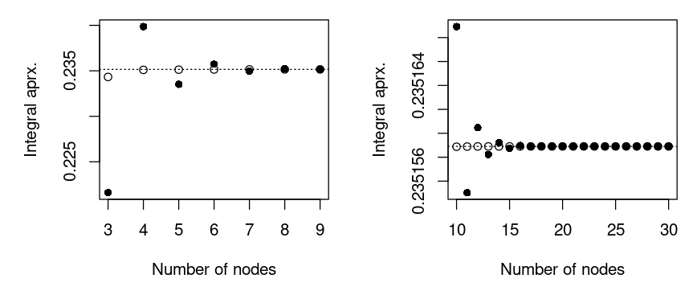
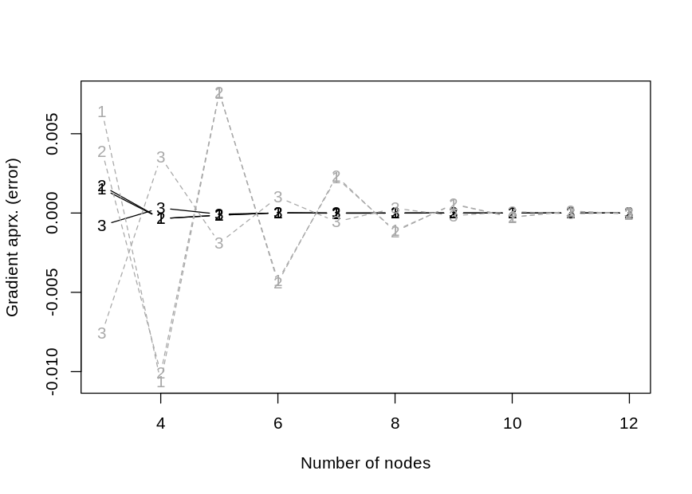

Mixed Models with a Probit Link
===============================

We make a comparison below of making an approximation of a marginal
likelihood factor that is typical in many mixed effect models with a
probit link function. The particular model we use here is mixed probit
model where the observed outcomes are binary. In this model, a marginal
factor, , for a given
cluster is

![\\begin{align\*}
L &= \\int \\phi^{(p)}(\\vec u; \\vec 0, \\Sigma)
  \\prod\_{i = 1}^n 
  \\Phi(\\eta\_i + \\vec z\_i^\\top\\vec u)^{y\_i} 
  \\Phi(-\\eta\_i-\\vec z\_i^\\top\\vec u)^{1 - y\_i}
  d\\vec u \\\\
\\vec y &\\in \\{0,1\\}^n \\\\
\\phi^{(p)}(\\vec u;\\vec \\mu, \\Sigma) &= 
  \\frac 1{(2\\pi)^{p/2}\\lvert\\Sigma\\rvert^{1/2}}
  \\exp\\left(-\\frac 12 (\\vec u - \\vec\\mu)^\\top\\Sigma^{-1}
                      (\\vec u - \\vec\\mu)\\right), 
  \\quad \\vec u \\in\\mathbb{R}^p\\\\
\\Phi(x) &= \\int\_0^x\\phi^{(1)}(z;0,1)dz
\\end{align\*}](https://latex.codecogs.com/svg.latex?%5Cbegin%7Balign%2A%7D%0AL%20%26%3D%20%5Cint%20%5Cphi%5E%7B%28p%29%7D%28%5Cvec%20u%3B%20%5Cvec%200%2C%20%5CSigma%29%0A%20%20%5Cprod_%7Bi%20%3D%201%7D%5En%20%0A%20%20%5CPhi%28%5Ceta_i%20%2B%20%5Cvec%20z_i%5E%5Ctop%5Cvec%20u%29%5E%7By_i%7D%20%0A%20%20%5CPhi%28-%5Ceta_i-%5Cvec%20z_i%5E%5Ctop%5Cvec%20u%29%5E%7B1%20-%20y_i%7D%0A%20%20d%5Cvec%20u%20%5C%5C%0A%5Cvec%20y%20%26%5Cin%20%5C%7B0%2C1%5C%7D%5En%20%5C%5C%0A%5Cphi%5E%7B%28p%29%7D%28%5Cvec%20u%3B%5Cvec%20%5Cmu%2C%20%5CSigma%29%20%26%3D%20%0A%20%20%5Cfrac%201%7B%282%5Cpi%29%5E%7Bp%2F2%7D%5Clvert%5CSigma%5Crvert%5E%7B1%2F2%7D%7D%0A%20%20%5Cexp%5Cleft%28-%5Cfrac%2012%20%28%5Cvec%20u%20-%20%5Cvec%5Cmu%29%5E%5Ctop%5CSigma%5E%7B-1%7D%0A%20%20%20%20%20%20%20%20%20%20%20%20%20%20%20%20%20%20%20%20%20%20%28%5Cvec%20u%20-%20%5Cvec%5Cmu%29%5Cright%29%2C%20%0A%20%20%5Cquad%20%5Cvec%20u%20%5Cin%5Cmathbb%7BR%7D%5Ep%5C%5C%0A%5CPhi%28x%29%20%26%3D%20%5Cint_0%5Ex%5Cphi%5E%7B%281%29%7D%28z%3B0%2C1%29dz%0A%5Cend%7Balign%2A%7D "\begin{align*}
L &= \int \phi^{(p)}(\vec u; \vec 0, \Sigma)
  \prod_{i = 1}^n 
  \Phi(\eta_i + \vec z_i^\top\vec u)^{y_i} 
  \Phi(-\eta_i-\vec z_i^\top\vec u)^{1 - y_i}
  d\vec u \\
\vec y &\in \{0,1\}^n \\
\phi^{(p)}(\vec u;\vec \mu, \Sigma) &= 
  \frac 1{(2\pi)^{p/2}\lvert\Sigma\rvert^{1/2}}
  \exp\left(-\frac 12 (\vec u - \vec\mu)^\top\Sigma^{-1}
                      (\vec u - \vec\mu)\right), 
  \quad \vec u \in\mathbb{R}^p\\
\Phi(x) &= \int_0^x\phi^{(1)}(z;0,1)dz
\end{align*}")

where
 can
be a fixed effect like

for some fixed effect covariate

and fixed effect coefficients

and 
is an unobserved random effect for the cluster.

The [quick comparison](#quick-comparison) section may be skipped unless
you want to get a grasp at what is implemented and see the definitions
of the functions that is used in this markdown. The [more rigorous
comparison](#more-rigorous-comparison) section is the main section of
this markdown. It contains an example where we vary the number of
observed outcomes, `n`, and the number of random effect, `p`, while
considering the computation time of various approximation methods for a
fixed relative error. A real data application is provided in
[examples/salamander.md](examples/salamander.md).

Quick Comparison
----------------

First, we assign a few functions that we are going to use.

``` r
aprx <- within(list(), {
  #####
  # returns a function to perform Gaussian Hermite quadrature (GHQ).
  #
  # Args:
  #   y: n length logical vector with for whether the observation has an 
  #      event.
  #   eta: n length numeric vector with offset on z-scale.
  #   Z: p by n matrix with random effect covariates. 
  #   S: n by n matrix with random effect covaraites.
  #   b: number of nodes to use with GHQ.
  get_GHQ_R <- function(y, eta, Z, S, b){
    library(fastGHQuad)
    library(compiler)
    rule <- gaussHermiteData(b)
    S_chol <- chol(S)
    
    # integrand
    f <- function(x)
      sum(mapply(pnorm, q = eta + sqrt(2) * drop(x %*% S_chol %*% Z),
               lower.tail = y, log.p = TRUE))
    
    # get all permutations of weights and values
    idx <- do.call(expand.grid, replicate(p, 1:b, simplify = FALSE))
    xs <- local({
      args <- list(FUN = c, SIMPLIFY = FALSE)
      do.call(mapply, c(args, lapply(idx, function(i) rule$x[i])))
    })
    ws_log <- local({
      args <- list(FUN = prod)
      log(do.call(mapply, c(args, lapply(idx, function(i) rule$w[i]))))
    })
    
    # final function to return
    out <- function()
      sum(exp(ws_log + vapply(xs, f, numeric(1L)))) / pi^(p / 2)
    f   <- cmpfun(f)
    out <- cmpfun(out)
    out
  }
  
  #####
  # returns a function to perform Gaussian Hermite quadrature (GHQ) using 
  # the C++ implemtation.
  # 
  # Args:
  #   y: n length logical vector with for whether the observation has an 
  #      event.
  #   eta: n length numeric vector with offset on z-scale.
  #   Z: p by n matrix with random effect covariates. 
  #   S: n by n matrix with random effect covaraites.
  #   b: number of nodes to use with GHQ.
  #   is_adaptive: logical for whether to use adaptive GHQ.
  get_GHQ_cpp <- function(y, eta, Z, S, b, is_adaptive = FALSE){
    mixprobit:::set_GH_rule_cached(b)
    function()
      mixprobit:::aprx_binary_mix_ghq(y = y, eta = eta, Z = Z, Sigma = S,
                                      b = b, is_adaptive = is_adaptive)
  }
  get_AGHQ_cpp <- get_GHQ_cpp
  formals(get_AGHQ_cpp)$is_adaptive <- TRUE
  
  #####
  # returns a function that returns the CDF approximation like in Pawitan 
  # et al. (2004).
  #
  # Args:
  #   y: n length logical vector with for whether the observation has an 
  #      event.
  #   eta: n length numeric vector with offset on z-scale.
  #   Z: p by n matrix with random effect covariates. 
  #   S: n by n matrix with random effect covaraites.
  #   maxpts: maximum number of function values as integer. 
  #   abseps: absolute error tolerance.
  #   releps: relative error tolerance.
  get_cdf_R <- function(y, eta, Z, S, maxpts, abseps = 1e-5, releps = -1){
    library(compiler)
    library(mvtnorm)
    p <- NROW(Z)
    
    out <- function(){
      dum_vec <- ifelse(y, 1, -1)
      Z_tilde <- Z * rep(dum_vec, each = p)
      SMat <- crossprod(Z_tilde , S %*% Z_tilde)
      diag(SMat) <- diag(SMat) + 1
      pmvnorm(upper = dum_vec * eta, mean = rep(0, n), sigma = SMat,
              algorithm = GenzBretz(maxpts = maxpts, abseps = abseps, 
                                    releps = releps))
    }
    out <- cmpfun(out)
    out
  }
  
  #####
  # returns a function that returns the CDF approximation like in Pawitan 
  # et al. (2004) using the C++ implementation.
  #
  # Args:
  #   y: n length logical vector with for whether the observation has an 
  #      event.
  #   eta: n length numeric vector with offset on z-scale.
  #   Z: p by n matrix with random effect covariates. 
  #   S: n by n matrix with random effect covaraites.
  #   maxpts: maximum number of function values as integer. 
  #   abseps: bsolute error tolerance.
  #   releps: relative error tolerance.
  get_cdf_cpp <- function(y, eta, Z, S, maxpts, abseps = -1, 
                          releps = 1e-3)
    function()
      mixprobit:::aprx_binary_mix_cdf(
        y = y, eta = eta, Z = Z, Sigma = S, maxpts = maxpts,
        abseps = abseps, releps = releps)
  
  #####
  # returns a function that uses the method from Genz & Monahan (1999).
  #
  # Args:
  #   y: n length logical vector with for whether the observation has an 
  #      event.
  #   eta: n length numeric vector with offset on z-scale.
  #   Z: p by n matrix with random effect covariates. 
  #   S: n by n matrix with random effect covaraites.
  #   maxpts: maximum number of function values as integer. 
  #   abseps: bsolute error tolerance.
  #   releps: relative error tolerance.
  #   is_adaptive: logical for whether to use adaptive method.
  get_sim_mth <- function(y, eta, Z, S, maxpts, abseps = 1e-5, releps = -1, 
                          is_adaptive = FALSE)
    # Args: 
    #   key: integer which determines degree of integration rule.
    function(key)
      mixprobit:::aprx_binary_mix(
        y = y, eta = eta, Z = Z, Sigma = S, maxpts = maxpts, key = key, 
        abseps = abseps, releps = releps, is_adaptive = is_adaptive)
  get_Asim_mth <- get_sim_mth
  formals(get_Asim_mth)$is_adaptive <- TRUE
  
  #####
  # returns a function that uses Quasi-monte carlo integration to 
  # approximate the integrals. 
  # 
  # Args:
  #   y: n length logical vector with for whether the observation has an 
  #      event.
  #   eta: n length numeric vector with offset on z-scale.
  #   Z: p by n matrix with random effect covariates. 
  #   S: n by n matrix with random effect covaraites.
  #   maxpts: integer with maximum number of points to use. 
  #   is_adaptive: logical for whether to use an adaptive method.
  #   releps: relative error tolerance.
  #   n_seqs: number of randomized sobol sequences.
  #   abseps: unused.
  get_qmc <- function(y, eta, Z, S, maxpts, is_adaptive = FALSE, 
                      releps = 1e-4, n_seqs = 10L, abseps)
    function(){
      seeds <- sample.int(2147483646L, n_seqs)
      mixprobit:::aprx_binary_mix_qmc(
        y = y, eta = eta, Z = Z, Sigma = S, n_max = maxpts, 
        is_adaptive = is_adaptive, seeds = seeds, releps = releps)
    }
  get_Aqmc <- get_qmc
  formals(get_Aqmc)$is_adaptive <- TRUE
})
```

Then we assign a function to get a simulated data set for a single
cluster within a mixed probit model with binary outcomes.

``` r
#####
# returns a simulated data set from one cluster in a mixed probit model 
# with binary outcomes.
# 
# Args:
#   n: cluster size.
#   p: number of random effects.
get_sim_dat <- function(n, p){
  out <- list(n = n, p = p)
  within(out, {
    Z <- do.call(                        # random effect design matrix
      rbind, c(list(sqrt(1/p)), 
               list(replicate(n, rnorm(p - 1L, sd = sqrt(1/p))))))
    eta <- rnorm(n)                      # fixed offsets/fixed effects
    n <- NCOL(Z)                         # number of individuals
    p <- NROW(Z)                         # number of random effects
    S <- drop(                           # covariance matrix of random effects
      rWishart(1, p, diag(1 / p, p)))
    S_chol <- chol(S)
    u <- drop(rnorm(p) %*% S_chol)       # random effects
    y <- runif(n) < pnorm(drop(u %*% Z)) # observed outcomes
  })
}
```

The variance of the linear predictor given the random effect is
independent of the random effect dimension, `p`.

``` r
var(replicate(1000, with(get_sim_dat(10, 2), u %*% Z + eta)))
#> [1] 1.996
var(replicate(1000, with(get_sim_dat(10, 3), u %*% Z + eta)))
#> [1] 1.981
var(replicate(1000, with(get_sim_dat(10, 4), u %*% Z + eta)))
#> [1] 2.005
var(replicate(1000, with(get_sim_dat(10, 5), u %*% Z + eta)))
#> [1] 2.002
var(replicate(1000, with(get_sim_dat(10, 6), u %*% Z + eta)))
#> [1] 1.966
var(replicate(1000, with(get_sim_dat(10, 7), u %*% Z + eta)))
#> [1] 1.934
var(replicate(1000, with(get_sim_dat(10, 8), u %*% Z + eta)))
#> [1] 1.992
```

Next we perform a quick example.

``` r
set.seed(2)

#####
# parameters to change
n <- 10L              # cluster size
p <- 4L               # number of random effects
b <- 15L              # number of nodes to use with GHQ
maxpts <- p * 10000L  # factor to set the (maximum) number of
                      # evaluations of the integrand with
                      # the other methods

#####
# variables used in simulation
dat <- get_sim_dat(n = n, p = p)

# shorter than calling `with(dat, ...)`
wd <- function(expr)
  eval(bquote(with(dat, .(substitute(expr)))), parent.frame())

#####
# get the functions to use
GHQ_R    <- wd(aprx$get_GHQ_R   (y = y, eta = eta, Z = Z, S = S, b = b))
GHQ_cpp  <- wd(aprx$get_GHQ_cpp (y = y, eta = eta, Z = Z, S = S, b = b))
AGHQ_cpp <- wd(aprx$get_AGHQ_cpp(y = y, eta = eta, Z = Z, S = S, b = b))

cdf_aprx_R   <- wd(aprx$get_cdf_R  (y = y, eta = eta, Z = Z, S = S, 
                                    maxpts = maxpts))
cdf_aprx_cpp <- wd(aprx$get_cdf_cpp(y = y, eta = eta, Z = Z, S = S, 
                                    maxpts = maxpts))

qmc_aprx <- wd(
  aprx$get_qmc(y = y, eta = eta, Z = Z, S = S, maxpts = maxpts))
qmc_Aaprx <- wd(
  aprx$get_Aqmc(y = y, eta = eta, Z = Z, S = S, maxpts = maxpts))

sim_aprx <-  wd(aprx$get_sim_mth(y = y, eta = eta, Z = Z, S = S, 
                                 maxpts = maxpts))
sim_Aaprx <- wd(aprx$get_Asim_mth(y = y, eta = eta, Z = Z, S = S, 
                                  maxpts = maxpts))

#####
# compare results. Start with the simulation based methods with a lot of
# samples. We take this as the ground truth
truth_maybe_cdf <- wd( 
  aprx$get_cdf_cpp (y = y, eta = eta, Z = Z, S = S, maxpts = 1e7, 
                    abseps = 1e-11))()

truth_maybe_qmc <- wd(
  aprx$get_qmc(y = y, eta = eta, Z = Z, S = S, maxpts = 1e7, 
               releps = 1e-11)())

truth_maybe_Aqmc <- wd(
  aprx$get_Aqmc(y = y, eta = eta, Z = Z, S = S, maxpts = 1e7, 
                releps = 1e-11)())

truth_maybe_mc <- wd(
  aprx$get_sim_mth (y = y, eta = eta, Z = Z, S = S, maxpts = 1e7, 
                    abseps = 1e-11)(2L))
truth_maybe_Amc <- wd(
  aprx$get_Asim_mth(y = y, eta = eta, Z = Z, S = S, maxpts = 1e7, 
                    abseps = 1e-11)(2L))

truth <- wd(
  mixprobit:::aprx_binary_mix_brute(y = y, eta = eta, Z = Z, Sigma = S, 
                                    n_sim = 1e8, n_threads = 6L))

c(Estiamte = truth, SE = attr(truth, "SE"),  
  `Estimate (log)` = log(c(truth)),  
  `SE (log)` = abs(attr(truth, "SE") / truth))
#>       Estiamte             SE Estimate (log)       SE (log) 
#>      4.436e-03      3.240e-08     -5.418e+00      7.304e-06
truth <- c(truth)
all.equal(truth, c(truth_maybe_cdf))
#> [1] "Mean relative difference: 7.963e-05"
all.equal(truth, c(truth_maybe_qmc))
#> [1] "Mean relative difference: 2.317e-05"
all.equal(truth, c(truth_maybe_Aqmc))
#> [1] "Mean relative difference: 1.763e-06"
all.equal(truth, c(truth_maybe_mc))
#> [1] "Mean relative difference: 0.0002474"
all.equal(truth, c(truth_maybe_Amc))
#> [1] "Mean relative difference: 1.555e-05"

# compare with using fewer samples and GHQ
all.equal(truth,   GHQ_R())
#> [1] "Mean relative difference: 5.245e-06"
all.equal(truth,   GHQ_cpp())
#> [1] "Mean relative difference: 5.245e-06"
all.equal(truth,   AGHQ_cpp())
#> [1] "Mean relative difference: 6.682e-06"
all.equal(truth, c(cdf_aprx_R()))
#> [1] "Mean relative difference: 0.0001005"
all.equal(truth, c(qmc_aprx()))
#> [1] "Mean relative difference: 0.002115"
all.equal(truth, c(qmc_Aaprx()))
#> [1] "Mean relative difference: 0.0005724"
all.equal(truth, c(cdf_aprx_cpp()))
#> [1] "Mean relative difference: 1.811e-05"
all.equal(truth, c(sim_aprx(1L)))
#> [1] "Mean relative difference: 0.03199"
all.equal(truth, c(sim_aprx(2L)))
#> [1] "Mean relative difference: 0.01141"
all.equal(truth, c(sim_aprx(3L)))
#> [1] "Mean relative difference: 0.006145"
all.equal(truth, c(sim_aprx(4L)))
#> [1] "Mean relative difference: 0.01554"
all.equal(truth, c(sim_Aaprx(1L)))
#> [1] "Mean relative difference: 5.265e-05"
all.equal(truth, c(sim_Aaprx(2L)))
#> [1] "Mean relative difference: 0.001101"
all.equal(truth, c(sim_Aaprx(3L)))
#> [1] "Mean relative difference: 0.001387"
all.equal(truth, c(sim_Aaprx(4L)))
#> [1] "Mean relative difference: 0.001129"

# compare computations times
system.time(GHQ_R()) # way too slow (seconds!). Use C++ method instead
#>    user  system elapsed 
#>   1.461   0.000   1.462
microbenchmark::microbenchmark(
  `GHQ (C++)` = GHQ_cpp(), `AGHQ (C++)` = AGHQ_cpp(),
  `CDF` = cdf_aprx_R(), `CDF (C++)` = cdf_aprx_cpp(),
  QMC = qmc_aprx(), `QMC Adaptive` = qmc_Aaprx(),
  `Genz & Monahan (1)` = sim_aprx(1L), `Genz & Monahan (2)` = sim_aprx(2L),
  `Genz & Monahan (3)` = sim_aprx(3L), `Genz & Monahan (4)` = sim_aprx(4L),
  `Genz & Monahan Adaptive (2)` = sim_Aaprx(2L),
  times = 10)
#> Unit: milliseconds
#>                         expr    min     lq  mean median    uq   max neval
#>                    GHQ (C++) 39.888 40.263 40.38  40.41 40.59 40.76    10
#>                   AGHQ (C++) 43.436 43.860 44.17  44.17 44.49 44.90    10
#>                          CDF 21.141 21.297 21.38  21.34 21.42 21.93    10
#>                    CDF (C++) 11.622 11.724 11.83  11.80 11.85 12.28    10
#>                          QMC 32.922 33.741 34.11  34.08 34.70 34.92    10
#>                 QMC Adaptive 38.575 39.423 39.69  39.71 40.10 40.40    10
#>           Genz & Monahan (1) 30.251 30.472 31.25  31.44 31.61 32.22    10
#>           Genz & Monahan (2) 31.106 32.696 32.83  32.89 33.22 33.76    10
#>           Genz & Monahan (3) 30.972 31.101 31.51  31.42 31.97 32.16    10
#>           Genz & Monahan (4) 30.745 31.237 31.40  31.37 31.70 32.06    10
#>  Genz & Monahan Adaptive (2)  6.844  7.991 10.97  10.13 12.89 21.26    10
```

More Rigorous Comparison
------------------------

We are interested in a more rigorous comparison. Therefor, we define a
function below which for given number of observation in the cluster,
`n`, and given number of random effects, `p`, performs a repeated number
of runs with each of the methods and returns the computation time (among
other output). To make a fair comparison, we fix the relative error of
the methods before hand such that the relative error is below `releps`,
.
Ground truth is computed with brute force MC using `n_brute`,
,
samples.

Since GHQ is deterministic, we use a number of nodes such that this
number of nodes or `streak_length`, 4, less value of nodes with GHQ
gives a relative error which is below the threshold. We use a minimum of
4 nodes at the time of this writing. The error of the simulation based
methods is approximated using `n_reps`, 25, replications.

``` r
# default parameters
ex_params <- list(
  streak_length = 4L, 
  max_b = 25L, 
  max_maxpts = 2500000L, 
  releps = 1e-4,
  min_releps = 1e-6,
  key_use = 3L, 
  n_reps = 25L, 
  n_runs = 5L, 
  n_brute = 1e7, 
  n_brute_max = 1e8, 
  n_brute_sds = 4, 
  qmc_n_seqs = 10L)
```

``` r
# perform a simulations run for a given number of observations and random 
# effects. First we fix the relative error of each method such that it is
# below a given threshold. Then we run each method a number of times to 
# measure the computation time. 
# 
# Args:
#   n: number of observations in the cluster.
#   p: number of random effects. 
#   releps: required relative error. 
#   key_use: integer which determines degree of integration rule for the 
#            method from Genz and Monahan (1999).
#   n_threads: number of threads to use.
#   n_fail: only used by the function if a brute force estimator cannot
#           get within the precision.
sim_experiment <- function(n, p, releps = ex_params$releps, 
                           key_use = ex_params$key_use, n_threads = 1L, 
                           n_fail = 0L){
  # in some cases we may not want to run the simulation experiment
  do_not_run <- FALSE
  
  # simulate data
  dat <- get_sim_dat(n = n, p = p)
  
  # shorter than calling `with(dat, ...)`
  wd <- function(expr)
    eval(bquote(with(dat, .(substitute(expr)))), parent.frame())
  
  # get the assumed ground truth
  if(do_not_run){
    truth <- SE_truth <- NA_real_
    n_brute <- NA_integer_
    find_brute_failed <- FALSE
    
  } else {
    passed <- FALSE
    n_brute <- NA_integer_
    find_brute_failed <- FALSE
    
    while(!passed){
      if(!is.na(n_brute) && n_brute >= ex_params$n_brute_max){
        n_brute <- NA_integer_
        find_brute_failed <- TRUE
        break
      }
      
      n_brute <- if(is.na(n_brute))
        ex_params$n_brute 
      else 
        min(ex_params$n_brute_max, 
            n_brute * as.integer(ceiling(1.2 * (SE_truth / eps)^2)))
      
      truth <- wd(mixprobit:::aprx_binary_mix_brute(
        y = y, eta = eta, Z = Z, Sigma = S, n_sim = n_brute, 
        n_threads = n_threads))
      
      SE_truth <- abs(attr(truth, "SE") / c(truth))
      eps <- ex_params$releps / ex_params$n_brute_sds * abs(log(c(truth)))
      passed <- SE_truth < eps
    }
      
    truth <- c(truth)
  }
  
  if(find_brute_failed){
    # we failed to find a brute force estimator within the precision. 
    # We repeat with a new data set
    cl <- match.call()
    cl$n_fail <- n_fail + 1L
    return(eval(cl, parent.frame()))
  }
  
  # function to test whether the value is ok
  is_ok_func <- function(vals){
    test_val <- abs((log(vals) - log(truth)) / log(truth)) 
    if(!all(is.finite(test_val)))
      stop("non-finite 'vals'")
    test_val < releps
  }
      
  # get function to use with GHQ
  get_b <- function(meth){
    if(do_not_run)
      NA_integer_
    else local({
      apx_func <- function(b)
        wd(meth(y = y, eta = eta, Z = Z, S = S, b = b))()
      
      # length of node values which have a relative error below the threshold
      streak_length <- ex_params$streak_length
      vals <- rep(NA_real_, streak_length)
      
      b <- streak_length
      for(i in 1:(streak_length - 1L))
        vals[i + 1L] <- apx_func(b - streak_length + i)
      repeat {
        vals[1:(streak_length - 1L)] <- vals[-1]
        vals[streak_length] <- apx_func(b)
        
        if(all(is_ok_func(vals)))
          break
        
        b <- b + 1L
        if(b > ex_params$max_b){
          warning("found no node value")
          b <- NA_integer_
          break
        }
      }
      b
    })
  }
  
  is_to_large_for_ghq <- n > 16L || p >= 5L
  b_use <- if(is_to_large_for_ghq)
    NA_integer_ else get_b(aprx$get_GHQ_cpp)
  ghq_func <- if(!is.na(b_use))
    wd(aprx$get_GHQ_cpp(y = y, eta = eta, Z = Z, S = S, b = b_use))
  else
    NA
  
  # get function to use with AGHQ
  b_use_A <- get_b(aprx$get_AGHQ_cpp)
  aghq_func <- if(!is.na(b_use_A))
    wd(aprx$get_AGHQ_cpp(y = y, eta = eta, Z = Z, S = S, b = b_use_A))
  else
    NA
  
  # get function to use with CDF method
  get_releps <- function(meth){
    if(do_not_run)
      NA_integer_
    else {
      releps_use <- releps * 100
      repeat {
        func <- wd(meth(y = y, eta = eta, Z = Z, S = S, 
                        maxpts = ex_params$max_maxpts, 
                        abseps = -1, releps = releps_use))
        if("key" %in% names(formals(func)))
          formals(func)$key <- ex_params$key_use
        vals <- replicate(ex_params$n_reps, {
          v <- func()
          inivls <- if("inivls" %in% names(attributes(v)))
            attr(v, "inivls") else NA_integer_
          c(value = v, error = attr(v, "error"), inivls = inivls)
        })
        
        inivls_ok <- all(
          is.na(vals["inivls", ]) | 
            vals["inivls", ] / ex_params$max_maxpts < .999999)
        
        if(all(is_ok_func(vals["value", ])) && inivls_ok)
          break
        
        releps_use <- if(!inivls_ok) 
          # no point in doing any more computations
          ex_params$min_releps / 10 else 
            releps_use / 2
        if(releps_use < ex_params$min_releps){
          warning("found no releps for CDF method")
          releps_use <- NA_integer_
          break
        }
      }
      releps_use
    }
  }
  
  cdf_releps <- get_releps(aprx$get_cdf_cpp)
  cdf_func <- if(!is.na(cdf_releps))
    wd(aprx$get_cdf_cpp(y = y, eta = eta, Z = Z, S = S, 
                        maxpts = ex_params$max_maxpts, abseps = -1, 
                        releps = cdf_releps))
  else 
    NA
  
  # get function to use with Genz and Monahan method
  # sim_releps <- if(is_to_large_for_ghq) 
  #   NA_integer_ else get_releps(aprx$get_sim_mth)
  sim_releps <- NA_integer_ # just do not use it. It is __very__ slow in  
                            # some cases
  sim_func <- if(!is.na(sim_releps))
    wd(aprx$get_sim_mth(y = y, eta = eta, Z = Z, S = S, 
                        maxpts = ex_params$max_maxpts, abseps = -1, 
                        releps = sim_releps))
  else 
    NA
  if(is.function(sim_func))
    formals(sim_func)$key <- key_use
  
  # do the same with the adaptive version
  Asim_releps <- get_releps(aprx$get_Asim_mth)
  Asim_func <- if(!is.na(Asim_releps))
    wd(aprx$get_Asim_mth(y = y, eta = eta, Z = Z, S = S, 
                         maxpts = ex_params$max_maxpts, abseps = -1, 
                         releps = Asim_releps))
  else 
    NA
  if(is.function(Asim_func))
    formals(Asim_func)$key <- key_use
  
  # get function to use with QMC
  formals(aprx$get_qmc)$n_seqs <- ex_params$qmc_n_seqs
  qmc_releps <- if(is_to_large_for_ghq)
    NA_integer_ else get_releps(aprx$get_qmc)
  qmc_func <- if(!is.na(qmc_releps))
     wd(aprx$get_qmc(y = y, eta = eta, Z = Z, S = S, 
                     maxpts = ex_params$max_maxpts, abseps = -1,
                     releps = qmc_releps, 
                     n_seqs = ex_params$qmc_n_seqs))
  else 
    NA

  # get function to use with adaptive QMC
  Aqmc_releps <- get_releps(aprx$get_Aqmc)
  formals(aprx$get_Aqmc)$n_seqs <- ex_params$qmc_n_seqs
  Aqmc_func <- if(!is.null(Aqmc_releps))
    wd(aprx$get_Aqmc(y = y, eta = eta, Z = Z, S = S, 
                     maxpts = ex_params$max_maxpts, abseps = -1,
                     releps = Aqmc_releps, 
                     n_seqs = ex_params$qmc_n_seqs))
  else 
    NA
    
  # perform the comparison
  out <- sapply(
    list(GHQ = ghq_func, AGHQ = aghq_func, CDF = cdf_func, 
         GenzMonahan = sim_func, GenzMonahanA = Asim_func, 
         QMC = qmc_func, QMCA = Aqmc_func), 
    function(func){
      if(!is.function(func) && is.na(func)){
        out <- rep(NA_real_, 6L)
        names(out) <- c("mean", "sd", "mse", "user.self", 
                        "sys.self", "elapsed")
        return(out)
      }
      
      # number of runs used to estimate the computation time, etc.
      n_runs <- ex_params$n_runs
      
      # perform the computations to estimate the computation times
      ti <- system.time(vals <- replicate(n_runs, {
        out <- func()
        if(!is.null(err <- attr(out, "error"))){
          # only of of the two methods needs an adjustment of the sd! 
          # TODO: this is very ad hoc...
          is_genz_mona <- !is.null(environment(func)$is_adaptive)

          sd <- if(is_genz_mona)
            err else err / 2.5
          
          out <- c(value = out, sd = sd)
        }
        out
      }))
      
      # handle computation of sd and mse
      is_ghq <- !is.null(b <- environment(func)$b)
      if(is_ghq){
        # if it is GHQ then we alter the number of nodes to get an sd 
        # estiamte etc.
        sl <- ex_params$streak_length
        other_vs <- sapply((b - sl + 1):b, function(b){
          environment(func)$b <- b
          func()
        })
        
        vs <- c(other_vs, vals[1])
        sd_use <- sd(vs)
        mse <- mean((vs - truth) ^2)
      } else {
        # we combine the variance estimators
        sd_use <- sqrt(mean(vals["sd", ]^2))
        vals <- vals["value", ]
        mse <- mean((vals - truth) ^2)
        
      }
      
      c(mean = mean(vals), sd = sd_use, mse = mse, ti[1:3] / n_runs)            
    })
  
  structure(list(
    b_use = b_use, b_use_A = b_use_A, cdf_releps = cdf_releps, 
    sim_releps = sim_releps, Asim_releps = Asim_releps, 
    qmc_releps = qmc_releps, Aqmc_releps = Aqmc_releps,
    ll_truth = log(truth), SE_truth = SE_truth, n_brute = n_brute, 
    n_fail = n_fail, vals_n_comp_time = out), 
    class = "sim_experiment")
}
```

Here is a few quick examples where we use the function we just defined.

``` r
print.sim_experiment <- function(x, ...){
  old <- options()
  on.exit(options(old))
  options(digits = 6, scipen = 999)
  
  cat(
    sprintf("         # brute force samples: %13d", x$n_brute),
    sprintf("                  # nodes  GHQ: %13d", x$b_use),
    sprintf("                  # nodes AGHQ: %13d", x$b_use_A),
    sprintf("                    CDF releps: %13.8f", x$cdf_releps), 
    sprintf("         Genz & Monahan releps: %13.8f", x$sim_releps),
    sprintf("Adaptive Genz & Monahan releps: %13.8f", x$Asim_releps), 
    sprintf("                    QMC releps: %13.8f", x$qmc_releps),
    sprintf("           Adaptive QMC releps: %13.8f", x$Aqmc_releps), 
    sprintf("  Log-likelihood estiamte (SE): %13.8f (%.8f)", x$ll_truth, 
            x$SE_truth), 
    "", sep = "\n")
  
  xx <- x$vals_n_comp_time["mean", ]
  print(cbind(`Mean estimate (likelihood)`     = xx, 
              `Mean estimate (log-likelihood)` = log(xx)))
  
  mult <- 1 / ex_params$releps
  cat(sprintf("\nSD & RMSE (/%.2f)\n", mult))
  print(rbind(SD   =      x$vals_n_comp_time["sd", ],  
              RMSE = sqrt(x$vals_n_comp_time[c("mse"), ])) * mult)
  
  cat("\nComputation times\n")
  print(x$vals_n_comp_time["elapsed", ])
}

set.seed(1)
sim_experiment(n = 3L , p = 2L, n_threads = 6L)
#>          # brute force samples:      10000000
#>                   # nodes  GHQ:             9
#>                   # nodes AGHQ:             7
#>                     CDF releps:    0.00015625
#>          Genz & Monahan releps:            NA
#> Adaptive Genz & Monahan releps:    0.00007813
#>                     QMC releps:    0.00003906
#>            Adaptive QMC releps:    0.00003906
#>   Log-likelihood estiamte (SE):   -0.84934116 (0.00000362)
#> 
#>              Mean estimate (likelihood) Mean estimate (log-likelihood)
#> GHQ                            0.427693                      -0.849350
#> AGHQ                           0.427693                      -0.849351
#> CDF                            0.427690                      -0.849357
#> GenzMonahan                          NA                             NA
#> GenzMonahanA                   0.427692                      -0.849352
#> QMC                            0.427692                      -0.849352
#> QMCA                           0.427690                      -0.849356
#> 
#> SD & RMSE (/10000.00)
#>            GHQ      AGHQ      CDF GenzMonahan GenzMonahanA       QMC      QMCA
#> SD   0.0866955 0.0192985 0.186747          NA     0.129640 0.0547419 0.0551937
#> RMSE 0.1035563 0.0454279 0.109239          NA     0.105835 0.0874184 0.1014698
#> 
#> Computation times
#>          GHQ         AGHQ          CDF  GenzMonahan GenzMonahanA          QMC 
#>       0.0000       0.0000       0.0004           NA       0.0032       0.0160 
#>         QMCA 
#>       0.0286
sim_experiment(n = 10L, p = 2L, n_threads = 6L)
#> Warning in (function() {: found no node value
#>          # brute force samples:      10000000
#>                   # nodes  GHQ:            NA
#>                   # nodes AGHQ:             6
#>                     CDF releps:    0.01000000
#>          Genz & Monahan releps:            NA
#> Adaptive Genz & Monahan releps:    0.01000000
#>                     QMC releps:    0.00062500
#>            Adaptive QMC releps:    0.00250000
#>   Log-likelihood estiamte (SE):  -10.93419002 (0.00000510)
#> 
#>              Mean estimate (likelihood) Mean estimate (log-likelihood)
#> GHQ                                  NA                             NA
#> AGHQ                       0.0000178378                       -10.9342
#> CDF                        0.0000178382                       -10.9342
#> GenzMonahan                          NA                             NA
#> GenzMonahanA               0.0000178378                       -10.9342
#> QMC                        0.0000178380                       -10.9342
#> QMCA                       0.0000178521                       -10.9334
#> 
#> SD & RMSE (/10000.00)
#>      GHQ          AGHQ          CDF GenzMonahan  GenzMonahanA          QMC
#> SD    NA 0.00000310891 0.0000379336          NA 0.00000202190 0.0000358423
#> RMSE  NA 0.00000363170 0.0000227956          NA 0.00000247443 0.0000800614
#>             QMCA
#> SD   0.000129177
#> RMSE 0.000178931
#> 
#> Computation times
#>          GHQ         AGHQ          CDF  GenzMonahan GenzMonahanA          QMC 
#>           NA       0.0000       0.0120           NA       0.0008       0.0228 
#>         QMCA 
#>       0.0014

sim_experiment(n = 3L , p = 5L, n_threads = 6L)
#>          # brute force samples:      20000000
#>                   # nodes  GHQ:            NA
#>                   # nodes AGHQ:             7
#>                     CDF releps:    0.00003906
#>          Genz & Monahan releps:            NA
#> Adaptive Genz & Monahan releps:    0.00000977
#>                     QMC releps:            NA
#>            Adaptive QMC releps:    0.00003906
#>   Log-likelihood estiamte (SE):   -1.09925821 (0.00002250)
#> 
#>              Mean estimate (likelihood) Mean estimate (log-likelihood)
#> GHQ                                  NA                             NA
#> AGHQ                           0.333127                       -1.09923
#> CDF                            0.333122                       -1.09925
#> GenzMonahan                          NA                             NA
#> GenzMonahanA                   0.333128                       -1.09923
#> QMC                                  NA                             NA
#> QMCA                           0.333125                       -1.09924
#> 
#> SD & RMSE (/10000.00)
#>      GHQ     AGHQ       CDF GenzMonahan GenzMonahanA QMC    QMCA
#> SD    NA 0.137227 0.0432472          NA     0.173962  NA 0.11808
#> RMSE  NA 0.123240 0.0596250          NA     0.161428  NA 0.15143
#> 
#> Computation times
#>          GHQ         AGHQ          CDF  GenzMonahan GenzMonahanA          QMC 
#>           NA       0.0056       0.0018           NA       0.8886           NA 
#>         QMCA 
#>       0.8898
sim_experiment(n = 10L, p = 5L, n_threads = 6L)
#>          # brute force samples:      10000000
#>                   # nodes  GHQ:            NA
#>                   # nodes AGHQ:             7
#>                     CDF releps:    0.01000000
#>          Genz & Monahan releps:            NA
#> Adaptive Genz & Monahan releps:    0.01000000
#>                     QMC releps:            NA
#>            Adaptive QMC releps:    0.00125000
#>   Log-likelihood estiamte (SE):  -10.75910728 (0.00000416)
#> 
#>              Mean estimate (likelihood) Mean estimate (log-likelihood)
#> GHQ                                  NA                             NA
#> AGHQ                       0.0000212509                       -10.7591
#> CDF                        0.0000212517                       -10.7591
#> GenzMonahan                          NA                             NA
#> GenzMonahanA               0.0000212504                       -10.7591
#> QMC                                  NA                             NA
#> QMCA                       0.0000212544                       -10.7589
#> 
#> SD & RMSE (/10000.00)
#>      GHQ          AGHQ          CDF GenzMonahan GenzMonahanA QMC         QMCA
#> SD    NA 0.00000927654 0.0000297948          NA 0.0000926980  NA 0.0000896494
#> RMSE  NA 0.00000860910 0.0000270847          NA 0.0000914737  NA 0.0001137584
#> 
#> Computation times
#>          GHQ         AGHQ          CDF  GenzMonahan GenzMonahanA          QMC 
#>           NA       0.0138       0.0132           NA       0.0008           NA 
#>         QMCA 
#>       0.0042

sim_experiment(n = 3L , p = 7L, n_threads = 6L)
#>          # brute force samples:      10000000
#>                   # nodes  GHQ:            NA
#>                   # nodes AGHQ:             6
#>                     CDF releps:    0.00031250
#>          Genz & Monahan releps:            NA
#> Adaptive Genz & Monahan releps:    0.00015625
#>                     QMC releps:            NA
#>            Adaptive QMC releps:    0.00015625
#>   Log-likelihood estiamte (SE):   -2.81239990 (0.00001049)
#> 
#>              Mean estimate (likelihood) Mean estimate (log-likelihood)
#> GHQ                                  NA                             NA
#> AGHQ                          0.0600601                       -2.81241
#> CDF                           0.0600625                       -2.81237
#> GenzMonahan                          NA                             NA
#> GenzMonahanA                  0.0600600                       -2.81241
#> QMC                                  NA                             NA
#> QMCA                          0.0600587                       -2.81243
#> 
#> SD & RMSE (/10000.00)
#>      GHQ      AGHQ       CDF GenzMonahan GenzMonahanA QMC      QMCA
#> SD    NA 0.0444994 0.0519446          NA    0.0364071  NA 0.0356508
#> RMSE  NA 0.0482498 0.0439745          NA    0.0411445  NA 0.0355180
#> 
#> Computation times
#>          GHQ         AGHQ          CDF  GenzMonahan GenzMonahanA          QMC 
#>           NA       0.0860       0.0004           NA       0.0202           NA 
#>         QMCA 
#>       0.0422
sim_experiment(n = 10L, p = 7L, n_threads = 6L)
#>          # brute force samples:      10000000
#>                   # nodes  GHQ:            NA
#>                   # nodes AGHQ:             6
#>                     CDF releps:    0.01000000
#>          Genz & Monahan releps:            NA
#> Adaptive Genz & Monahan releps:    0.00250000
#>                     QMC releps:            NA
#>            Adaptive QMC releps:    0.00062500
#>   Log-likelihood estiamte (SE):   -9.53553871 (0.00000773)
#> 
#>              Mean estimate (likelihood) Mean estimate (log-likelihood)
#> GHQ                                  NA                             NA
#> AGHQ                       0.0000722382                       -9.53554
#> CDF                        0.0000722374                       -9.53555
#> GenzMonahan                          NA                             NA
#> GenzMonahanA               0.0000722530                       -9.53534
#> QMC                                  NA                             NA
#> QMCA                       0.0000722373                       -9.53555
#> 
#> SD & RMSE (/10000.00)
#>      GHQ         AGHQ          CDF GenzMonahan GenzMonahanA QMC        QMCA
#> SD    NA 0.0000154870 0.0000878777          NA  0.000296669  NA 0.000148304
#> RMSE  NA 0.0000173175 0.0000231096          NA  0.000641938  NA 0.000173144
#> 
#> Computation times
#>          GHQ         AGHQ          CDF  GenzMonahan GenzMonahanA          QMC 
#>           NA       0.2386       0.0112           NA       0.0010           NA 
#>         QMCA 
#>       0.0132

sim_experiment(n = 20L, p = 7L, n_threads = 6L)
#>          # brute force samples:      10000000
#>                   # nodes  GHQ:            NA
#>                   # nodes AGHQ:             6
#>                     CDF releps:    0.00250000
#>          Genz & Monahan releps:            NA
#> Adaptive Genz & Monahan releps:    0.00250000
#>                     QMC releps:            NA
#>            Adaptive QMC releps:    0.00125000
#>   Log-likelihood estiamte (SE):  -24.05475041 (0.00001577)
#> 
#>              Mean estimate (likelihood) Mean estimate (log-likelihood)
#> GHQ                                  NA                             NA
#> AGHQ                 0.0000000000357396                       -24.0548
#> CDF                  0.0000000000357369                       -24.0548
#> GenzMonahan                          NA                             NA
#> GenzMonahanA         0.0000000000357422                       -24.0547
#> QMC                                  NA                             NA
#> QMCA                 0.0000000000357385                       -24.0548
#> 
#> SD & RMSE (/10000.00)
#>      GHQ               AGHQ               CDF GenzMonahan      GenzMonahanA QMC
#> SD    NA 0.0000000000865070 0.000000000264832          NA 0.000000000310245  NA
#> RMSE  NA 0.0000000000906587 0.000000000264111          NA 0.000000000375238  NA
#>                   QMCA
#> SD   0.000000000153660
#> RMSE 0.000000000143546
#> 
#> Computation times
#>          GHQ         AGHQ          CDF  GenzMonahan GenzMonahanA          QMC 
#>           NA       0.4382       0.0606           NA       0.0022           NA 
#>         QMCA 
#>       0.0214
```

Next, we apply the method a number of times for a of combination of
number of observations, `n`, and number of random effects, `p`.

``` r
# number of observations in the cluster
n_vals <- 2^(1:5)
# number of random effects
p_vals <- 2:7
# grid with all configurations
gr_vals <- expand.grid(n = n_vals, p = p_vals)
# number of replications per configuration
n_runs <- 25L

ex_output <- (function(){
  # setup directory to store data
  cache_dir <- file.path("README_cache", "experiment")
  if(!dir.exists(cache_dir))
    dir.create(cache_dir)
  
  # setup cluster to use
  library(parallel)
  
  # run the experiment
  mcmapply(function(n, p){
    cache_file <- file.path(cache_dir, sprintf("n-%03d-p-%03d.Rds", n, p))
    if(!file.exists(cache_file)){
      message(sprintf("Running setup with   n %3d and p %3d", n, p))
      
      # create file to write progress to
      prg_file <- file.path(getwd(), 
                            sprintf("progress-n-%03d-p-%03d.txt", n, p))
      file.create(prg_file)
      message(sprintf("Follow progress in %s", sQuote(prg_file)))
      on.exit(unlink(prg_file))
      
      set.seed(71771946)
      sim_out <- lapply(1:n_runs, function(...){
        seed <- .Random.seed
        out <- sim_experiment(n = n, p = p)
        attr(out, "seed") <- seed
        
        cat("-", file = prg_file, append = TRUE)
        out
      })
      
      sim_out[c("n", "p")] <- list(n = n, p = p)
      saveRDS(sim_out, cache_file)
    } else
      message(sprintf("Loading results with n %3d and p %3d", n, p))
      
    
    readRDS(cache_file)
  }, n = gr_vals$n, p = gr_vals$p, SIMPLIFY = FALSE, 
  mc.cores = 4L, mc.preschedule = FALSE)
})()
```

We create a table where we summarize the results below. First we start
with the average computation time, then we show the mean scaled RMSE,
and we end by looking at the number of nodes that we need to use with
GHQ. The latter shows why GHQ becomes slower as the cluster size, `n`,
increases. The computation time is in 1000s of a second,
`comp_time_mult`. The mean scaled RMSE is multiplied by
,
`err_mult`.

``` r
comp_time_mult <- 1000 # millisecond
err_mult <- 1e5
```

``` r
#####
# show number of complete cases
.get_nice_names <- function(x){
  x <- gsub(
    "^GenzMonahan$", "Genz & Monahan (1999)", x)
  x <- gsub(
    "^GenzMonahanA$", "Genz & Monahan (1999) Adaptive", x)
  # fix stupid typo at one point
  x <- gsub("^ADHQ$", "AGHQ", x)
  x <- gsub("^QMCA$", "Adaptive QMC", x)
  x
}

local({
  comp_times <- sapply(ex_output, function(x)
    sapply(x[!names(x) %in% c("n", "p")], `[[`, "vals_n_comp_time", 
           simplify = "array"), 
    simplify = "array")
  comp_times <- comp_times["elapsed", , , ]
  n_complete <- apply(!is.na(comp_times), c(1L, 3L), sum)
  
  # flatten the table. Start by getting the row labels
  meths <- rownames(n_complete)
  n_labs <- sprintf("%2d", n_vals)
  rnames <- expand.grid(
    Method = meths, n = n_labs, stringsAsFactors = FALSE)
  rnames[2:1] <- rnames[1:2]
  rnames[[2L]] <- .get_nice_names(rnames[[2L]])
  
  # then flatten
  n_complete <- matrix(c(n_complete), nrow = NROW(rnames))
  n_complete[] <- sprintf("%4d", n_complete[])
  
  # combine computation times and row labels
  table_out <- cbind(as.matrix(rnames), n_complete)
  
  keep <- apply(
    matrix(as.integer(table_out[, -(1:2), drop = FALSE]), 
           nr = NROW(table_out)) > 0L, 1, any)
  table_out <- table_out[keep, , drop = FALSE]
  
  nvs <- table_out[, 1L]
  table_out[, 1L] <- c(
    nvs[1L], ifelse(nvs[-1L] != head(nvs, -1L), nvs[-1L], NA_integer_))
  
  # add header 
  p_labs <- sprintf("%d", p_vals)
  colnames(table_out) <- c("n", "method/p", p_labs)
  
  cat("**Number of complete cases**\n")
  
  options(knitr.kable.NA = "")
  print(knitr::kable(
    table_out, align = c("l", "l", rep("r", length(p_vals)))))
})
```

**Number of complete cases**

| n   | method/p                       |    2|    3|    4|    5|    6|    7|
|:----|:-------------------------------|----:|----:|----:|----:|----:|----:|
| 2   | GHQ                            |   25|   25|   25|    0|    0|    0|
|     | AGHQ                           |   25|   25|   25|   25|   25|   25|
|     | CDF                            |   25|   25|   25|   25|   25|   25|
|     | Genz & Monahan (1999) Adaptive |   24|   25|   22|   22|   24|   24|
|     | QMC                            |   25|   25|   25|    0|    0|    0|
|     | Adaptive QMC                   |   25|   25|   25|   25|   25|   25|
| 4   | GHQ                            |   25|   25|   25|    0|    0|    0|
|     | AGHQ                           |   25|   25|   25|   25|   25|   25|
|     | CDF                            |   25|   25|   25|   25|   25|   25|
|     | Genz & Monahan (1999) Adaptive |   25|   25|   23|   23|   24|   24|
|     | QMC                            |   25|   25|   25|    0|    0|    0|
|     | Adaptive QMC                   |   25|   25|   25|   25|   25|   25|
| 8   | GHQ                            |   25|   25|   25|    0|    0|    0|
|     | AGHQ                           |   25|   25|   25|   25|   25|   25|
|     | CDF                            |   25|   25|   25|   25|   25|   25|
|     | Genz & Monahan (1999) Adaptive |   25|   25|   23|   24|   24|   25|
|     | QMC                            |   25|   25|   25|    0|    0|    0|
|     | Adaptive QMC                   |   25|   25|   25|   25|   25|   25|
| 16  | GHQ                            |   20|   21|   24|    0|    0|    0|
|     | AGHQ                           |   25|   25|   25|   25|   25|   25|
|     | CDF                            |   25|   25|   25|   25|   25|   25|
|     | Genz & Monahan (1999) Adaptive |   25|   25|   25|   25|   25|   25|
|     | QMC                            |   25|   25|   24|    0|    0|    0|
|     | Adaptive QMC                   |   25|   25|   25|   25|   25|   25|
| 32  | AGHQ                           |   25|   25|   25|   25|   25|   25|
|     | CDF                            |   25|   25|   25|   25|   25|   25|
|     | Genz & Monahan (1999) Adaptive |   25|   25|   25|   25|   25|   25|
|     | Adaptive QMC                   |   25|   25|   25|   25|   25|   25|

``` r

#####
# table with computation times
# util functions
.get_cap <- function(remove_nas, na.rm = FALSE, sufix = ""){
  stopifnot(!(remove_nas && na.rm))
  cap <- if(remove_nas && !na.rm)
    "**Only showing complete cases"
  else if(!remove_nas && na.rm)
    "**NAs have been removed. Cells may not be comparable"
  else 
    "**Blank cells have at least one failure"
  paste0(cap, sufix, "**")
}

.show_n_complete <- function(is_complete, n_labs, p_labs){
  n_complete <- matrix(
    colSums(is_complete), length(n_labs), length(p_labs), 
    dimnames = list(n = n_labs, p = p_labs))
  
  cat("\n**Number of complete cases**")
 print(knitr::kable(n_complete, align = rep("r", ncol(n_complete))))
}

# function to create the computation time table
show_run_times <- function(remove_nas = FALSE, na.rm = FALSE, 
                           meth = rowMeans, suffix = " (means)"){
  # get mean computations time for the methods and the configurations pairs
  comp_times <- sapply(ex_output, function(x)
    sapply(x[!names(x) %in% c("n", "p")], `[[`, "vals_n_comp_time", 
           simplify = "array"), 
    simplify = "array")
  comp_times <- comp_times["elapsed", , , ]
  
  is_complete <- apply(comp_times, 3, function(x){
    if(remove_nas){
      consider <- !apply(is.na(x), 1L, all)
      apply(!is.na(x[consider, , drop = FALSE]), 2, all)
    } else 
      rep(TRUE, NCOL(x))
  })
  
  comp_times <- lapply(1:dim(comp_times)[3], function(i){
    x <- comp_times[, , i]
    x[, is_complete[, i]]
  })
  comp_times <- sapply(comp_times, meth, na.rm  = na.rm) * 
    comp_time_mult
  comp_times[is.nan(comp_times)] <- NA_real_
  
  # flatten the table. Start by getting the row labels
  meths <- rownames(comp_times)
  n_labs <- sprintf("%2d", n_vals)
  rnames <- expand.grid(
    Method = meths, n = n_labs, stringsAsFactors = FALSE)
  rnames[2:1] <- rnames[1:2]
  rnames[[2L]] <- .get_nice_names(rnames[[2L]])
  
  # then flatten
  comp_times <- matrix(c(comp_times), nrow = NROW(rnames))
  na_idx <- is.na(comp_times)
  comp_times[] <- sprintf("%.2f", comp_times[])
  comp_times[na_idx] <- NA_character_
  
  # combine computation times and row labels
  table_out <- cbind(as.matrix(rnames), comp_times)
  
  if(na.rm){
    keep <- apply(!is.na(table_out[, -(1:2), drop = FALSE]), 1, any)
    table_out <- table_out[keep, , drop = FALSE]
  }
  
  nvs <- table_out[, 1L]
  table_out[, 1L] <- c(
    nvs[1L], ifelse(nvs[-1L] != head(nvs, -1L), nvs[-1L], NA_integer_))
  
  # add header 
  p_labs <- sprintf("%d", p_vals)
  colnames(table_out) <- c("n", "method/p", p_labs)
  
  cat(.get_cap(remove_nas, na.rm, sufix = suffix))
    
  options(knitr.kable.NA = "")
  print(knitr::kable(
    table_out, align = c("l", "l", rep("r", length(p_vals)))))
  
  if(remove_nas)
    .show_n_complete(is_complete, n_labs, p_labs)
}

show_run_times(FALSE)
```

**Blank cells have at least one failure (means)**

| n   | method/p                       |       2|       3|       4|       5|       6|        7|
|:----|:-------------------------------|-------:|-------:|-------:|-------:|-------:|--------:|
| 2   | GHQ                            |    0.05|    0.18|    2.10|        |        |         |
|     | AGHQ                           |    0.06|    0.10|    1.06|    6.54|   29.45|   159.83|
|     | CDF                            |    0.07|    0.04|    0.06|    0.06|    0.06|     0.04|
|     | Genz & Monahan (1999)          |        |        |        |        |        |         |
|     | Genz & Monahan (1999) Adaptive |        |   65.11|        |        |        |         |
|     | QMC                            |   13.91|   18.20|   36.10|        |        |         |
|     | Adaptive QMC                   |   86.89|   79.79|  265.90|  211.28|  201.84|    95.67|
| 4   | GHQ                            |    0.06|    0.57|   10.42|        |        |         |
|     | AGHQ                           |    0.03|    0.19|    1.37|    8.94|   53.84|   416.06|
|     | CDF                            |    0.94|    0.74|    1.32|    1.18|    0.88|     1.10|
|     | Genz & Monahan (1999)          |        |        |        |        |        |         |
|     | Genz & Monahan (1999) Adaptive |  206.02|  119.38|        |        |        |         |
|     | QMC                            |   15.13|   30.17|   57.16|        |        |         |
|     | Adaptive QMC                   |  339.08|  117.25|  381.64|  338.68|  228.45|   412.05|
| 8   | GHQ                            |    0.21|    2.27|   33.33|        |        |         |
|     | AGHQ                           |    0.10|    0.30|    2.11|   14.22|   88.10|   660.72|
|     | CDF                            |    5.25|    5.03|    5.70|    6.61|    5.88|     5.47|
|     | Genz & Monahan (1999)          |        |        |        |        |        |         |
|     | Genz & Monahan (1999) Adaptive |  110.91|  181.18|        |        |        |   250.48|
|     | QMC                            |   40.81|   86.25|  251.87|        |        |         |
|     | Adaptive QMC                   |  268.32|  211.90|  524.56|  374.91|  173.72|   231.34|
| 16  | GHQ                            |        |        |        |        |        |         |
|     | AGHQ                           |    0.14|    0.49|    2.76|   19.76|  114.27|   878.53|
|     | CDF                            |   38.31|   41.30|   35.42|   38.42|   34.18|    41.58|
|     | Genz & Monahan (1999)          |        |        |        |        |        |         |
|     | Genz & Monahan (1999) Adaptive |   76.33|   49.79|   31.07|  150.51|  148.78|   245.47|
|     | QMC                            |   58.82|  386.18|        |        |        |         |
|     | Adaptive QMC                   |  286.06|  208.83|   70.07|   99.82|   71.96|   141.39|
| 32  | GHQ                            |        |        |        |        |        |         |
|     | AGHQ                           |    0.17|    0.68|    4.42|   29.65|  187.66|  1046.70|
|     | CDF                            |  142.76|   79.87|   79.87|   75.75|  212.82|   111.15|
|     | Genz & Monahan (1999)          |        |        |        |        |        |         |
|     | Genz & Monahan (1999) Adaptive |  303.38|   19.57|   91.32|   32.94|   95.82|   102.79|
|     | QMC                            |        |        |        |        |        |         |
|     | Adaptive QMC                   |  278.28|   32.56|  144.66|   31.35|   48.12|    63.19|

``` r
show_run_times(na.rm = TRUE)
```

**NAs have been removed. Cells may not be comparable (means)**

| n   | method/p                       |       2|       3|       4|       5|       6|        7|
|:----|:-------------------------------|-------:|-------:|-------:|-------:|-------:|--------:|
| 2   | GHQ                            |    0.05|    0.18|    2.10|        |        |         |
|     | AGHQ                           |    0.06|    0.10|    1.06|    6.54|   29.45|   159.83|
|     | CDF                            |    0.07|    0.04|    0.06|    0.06|    0.06|     0.04|
|     | Genz & Monahan (1999) Adaptive |   40.31|   65.11|  198.00|  201.50|  142.95|    49.43|
|     | QMC                            |   13.91|   18.20|   36.10|        |        |         |
|     | Adaptive QMC                   |   86.89|   79.79|  265.90|  211.28|  201.84|    95.67|
| 4   | GHQ                            |    0.06|    0.57|   10.42|        |        |         |
|     | AGHQ                           |    0.03|    0.19|    1.37|    8.94|   53.84|   416.06|
|     | CDF                            |    0.94|    0.74|    1.32|    1.18|    0.88|     1.10|
|     | Genz & Monahan (1999) Adaptive |  206.02|  119.38|  307.35|  228.13|  213.61|   405.51|
|     | QMC                            |   15.13|   30.17|   57.16|        |        |         |
|     | Adaptive QMC                   |  339.08|  117.25|  381.64|  338.68|  228.45|   412.05|
| 8   | GHQ                            |    0.21|    2.27|   33.33|        |        |         |
|     | AGHQ                           |    0.10|    0.30|    2.11|   14.22|   88.10|   660.72|
|     | CDF                            |    5.25|    5.03|    5.70|    6.61|    5.88|     5.47|
|     | Genz & Monahan (1999) Adaptive |  110.91|  181.18|  307.26|  406.34|   85.26|   250.48|
|     | QMC                            |   40.81|   86.25|  251.87|        |        |         |
|     | Adaptive QMC                   |  268.32|  211.90|  524.56|  374.91|  173.72|   231.34|
| 16  | GHQ                            |    0.32|    6.80|   98.30|        |        |         |
|     | AGHQ                           |    0.14|    0.49|    2.76|   19.76|  114.27|   878.53|
|     | CDF                            |   38.31|   41.30|   35.42|   38.42|   34.18|    41.58|
|     | Genz & Monahan (1999) Adaptive |   76.33|   49.79|   31.07|  150.51|  148.78|   245.47|
|     | QMC                            |   58.82|  386.18|  602.78|        |        |         |
|     | Adaptive QMC                   |  286.06|  208.83|   70.07|   99.82|   71.96|   141.39|
| 32  | AGHQ                           |    0.17|    0.68|    4.42|   29.65|  187.66|  1046.70|
|     | CDF                            |  142.76|   79.87|   79.87|   75.75|  212.82|   111.15|
|     | Genz & Monahan (1999) Adaptive |  303.38|   19.57|   91.32|   32.94|   95.82|   102.79|
|     | Adaptive QMC                   |  278.28|   32.56|  144.66|   31.35|   48.12|    63.19|

``` r
show_run_times(TRUE)
```

**Only showing complete cases (means)**

| n   | method/p                       |       2|       3|       4|       5|       6|        7|
|:----|:-------------------------------|-------:|-------:|-------:|-------:|-------:|--------:|
| 2   | GHQ                            |    0.05|    0.18|    2.04|        |        |         |
|     | AGHQ                           |    0.05|    0.10|    1.06|    5.80|   27.78|   140.40|
|     | CDF                            |    0.07|    0.04|    0.06|    0.06|    0.06|     0.04|
|     | Genz & Monahan (1999)          |        |        |        |        |        |         |
|     | Genz & Monahan (1999) Adaptive |   40.31|   65.11|  198.00|  201.50|  142.95|    49.43|
|     | QMC                            |   13.99|   18.20|   30.24|        |        |         |
|     | Adaptive QMC                   |   61.51|   79.79|  219.10|  137.69|  168.90|    50.34|
| 4   | GHQ                            |    0.06|    0.57|   11.03|        |        |         |
|     | AGHQ                           |    0.03|    0.19|    1.23|    7.77|   53.70|   391.68|
|     | CDF                            |    0.94|    0.74|    1.08|    1.06|    0.89|     0.70|
|     | Genz & Monahan (1999)          |        |        |        |        |        |         |
|     | Genz & Monahan (1999) Adaptive |  206.02|  119.38|  307.35|  228.13|  213.61|   405.51|
|     | QMC                            |   15.13|   30.17|   53.04|        |        |         |
|     | Adaptive QMC                   |  339.08|  117.25|  297.33|  232.03|  171.13|   414.49|
| 8   | GHQ                            |    0.21|    2.27|   24.17|        |        |         |
|     | AGHQ                           |    0.10|    0.30|    1.81|   13.16|   73.48|   660.72|
|     | CDF                            |    5.25|    5.03|    5.05|    5.97|    5.02|     5.47|
|     | Genz & Monahan (1999)          |        |        |        |        |        |         |
|     | Genz & Monahan (1999) Adaptive |  110.91|  181.18|  307.26|  406.34|   85.26|   250.48|
|     | QMC                            |   40.81|   86.25|  254.20|        |        |         |
|     | Adaptive QMC                   |  268.32|  211.90|  366.53|  287.33|   75.07|   231.34|
| 16  | GHQ                            |    0.32|    6.80|  100.19|        |        |         |
|     | AGHQ                           |    0.13|    0.46|    2.73|   19.76|  114.27|   878.53|
|     | CDF                            |   37.57|   42.54|   35.26|   38.42|   34.18|    41.58|
|     | Genz & Monahan (1999)          |        |        |        |        |        |         |
|     | Genz & Monahan (1999) Adaptive |   87.96|   24.37|   27.97|  150.51|  148.78|   245.47|
|     | QMC                            |   48.47|  436.30|  593.07|        |        |         |
|     | Adaptive QMC                   |  286.05|  133.08|   34.11|   99.82|   71.96|   141.39|
| 32  | GHQ                            |        |        |        |        |        |         |
|     | AGHQ                           |    0.17|    0.68|    4.42|   29.65|  187.66|  1046.70|
|     | CDF                            |  142.76|   79.87|   79.87|   75.75|  212.82|   111.15|
|     | Genz & Monahan (1999)          |        |        |        |        |        |         |
|     | Genz & Monahan (1999) Adaptive |  303.38|   19.57|   91.32|   32.94|   95.82|   102.79|
|     | QMC                            |        |        |        |        |        |         |
|     | Adaptive QMC                   |  278.28|   32.56|  144.66|   31.35|   48.12|    63.19|

**Number of complete cases**

|     |    2|    3|    4|    5|    6|    7|
|-----|----:|----:|----:|----:|----:|----:|
| 2   |   24|   25|   22|   22|   24|   24|
| 4   |   25|   25|   23|   23|   24|   24|
| 8   |   25|   25|   23|   24|   24|   25|
| 16  |   20|   21|   23|   25|   25|   25|
| 32  |   25|   25|   25|   25|   25|   25|

``` r

# show medians instead
med_func <- function(x, na.rm)
  apply(x, 1, median, na.rm = na.rm)
show_run_times(meth = med_func, suffix = " (median)", FALSE)
```

**Blank cells have at least one failure (median)**

| n   | method/p                       |      2|      3|       4|      5|       6|        7|
|:----|:-------------------------------|------:|------:|-------:|------:|-------:|--------:|
| 2   | GHQ                            |   0.00|   0.20|    1.00|       |        |         |
|     | AGHQ                           |   0.00|   0.00|    0.60|   4.80|   31.40|    82.60|
|     | CDF                            |   0.00|   0.00|    0.00|   0.00|    0.00|     0.00|
|     | Genz & Monahan (1999)          |       |       |        |       |        |         |
|     | Genz & Monahan (1999) Adaptive |       |   0.80|        |       |        |         |
|     | QMC                            |  10.20|  17.00|   29.40|       |        |         |
|     | Adaptive QMC                   |  12.20|   8.60|   99.40|  31.40|   54.80|    21.20|
| 4   | GHQ                            |   0.00|   0.40|    2.60|       |        |         |
|     | AGHQ                           |   0.00|   0.20|    1.00|   7.60|   49.60|   389.80|
|     | CDF                            |   0.60|   0.40|    0.60|   0.60|    0.60|     0.60|
|     | Genz & Monahan (1999)          |       |       |        |       |        |         |
|     | Genz & Monahan (1999) Adaptive |   3.40|   0.80|        |       |        |         |
|     | QMC                            |  11.80|  18.80|   38.40|       |        |         |
|     | Adaptive QMC                   |  15.20|  10.40|   65.20|  56.80|   48.60|    87.60|
| 8   | GHQ                            |   0.20|   2.00|   14.80|       |        |         |
|     | AGHQ                           |   0.00|   0.20|    1.80|  13.40|   36.60|   659.20|
|     | CDF                            |   4.80|   5.00|    5.00|   5.00|    5.00|     5.20|
|     | Genz & Monahan (1999)          |       |       |        |       |        |         |
|     | Genz & Monahan (1999) Adaptive |   0.80|   3.20|        |       |        |    54.80|
|     | QMC                            |  17.60|  58.40|  190.80|       |        |         |
|     | Adaptive QMC                   |   6.60|  18.20|   50.80|  51.80|   30.20|    57.00|
| 16  | GHQ                            |       |       |        |       |        |         |
|     | AGHQ                           |   0.20|   0.40|    2.20|  23.80|   69.00|  1134.40|
|     | CDF                            |  34.20|  34.40|   34.60|  34.80|   34.20|    34.40|
|     | Genz & Monahan (1999)          |       |       |        |       |        |         |
|     | Genz & Monahan (1999) Adaptive |   1.60|   4.60|    5.80|  32.60|   27.20|    60.80|
|     | QMC                            |  31.60|  86.40|        |       |        |         |
|     | Adaptive QMC                   |   5.20|  17.60|   10.60|  32.80|   35.40|    34.00|
| 32  | GHQ                            |       |       |        |       |        |         |
|     | AGHQ                           |   0.20|   0.60|    3.80|  21.80|  133.60|   695.20|
|     | CDF                            |  70.40|  72.40|   73.40|  71.80|   73.20|    61.80|
|     | Genz & Monahan (1999)          |       |       |        |       |        |         |
|     | Genz & Monahan (1999) Adaptive |   2.80|   2.80|    3.00|   4.80|    6.20|    45.20|
|     | QMC                            |       |       |        |       |        |         |
|     | Adaptive QMC                   |   3.40|   4.00|    9.40|  12.80|   16.00|    31.00|

``` r
show_run_times(meth = med_func, suffix = " (median)", na.rm = TRUE)
```

**NAs have been removed. Cells may not be comparable (median)**

| n   | method/p                       |      2|      3|       4|      5|       6|        7|
|:----|:-------------------------------|------:|------:|-------:|------:|-------:|--------:|
| 2   | GHQ                            |   0.00|   0.20|    1.00|       |        |         |
|     | AGHQ                           |   0.00|   0.00|    0.60|   4.80|   31.40|    82.60|
|     | CDF                            |   0.00|   0.00|    0.00|   0.00|    0.00|     0.00|
|     | Genz & Monahan (1999) Adaptive |   0.50|   0.80|   63.80|   6.40|   46.20|     7.40|
|     | QMC                            |  10.20|  17.00|   29.40|       |        |         |
|     | Adaptive QMC                   |  12.20|   8.60|   99.40|  31.40|   54.80|    21.20|
| 4   | GHQ                            |   0.00|   0.40|    2.60|       |        |         |
|     | AGHQ                           |   0.00|   0.20|    1.00|   7.60|   49.60|   389.80|
|     | CDF                            |   0.60|   0.40|    0.60|   0.60|    0.60|     0.60|
|     | Genz & Monahan (1999) Adaptive |   3.40|   0.80|   41.60|  23.80|   45.50|    56.80|
|     | QMC                            |  11.80|  18.80|   38.40|       |        |         |
|     | Adaptive QMC                   |  15.20|  10.40|   65.20|  56.80|   48.60|    87.60|
| 8   | GHQ                            |   0.20|   2.00|   14.80|       |        |         |
|     | AGHQ                           |   0.00|   0.20|    1.80|  13.40|   36.60|   659.20|
|     | CDF                            |   4.80|   5.00|    5.00|   5.00|    5.00|     5.20|
|     | Genz & Monahan (1999) Adaptive |   0.80|   3.20|   19.20|  35.90|   17.90|    54.80|
|     | QMC                            |  17.60|  58.40|  190.80|       |        |         |
|     | Adaptive QMC                   |   6.60|  18.20|   50.80|  51.80|   30.20|    57.00|
| 16  | GHQ                            |   0.20|   5.40|   80.50|       |        |         |
|     | AGHQ                           |   0.20|   0.40|    2.20|  23.80|   69.00|  1134.40|
|     | CDF                            |  34.20|  34.40|   34.60|  34.80|   34.20|    34.40|
|     | Genz & Monahan (1999) Adaptive |   1.60|   4.60|    5.80|  32.60|   27.20|    60.80|
|     | QMC                            |  31.60|  86.40|  308.00|       |        |         |
|     | Adaptive QMC                   |   5.20|  17.60|   10.60|  32.80|   35.40|    34.00|
| 32  | AGHQ                           |   0.20|   0.60|    3.80|  21.80|  133.60|   695.20|
|     | CDF                            |  70.40|  72.40|   73.40|  71.80|   73.20|    61.80|
|     | Genz & Monahan (1999) Adaptive |   2.80|   2.80|    3.00|   4.80|    6.20|    45.20|
|     | Adaptive QMC                   |   3.40|   4.00|    9.40|  12.80|   16.00|    31.00|

``` r
show_run_times(meth = med_func, suffix = " (median)", TRUE)
```

**Only showing complete cases (median)**

| n   | method/p                       |      2|       3|       4|      5|       6|        7|
|:----|:-------------------------------|------:|-------:|-------:|------:|-------:|--------:|
| 2   | GHQ                            |   0.00|    0.20|    1.00|       |        |         |
|     | AGHQ                           |   0.00|    0.00|    0.60|   4.60|   31.40|    82.40|
|     | CDF                            |   0.00|    0.00|    0.00|   0.00|    0.00|     0.00|
|     | Genz & Monahan (1999)          |       |        |        |       |        |         |
|     | Genz & Monahan (1999) Adaptive |   0.50|    0.80|   63.80|   6.40|   46.20|     7.40|
|     | QMC                            |  10.10|   17.00|   26.90|       |        |         |
|     | Adaptive QMC                   |  11.00|    8.60|   83.80|  30.10|   52.00|    21.10|
| 4   | GHQ                            |   0.00|    0.40|    2.60|       |        |         |
|     | AGHQ                           |   0.00|    0.20|    1.00|   7.60|   49.60|   386.60|
|     | CDF                            |   0.60|    0.40|    0.60|   0.60|    0.60|     0.50|
|     | Genz & Monahan (1999)          |       |        |        |       |        |         |
|     | Genz & Monahan (1999) Adaptive |   3.40|    0.80|   41.60|  23.80|   45.50|    56.80|
|     | QMC                            |  11.80|   18.80|   37.40|       |        |         |
|     | Adaptive QMC                   |  15.20|   10.40|   45.40|  54.00|   48.30|    87.60|
| 8   | GHQ                            |   0.20|    2.00|   14.40|       |        |         |
|     | AGHQ                           |   0.00|    0.20|    1.80|  13.30|   36.30|   659.20|
|     | CDF                            |   4.80|    5.00|    5.00|   5.00|    5.00|     5.20|
|     | Genz & Monahan (1999)          |       |        |        |       |        |         |
|     | Genz & Monahan (1999) Adaptive |   0.80|    3.20|   19.20|  35.90|   17.90|    54.80|
|     | QMC                            |  17.60|   58.40|  152.60|       |        |         |
|     | Adaptive QMC                   |   6.60|   18.20|   36.20|  49.50|   27.70|    57.00|
| 16  | GHQ                            |   0.20|    5.40|   87.80|       |        |         |
|     | AGHQ                           |   0.20|    0.40|    2.00|  23.80|   69.00|  1134.40|
|     | CDF                            |  34.50|   34.00|   34.40|  34.80|   34.20|    34.40|
|     | Genz & Monahan (1999)          |       |        |        |       |        |         |
|     | Genz & Monahan (1999) Adaptive |   1.40|    2.80|    4.80|  32.60|   27.20|    60.80|
|     | QMC                            |  18.30|  101.20|  303.20|       |        |         |
|     | Adaptive QMC                   |   3.90|   17.60|   10.20|  32.80|   35.40|    34.00|
| 32  | GHQ                            |       |        |        |       |        |         |
|     | AGHQ                           |   0.20|    0.60|    3.80|  21.80|  133.60|   695.20|
|     | CDF                            |  70.40|   72.40|   73.40|  71.80|   73.20|    61.80|
|     | Genz & Monahan (1999)          |       |        |        |       |        |         |
|     | Genz & Monahan (1999) Adaptive |   2.80|    2.80|    3.00|   4.80|    6.20|    45.20|
|     | QMC                            |       |        |        |       |        |         |
|     | Adaptive QMC                   |   3.40|    4.00|    9.40|  12.80|   16.00|    31.00|

**Number of complete cases**

|     |    2|    3|    4|    5|    6|    7|
|-----|----:|----:|----:|----:|----:|----:|
| 2   |   24|   25|   22|   22|   24|   24|
| 4   |   25|   25|   23|   23|   24|   24|
| 8   |   25|   25|   23|   24|   24|   25|
| 16  |   20|   21|   23|   25|   25|   25|
| 32  |   25|   25|   25|   25|   25|   25|

``` r

# show quantiles instead
med_func <- function(x, prob = .75, ...)
  apply(x, 1, function(z) quantile(na.omit(z), probs = prob))
show_run_times(meth = med_func, suffix = " (75% quantile)", na.rm = TRUE)
```

**NAs have been removed. Cells may not be comparable (75% quantile)**

| n   | method/p                       |       2|       3|       4|       5|       6|        7|
|:----|:-------------------------------|-------:|-------:|-------:|-------:|-------:|--------:|
| 2   | GHQ                            |    0.00|    0.20|    3.00|        |        |         |
|     | AGHQ                           |    0.20|    0.20|    1.00|    9.20|   32.00|   234.20|
|     | CDF                            |    0.20|    0.00|    0.20|    0.20|    0.20|     0.00|
|     | Genz & Monahan (1999) Adaptive |    8.35|   65.20|  152.80|  516.45|  137.40|    18.10|
|     | QMC                            |   14.80|   19.20|   43.60|        |        |         |
|     | Adaptive QMC                   |   50.20|   85.60|  452.40|  162.40|  161.60|    35.60|
| 4   | GHQ                            |    0.20|    0.60|    5.80|        |        |         |
|     | AGHQ                           |    0.00|    0.20|    1.80|    8.00|   53.20|   409.40|
|     | CDF                            |    1.20|    0.60|    1.60|    1.20|    1.00|     1.00|
|     | Genz & Monahan (1999) Adaptive |  177.40|   15.00|  540.00|  120.70|  122.10|   974.95|
|     | QMC                            |   26.20|   31.40|   75.00|        |        |         |
|     | Adaptive QMC                   |  738.00|   33.00|  715.80|  144.20|  147.40|   601.80|
| 8   | GHQ                            |    0.20|    2.60|   28.20|        |        |         |
|     | AGHQ                           |    0.20|    0.40|    2.00|   13.80|   91.20|   696.00|
|     | CDF                            |    5.00|    5.20|    5.20|    5.20|    5.20|     5.40|
|     | Genz & Monahan (1999) Adaptive |   10.20|   79.00|  261.00|  267.10|   50.15|   183.40|
|     | QMC                            |   62.00|   75.80|  277.00|        |        |         |
|     | Adaptive QMC                   |   74.40|  161.40|  328.00|  240.80|   64.80|   249.80|
| 16  | GHQ                            |    0.40|    8.20|  125.60|        |        |         |
|     | AGHQ                           |    0.20|    0.60|    3.60|   25.60|  174.60|  1270.00|
|     | CDF                            |   35.20|   35.40|   36.20|   36.20|   35.00|    35.80|
|     | Genz & Monahan (1999) Adaptive |    1.60|   21.40|   41.60|   80.40|  252.60|   390.80|
|     | QMC                            |   63.60|  353.60|  683.30|        |        |         |
|     | Adaptive QMC                   |   14.60|   80.40|   55.40|  105.60|   91.60|   129.60|
| 32  | AGHQ                           |    0.20|    1.00|    7.00|   48.60|  342.60|  2005.40|
|     | CDF                            |   74.20|   74.20|   75.20|   74.00|   74.60|    64.00|
|     | Genz & Monahan (1999) Adaptive |    3.00|    3.00|   26.60|   59.60|   74.20|    86.00|
|     | Adaptive QMC                   |    5.40|   17.80|   20.00|   42.80|   57.40|    61.80|

``` r
show_run_times(meth = med_func, suffix = " (75% quantile)", TRUE)
```

**Only showing complete cases (75% quantile)**

| n   | method/p                       |       2|       3|       4|       5|       6|        7|
|:----|:-------------------------------|-------:|-------:|-------:|-------:|-------:|--------:|
| 2   | GHQ                            |    0.05|    0.20|    2.80|        |        |         |
|     | AGHQ                           |    0.05|    0.20|    0.95|    9.05|   32.00|   231.80|
|     | CDF                            |    0.20|    0.00|    0.20|    0.20|    0.20|     0.00|
|     | Genz & Monahan (1999)          |        |        |        |        |        |         |
|     | Genz & Monahan (1999) Adaptive |    8.35|   65.20|  152.80|  516.45|  137.40|    18.10|
|     | QMC                            |   15.15|   19.20|   42.15|        |        |         |
|     | Adaptive QMC                   |   46.30|   85.60|  296.95|  134.60|  133.85|    35.30|
| 4   | GHQ                            |    0.20|    0.60|    6.80|        |        |         |
|     | AGHQ                           |    0.00|    0.20|    1.30|    7.80|   53.20|   402.65|
|     | CDF                            |    1.20|    0.60|    1.30|    1.10|    1.05|     0.70|
|     | Genz & Monahan (1999)          |        |        |        |        |        |         |
|     | Genz & Monahan (1999) Adaptive |  177.40|   15.00|  540.00|  120.70|  122.10|   974.95|
|     | QMC                            |   26.20|   31.40|   69.20|        |        |         |
|     | Adaptive QMC                   |  738.00|   33.00|  374.60|  140.70|  143.80|   672.70|
| 8   | GHQ                            |    0.20|    2.60|   21.60|        |        |         |
|     | AGHQ                           |    0.20|    0.40|    2.00|   13.65|   90.75|   696.00|
|     | CDF                            |    5.00|    5.20|    5.20|    5.20|    5.20|     5.40|
|     | Genz & Monahan (1999)          |        |        |        |        |        |         |
|     | Genz & Monahan (1999) Adaptive |   10.20|   79.00|  261.00|  267.10|   50.15|   183.40|
|     | QMC                            |   62.00|   75.80|  296.30|        |        |         |
|     | Adaptive QMC                   |   74.40|  161.40|  190.70|  149.30|   61.95|   249.80|
| 16  | GHQ                            |    0.40|    8.20|  133.60|        |        |         |
|     | AGHQ                           |    0.20|    0.60|    3.60|   25.60|  174.60|  1270.00|
|     | CDF                            |   35.25|   35.40|   35.50|   36.20|   35.00|    35.80|
|     | Genz & Monahan (1999)          |        |        |        |        |        |         |
|     | Genz & Monahan (1999) Adaptive |    1.60|   16.00|   33.90|   80.40|  252.60|   390.80|
|     | QMC                            |   46.70|  410.00|  615.10|        |        |         |
|     | Adaptive QMC                   |   13.85|   40.40|   50.30|  105.60|   91.60|   129.60|
| 32  | GHQ                            |        |        |        |        |        |         |
|     | AGHQ                           |    0.20|    1.00|    7.00|   48.60|  342.60|  2005.40|
|     | CDF                            |   74.20|   74.20|   75.20|   74.00|   74.60|    64.00|
|     | Genz & Monahan (1999)          |        |        |        |        |        |         |
|     | Genz & Monahan (1999) Adaptive |    3.00|    3.00|   26.60|   59.60|   74.20|    86.00|
|     | QMC                            |        |        |        |        |        |         |
|     | Adaptive QMC                   |    5.40|   17.80|   20.00|   42.80|   57.40|    61.80|

**Number of complete cases**

|     |    2|    3|    4|    5|    6|    7|
|-----|----:|----:|----:|----:|----:|----:|
| 2   |   24|   25|   22|   22|   24|   24|
| 4   |   25|   25|   23|   23|   24|   24|
| 8   |   25|   25|   23|   24|   24|   25|
| 16  |   20|   21|   23|   25|   25|   25|
| 32  |   25|   25|   25|   25|   25|   25|

``` r

#####
# mean scaled RMSE table
show_scaled_mean_rmse <- function(remove_nas = FALSE, na.rm = FALSE){
  # get mean scaled RMSE for the methods and the configurations pairs
  res <- sapply(ex_output, function(x)
    sapply(x[!names(x) %in% c("n", "p")], `[[`, "vals_n_comp_time", 
           simplify = "array"), 
    simplify = "array")
  err <- sqrt(res["mse", , , ])
  
  # scale by mean integral value
  mean_integral <- apply(res["mean", , , ], 2:3, mean, na.rm = TRUE)
  n_meth <- dim(err)[1]
  err <- err / rep(mean_integral, each = n_meth)
  
  is_complete <- apply(err, 3, function(x){
    if(remove_nas){
      consider <- !apply(is.na(x), 1L, all)
      apply(!is.na(x[consider, , drop = FALSE]), 2, all)
    } else 
      rep(TRUE, NCOL(x))
  })
  dim(is_complete) <- dim(err)[2:3]
  
  err <- lapply(1:dim(err)[3], function(i){
    x <- err[, , i]
    x[, is_complete[, i]]
  })
  
  err <- sapply(err, rowMeans, na.rm = na.rm) * err_mult
  err[is.nan(err)] <- NA_real_
  err <- err[!apply(err, 1, function(x) all(is.na(x))), ]
  
  # flatten the table. Start by getting the row labels
  meths <- rownames(err)
  n_labs <- sprintf("%2d", n_vals)
  rnames <- expand.grid(
    Method = meths, n = n_labs, stringsAsFactors = FALSE)
  rnames[2:1] <- rnames[1:2]
  rnames[[2L]] <- .get_nice_names(rnames[[2L]])
  
  # then flatten
  err <- matrix(c(err), nrow = NROW(rnames))
  na_idx <- is.na(err)
  err[] <- sprintf("%.2f", err[])
  err[na_idx] <- NA_character_
  
  # combine mean mse and row labels
  table_out <- cbind(as.matrix(rnames), err)
  
  if(na.rm){
    keep <- apply(!is.na(table_out[, -(1:2), drop = FALSE]), 1, any)
    table_out <- table_out[keep, , drop = FALSE]
  }
  
  nvs <- table_out[, 1L]
  table_out[, 1L] <- c(
    nvs[1L], ifelse(nvs[-1L] != head(nvs, -1L), nvs[-1L], NA_integer_))
  
  # add header 
  p_labs <- sprintf("%d", p_vals)
  colnames(table_out) <- c("n", "method/p", p_labs)
  
  cat(.get_cap(remove_nas, na.rm))
  
  options(knitr.kable.NA = "")
  print(knitr::kable(
    table_out, align = c("l", "l", rep("r", length(p_vals)))))
  
  if(remove_nas)
    .show_n_complete(is_complete, n_labs, p_labs)
}

show_scaled_mean_rmse(FALSE)
```

**Blank cells have at least one failure**

| n   | method/p                       |      2|      3|      4|      5|      6|      7|
|:----|:-------------------------------|------:|------:|------:|------:|------:|------:|
| 2   | GHQ                            |   6.98|   4.85|   4.06|       |       |       |
|     | AGHQ                           |   4.86|   3.16|   4.23|   2.42|   3.48|   3.04|
|     | CDF                            |   0.56|   0.79|   1.46|   0.95|   1.19|   0.54|
|     | Genz & Monahan (1999) Adaptive |       |   4.27|       |       |       |       |
|     | QMC                            |   6.89|   6.88|   5.61|       |       |       |
|     | Adaptive QMC                   |   7.16|   5.13|   5.42|   7.64|   4.89|   8.80|
| 4   | GHQ                            |  11.98|  10.56|  10.31|       |       |       |
|     | AGHQ                           |   7.84|   6.78|   6.80|   5.14|   4.20|   6.75|
|     | CDF                            |  14.28|  10.96|  10.33|  10.83|  11.71|  12.90|
|     | Genz & Monahan (1999) Adaptive |   6.69|  11.59|       |       |       |       |
|     | QMC                            |  12.31|  13.29|  12.51|       |       |       |
|     | Adaptive QMC                   |   9.30|  12.33|  13.52|  10.64|  11.26|  15.19|
| 8   | GHQ                            |  23.17|  28.26|  24.42|       |       |       |
|     | AGHQ                           |  11.92|  10.65|  14.76|  11.74|  14.14|  12.28|
|     | CDF                            |  14.22|  13.95|  12.82|  17.34|  12.45|  16.86|
|     | Genz & Monahan (1999) Adaptive |  12.65|  20.74|       |       |       |  24.92|
|     | QMC                            |  17.71|  24.78|  24.66|       |       |       |
|     | Adaptive QMC                   |  19.45|  19.11|  25.00|  21.54|  19.02|  21.93|
| 16  | GHQ                            |       |       |       |       |       |       |
|     | AGHQ                           |  30.04|  17.45|  19.97|  21.54|  23.40|  19.02|
|     | CDF                            |  12.07|  17.26|  17.05|  21.33|  16.79|  15.25|
|     | Genz & Monahan (1999) Adaptive |  19.41|  35.64|  35.26|  41.08|  41.14|  39.94|
|     | QMC                            |  34.60|  40.67|       |       |       |       |
|     | Adaptive QMC                   |  37.08|  39.41|  41.50|  47.53|  35.53|  37.32|
| 32  | GHQ                            |       |       |       |       |       |       |
|     | AGHQ                           |  69.85|  57.01|  53.54|  38.72|  41.49|  47.47|
|     | CDF                            |  35.99|  45.44|  51.31|  61.88|  58.10|  65.74|
|     | Genz & Monahan (1999) Adaptive |  24.65|  40.76|  53.16|  59.96|  80.48|  67.96|
|     | QMC                            |       |       |       |       |       |       |
|     | Adaptive QMC                   |  62.51|  78.92|  89.81|  85.95|  86.52|  81.91|

``` r
show_scaled_mean_rmse(na.rm = TRUE)
```

**NAs have been removed. Cells may not be comparable**

| n   | method/p                       |      2|      3|      4|      5|      6|      7|
|:----|:-------------------------------|------:|------:|------:|------:|------:|------:|
| 2   | GHQ                            |   6.98|   4.85|   4.06|       |       |       |
|     | AGHQ                           |   4.86|   3.16|   4.23|   2.42|   3.48|   3.04|
|     | CDF                            |   0.56|   0.79|   1.46|   0.95|   1.19|   0.54|
|     | Genz & Monahan (1999) Adaptive |   5.98|   4.27|   5.63|   6.62|   5.46|   5.93|
|     | QMC                            |   6.89|   6.88|   5.61|       |       |       |
|     | Adaptive QMC                   |   7.16|   5.13|   5.42|   7.64|   4.89|   8.80|
| 4   | GHQ                            |  11.98|  10.56|  10.31|       |       |       |
|     | AGHQ                           |   7.84|   6.78|   6.80|   5.14|   4.20|   6.75|
|     | CDF                            |  14.28|  10.96|  10.33|  10.83|  11.71|  12.90|
|     | Genz & Monahan (1999) Adaptive |   6.69|  11.59|   9.66|  10.57|  11.17|  12.11|
|     | QMC                            |  12.31|  13.29|  12.51|       |       |       |
|     | Adaptive QMC                   |   9.30|  12.33|  13.52|  10.64|  11.26|  15.19|
| 8   | GHQ                            |  23.17|  28.26|  24.42|       |       |       |
|     | AGHQ                           |  11.92|  10.65|  14.76|  11.74|  14.14|  12.28|
|     | CDF                            |  14.22|  13.95|  12.82|  17.34|  12.45|  16.86|
|     | Genz & Monahan (1999) Adaptive |  12.65|  20.74|  22.30|  21.67|  24.26|  24.92|
|     | QMC                            |  17.71|  24.78|  24.66|       |       |       |
|     | Adaptive QMC                   |  19.45|  19.11|  25.00|  21.54|  19.02|  21.93|
| 16  | GHQ                            |  55.28|  57.60|  44.39|       |       |       |
|     | AGHQ                           |  30.04|  17.45|  19.97|  21.54|  23.40|  19.02|
|     | CDF                            |  12.07|  17.26|  17.05|  21.33|  16.79|  15.25|
|     | Genz & Monahan (1999) Adaptive |  19.41|  35.64|  35.26|  41.08|  41.14|  39.94|
|     | QMC                            |  34.60|  40.67|  42.45|       |       |       |
|     | Adaptive QMC                   |  37.08|  39.41|  41.50|  47.53|  35.53|  37.32|
| 32  | AGHQ                           |  69.85|  57.01|  53.54|  38.72|  41.49|  47.47|
|     | CDF                            |  35.99|  45.44|  51.31|  61.88|  58.10|  65.74|
|     | Genz & Monahan (1999) Adaptive |  24.65|  40.76|  53.16|  59.96|  80.48|  67.96|
|     | Adaptive QMC                   |  62.51|  78.92|  89.81|  85.95|  86.52|  81.91|

``` r
show_scaled_mean_rmse(TRUE)
```

**Only showing complete cases**

| n   | method/p                       |      2|      3|      4|      5|      6|      7|
|:----|:-------------------------------|------:|------:|------:|------:|------:|------:|
| 2   | GHQ                            |   7.00|   4.85|   4.06|       |       |       |
|     | AGHQ                           |   4.89|   3.16|   4.13|   2.27|   3.50|   3.02|
|     | CDF                            |   0.57|   0.79|   1.07|   0.59|   1.12|   0.49|
|     | Genz & Monahan (1999) Adaptive |   5.98|   4.27|   5.63|   6.62|   5.46|   5.93|
|     | QMC                            |   7.03|   6.88|   5.71|       |       |       |
|     | Adaptive QMC                   |   6.98|   5.13|   5.50|   7.77|   4.86|   8.84|
| 4   | GHQ                            |  11.98|  10.56|  10.76|       |       |       |
|     | AGHQ                           |   7.84|   6.78|   6.99|   5.07|   4.07|   6.90|
|     | CDF                            |  14.28|  10.96|  10.86|  11.07|  12.05|  13.21|
|     | Genz & Monahan (1999) Adaptive |   6.69|  11.59|   9.66|  10.57|  11.17|  12.11|
|     | QMC                            |  12.31|  13.29|  13.24|       |       |       |
|     | Adaptive QMC                   |   9.30|  12.33|  13.74|  10.83|  11.39|  15.65|
| 8   | GHQ                            |  23.17|  28.26|  24.09|       |       |       |
|     | AGHQ                           |  11.92|  10.65|  14.56|  11.93|  14.65|  12.28|
|     | CDF                            |  14.22|  13.95|  12.12|  17.90|  12.69|  16.86|
|     | Genz & Monahan (1999) Adaptive |  12.65|  20.74|  22.30|  21.67|  24.26|  24.92|
|     | QMC                            |  17.71|  24.78|  25.39|       |       |       |
|     | Adaptive QMC                   |  19.45|  19.11|  24.37|  21.83|  19.17|  21.93|
| 16  | GHQ                            |  55.28|  57.60|  45.18|       |       |       |
|     | AGHQ                           |  34.50|  16.72|  18.23|  21.54|  23.40|  19.02|
|     | CDF                            |  10.48|  17.19|  16.12|  21.33|  16.79|  15.25|
|     | Genz & Monahan (1999) Adaptive |  17.61|  36.36|  32.85|  41.08|  41.14|  39.94|
|     | QMC                            |  38.16|  38.36|  42.50|       |       |       |
|     | Adaptive QMC                   |  36.65|  38.21|  43.46|  47.53|  35.53|  37.32|
| 32  | GHQ                            |       |       |       |       |       |       |
|     | AGHQ                           |  69.85|  57.01|  53.54|  38.72|  41.49|  47.47|
|     | CDF                            |  35.99|  45.44|  51.31|  61.88|  58.10|  65.74|
|     | Genz & Monahan (1999) Adaptive |  24.65|  40.76|  53.16|  59.96|  80.48|  67.96|
|     | QMC                            |       |       |       |       |       |       |
|     | Adaptive QMC                   |  62.51|  78.92|  89.81|  85.95|  86.52|  81.91|

**Number of complete cases**

|     |    2|    3|    4|    5|    6|    7|
|-----|----:|----:|----:|----:|----:|----:|
| 2   |   24|   25|   22|   22|   24|   24|
| 4   |   25|   25|   23|   23|   24|   24|
| 8   |   25|   25|   23|   24|   24|   25|
| 16  |   20|   21|   23|   25|   25|   25|
| 32  |   25|   25|   25|   25|   25|   25|

``` r

#####
# (A)GHQ node table
show_n_nodes <- function(adaptive){
  b_use_name <- if(adaptive) "b_use_A" else "b_use"
  
  # get the number of nodes that we use
  res <- sapply(ex_output, function(x)
    sapply(x[!names(x) %in% c("n", "p")], `[[`, b_use_name))
  
  # compute the quantiles
  probs <- seq(0, 1, length.out = 5)
  is_ok <- !is.na(res)
  qs <- lapply(1:dim(res)[2], function(i) res[is_ok[, i], i])
  qs <- sapply(qs, quantile, prob = probs)
  
  # flatten the table. Start by getting the row labels
  meths <- rownames(qs)
  n_labs <- sprintf("%2d", n_vals)
  rnames <- expand.grid(
    Method = meths, n = n_labs, stringsAsFactors = FALSE)
  rnames[2:1] <- rnames[1:2]
  
  # then flatten
  qs <- matrix(c(qs), nrow = NROW(rnames))
  na_idx <- is.na(qs)
  qs[] <- sprintf("%.2f", qs[])
  qs[na_idx] <- NA_character_
  
  # combine mean mse and row labels
  table_out <- cbind(as.matrix(rnames), qs)
  
  keep <- apply(!is.na(table_out[, -(1:2), drop = FALSE]), 1, any)
    table_out <- table_out[keep, , drop = FALSE]
  nvs <- table_out[, 1L]
  table_out[, 1L] <- c(
    nvs[1L], ifelse(nvs[-1L] != head(nvs, -1L), nvs[-1L], NA_integer_))
  
  # add header 
  p_labs <- sprintf("%d", p_vals)
  colnames(table_out) <- c("n", "quantile/p", p_labs)
  
  cat(.get_cap(TRUE, FALSE, if(adaptive) " (Adaptive GHQ)" else " (GHQ)"))
  
  options(knitr.kable.NA = "")
  print(knitr::kable(
    table_out, align = c("l", "l", rep("r", length(p_vals)))))
  
  .show_n_complete(is_ok, n_labs, p_labs)
}

show_n_nodes(FALSE)
```

**Only showing complete cases (GHQ)**

| n   | quantile/p |      2|      3|      4|    5|    6|    7|
|:----|:-----------|------:|------:|------:|----:|----:|----:|
| 2   | 0%         |   5.00|   6.00|   6.00|     |     |     |
|     | 25%        |   8.00|   7.00|   8.00|     |     |     |
|     | 50%        |   9.00|   8.00|   8.00|     |     |     |
|     | 75%        |  12.00|  10.00|  11.00|     |     |     |
|     | 100%       |  19.00|  12.00|  14.00|     |     |     |
| 4   | 0%         |   5.00|   7.00|   7.00|     |     |     |
|     | 25%        |   9.00|   8.00|   8.00|     |     |     |
|     | 50%        |  11.00|  10.00|   9.00|     |     |     |
|     | 75%        |  15.00|  12.00|  11.00|     |     |     |
|     | 100%       |  21.00|  21.00|  24.00|     |     |     |
| 8   | 0%         |   6.00|   7.00|   7.00|     |     |     |
|     | 25%        |  12.00|  10.00|  10.00|     |     |     |
|     | 50%        |  14.00|  14.00|  12.00|     |     |     |
|     | 75%        |  16.00|  16.00|  14.00|     |     |     |
|     | 100%       |  23.00|  24.00|  23.00|     |     |     |
| 16  | 0%         |   7.00|  10.00|  11.00|     |     |     |
|     | 25%        |   9.00|  14.00|  13.00|     |     |     |
|     | 50%        |  13.00|  16.00|  15.50|     |     |     |
|     | 75%        |  17.25|  18.00|  17.25|     |     |     |
|     | 100%       |  23.00|  25.00|  20.00|     |     |     |

**Number of complete cases**

|     |    2|    3|    4|    5|    6|    7|
|-----|----:|----:|----:|----:|----:|----:|
| 2   |   25|   25|   25|    0|    0|    0|
| 4   |   25|   25|   25|    0|    0|    0|
| 8   |   25|   25|   25|    0|    0|    0|
| 16  |   20|   21|   24|    0|    0|    0|
| 32  |    0|    0|    0|    0|    0|    0|

``` r
show_n_nodes(TRUE)
```

**Only showing complete cases (Adaptive GHQ)**

| n   | quantile/p |      2|      3|      4|     5|     6|     7|
|:----|:-----------|------:|------:|------:|-----:|-----:|-----:|
| 2   | 0%         |   4.00|   4.00|   4.00|  6.00|  6.00|  5.00|
|     | 25%        |   6.00|   6.00|   7.00|  6.00|  6.00|  6.00|
|     | 50%        |   7.00|   7.00|   7.00|  7.00|  7.00|  6.00|
|     | 75%        |   7.00|   7.00|   8.00|  8.00|  7.00|  7.00|
|     | 100%       |   9.00|   9.00|  13.00|  9.00|  8.00|  8.00|
| 4   | 0%         |   4.00|   4.00|   5.00|  6.00|  6.00|  6.00|
|     | 25%        |   6.00|   6.00|   6.00|  6.00|  7.00|  6.00|
|     | 50%        |   7.00|   7.00|   7.00|  7.00|  7.00|  7.00|
|     | 75%        |   9.00|   7.00|   8.00|  7.00|  7.00|  7.00|
|     | 100%       |  10.00|  10.00|   9.00|  9.00|  9.00|  8.00|
| 8   | 0%         |   5.00|   5.00|   6.00|  6.00|  6.00|  6.00|
|     | 25%        |   6.00|   6.00|   6.00|  7.00|  6.00|  6.00|
|     | 50%        |   7.00|   7.00|   7.00|  7.00|  6.00|  7.00|
|     | 75%        |   7.00|   7.00|   7.00|  7.00|  7.00|  7.00|
|     | 100%       |   9.00|   9.00|   9.00|  9.00|  9.00|  9.00|
| 16  | 0%         |   4.00|   6.00|   6.00|  4.00|  6.00|  6.00|
|     | 25%        |   5.00|   6.00|   6.00|  6.00|  6.00|  6.00|
|     | 50%        |   6.00|   7.00|   6.00|  7.00|  6.00|  7.00|
|     | 75%        |   6.00|   7.00|   7.00|  7.00|  7.00|  7.00|
|     | 100%       |   9.00|   9.00|   7.00|  8.00|  7.00|  7.00|
| 32  | 0%         |   4.00|   4.00|   5.00|  5.00|  5.00|  5.00|
|     | 25%        |   4.00|   5.00|   6.00|  6.00|  6.00|  6.00|
|     | 50%        |   4.00|   6.00|   6.00|  6.00|  6.00|  6.00|
|     | 75%        |   6.00|   7.00|   7.00|  7.00|  7.00|  7.00|
|     | 100%       |   9.00|   7.00|   7.00|  7.00|  7.00|  7.00|

**Number of complete cases**

|     |    2|    3|    4|    5|    6|    7|
|-----|----:|----:|----:|----:|----:|----:|
| 2   |   25|   25|   25|   25|   25|   25|
| 4   |   25|   25|   25|   25|   25|   25|
| 8   |   25|   25|   25|   25|   25|   25|
| 16  |   25|   25|   25|   25|   25|   25|
| 32  |   25|   25|   25|   25|   25|   25|

Quasi-Monte Carlo Method
------------------------

We use the Fortran code to from the `randtoolbox` package to generate
the Sobol sequences which we use for Quasi-Monte Carlo method. However,
there is a big overhead which can be avoided in the package so we have
created our own interface to the Fortran functions. As we show below,
the difference in computation time is quite substantial.

``` r
# assign function to get Sobol sequences from this package
library(randtoolbox)
get_sobol_seq <- function(dim, scrambling = 0L, seed = formals(sobol)$seed){
  ptr <- mixprobit:::get_sobol_obj(dimen = dim, scrambling = scrambling, 
                                   seed = seed)
  
  function(n)
    mixprobit:::eval_sobol(n, ptr = ptr)
}

#####
# differences when initializing
dim <- 3L
n   <- 10L
all.equal(get_sobol_seq(dim)(n), t(sobol(n = n, dim = dim)))
#> [1] TRUE
microbenchmark::microbenchmark(
  mixprobit = get_sobol_seq(dim)(n), 
  randtoolbox = sobol(n = n, dim = dim), times = 1000)
#> Unit: microseconds
#>         expr    min     lq  mean median    uq  max neval
#>    mixprobit  8.259  9.459 13.65  11.61 12.47 1841  1000
#>  randtoolbox 55.611 58.913 66.59  60.83 64.39 1768  1000

# w/ larger dim
dim <- 50L
all.equal(get_sobol_seq(dim)(n), t(sobol(n = n, dim = dim)))
#> [1] TRUE
microbenchmark::microbenchmark(
  mixprobit = get_sobol_seq(dim)(n), 
  randtoolbox = sobol(n = n, dim = dim), times = 1000)
#> Unit: microseconds
#>         expr   min    lq  mean median    uq    max neval
#>    mixprobit 17.07 18.98 22.31  21.79 23.69  123.8  1000
#>  randtoolbox 72.95 77.34 86.08  80.50 84.83 2013.8  1000

#####
# after having initialized
dim <- 3L
sobol_obj <- get_sobol_seq(dim)
invisible(sobol_obj(1L))
invisible(sobol(n = 1L, dim = dim))

n <- 10L
all.equal(sobol_obj(n), t(sobol(n = n, dim = dim, init = FALSE)))
#> [1] TRUE
microbenchmark::microbenchmark(
  `mixprobit   (1 point)`        = sobol_obj(1L), 
  `randtoolbox (1 point)`        = sobol(n = 1L, dim = dim, init = FALSE), 
  `mixprobit   (100 points)`     = sobol_obj(100L), 
  `randtoolbox (100 points)`     = sobol(n = 100L, dim = dim, init = FALSE), 
  `mixprobit   (10000 points)`   = sobol_obj(10000L), 
  `randtoolbox (10000 points)`   = sobol(n = 10000L, dim = dim, init = FALSE), 
  
  times = 1000)
#> Unit: microseconds
#>                        expr     min      lq    mean  median      uq     max
#>       mixprobit   (1 point)   3.332   4.038   5.295   5.335   6.006   18.09
#>       randtoolbox (1 point)  38.426  40.888  43.377  42.240  43.974  105.86
#>    mixprobit   (100 points)   5.478   6.508   7.740   7.739   8.330   40.33
#>    randtoolbox (100 points)  42.957  45.479  48.474  46.899  48.733  227.40
#>  mixprobit   (10000 points) 184.854 193.361 220.872 196.444 202.827 3614.90
#>  randtoolbox (10000 points) 368.451 382.314 461.568 388.495 407.096 3734.77
#>  neval
#>   1000
#>   1000
#>   1000
#>   1000
#>   1000
#>   1000

#####
# similar conclusions apply w/ scrambling
dim <- 10L
n <- 10L
all.equal(get_sobol_seq(dim, scrambling = 1L)(n), 
          t(sobol(n = n, dim = dim, scrambling = 1L)))
#> [1] TRUE

microbenchmark::microbenchmark(
  mixprobit = get_sobol_seq(dim, scrambling = 1L)(n), 
  randtoolbox = sobol(n = n, dim = dim, scrambling = 1L), times = 1000)
#> Unit: microseconds
#>         expr   min    lq  mean median    uq    max neval
#>    mixprobit 274.4 281.7 287.6  283.7 288.0  487.9  1000
#>  randtoolbox 327.1 336.4 346.8  340.5 344.7 2159.4  1000

sobol_obj <- get_sobol_seq(dim, scrambling = 1L)
invisible(sobol_obj(1L))
invisible(sobol(n = 1L, dim = dim, scrambling = 1L))

all.equal(sobol_obj(n), t(sobol(n = n, dim = dim, init = FALSE)))
#> [1] TRUE
microbenchmark::microbenchmark(
  `mixprobit   (1 point)`        = sobol_obj(1L), 
  `randtoolbox (1 point)`        = sobol(n = 1L, dim = dim, init = FALSE), 
  `mixprobit   (100 points)`     = sobol_obj(100L), 
  `randtoolbox (100 points)`     = sobol(n = 100L, dim = dim, init = FALSE), 
  `mixprobit   (10000 points)`   = sobol_obj(10000L), 
  `randtoolbox (10000 points)`   = sobol(n = 10000L, dim = dim, init = FALSE), 
  
  times = 1000)
#> Unit: microseconds
#>                        expr     min      lq     mean   median       uq      max
#>       mixprobit   (1 point)   3.328   4.377    6.665    5.945    7.434    40.85
#>       randtoolbox (1 point)  39.403  42.469   49.927   45.609   50.434  1399.46
#>    mixprobit   (100 points)   6.819   8.261   10.605    9.837   11.346    68.74
#>    randtoolbox (100 points)  49.735  52.854   69.383   56.218   61.041  6548.78
#>  mixprobit   (10000 points) 308.059 354.920  440.079  369.568  388.820  3735.48
#>  randtoolbox (10000 points) 951.142 997.139 1257.844 1015.037 1088.019 33880.11
#>  neval
#>   1000
#>   1000
#>   1000
#>   1000
#>   1000
#>   1000
```

Lastly, the C++ interface we have created allow us to call the Fortran
from C++ directly. This was the primary motivation for creating our own
interface.

Mixed Models with Multinomial Outcomes
--------------------------------------

A related model is with multinomial outcomes (TODO: write more about the
model).

We have also made an implementation for this model. We perform a similar
quick example as before below. We start by assigning functions to
approximate the marginal likelihood. Then we assign a function to draw a
covariance matrix, the random effects, the fixed offsets, and the
outcomes.

``` r
#####
# assign approximation functions
aprx <- within(list(), {
  get_GHQ_cpp <- function(eta, Z, p, Sigma, b, is_adaptive = FALSE){
    mixprobit:::set_GH_rule_cached(b)
    function()
      mixprobit:::aprx_mult_mix_ghq(eta = eta, n_alt = p, Z = Z, 
                                    Sigma = Sigma, b = b, 
                                    is_adaptive = is_adaptive)
  }
  get_AGHQ_cpp <- get_GHQ_cpp
  formals(get_AGHQ_cpp)$is_adaptive <- TRUE
  
  get_sim_mth <- function(eta, Z, p, Sigma, maxpts, abseps = -1, 
                          releps = 1e-4, is_adaptive = FALSE)
    # Args: 
    #   key: integer which determines degree of integration rule.
    function(key)
      mixprobit:::aprx_mult_mix(
        eta = eta, n_alt = p, Z = Z, Sigma = Sigma, maxpts = maxpts, 
        key = key, abseps = abseps, releps = releps, 
        is_adaptive = is_adaptive)
  get_Asim_mth <- get_sim_mth
  formals(get_Asim_mth)$is_adaptive <- TRUE
  
  get_qmc <- function(eta, Z, p, Sigma, maxpts, is_adaptive = FALSE, 
                      releps = 1e-4, n_seqs = 10L, abseps)
    function(){
      seeds <- sample.int(2147483646L, n_seqs)
      mixprobit:::aprx_mult_mix_qmc(
        eta = eta, n_alt = p, Z = Z, Sigma = Sigma, n_max = maxpts, 
        is_adaptive = is_adaptive, seeds = seeds, releps = releps)
    }
  get_Aqmc <- get_qmc
  formals(get_Aqmc)$is_adaptive <- TRUE
})
```

``` r
#####
# returns a simulated data set from one cluster in a mixed multinomial 
# model.
# 
# Args:
#   n: cluster size.
#   p: number of random effects and number of categories.
get_sim_dat <- function(n, p){
  out <- list(n = n, p = p)
  within(out, {
    Z <- diag(p)
    Sigma <- drop(                       # covariance matrix of random effects
      rWishart(1, 5 * p, diag(1 / 5 / p, p)))
    S_chol <- chol(Sigma)
    u <- drop(rnorm(p) %*% S_chol)       # random effects
    
    dat <- replicate(n, {
      eta <- rnorm(p)
      lp <- drop(eta + Z %*% u)
      y <- sample.int(p, 1L, prob = pnorm(lp))
      Z <- Z[, y] - Z[, -y, drop = FALSE]
      eta <- eta[y] - eta[-y]
      list(eta = eta, Z = Z, y = y)
    }, simplify = FALSE)
    
    y <- sapply(dat, `[[`, "y")
    eta <- do.call(c, lapply(dat, `[[`, "eta"))
    Z <- do.call(cbind, lapply(dat, `[[`, "Z"))
    rm(dat, S_chol)
  })
}

# example of one data set
set.seed(1L)
get_sim_dat(n = 3L, p = 3L)
#> $n
#> [1] 3
#> 
#> $p
#> [1] 3
#> 
#> $eta
#> [1] -1.9113 -0.3486  2.1698 -1.1699 -0.3456 -1.6732
#> 
#> $y
#> [1] 3 3 3
#> 
#> $u
#> [1] -0.2510 -0.1036  2.4514
#> 
#> $Sigma
#>         [,1]    [,2]    [,3]
#> [1,]  0.7254  0.2798 -0.3387
#> [2,]  0.2798  1.4856 -0.4120
#> [3,] -0.3387 -0.4120  1.1567
#> 
#> $Z
#>      [,1] [,2] [,3] [,4] [,5] [,6]
#> [1,]   -1    0   -1    0   -1    0
#> [2,]    0   -1    0   -1    0   -1
#> [3,]    1    1    1    1    1    1
```

Here is a quick example where we compare the approximation methods on
one data set.

``` r
#####
# parameters to change
n <- 10L              # cluster size
p <- 4L               # number of random effects and categories
b <- 15L              # number of nodes to use with GHQ
maxpts <- p * 10000L  # factor to set the (maximum) number of
                      # evaluations of the integrand with
                      # the other methods

#####
# variables used in simulation
set.seed(1)
dat <- get_sim_dat(n = n, p = p)

# shorter than calling `with(dat, ...)`
wd <- function(expr)
  eval(bquote(with(dat, .(substitute(expr)))), parent.frame())

#####
# get the functions to use
GHQ_cpp  <- wd(aprx$get_GHQ_cpp (eta = eta, Z = Z, p = p - 1L, 
                                 Sigma = Sigma, b = b))
AGHQ_cpp <- wd(aprx$get_AGHQ_cpp(eta = eta, Z = Z, p = p - 1L, 
                                 Sigma = Sigma, b = b))

# cdf_aprx_R   <- wd(aprx$get_cdf_R  (y = y, eta = eta, Z = Z, S = S, 
#                                     maxpts = maxpts))
# cdf_aprx_cpp <- wd(aprx$get_cdf_cpp(y = y, eta = eta, Z = Z, S = S, 
#                                     maxpts = maxpts))

qmc_aprx <- wd(
  aprx$get_qmc(eta = eta, Z = Z, p = p - 1L, Sigma = Sigma, 
               maxpts = maxpts))
qmc_Aaprx <- wd(
  aprx$get_Aqmc(eta = eta, Z = Z, p = p - 1L, Sigma = Sigma, 
                maxpts = maxpts))

sim_aprx <-  wd(aprx$get_sim_mth(eta = eta, Z = Z, p = p - 1L, 
                                 Sigma = Sigma, maxpts = maxpts))
sim_Aaprx <- wd(aprx$get_Asim_mth(eta = eta, Z = Z, p = p - 1L, 
                                 Sigma = Sigma, maxpts = maxpts))


#####
# compare results. Start with the simulation based methods with a lot of
# samples. We take this as the ground truth
# truth_maybe_cdf <- wd( 
#   aprx$get_cdf_cpp (y = y, eta = eta, Z = Z, S = S, maxpts = 1e7, 
#                     abseps = 1e-11))()
truth_maybe_Aqmc <- wd(
  aprx$get_Aqmc(eta = eta, Z = Z, p = p - 1L, Sigma = Sigma, maxpts = 1e6, 
                releps = 1e-11)())
truth_maybe_Aqmc
#> [1] 0.000447
#> attr(,"intvls")
#> [1] 1000000
#> attr(,"error")
#> [1] 3.992e-08

truth_maybe_Amc <- wd(
  aprx$get_Asim_mth(eta = eta, Z = Z, p = p - 1L, Sigma = Sigma, 
                    maxpts = 1e6, releps = 1e-11)(2L))
truth_maybe_Amc
#> [1] 0.0004472
#> attr(,"error")
#> [1] 1.114e-07
#> attr(,"inform")
#> [1] 1
#> attr(,"inivls")
#> [1] 999991

truth <- wd(
  mixprobit:::aprx_mult_mix_brute(
    eta = eta, Z = Z, n_alt = p - 1L, Sigma = Sigma,  n_sim = 1e7, 
    n_threads = 6L))
c(Estiamte = truth, SE = attr(truth, "SE"),  
  `Estimate (log)` = log(c(truth)),  
  `SE (log)` = abs(attr(truth, "SE") / truth))
#>       Estiamte             SE Estimate (log)       SE (log) 
#>      4.470e-04      2.329e-08     -7.713e+00      5.211e-05
truth <- c(truth)

# all.equal(truth, c(truth_maybe_cdf))
all.equal(truth, c(truth_maybe_Aqmc))
#> [1] "Mean relative difference: 2.416e-05"
all.equal(truth, c(truth_maybe_Amc))
#> [1] "Mean relative difference: 0.000419"

# compare with using fewer samples and GHQ
all.equal(truth,   GHQ_cpp())
#> [1] "Mean relative difference: 0.000157"
all.equal(truth,   AGHQ_cpp())
#> [1] "Mean relative difference: 0.0001124"
all.equal(truth, c(qmc_aprx()))
#> [1] "Mean relative difference: 0.002574"
all.equal(truth, c(qmc_Aaprx()))
#> [1] "Mean relative difference: 0.001916"
# all.equal(truth, c(cdf_aprx_cpp()))
all.equal(truth, c(sim_aprx(1L)))
#> [1] "Mean relative difference: 0.03461"
all.equal(truth, c(sim_aprx(2L)))
#> [1] "Mean relative difference: 0.02268"
all.equal(truth, c(sim_aprx(3L)))
#> [1] "Mean relative difference: 0.007367"
all.equal(truth, c(sim_aprx(4L)))
#> [1] "Mean relative difference: 0.005714"
all.equal(truth, c(sim_Aaprx(1L)))
#> [1] "Mean relative difference: 2.841e-05"
all.equal(truth, c(sim_Aaprx(2L)))
#> [1] "Mean relative difference: 0.0007702"
all.equal(truth, c(sim_Aaprx(3L)))
#> [1] "Mean relative difference: 0.0002279"
all.equal(truth, c(sim_Aaprx(4L)))
#> [1] "Mean relative difference: 0.0007256"

# compare computations times
microbenchmark::microbenchmark(
  `GHQ (C++)` = GHQ_cpp(), `AGHQ (C++)` = AGHQ_cpp(),
  # `CDF` = cdf_aprx_R(), `CDF (C++)` = cdf_aprx_cpp(),
  QMC = qmc_aprx(), `QMC Adaptive` = qmc_Aaprx(),
  `Genz & Monahan (1)` = sim_aprx(1L), `Genz & Monahan (2)` = sim_aprx(2L),
  `Genz & Monahan (3)` = sim_aprx(3L), `Genz & Monahan (4)` = sim_aprx(4L),
  `Genz & Monahan Adaptive (2)` = sim_Aaprx(2L),
  times = 5)
#> Unit: seconds
#>                         expr   min    lq  mean median    uq   max neval
#>                    GHQ (C++) 1.369 1.383 1.395  1.400 1.408 1.413     5
#>                   AGHQ (C++) 1.349 1.349 1.355  1.355 1.360 1.364     5
#>                          QMC 1.076 1.098 1.103  1.100 1.118 1.126     5
#>                 QMC Adaptive 1.022 1.027 1.129  1.053 1.068 1.475     5
#>           Genz & Monahan (1) 1.097 1.097 1.107  1.102 1.111 1.128     5
#>           Genz & Monahan (2) 1.096 1.113 1.117  1.118 1.124 1.136     5
#>           Genz & Monahan (3) 1.101 1.112 1.119  1.120 1.124 1.136     5
#>           Genz & Monahan (4) 1.111 1.111 1.128  1.120 1.143 1.156     5
#>  Genz & Monahan Adaptive (2) 1.049 1.050 1.063  1.055 1.081 1.083     5
```

### Approximating the Inner Integral

The integrand with multinomial outcomes is intractable and requires an
approximation. To be more precise, we need an approximation of

 &= \int \phi(a)\prod_{k = 1}^c
   \Phi\left(a + \eta_k + \vec z_k^\top\vec u\right) du \\
&=\int \phi(a)\prod_{k = 1}^c
   \Phi\left(\eta_k (a, \vec u)\right) du
\end{align*}
")

with
 = a + \eta_k + \vec z_k^\top\vec u").
Moreover, we need an approximations of the gradient and Hessian with
respect to
 of
").
We can easily compute the these if we have an approximations of the
gradient and Hessian with respect to
.
Let
 = \eta_k(a, \vec u)")
which implicitly depends on a given value of
.
Then the latter derivatives are

![
\\begin{align\*}
\\frac{\\partial}{\\partial x\_i} \\log h &=
  \\frac{
  \\int \\phi(a)\\phi(e\_i(a))
  \\prod\_{k\\ne i}\\Phi(e\_k(a)) da}{
  \\int \\phi(a)\\prod\_{k = 1}^c\\Phi(e\_{k}(a)) da} \\\\
\\frac{\\partial^2}{\\partial x\_i^2}\\log h &=
 -\\bigg(
 \\left\[\\int \\phi(a)e\_i(a)\\phi(e\_{i}(a))
 \\prod\_{k\\ne i}\\Phi(e\_{k}(a))da\\right\]
 \\left\[\\int \\phi(a)\\prod\_{k = 1}^c\\Phi(e\_k(a)) da\\right\]\\\\
 &\\hspace{20pt}
 +\\left\[\\int \\phi(a)\\phi(e\_i(a))
 \\prod\_{k\\ne i}\\Phi(e\_k(a))da\\right\]^2\\bigg) \\\\
 &\\hspace{20pt}\\bigg/\\left\[\\int \\phi(a)
 \\prod\_{k = 1}^c\\Phi(e\_k(a)) da\\right\]^2 \\\\
\\frac{\\partial^2}{\\partial x\_i\\partial x\_j}\\log h &=
 \\bigg(
 \\left\[\\int \\phi(a)\\prod\_{k = 1}^c\\Phi(e\_k(a)) da\\right\]
 \\left\[\\int \\phi(a)\\phi(e\_i(a))\\phi(e\_j(a))
 \\prod\_{k\\ne i,j}\\Phi(e\_k(a))da\\right\] \\\\
 &\\hspace{20pt} -
 \\left\[\\int \\phi(a)\\phi(e\_i(a))
 \\prod\_{k\\ne i}\\Phi(e\_k(a))da\\right\]
 \\left\[\\int \\phi(a)\\phi(e\_j(a))
 \\prod\_{k\\ne j}\\Phi(e\_k(a))da\\right\]\\bigg) \\\\
 &\\hspace{20pt}\\bigg/
 \\left\[\\int \\phi(a)\\prod\_{k = 1}^c\\Phi(e\_k(a)) da\\right\]^2
\\end{align\*}
](https://latex.codecogs.com/svg.latex?%0A%5Cbegin%7Balign%2A%7D%0A%5Cfrac%7B%5Cpartial%7D%7B%5Cpartial%20x_i%7D%20%5Clog%20h%20%26%3D%0A%20%20%5Cfrac%7B%0A%20%20%5Cint%20%5Cphi%28a%29%5Cphi%28e_i%28a%29%29%0A%20%20%5Cprod_%7Bk%5Cne%20i%7D%5CPhi%28e_k%28a%29%29%20da%7D%7B%0A%20%20%5Cint%20%5Cphi%28a%29%5Cprod_%7Bk%20%3D%201%7D%5Ec%5CPhi%28e_%7Bk%7D%28a%29%29%20da%7D%20%5C%5C%0A%5Cfrac%7B%5Cpartial%5E2%7D%7B%5Cpartial%20x_i%5E2%7D%5Clog%20h%20%26%3D%0A%20-%5Cbigg%28%0A%20%5Cleft%5B%5Cint%20%5Cphi%28a%29e_i%28a%29%5Cphi%28e_%7Bi%7D%28a%29%29%0A%20%5Cprod_%7Bk%5Cne%20i%7D%5CPhi%28e_%7Bk%7D%28a%29%29da%5Cright%5D%0A%20%5Cleft%5B%5Cint%20%5Cphi%28a%29%5Cprod_%7Bk%20%3D%201%7D%5Ec%5CPhi%28e_k%28a%29%29%20da%5Cright%5D%5C%5C%0A%20%26%5Chspace%7B20pt%7D%0A%20%2B%5Cleft%5B%5Cint%20%5Cphi%28a%29%5Cphi%28e_i%28a%29%29%0A%20%5Cprod_%7Bk%5Cne%20i%7D%5CPhi%28e_k%28a%29%29da%5Cright%5D%5E2%5Cbigg%29%20%5C%5C%0A%20%26%5Chspace%7B20pt%7D%5Cbigg%2F%5Cleft%5B%5Cint%20%5Cphi%28a%29%0A%20%5Cprod_%7Bk%20%3D%201%7D%5Ec%5CPhi%28e_k%28a%29%29%20da%5Cright%5D%5E2%20%5C%5C%0A%5Cfrac%7B%5Cpartial%5E2%7D%7B%5Cpartial%20x_i%5Cpartial%20x_j%7D%5Clog%20h%20%26%3D%0A%20%5Cbigg%28%0A%20%5Cleft%5B%5Cint%20%5Cphi%28a%29%5Cprod_%7Bk%20%3D%201%7D%5Ec%5CPhi%28e_k%28a%29%29%20da%5Cright%5D%0A%20%5Cleft%5B%5Cint%20%5Cphi%28a%29%5Cphi%28e_i%28a%29%29%5Cphi%28e_j%28a%29%29%0A%20%5Cprod_%7Bk%5Cne%20i%2Cj%7D%5CPhi%28e_k%28a%29%29da%5Cright%5D%20%5C%5C%0A%20%26%5Chspace%7B20pt%7D%20-%0A%20%5Cleft%5B%5Cint%20%5Cphi%28a%29%5Cphi%28e_i%28a%29%29%0A%20%5Cprod_%7Bk%5Cne%20i%7D%5CPhi%28e_k%28a%29%29da%5Cright%5D%0A%20%5Cleft%5B%5Cint%20%5Cphi%28a%29%5Cphi%28e_j%28a%29%29%0A%20%5Cprod_%7Bk%5Cne%20j%7D%5CPhi%28e_k%28a%29%29da%5Cright%5D%5Cbigg%29%20%5C%5C%0A%20%26%5Chspace%7B20pt%7D%5Cbigg%2F%0A%20%5Cleft%5B%5Cint%20%5Cphi%28a%29%5Cprod_%7Bk%20%3D%201%7D%5Ec%5CPhi%28e_k%28a%29%29%20da%5Cright%5D%5E2%0A%5Cend%7Balign%2A%7D%0A "
\begin{align*}
\frac{\partial}{\partial x_i} \log h &=
  \frac{
  \int \phi(a)\phi(e_i(a))
  \prod_{k\ne i}\Phi(e_k(a)) da}{
  \int \phi(a)\prod_{k = 1}^c\Phi(e_{k}(a)) da} \\
\frac{\partial^2}{\partial x_i^2}\log h &=
 -\bigg(
 \left[\int \phi(a)e_i(a)\phi(e_{i}(a))
 \prod_{k\ne i}\Phi(e_{k}(a))da\right]
 \left[\int \phi(a)\prod_{k = 1}^c\Phi(e_k(a)) da\right]\\
 &\hspace{20pt}
 +\left[\int \phi(a)\phi(e_i(a))
 \prod_{k\ne i}\Phi(e_k(a))da\right]^2\bigg) \\
 &\hspace{20pt}\bigg/\left[\int \phi(a)
 \prod_{k = 1}^c\Phi(e_k(a)) da\right]^2 \\
\frac{\partial^2}{\partial x_i\partial x_j}\log h &=
 \bigg(
 \left[\int \phi(a)\prod_{k = 1}^c\Phi(e_k(a)) da\right]
 \left[\int \phi(a)\phi(e_i(a))\phi(e_j(a))
 \prod_{k\ne i,j}\Phi(e_k(a))da\right] \\
 &\hspace{20pt} -
 \left[\int \phi(a)\phi(e_i(a))
 \prod_{k\ne i}\Phi(e_k(a))da\right]
 \left[\int \phi(a)\phi(e_j(a))
 \prod_{k\ne j}\Phi(e_k(a))da\right]\bigg) \\
 &\hspace{20pt}\bigg/
 \left[\int \phi(a)\prod_{k = 1}^c\Phi(e_k(a)) da\right]^2
\end{align*}
")

This requires an approximation of four different types of integrals and
is what we have implemented. Below, we consider an approximation
").
We have implemented both an adaptive and non-adaptive version of GHQ.
Thus, we interested in comparing which version is fastest and a high
precision.

``` r
# define function to get test data for a given number of alternative 
# groups 
get_ex_data <- function(n_alt){
  Z <- Sigma <- diag(1., n_alt)
  Sigma[lower.tri(Sigma)] <- Sigma[upper.tri(Sigma)] <- -.1
  eta <- seq(-1, 1, length.out = n_alt)
  
  list(Z = Z, Sigma = Sigma, eta = eta)
}

# use the data to assign two functions to approximate the "inner" integral
dat <- get_ex_data(3L)
get_aprx_ghq <- function(dat, is_adaptive, u)
  function(n_nodes, n_times = 1L, order = 0L) 
    with(dat, drop(mixprobit:::multinomial_inner_integral(
      Z = Z, eta = eta, Sigma = Sigma, n_nodes = n_nodes, 
      is_adaptive = is_adaptive, n_times = n_times, u = u, 
      order = order)))

set.seed(1)
u <- drop(mvtnorm::rmvnorm(1L, sigma = dat$Sigma))
# the adaptive version 
adap   <- get_aprx_ghq(dat, TRUE , u)
# the non-adaptive version
n_adap <- get_aprx_ghq(dat, FALSE, u)
adap  (10L)
#> [1] 0.2352
n_adap(10L)
#> [1] 0.2352

# plot one example (open circle: AGHQ; filled circle: GHQ)
ns <- 3:30
par(mar = c(5, 5, 1, 1), mfcol = c(1, 2))
vals <- cbind(sapply(ns, adap), sapply(ns, n_adap))
matplot(ns[1:7], vals[1:7, ], pch = c(1, 16), col = "black",
        xlab = "Number of nodes", ylab = "Integral aprx.")
abline(h = tail(vals, 1L)[, 1], lty = 3)
matplot(ns[-(1:7)], vals[-(1:7), ], pch = c(1, 16), col = "black",
        xlab = "Number of nodes", ylab = "Integral aprx.")
abline(h = tail(vals, 1L)[, 1], lty = 3)
```



``` r

# compare approximation time
microbenchmark::microbenchmark(
  `AGHQ 3`  = adap  (3L , n_times = 1000L),
  `AGHQ 7`  = adap  (7L , n_times = 1000L), 
  ` GHQ 3`  = n_adap(3L , n_times = 1000L), 
  ` GHQ 7`  = n_adap(7L , n_times = 1000L),
  ` GHQ 21` = n_adap(21L, n_times = 1000L))
#> Unit: microseconds
#>     expr    min     lq   mean median     uq    max neval
#>   AGHQ 3  906.7  943.4  953.7  944.7  949.2 1325.6   100
#>   AGHQ 7 1784.3 1853.5 1889.4 1861.4 1871.3 2468.3   100
#>    GHQ 3  652.0  676.0  692.4  682.1  686.5  921.4   100
#>    GHQ 7 1493.7 1536.8 1574.6 1561.0 1569.2 2129.6   100
#>   GHQ 21 4511.0 4681.2 4732.7 4693.9 4712.6 5604.1   100
```

The adaptive version is much more precise. Moreover, the it seems that 5
nodes is about sufficient. As of this writing, it takes about 1.9
milliseconds to do 1000 evaluations of the integrand. This implies about
1.9 microseconds per integrand evaluation which, unfortunately, will add
when we have to marginalize over the random effects,
.

Similar to what we do above, we consider approximating the gradient and
Hessian of
")
with respect to

below.

``` r
#####
# the gradient
adap  (10L, order = 1L)
#> [1] -0.47024 -0.47285 -0.02483
n_adap(10L, order = 1L)
#> [1] -0.47049 -0.47313 -0.02473

# check precision. We plot the errors now with the black being the 
# adaptive version and gray being the non-adaptive version
va <- t(sapply(ns,   adap, order = 1L))
vn <- t(sapply(ns, n_adap, order = 1L))
est <- rep(drop(tail(va, 1)), each = length(ns))
va <- va - est
vn <- vn - est
matplot(
  ns[1:10], cbind(va, vn)[1:10, ], pch = rep(as.character(1:NCOL(va)), 2), 
  xlab = "Number of nodes", ylab = "Gradient aprx. (error)", 
  col = rep(c("black", "darkgray"), each = NCOL(va)), type = "b", 
  lty = rep(c(1, 2), each = NCOL(va)))
```



``` r

# compare approximation time
microbenchmark::microbenchmark(
  `AGHQ 3`  = adap  (3L , n_times = 1000L, order = 1L),
  `AGHQ 7`  = adap  (7L , n_times = 1000L, order = 1L), 
  ` GHQ 3`  = n_adap(3L , n_times = 1000L, order = 1L), 
  ` GHQ 7`  = n_adap(7L , n_times = 1000L, order = 1L),
  ` GHQ 21` = n_adap(21L, n_times = 1000L, order = 1L))
#> Unit: microseconds
#>     expr    min     lq mean median   uq  max neval
#>   AGHQ 3 1256.3 1270.9 1309   1300 1307 1579   100
#>   AGHQ 7 2609.0 2633.9 2696   2694 2701 3098   100
#>    GHQ 3  983.4  993.5 1022   1016 1024 1242   100
#>    GHQ 7 2352.9 2368.8 2421   2419 2430 2809   100
#>   GHQ 21 6969.8 7019.7 7156   7171 7208 7663   100
```

``` r
#####
# the Hessian
adap  (10L, order = 2L)
#>          [,1]     [,2]     [,3]
#> [1,] -0.38453  0.13987  0.01607
#> [2,]  0.13987 -0.34386  0.01722
#> [3,]  0.01607  0.01722 -0.04677
n_adap(10L, order = 2L)
#>          [,1]     [,2]     [,3]
#> [1,] -0.38482  0.13960  0.01599
#> [2,]  0.13960 -0.34424  0.01714
#> [3,]  0.01599  0.01714 -0.04666

# check precision. We plot the errors now with the black being the 
# adaptive version and gray being the non-adaptive version
va <- t(sapply(ns, adap, order = 2L))
vn <- t(sapply(ns, n_adap, order = 2L))
keep <- which(lower.tri(matrix(nc = 3, nr = 3), diag = TRUE))
va <- va[, keep]
vn <- vn[, keep]
est <- rep(drop(tail(va, 1)), each = length(ns))
va <- va - est
vn <- vn - est
matplot(
  ns[1:10], cbind(va, vn)[1:10, ], pch = rep(as.character(1:NCOL(va)), 2), 
  xlab = "Number of nodes", ylab = "Hessian aprx. (error)", 
  col = rep(c("black", "darkgray"), each = NCOL(va)), type = "b", 
  lty = rep(c(1, 2), each = NCOL(va)))
```


``` r

# compare approximation time
microbenchmark::microbenchmark(
  `AGHQ 3`  = adap  (3L , n_times = 1000L, order = 2L),
  `AGHQ 7`  = adap  (7L , n_times = 1000L, order = 2L), 
  ` GHQ 3`  = n_adap(3L , n_times = 1000L, order = 2L), 
  ` GHQ 7`  = n_adap(7L , n_times = 1000L, order = 2L),
  ` GHQ 21` = n_adap(21L, n_times = 1000L, order = 2L))
#> Unit: milliseconds
#>     expr    min     lq   mean median     uq    max neval
#>   AGHQ 3  1.286  1.319  1.338  1.336  1.340  1.587   100
#>   AGHQ 7  2.590  2.679  2.679  2.684  2.689  2.778   100
#>    GHQ 3  1.012  1.047  1.061  1.049  1.054  1.330   100
#>    GHQ 7  2.327  2.388  2.397  2.392  2.397  2.700   100
#>   GHQ 21 16.414 16.838 16.915 16.864 16.956 17.744   100
```

It does not take much more time and using an adaptive method only seems
more attractive as the overhead from finding a mode is relatively
smaller.

References
----------

Barrett, Jessica, Peter Diggle, Robin Henderson, and David
Taylor-Robinson. 2015. “Joint Modelling of Repeated Measurements and
Time-to-Event Outcomes: Flexible Model Specification and Exact
Likelihood Inference.” *Journal of the Royal Statistical Society: Series
B (Statistical Methodology)* 77 (1): 131–48.
<https://doi.org/10.1111/rssb.12060>.

Genz, Alan, and Frank Bretz. 2002. “Comparison of Methods for the
Computation of Multivariate T Probabilities.” *Journal of Computational
and Graphical Statistics* 11 (4). Taylor & Francis: 950–71.
<https://doi.org/10.1198/106186002394>.

Genz, Alan., and John. Monahan. 1998. “Stochastic Integration Rules for
Infinite Regions.” *SIAM Journal on Scientific Computing* 19 (2):
426–39. <https://doi.org/10.1137/S1064827595286803>.

Genz, Alan, and John Monahan. 1999. “A Stochastic Algorithm for
High-Dimensional Integrals over Unbounded Regions with Gaussian Weight.”
*Journal of Computational and Applied Mathematics* 112 (1): 71–81.
<https://doi.org/https://doi.org/10.1016/S0377-0427(99)00214-9>.

Hajivassiliou, Vassilis, Daniel McFadden, and Paul Ruud. 1996.
“Simulation of Multivariate Normal Rectangle Probabilities and Their
Derivatives Theoretical and Computational Results.” *Journal of
Econometrics* 72 (1): 85–134.
<https://doi.org/https://doi.org/10.1016/0304-4076(94)01716-6>.

Liu, Qing, and Donald A. Pierce. 1994. “A Note on Gauss-Hermite
Quadrature.” *Biometrika* 81 (3). \[Oxford University Press, Biometrika
Trust\]: 624–29. <http://www.jstor.org/stable/2337136>.

Ochi, Y., and Ross L. Prentice. 1984. “Likelihood Inference in a
Correlated Probit Regression Model.” *Biometrika* 71 (3). \[Oxford
University Press, Biometrika Trust\]: 531–43.
<http://www.jstor.org/stable/2336562>.

Pawitan, Y., M. Reilly, E. Nilsson, S. Cnattingius, and P. Lichtenstein.
2004. “Estimation of Genetic and Environmental Factors for Binary Traits
Using Family Data.” *Statistics in Medicine* 23 (3): 449–65.
<https://doi.org/10.1002/sim.1603>.
