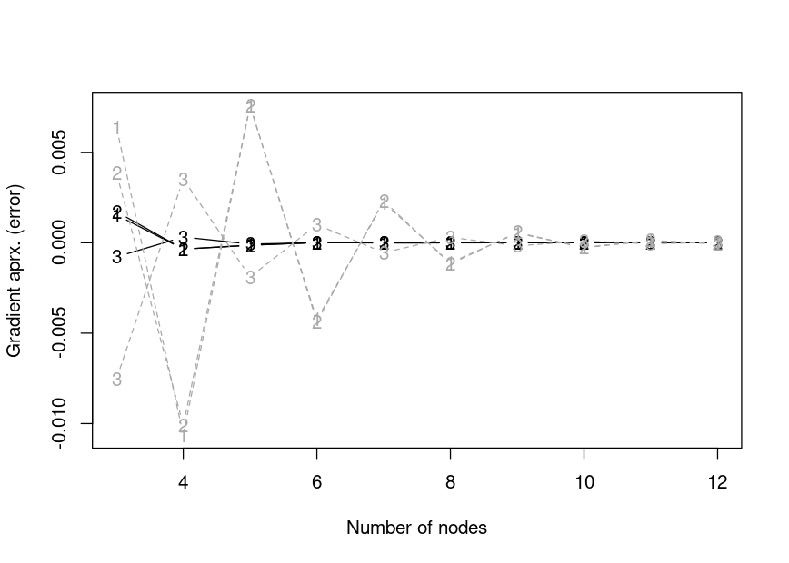
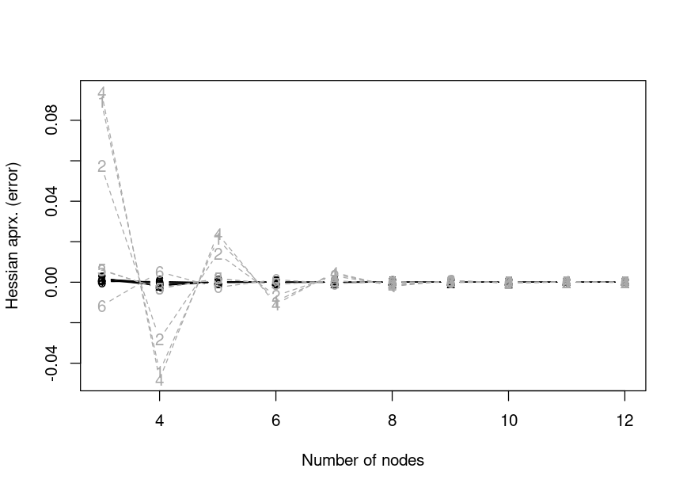
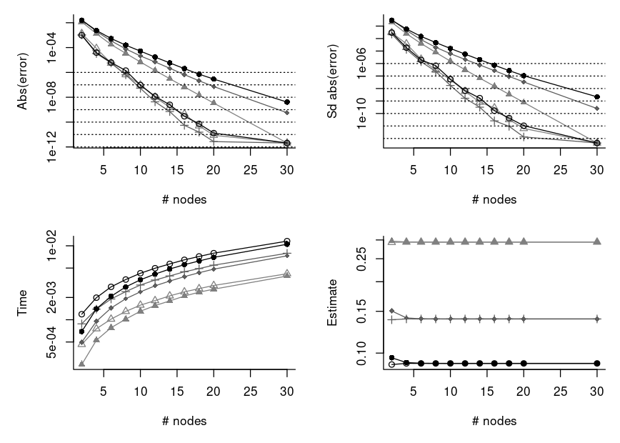
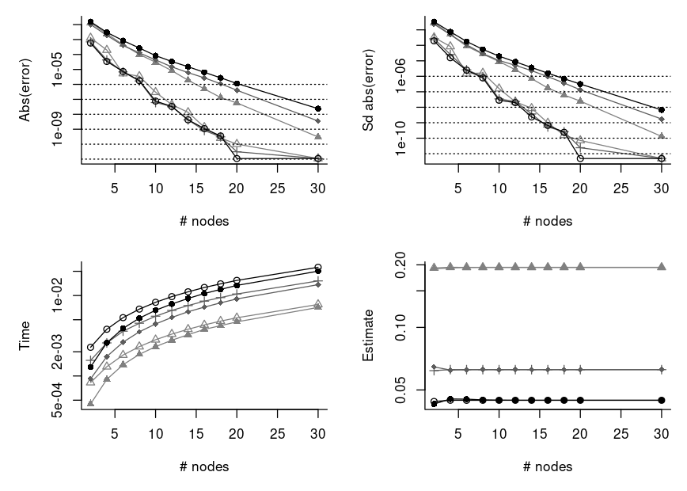
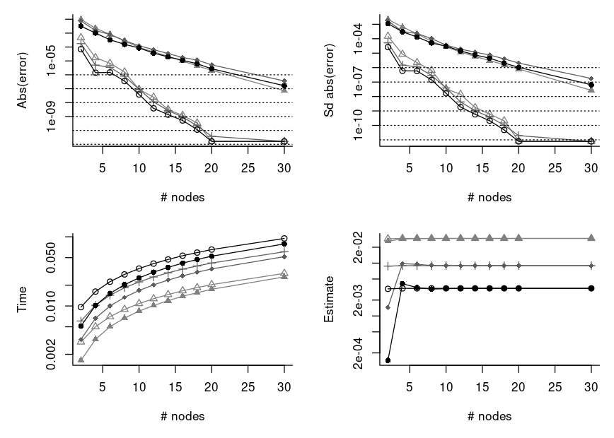

Mixed Models with a Probit Link
===============================

We make a comparison below of making an approximation of a marginal
likelihood factor that is typical in many mixed effect models with a
probit link function. The particular model we use here is mixed probit
model where the observed outcomes are binary. In this model, a marginal
factor, , for a given
cluster is

![\\begin{align\*}
L &= \\int \\phi^{(p)}(\\vec u; \\vec 0, \\Sigma)
  \\prod\_{i = 1}^n 
  \\Phi(\\eta\_i + \\vec z\_i^\\top\\vec u)^{y\_i} 
  \\Phi(-\\eta\_i-\\vec z\_i^\\top\\vec u)^{1 - y\_i}
  d\\vec u \\\\
\\vec y &\\in \\{0,1\\}^n \\\\
\\phi^{(p)}(\\vec u;\\vec \\mu, \\Sigma) &= 
  \\frac 1{(2\\pi)^{p/2}\\lvert\\Sigma\\rvert^{1/2}}
  \\exp\\left(-\\frac 12 (\\vec u - \\vec\\mu)^\\top\\Sigma^{-1}
                      (\\vec u - \\vec\\mu)\\right), 
  \\quad \\vec u \\in\\mathbb{R}^p\\\\
\\Phi(x) &= \\int\_0^x\\phi^{(1)}(z;0,1)dz
\\end{align\*}](https://latex.codecogs.com/svg.latex?%5Cbegin%7Balign%2A%7D%0AL%20%26%3D%20%5Cint%20%5Cphi%5E%7B%28p%29%7D%28%5Cvec%20u%3B%20%5Cvec%200%2C%20%5CSigma%29%0A%20%20%5Cprod_%7Bi%20%3D%201%7D%5En%20%0A%20%20%5CPhi%28%5Ceta_i%20%2B%20%5Cvec%20z_i%5E%5Ctop%5Cvec%20u%29%5E%7By_i%7D%20%0A%20%20%5CPhi%28-%5Ceta_i-%5Cvec%20z_i%5E%5Ctop%5Cvec%20u%29%5E%7B1%20-%20y_i%7D%0A%20%20d%5Cvec%20u%20%5C%5C%0A%5Cvec%20y%20%26%5Cin%20%5C%7B0%2C1%5C%7D%5En%20%5C%5C%0A%5Cphi%5E%7B%28p%29%7D%28%5Cvec%20u%3B%5Cvec%20%5Cmu%2C%20%5CSigma%29%20%26%3D%20%0A%20%20%5Cfrac%201%7B%282%5Cpi%29%5E%7Bp%2F2%7D%5Clvert%5CSigma%5Crvert%5E%7B1%2F2%7D%7D%0A%20%20%5Cexp%5Cleft%28-%5Cfrac%2012%20%28%5Cvec%20u%20-%20%5Cvec%5Cmu%29%5E%5Ctop%5CSigma%5E%7B-1%7D%0A%20%20%20%20%20%20%20%20%20%20%20%20%20%20%20%20%20%20%20%20%20%20%28%5Cvec%20u%20-%20%5Cvec%5Cmu%29%5Cright%29%2C%20%0A%20%20%5Cquad%20%5Cvec%20u%20%5Cin%5Cmathbb%7BR%7D%5Ep%5C%5C%0A%5CPhi%28x%29%20%26%3D%20%5Cint_0%5Ex%5Cphi%5E%7B%281%29%7D%28z%3B0%2C1%29dz%0A%5Cend%7Balign%2A%7D "\begin{align*}
L &= \int \phi^{(p)}(\vec u; \vec 0, \Sigma)
  \prod_{i = 1}^n 
  \Phi(\eta_i + \vec z_i^\top\vec u)^{y_i} 
  \Phi(-\eta_i-\vec z_i^\top\vec u)^{1 - y_i}
  d\vec u \\
\vec y &\in \{0,1\}^n \\
\phi^{(p)}(\vec u;\vec \mu, \Sigma) &= 
  \frac 1{(2\pi)^{p/2}\lvert\Sigma\rvert^{1/2}}
  \exp\left(-\frac 12 (\vec u - \vec\mu)^\top\Sigma^{-1}
                      (\vec u - \vec\mu)\right), 
  \quad \vec u \in\mathbb{R}^p\\
\Phi(x) &= \int_0^x\phi^{(1)}(z;0,1)dz
\end{align*}")

where
 can
be a fixed effect like

for some fixed effect covariate

and fixed effect coefficients

and 
is an unobserved random effect for the cluster.

The [quick comparison](#quick-comparison) section may be skipped unless
you want to get a grasp at what is implemented and see the definitions
of the functions that is used in this markdown. The [more rigorous
comparison](#more-rigorous-comparison) section is the main section of
this markdown. It contains an example where we vary the number of
observed outcomes, `n`, and the number of random effect, `p`, while
considering the computation time of various approximation methods for a
fixed relative error. A real data application is provided in
[examples/salamander.md](examples/salamander.md).

Quick Comparison
----------------

First, we assign a few functions that we are going to use.

``` r
aprx <- within(list(), {
  #####
  # returns a function to perform Gaussian Hermite quadrature (GHQ).
  #
  # Args:
  #   y: n length logical vector with for whether the observation has an 
  #      event.
  #   eta: n length numeric vector with offset on z-scale.
  #   Z: p by n matrix with random effect covariates. 
  #   S: n by n matrix with random effect covaraites.
  #   b: number of nodes to use with GHQ.
  get_GHQ_R <- function(y, eta, Z, S, b){
    library(fastGHQuad)
    library(compiler)
    rule <- gaussHermiteData(b)
    S_chol <- chol(S)
    
    # integrand
    f <- function(x)
      sum(mapply(pnorm, q = eta + sqrt(2) * drop(x %*% S_chol %*% Z),
               lower.tail = y, log.p = TRUE))
    
    # get all permutations of weights and values
    idx <- do.call(expand.grid, replicate(p, 1:b, simplify = FALSE))
    xs <- local({
      args <- list(FUN = c, SIMPLIFY = FALSE)
      do.call(mapply, c(args, lapply(idx, function(i) rule$x[i])))
    })
    ws_log <- local({
      args <- list(FUN = prod)
      log(do.call(mapply, c(args, lapply(idx, function(i) rule$w[i]))))
    })
    
    # final function to return
    out <- function()
      sum(exp(ws_log + vapply(xs, f, numeric(1L)))) / pi^(p / 2)
    f   <- cmpfun(f)
    out <- cmpfun(out)
    out
  }
  
  #####
  # returns a function to perform Gaussian Hermite quadrature (GHQ) using 
  # the C++ implemtation.
  # 
  # Args:
  #   y: n length logical vector with for whether the observation has an 
  #      event.
  #   eta: n length numeric vector with offset on z-scale.
  #   Z: p by n matrix with random effect covariates. 
  #   S: n by n matrix with random effect covaraites.
  #   b: number of nodes to use with GHQ.
  #   is_adaptive: logical for whether to use adaptive GHQ.
  get_GHQ_cpp <- function(y, eta, Z, S, b, is_adaptive = FALSE){
    mixprobit:::set_GH_rule_cached(b)
    function()
      mixprobit:::aprx_binary_mix_ghq(y = y, eta = eta, Z = Z, Sigma = S,
                                      b = b, is_adaptive = is_adaptive)
  }
  get_AGHQ_cpp <- get_GHQ_cpp
  formals(get_AGHQ_cpp)$is_adaptive <- TRUE
  
  #####
  # returns a function that returns the CDF approximation like in Pawitan 
  # et al. (2004).
  #
  # Args:
  #   y: n length logical vector with for whether the observation has an 
  #      event.
  #   eta: n length numeric vector with offset on z-scale.
  #   Z: p by n matrix with random effect covariates. 
  #   S: n by n matrix with random effect covaraites.
  #   maxpts: maximum number of function values as integer. 
  #   abseps: absolute error tolerance.
  #   releps: relative error tolerance.
  get_cdf_R <- function(y, eta, Z, S, maxpts, abseps = 1e-5, releps = -1){
    library(compiler)
    library(mvtnorm)
    p <- NROW(Z)
    
    out <- function(){
      dum_vec <- ifelse(y, 1, -1)
      Z_tilde <- Z * rep(dum_vec, each = p)
      SMat <- crossprod(Z_tilde , S %*% Z_tilde)
      diag(SMat) <- diag(SMat) + 1
      pmvnorm(upper = dum_vec * eta, mean = rep(0, n), sigma = SMat,
              algorithm = GenzBretz(maxpts = maxpts, abseps = abseps, 
                                    releps = releps))
    }
    out <- cmpfun(out)
    out
  }
  
  #####
  # returns a function that returns the CDF approximation like in Pawitan 
  # et al. (2004) using the C++ implementation.
  #
  # Args:
  #   y: n length logical vector with for whether the observation has an 
  #      event.
  #   eta: n length numeric vector with offset on z-scale.
  #   Z: p by n matrix with random effect covariates. 
  #   S: n by n matrix with random effect covaraites.
  #   maxpts: maximum number of function values as integer. 
  #   abseps: bsolute error tolerance.
  #   releps: relative error tolerance.
  get_cdf_cpp <- function(y, eta, Z, S, maxpts, abseps = -1, 
                          releps = 1e-3)
    function()
      mixprobit:::aprx_binary_mix_cdf(
        y = y, eta = eta, Z = Z, Sigma = S, maxpts = maxpts,
        abseps = abseps, releps = releps)
  
  #####
  # returns a function that uses the method from Genz & Monahan (1999).
  #
  # Args:
  #   y: n length logical vector with for whether the observation has an 
  #      event.
  #   eta: n length numeric vector with offset on z-scale.
  #   Z: p by n matrix with random effect covariates. 
  #   S: n by n matrix with random effect covaraites.
  #   maxpts: maximum number of function values as integer. 
  #   abseps: bsolute error tolerance.
  #   releps: relative error tolerance.
  #   is_adaptive: logical for whether to use adaptive method.
  get_sim_mth <- function(y, eta, Z, S, maxpts, abseps = 1e-5, releps = -1, 
                          is_adaptive = FALSE)
    # Args: 
    #   key: integer which determines degree of integration rule.
    function(key)
      mixprobit:::aprx_binary_mix(
        y = y, eta = eta, Z = Z, Sigma = S, maxpts = maxpts, key = key, 
        abseps = abseps, releps = releps, is_adaptive = is_adaptive)
  get_Asim_mth <- get_sim_mth
  formals(get_Asim_mth)$is_adaptive <- TRUE
  
  #####
  # returns a function that uses Quasi-monte carlo integration to 
  # approximate the integrals. 
  # 
  # Args:
  #   y: n length logical vector with for whether the observation has an 
  #      event.
  #   eta: n length numeric vector with offset on z-scale.
  #   Z: p by n matrix with random effect covariates. 
  #   S: n by n matrix with random effect covaraites.
  #   maxpts: integer with maximum number of points to use. 
  #   is_adaptive: logical for whether to use an adaptive method.
  #   releps: relative error tolerance.
  #   n_seqs: number of randomized sobol sequences.
  #   abseps: unused.
  get_qmc <- function(y, eta, Z, S, maxpts, is_adaptive = FALSE, 
                      releps = 1e-4, n_seqs = 10L, abseps)
    function(){
      seeds <- sample.int(2147483646L, n_seqs)
      mixprobit:::aprx_binary_mix_qmc(
        y = y, eta = eta, Z = Z, Sigma = S, n_max = maxpts, 
        is_adaptive = is_adaptive, seeds = seeds, releps = releps)
    }
  get_Aqmc <- get_qmc
  formals(get_Aqmc)$is_adaptive <- TRUE
})
```

Then we assign a function to get a simulated data set for a single
cluster within a mixed probit model with binary outcomes.

``` r
#####
# returns a simulated data set from one cluster in a mixed probit model 
# with binary outcomes.
# 
# Args:
#   n: cluster size.
#   p: number of random effects.
get_sim_dat <- function(n, p){
  out <- list(n = n, p = p)
  within(out, {
    Z <- do.call(                        # random effect design matrix
      rbind, c(list(sqrt(1/p)), 
               list(replicate(n, rnorm(p - 1L, sd = sqrt(1/p))))))
    eta <- rnorm(n)                      # fixed offsets/fixed effects
    n <- NCOL(Z)                         # number of individuals
    p <- NROW(Z)                         # number of random effects
    S <- drop(                           # covariance matrix of random effects
      rWishart(1, 5 * p, diag(1 / p / 5, p)))
    S_chol <- chol(S)
    u <- drop(rnorm(p) %*% S_chol)       # random effects
    y <- runif(n) < pnorm(drop(u %*% Z)) # observed outcomes
  })
}
```

The variance of the linear predictor given the random effect is
independent of the random effect dimension, `p`.

``` r
var(replicate(1000, with(get_sim_dat(10, 2), u %*% Z + eta)))
#> [1] 1.996
var(replicate(1000, with(get_sim_dat(10, 3), u %*% Z + eta)))
#> [1] 2.049
var(replicate(1000, with(get_sim_dat(10, 4), u %*% Z + eta)))
#> [1] 2.037
var(replicate(1000, with(get_sim_dat(10, 5), u %*% Z + eta)))
#> [1] 2.012
var(replicate(1000, with(get_sim_dat(10, 6), u %*% Z + eta)))
#> [1] 1.962
var(replicate(1000, with(get_sim_dat(10, 7), u %*% Z + eta)))
#> [1] 2.004
var(replicate(1000, with(get_sim_dat(10, 8), u %*% Z + eta)))
#> [1] 2.046
```

Next we perform a quick example.

``` r
set.seed(2)

#####
# parameters to change
n <- 10L              # cluster size
p <- 4L               # number of random effects
b <- 15L              # number of nodes to use with GHQ
maxpts <- p * 10000L  # factor to set the (maximum) number of
                      # evaluations of the integrand with
                      # the other methods

#####
# variables used in simulation
dat <- get_sim_dat(n = n, p = p)

# shorter than calling `with(dat, ...)`
wd <- function(expr)
  eval(bquote(with(dat, .(substitute(expr)))), parent.frame())

#####
# get the functions to use
GHQ_R    <- wd(aprx$get_GHQ_R   (y = y, eta = eta, Z = Z, S = S, b = b))
#> Loading required package: Rcpp
GHQ_cpp  <- wd(aprx$get_GHQ_cpp (y = y, eta = eta, Z = Z, S = S, b = b))
AGHQ_cpp <- wd(aprx$get_AGHQ_cpp(y = y, eta = eta, Z = Z, S = S, b = b))

cdf_aprx_R   <- wd(aprx$get_cdf_R  (y = y, eta = eta, Z = Z, S = S, 
                                    maxpts = maxpts))
cdf_aprx_cpp <- wd(aprx$get_cdf_cpp(y = y, eta = eta, Z = Z, S = S, 
                                    maxpts = maxpts))

qmc_aprx <- wd(
  aprx$get_qmc(y = y, eta = eta, Z = Z, S = S, maxpts = maxpts))
qmc_Aaprx <- wd(
  aprx$get_Aqmc(y = y, eta = eta, Z = Z, S = S, maxpts = maxpts))

sim_aprx <-  wd(aprx$get_sim_mth(y = y, eta = eta, Z = Z, S = S, 
                                 maxpts = maxpts))
sim_Aaprx <- wd(aprx$get_Asim_mth(y = y, eta = eta, Z = Z, S = S, 
                                  maxpts = maxpts))

#####
# compare results. Start with the simulation based methods with a lot of
# samples. We take this as the ground truth
truth_maybe_cdf <- wd( 
  aprx$get_cdf_cpp (y = y, eta = eta, Z = Z, S = S, maxpts = 1e7, 
                    abseps = 1e-11))()
truth_maybe_cdf
#> [1] 6.184e-05
#> attr(,"inform")
#> [1] 0
#> attr(,"error")
#> [1] 3.471e-08

truth_maybe_qmc <- wd(
  aprx$get_qmc(y = y, eta = eta, Z = Z, S = S, maxpts = 1e7, 
               releps = 1e-11)())
truth_maybe_qmc
#> [1] 6.184e-05
#> attr(,"intvls")
#> [1] 10000000
#> attr(,"error")
#> [1] 6.227e-10

truth_maybe_Aqmc <- wd(
  aprx$get_Aqmc(y = y, eta = eta, Z = Z, S = S, maxpts = 1e7, 
                releps = 1e-11)())
truth_maybe_Aqmc
#> [1] 6.184e-05
#> attr(,"intvls")
#> [1] 10000000
#> attr(,"error")
#> [1] 3.495e-10

truth_maybe_Amc <- wd(
  aprx$get_Asim_mth(y = y, eta = eta, Z = Z, S = S, maxpts = 1e7, 
                    abseps = 1e-11)(2L))
truth_maybe_Amc
#> [1] 6.184e-05
#> attr(,"error")
#> [1] 1.082e-09
#> attr(,"inform")
#> [1] 1
#> attr(,"inivls")
#> [1] 9999991

truth <- wd(
  mixprobit:::aprx_binary_mix_brute(y = y, eta = eta, Z = Z, Sigma = S, 
                                    n_sim = 1e8, n_threads = 6L))

c(Estiamte = truth, SE = attr(truth, "SE"),  
  `Estimate (log)` = log(c(truth)),  
  `SE (log)` = abs(attr(truth, "SE") / truth))
#>       Estiamte             SE Estimate (log)       SE (log) 
#>      6.184e-05      2.566e-10     -9.691e+00      4.149e-06

tr <- c(truth)
all.equal(tr, c(truth_maybe_cdf))
#> [1] "Mean relative difference: 5.269e-05"
all.equal(tr, c(truth_maybe_qmc))
#> [1] "Mean relative difference: 2.435e-05"
all.equal(tr, c(truth_maybe_Aqmc))
#> [1] "Mean relative difference: 9.696e-06"
all.equal(tr, c(truth_maybe_Amc))
#> [1] "Mean relative difference: 1.157e-05"

# compare with using fewer samples and GHQ
all.equal(tr,   GHQ_R())
#> [1] "Mean relative difference: 2.226e-05"
all.equal(tr,   GHQ_cpp())
#> [1] "Mean relative difference: 2.226e-05"
all.equal(tr,   AGHQ_cpp())
#> [1] "Mean relative difference: 2.068e-06"
comp <- function(f, ...)
  mean(replicate(10, abs((tr - c(f())) / tr)))
comp(cdf_aprx_R)
#> [1] 9.598e-05
comp(qmc_aprx)
#> [1] 0.001256
comp(qmc_Aaprx)
#> [1] 0.0002439
comp(cdf_aprx_cpp)
#> [1] 0.0001169
comp(function() sim_aprx(1L))
#> [1] 0.05832
comp(function() sim_aprx(2L))
#> [1] 0.04502
comp(function() sim_aprx(3L))
#> [1] 0.05785
comp(function() sim_aprx(4L))
#> [1] 0.04911
comp(function() sim_Aaprx(1L))
#> [1] 0.004187
comp(function() sim_Aaprx(2L))
#> [1] 0.004547
comp(function() sim_Aaprx(3L))
#> [1] 0.002234
comp(function() sim_Aaprx(4L))
#> [1] 0.002864

# compare computations times
system.time(GHQ_R()) # way too slow (seconds!). Use C++ method instead
#>    user  system elapsed 
#>   1.386   0.000   1.385
microbenchmark::microbenchmark(
  `GHQ (C++)` = GHQ_cpp(), `AGHQ (C++)` = AGHQ_cpp(),
  `CDF` = cdf_aprx_R(), `CDF (C++)` = cdf_aprx_cpp(),
  QMC = qmc_aprx(), `QMC Adaptive` = qmc_Aaprx(),
  `Genz & Monahan (1)` = sim_aprx(1L), `Genz & Monahan (2)` = sim_aprx(2L),
  `Genz & Monahan (3)` = sim_aprx(3L), `Genz & Monahan (4)` = sim_aprx(4L),
  `Genz & Monahan Adaptive (2)` = sim_Aaprx(2L),
  times = 10)
#> Unit: microseconds
#>                         expr      min      lq    mean  median      uq     max
#>                    GHQ (C++) 35294.50 35447.0 35734.9 35721.8 35933.5 36565.0
#>                   AGHQ (C++) 36395.50 36573.2 36887.8 36862.3 37193.9 37457.2
#>                          CDF 21442.10 21603.7 21790.3 21635.3 21982.6 22366.6
#>                    CDF (C++) 11190.90 11275.6 11379.3 11356.1 11431.1 11667.0
#>                          QMC 28006.59 28224.3 30232.6 28890.3 30683.0 40964.5
#>                 QMC Adaptive 29316.52 29772.1 30103.8 30258.8 30281.4 30895.8
#>           Genz & Monahan (1)   232.56   563.8   703.0   767.4   886.4   955.0
#>           Genz & Monahan (2)    83.72   268.5   288.1   289.8   355.0   365.3
#>           Genz & Monahan (3)    90.66   100.9   172.9   183.6   237.8   257.1
#>           Genz & Monahan (4)   192.70   209.9   255.1   220.7   304.6   375.7
#>  Genz & Monahan Adaptive (2)   109.79   117.2   130.6   132.2   142.3   150.6
#>  neval
#>     10
#>     10
#>     10
#>     10
#>     10
#>     10
#>     10
#>     10
#>     10
#>     10
#>     10
```

More Rigorous Comparison
------------------------

We are interested in a more rigorous comparison. Therefor, we define a
function below which for given number of observation in the cluster,
`n`, and given number of random effects, `p`, performs a repeated number
of runs with each of the methods and returns the computation time (among
other output). To make a fair comparison, we fix the relative error of
the methods before hand such that the relative error is below `releps`,
.
Ground truth is computed with brute force MC using `n_brute`,
,
samples.

Since GHQ is deterministic, we use a number of nodes such that this
number of nodes or `streak_length`, 4, less value of nodes with GHQ
gives a relative error which is below the threshold. We use a minimum of
4 nodes at the time of this writing. The error of the simulation based
methods is approximated using `n_reps`, 20, replications.

``` r
# default parameters
ex_params <- list(
  streak_length = 4L, 
  max_b = 25L, 
  max_maxpts = 2500000L, 
  releps = 2e-4,
  min_releps = 1e-6,
  key_use = 3L, 
  n_reps = 20L, 
  n_runs = 5L, 
  n_brute = 1e7, 
  n_brute_max = 1e8, 
  n_brute_sds = 4, 
  qmc_n_seqs = 10L)
```

``` r
# perform a simulations run for a given number of observations and random 
# effects. First we fix the relative error of each method such that it is
# below a given threshold. Then we run each method a number of times to 
# measure the computation time. 
# 
# Args:
#   n: number of observations in the cluster.
#   p: number of random effects. 
#   releps: required relative error. 
#   key_use: integer which determines degree of integration rule for the 
#            method from Genz and Monahan (1999).
#   n_threads: number of threads to use.
#   n_fail: only used by the function if a brute force estimator cannot
#           get within the precision.
sim_experiment <- function(n, p, releps = ex_params$releps, 
                           key_use = ex_params$key_use, n_threads = 1L, 
                           n_fail = 0L){
  # in some cases we may not want to run the simulation experiment
  do_not_run <- FALSE
  
  # simulate data
  dat <- get_sim_dat(n = n, p = p)
  
  # shorter than calling `with(dat, ...)`
  wd <- function(expr)
    eval(bquote(with(dat, .(substitute(expr)))), parent.frame())
  
  # get the assumed ground truth
  if(do_not_run){
    truth <- SE_truth <- NA_real_
    n_brute <- NA_integer_
    find_brute_failed <- FALSE
    
  } else {
    passed <- FALSE
    n_brute <- NA_integer_
    find_brute_failed <- FALSE
    
    while(!passed){
      if(!is.na(n_brute) && n_brute >= ex_params$n_brute_max){
        n_brute <- NA_integer_
        find_brute_failed <- TRUE
        break
      }
      
      n_brute <- if(is.na(n_brute))
        ex_params$n_brute 
      else 
        min(ex_params$n_brute_max, 
            n_brute * as.integer(ceiling(1.2 * (SE_truth / eps)^2)))
      
      truth <- wd(mixprobit:::aprx_binary_mix_brute(
        y = y, eta = eta, Z = Z, Sigma = S, n_sim = n_brute, 
        n_threads = n_threads))
      
      SE_truth <- abs(attr(truth, "SE") / c(truth))
      eps <- ex_params$releps / ex_params$n_brute_sds * abs(log(c(truth)))
      passed <- SE_truth < eps
    }
      
    truth <- c(truth)
  }
  
  if(find_brute_failed){
    # we failed to find a brute force estimator within the precision. 
    # We repeat with a new data set
    cl <- match.call()
    cl$n_fail <- n_fail + 1L
    return(eval(cl, parent.frame()))
  }
  
  # function to test whether the value is ok
  is_ok_func <- function(vals){
    test_val <- (log(vals) - log(truth)) / log(truth) 
    if(!all(is.finite(test_val)))
      stop("non-finite 'vals'")
    sqrt(mean(test_val^2)) < releps / 2
  }
      
  # get function to use with GHQ
  get_b <- function(meth){
    if(do_not_run)
      NA_integer_
    else local({
      apx_func <- function(b)
        wd(meth(y = y, eta = eta, Z = Z, S = S, b = b))()
      
      # length of node values which have a relative error below the threshold
      streak_length <- ex_params$streak_length
      vals <- rep(NA_real_, streak_length)
      
      b <- streak_length
      for(i in 1:(streak_length - 1L))
        vals[i + 1L] <- apx_func(b - streak_length + i)
      repeat {
        vals[1:(streak_length - 1L)] <- vals[-1]
        vals[streak_length] <- apx_func(b)
        
        if(all(is_ok_func(vals)))
          break
        
        b <- b + 1L
        if(b > ex_params$max_b){
          warning("found no node value")
          b <- NA_integer_
          break
        }
      }
      b
    })
  }
  
  is_to_large_for_ghq <- n > 16L || p >= 5L
  b_use <- if(is_to_large_for_ghq)
    NA_integer_ else get_b(aprx$get_GHQ_cpp)
  ghq_func <- if(!is.na(b_use))
    wd(aprx$get_GHQ_cpp(y = y, eta = eta, Z = Z, S = S, b = b_use))
  else
    NA
  
  # get function to use with AGHQ
  b_use_A <- get_b(aprx$get_AGHQ_cpp)
  aghq_func <- if(!is.na(b_use_A))
    wd(aprx$get_AGHQ_cpp(y = y, eta = eta, Z = Z, S = S, b = b_use_A))
  else
    NA
  
  # get function to use with CDF method
  get_releps <- function(meth){
    if(do_not_run)
      NA_integer_
    else {
      releps_use <- releps * 1000
      repeat {
        func <- wd(meth(y = y, eta = eta, Z = Z, S = S, 
                        maxpts = ex_params$max_maxpts, 
                        abseps = -1, releps = releps_use))
        if("key" %in% names(formals(func)))
          formals(func)$key <- ex_params$key_use
        vals <- replicate(ex_params$n_reps, {
          v <- func()
          inivls <- if("inivls" %in% names(attributes(v)))
            attr(v, "inivls") else NA_integer_
          c(value = v, error = attr(v, "error"), inivls = inivls)
        })
        
        inivls_ok <- all(
          is.na(vals["inivls", ]) | 
            vals["inivls", ] / ex_params$max_maxpts < .999999)
        
        if(all(is_ok_func(vals["value", ])) && inivls_ok)
          break
        
        releps_use <- if(!inivls_ok) 
          # no point in doing any more computations
          ex_params$min_releps / 10 else 
            releps_use / 2
        if(releps_use < ex_params$min_releps){
          warning("found no releps")
          releps_use <- NA_integer_
          break
        }
      }
      releps_use
    }
  }
  
  cdf_releps <- get_releps(aprx$get_cdf_cpp)
  cdf_func <- if(!is.na(cdf_releps))
    wd(aprx$get_cdf_cpp(y = y, eta = eta, Z = Z, S = S, 
                        maxpts = ex_params$max_maxpts, abseps = -1, 
                        releps = cdf_releps))
  else 
    NA
  
  # get function to use with Genz and Monahan method
  # sim_releps <- if(is_to_large_for_ghq) 
  #   NA_integer_ else get_releps(aprx$get_sim_mth)
  sim_releps <- NA_integer_ # just do not use it. It is __very__ slow in  
                            # some cases
  sim_func <- if(!is.na(sim_releps))
    wd(aprx$get_sim_mth(y = y, eta = eta, Z = Z, S = S, 
                        maxpts = ex_params$max_maxpts, abseps = -1, 
                        releps = sim_releps))
  else 
    NA
  if(is.function(sim_func))
    formals(sim_func)$key <- key_use
  
  # do the same with the adaptive version
  Asim_releps <- get_releps(aprx$get_Asim_mth)
  Asim_func <- if(!is.na(Asim_releps))
    wd(aprx$get_Asim_mth(y = y, eta = eta, Z = Z, S = S, 
                         maxpts = ex_params$max_maxpts, abseps = -1, 
                         releps = Asim_releps))
  else 
    NA
  if(is.function(Asim_func))
    formals(Asim_func)$key <- key_use
  
  # get function to use with QMC
  formals(aprx$get_qmc)$n_seqs <- ex_params$qmc_n_seqs
  qmc_releps <- if(is_to_large_for_ghq)
    NA_integer_ else get_releps(aprx$get_qmc)
  qmc_func <- if(!is.na(qmc_releps))
     wd(aprx$get_qmc(y = y, eta = eta, Z = Z, S = S, 
                     maxpts = ex_params$max_maxpts, abseps = -1,
                     releps = qmc_releps, 
                     n_seqs = ex_params$qmc_n_seqs))
  else 
    NA

  # get function to use with adaptive QMC
  Aqmc_releps <- get_releps(aprx$get_Aqmc)
  formals(aprx$get_Aqmc)$n_seqs <- ex_params$qmc_n_seqs
  Aqmc_func <- if(!is.null(Aqmc_releps))
    wd(aprx$get_Aqmc(y = y, eta = eta, Z = Z, S = S, 
                     maxpts = ex_params$max_maxpts, abseps = -1,
                     releps = Aqmc_releps, 
                     n_seqs = ex_params$qmc_n_seqs))
  else 
    NA
    
  # perform the comparison
  out <- sapply(
    list(GHQ = ghq_func, AGHQ = aghq_func, CDF = cdf_func, 
         GenzMonahan = sim_func, GenzMonahanA = Asim_func, 
         QMC = qmc_func, QMCA = Aqmc_func), 
    function(func){
      if(!is.function(func) && is.na(func)){
        out <- rep(NA_real_, 7L)
        names(out) <- c("mean", "sd", "mse", "user.self", 
                        "sys.self", "elapsed", "rel_rmse")
        return(out)
      }
      
      # number of runs used to estimate the computation time, etc.
      n_runs <- ex_params$n_runs
      
      # perform the computations to estimate the computation times
      ti <- system.time(vals <- replicate(n_runs, {
        out <- func()
        if(!is.null(err <- attr(out, "error"))){
          # only of of the two methods needs an adjustment of the sd! 
          # TODO: this is very ad hoc...
          is_genz_mona <- !is.null(environment(func)$is_adaptive)

          sd <- if(is_genz_mona)
            err else err / 2.5
          
          out <- c(value = out, sd = sd)
        }
        out
      }))
      
      # handle computation of sd and mse
      is_ghq <- !is.null(b <- environment(func)$b)
      if(is_ghq){
        # if it is GHQ then we alter the number of nodes to get an sd 
        # estiamte etc.
        sl <- ex_params$streak_length
        other_vs <- sapply((b - sl + 1):b, function(b){
          environment(func)$b <- b
          func()
        })
        
        vs <- c(other_vs, vals[1])
        sd_use <- sd(vs)
        mse <- mean((vs - truth)^2)
        rel_rmse <- sqrt(mean(((log(vs) - log(truth)) / log(truth))^2))
        
      } else {
        # we combine the variance estimators
        sd_use <- sqrt(mean(vals["sd", ]^2))
        vals <- vals["value", ]
        mse <- mean((vals - truth)^2)
        rel_rmse <- sqrt(mean(((log(vals) - log(truth)) / log(truth))^2))
        
      }
      
      c(mean = mean(vals), sd = sd_use, mse = mse, ti[1:3] / n_runs, 
        rel_rmse = rel_rmse)            
    })
  
  structure(list(
    b_use = b_use, b_use_A = b_use_A, cdf_releps = cdf_releps, 
    sim_releps = sim_releps, Asim_releps = Asim_releps, 
    qmc_releps = qmc_releps, Aqmc_releps = Aqmc_releps,
    ll_truth = log(truth), SE_truth = SE_truth, n_brute = n_brute, 
    n_fail = n_fail, vals_n_comp_time = out), 
    class = "sim_experiment")
}
```

Here is a few quick examples where we use the function we just defined.

``` r
print.sim_experiment <- function(x, ...){
  old <- options()
  on.exit(options(old))
  options(digits = 6, scipen = 999)
  
  cat(
    sprintf("         # brute force samples: %13d", x$n_brute),
    sprintf("                  # nodes  GHQ: %13d", x$b_use),
    sprintf("                  # nodes AGHQ: %13d", x$b_use_A),
    sprintf("                    CDF releps: %13.8f", x$cdf_releps), 
    sprintf("         Genz & Monahan releps: %13.8f", x$sim_releps),
    sprintf("Adaptive Genz & Monahan releps: %13.8f", x$Asim_releps), 
    sprintf("                    QMC releps: %13.8f", x$qmc_releps),
    sprintf("           Adaptive QMC releps: %13.8f", x$Aqmc_releps), 
    sprintf("  Log-likelihood estimate (SE): %13.8f (%.8f)", x$ll_truth, 
            x$SE_truth), 
    "", sep = "\n")
  
  xx <- x$vals_n_comp_time["mean", ]
  print(cbind(`Mean estimate (likelihood)`     = xx, 
              `Mean estimate (log-likelihood)` = log(xx)))
  
  mult <- exp(ceiling(log10(1 / ex_params$releps)) * log(10))
  cat(sprintf("\nSD & RMSE (/%.2f)\n", mult))
  print(rbind(SD   = x$vals_n_comp_time ["sd", ],  
              RMSE = sqrt(x$vals_n_comp_time ["mse", ]), 
              `Rel RMSE` = x$vals_n_comp_time["rel_rmse", ]) * mult)
  
  cat("\nComputation times\n")
  print(x$vals_n_comp_time["elapsed", ])
}

set.seed(1)
sim_experiment(n = 3L , p = 2L, n_threads = 6L)
#>          # brute force samples:      10000000
#>                   # nodes  GHQ:            10
#>                   # nodes AGHQ:             6
#>                     CDF releps:    0.20000000
#>          Genz & Monahan releps:            NA
#> Adaptive Genz & Monahan releps:    0.20000000
#>                     QMC releps:    0.00039063
#>            Adaptive QMC releps:    0.00039063
#>   Log-likelihood estimate (SE):   -3.20961388 (0.00000229)
#> 
#>              Mean estimate (likelihood) Mean estimate (log-likelihood)
#> GHQ                           0.0403722                       -3.20961
#> AGHQ                          0.0403721                       -3.20962
#> CDF                           0.0403691                       -3.20969
#> GenzMonahan                          NA                             NA
#> GenzMonahanA                  0.0403672                       -3.20974
#> QMC                           0.0403794                       -3.20944
#> QMCA                          0.0403686                       -3.20970
#> 
#> SD & RMSE (/10000.00)
#>                GHQ      AGHQ      CDF GenzMonahan GenzMonahanA       QMC
#> SD       0.0425442 0.0382665 0.134515          NA     0.126093 0.0547395
#> RMSE     0.0406504 0.0386503 0.061449          NA     0.153399 0.1152442
#> Rel RMSE 0.3137423 0.2983075 0.474246          NA     1.183884 0.8891403
#>               QMCA
#> SD       0.0541388
#> RMSE     0.0791076
#> Rel RMSE 0.6105496
#> 
#> Computation times
#>          GHQ         AGHQ          CDF  GenzMonahan GenzMonahanA          QMC 
#>       0.0000       0.0000       0.0002           NA       0.0000       0.0084 
#>         QMCA 
#>       0.0020
sim_experiment(n = 10L, p = 2L, n_threads = 6L)
#>          # brute force samples:      10000000
#>                   # nodes  GHQ:            11
#>                   # nodes AGHQ:             4
#>                     CDF releps:    0.20000000
#>          Genz & Monahan releps:            NA
#> Adaptive Genz & Monahan releps:    0.20000000
#>                     QMC releps:    0.00078125
#>            Adaptive QMC releps:    0.00156250
#>   Log-likelihood estimate (SE):   -5.88644301 (0.00000181)
#> 
#>              Mean estimate (likelihood) Mean estimate (log-likelihood)
#> GHQ                          0.00277676                       -5.88647
#> AGHQ                         0.00277684                       -5.88644
#> CDF                          0.00277680                       -5.88646
#> GenzMonahan                          NA                             NA
#> GenzMonahanA                 0.00277686                       -5.88644
#> QMC                          0.00277650                       -5.88656
#> QMCA                         0.00277655                       -5.88655
#> 
#> SD & RMSE (/10000.00)
#>                 GHQ      AGHQ        CDF GenzMonahan GenzMonahanA        QMC
#> SD       0.00702665 0.0137016 0.00201768          NA  0.001874198 0.00652502
#> RMSE     0.00650774 0.0127977 0.00102083          NA  0.000836298 0.01026912
#> Rel RMSE 0.39805560 0.7825776 0.06245331          NA  0.051162306 0.62841695
#>                QMCA
#> SD       0.01374649
#> RMSE     0.00877671
#> Rel RMSE 0.53709955
#> 
#> Computation times
#>          GHQ         AGHQ          CDF  GenzMonahan GenzMonahanA          QMC 
#>       0.0000       0.0000       0.0104           NA       0.0000       0.0080 
#>         QMCA 
#>       0.0010

sim_experiment(n = 3L , p = 5L, n_threads = 6L)
#>          # brute force samples:      10000000
#>                   # nodes  GHQ:            NA
#>                   # nodes AGHQ:             7
#>                     CDF releps:    0.20000000
#>          Genz & Monahan releps:            NA
#> Adaptive Genz & Monahan releps:    0.00039063
#>                     QMC releps:            NA
#>            Adaptive QMC releps:    0.00039063
#>   Log-likelihood estimate (SE):   -2.93081608 (0.00003156)
#> 
#>              Mean estimate (likelihood) Mean estimate (log-likelihood)
#> GHQ                                  NA                             NA
#> AGHQ                          0.0533543                       -2.93080
#> CDF                           0.0533500                       -2.93088
#> GenzMonahan                          NA                             NA
#> GenzMonahanA                  0.0533519                       -2.93085
#> QMC                                  NA                             NA
#> QMCA                          0.0533523                       -2.93084
#> 
#> SD & RMSE (/10000.00)
#>          GHQ      AGHQ       CDF GenzMonahan GenzMonahanA QMC      QMCA
#> SD        NA 0.0636415 0.0679714          NA    0.0809023  NA 0.0794669
#> RMSE      NA 0.0631283 0.0400429          NA    0.0373369  NA 0.0374468
#> Rel RMSE  NA 0.4037652 0.2560918          NA    0.2387783  NA 0.2394755
#> 
#> Computation times
#>          GHQ         AGHQ          CDF  GenzMonahan GenzMonahanA          QMC 
#>           NA       0.0054       0.0002           NA       0.1660           NA 
#>         QMCA 
#>       0.0522
sim_experiment(n = 10L, p = 5L, n_threads = 6L)
#>          # brute force samples:      10000000
#>                   # nodes  GHQ:            NA
#>                   # nodes AGHQ:             7
#>                     CDF releps:    0.20000000
#>          Genz & Monahan releps:            NA
#> Adaptive Genz & Monahan releps:    0.00078125
#>                     QMC releps:            NA
#>            Adaptive QMC releps:    0.00078125
#>   Log-likelihood estimate (SE):   -5.59250506 (0.00002585)
#> 
#>              Mean estimate (likelihood) Mean estimate (log-likelihood)
#> GHQ                                  NA                             NA
#> AGHQ                         0.00372564                       -5.59252
#> CDF                          0.00372573                       -5.59249
#> GenzMonahan                          NA                             NA
#> GenzMonahanA                 0.00372568                       -5.59251
#> QMC                                  NA                             NA
#> QMCA                         0.00372582                       -5.59247
#> 
#> SD & RMSE (/10000.00)
#>          GHQ       AGHQ        CDF GenzMonahan GenzMonahanA QMC      QMCA
#> SD        NA 0.00179142 0.00258681          NA    0.0112966  NA 0.0106091
#> RMSE      NA 0.00241341 0.00219074          NA    0.0101269  NA 0.0185980
#> Rel RMSE  NA 0.11583533 0.10514177          NA    0.4860662  NA 0.8925964
#> 
#> Computation times
#>          GHQ         AGHQ          CDF  GenzMonahan GenzMonahanA          QMC 
#>           NA       0.0140       0.0120           NA       0.0872           NA 
#>         QMCA 
#>       0.0478

sim_experiment(n = 3L , p = 7L, n_threads = 6L)
#>          # brute force samples:      10000000
#>                   # nodes  GHQ:            NA
#>                   # nodes AGHQ:             6
#>                     CDF releps:    0.20000000
#>          Genz & Monahan releps:            NA
#> Adaptive Genz & Monahan releps:    0.00009766
#>                     QMC releps:            NA
#>            Adaptive QMC releps:    0.00039063
#>   Log-likelihood estimate (SE):   -2.07459523 (0.00001161)
#> 
#>              Mean estimate (likelihood) Mean estimate (log-likelihood)
#> GHQ                                  NA                             NA
#> AGHQ                           0.125608                       -2.07459
#> CDF                            0.125606                       -2.07461
#> GenzMonahan                          NA                             NA
#> GenzMonahanA                   0.125607                       -2.07459
#> QMC                                  NA                             NA
#> QMCA                           0.125630                       -2.07441
#> 
#> SD & RMSE (/10000.00)
#>          GHQ     AGHQ       CDF GenzMonahan GenzMonahanA QMC     QMCA
#> SD        NA 0.213788 0.0960791          NA    0.0476176  NA 0.166506
#> RMSE      NA 0.212742 0.0612825          NA    0.0398558  NA 0.296269
#> Rel RMSE  NA 0.816557 0.2351722          NA    0.1529476  NA 1.136713
#> 
#> Computation times
#>          GHQ         AGHQ          CDF  GenzMonahan GenzMonahanA          QMC 
#>           NA       0.0936       0.0002           NA       0.2564           NA 
#>         QMCA 
#>       0.0164
sim_experiment(n = 10L, p = 7L, n_threads = 6L)
#>          # brute force samples:      10000000
#>                   # nodes  GHQ:            NA
#>                   # nodes AGHQ:             6
#>                     CDF releps:    0.20000000
#>          Genz & Monahan releps:            NA
#> Adaptive Genz & Monahan releps:    0.00078125
#>                     QMC releps:            NA
#>            Adaptive QMC releps:    0.00156250
#>   Log-likelihood estimate (SE):   -9.16691806 (0.00002557)
#> 
#>              Mean estimate (likelihood) Mean estimate (log-likelihood)
#> GHQ                                  NA                             NA
#> AGHQ                        0.000104435                       -9.16694
#> CDF                         0.000104436                       -9.16694
#> GenzMonahan                          NA                             NA
#> GenzMonahanA                0.000104417                       -9.16712
#> QMC                                  NA                             NA
#> QMCA                        0.000104327                       -9.16798
#> 
#> SD & RMSE (/10000.00)
#>          GHQ        AGHQ          CDF GenzMonahan GenzMonahanA QMC        QMCA
#> SD        NA 0.000816346 0.0001221850          NA  0.000316621  NA 0.000550119
#> RMSE      NA 0.000808792 0.0000363568          NA  0.000319628  NA 0.001556121
#> Rel RMSE  NA 0.845517868 0.0379766475          NA  0.333922294  NA 1.627154353
#> 
#> Computation times
#>          GHQ         AGHQ          CDF  GenzMonahan GenzMonahanA          QMC 
#>           NA       0.2248       0.0130           NA       0.1526           NA 
#>         QMCA 
#>       0.0146
sim_experiment(n = 20L, p = 7L, n_threads = 6L)
#>          # brute force samples:      10000000
#>                   # nodes  GHQ:            NA
#>                   # nodes AGHQ:             7
#>                     CDF releps:    0.20000000
#>          Genz & Monahan releps:            NA
#> Adaptive Genz & Monahan releps:    0.00312500
#>                     QMC releps:            NA
#>            Adaptive QMC releps:    0.00312500
#>   Log-likelihood estimate (SE):  -15.10308843 (0.00004961)
#> 
#>              Mean estimate (likelihood) Mean estimate (log-likelihood)
#> GHQ                                  NA                             NA
#> AGHQ                     0.000000275931                       -15.1031
#> CDF                      0.000000275944                       -15.1031
#> GenzMonahan                          NA                             NA
#> GenzMonahanA             0.000000275847                       -15.1034
#> QMC                                  NA                             NA
#> QMCA                     0.000000275726                       -15.1039
#> 
#> SD & RMSE (/10000.00)
#>          GHQ           AGHQ            CDF GenzMonahan  GenzMonahanA QMC
#> SD        NA 0.000000207285 0.000001685322          NA 0.00000311119  NA
#> RMSE      NA 0.000000279837 0.000000958438          NA 0.00001592394  NA
#> Rel RMSE  NA 0.067153061495 0.229961696120          NA 3.83474954116  NA
#>                   QMCA
#> SD       0.00000308213
#> RMSE     0.00000311659
#> Rel RMSE 0.74841648168
#> 
#> Computation times
#>          GHQ         AGHQ          CDF  GenzMonahan GenzMonahanA          QMC 
#>           NA       1.1976       0.0358           NA       0.0298           NA 
#>         QMCA 
#>       0.0212
```

Next, we apply the method a number of times for a of combination of
number of observations, `n`, and number of random effects, `p`.

``` r
# number of observations in the cluster
n_vals <- 2^(1:5)
# number of random effects
p_vals <- 2:7
# grid with all configurations
gr_vals <- expand.grid(n = n_vals, p = p_vals)
# number of replications per configuration
n_runs <- 25L

ex_output <- (function(){
  # setup directory to store data
  cache_dir <- file.path("README_cache", "experiment")
  if(!dir.exists(cache_dir))
    dir.create(cache_dir)
  
  # setup cluster to use
  library(parallel)
  
  # run the experiment
  mcmapply(function(n, p){
    cache_file <- file.path(cache_dir, sprintf("n-%03d-p-%03d.Rds", n, p))
    if(!file.exists(cache_file)){
      message(sprintf("Running setup with   n %3d and p %3d", n, p))
      
      # create file to write progress to
      prg_file <- file.path(getwd(), 
                            sprintf("progress-n-%03d-p-%03d.txt", n, p))
      file.create(prg_file)
      message(sprintf("Follow progress in %s", sQuote(prg_file)))
      on.exit(unlink(prg_file))
      
      set.seed(71771946)
      sim_out <- lapply(1:n_runs, function(...){
        seed <- .Random.seed
        out <- sim_experiment(n = n, p = p)
        attr(out, "seed") <- seed
        
        cat("-", file = prg_file, append = TRUE)
        out
      })
      
      sim_out[c("n", "p")] <- list(n = n, p = p)
      saveRDS(sim_out, cache_file)
    } else
      message(sprintf("Loading results with n %3d and p %3d", n, p))
      
    
    readRDS(cache_file)
  }, n = gr_vals$n, p = gr_vals$p, SIMPLIFY = FALSE, 
  mc.cores = 4L, mc.preschedule = FALSE)
})()
```

We create a table where we summarize the results below. First we start
with the average computation time, then we show the mean scaled RMSE,
and we end by looking at the number of nodes that we need to use with
GHQ. The latter shows why GHQ becomes slower as the cluster size, `n`,
increases. The computation time is in 1000s of a second,
`comp_time_mult`. The mean scaled RMSE is multiplied by
,
`err_mult`.

``` r
comp_time_mult <- 1000 # millisecond
err_mult <- 1e5
```

``` r
#####
# show number of complete cases
.get_nice_names <- function(x){
  x <- gsub(
    "^GenzMonahan$", "Genz & Monahan (1999)", x)
  x <- gsub(
    "^GenzMonahanA$", "Genz & Monahan (1999) Adaptive", x)
  # fix stupid typo at one point
  x <- gsub("^ADHQ$", "AGHQ", x)
  x <- gsub("^QMCA$", "Adaptive QMC", x)
  x
}

local({
  comp_times <- sapply(ex_output, function(x)
    sapply(x[!names(x) %in% c("n", "p")], `[[`, "vals_n_comp_time", 
           simplify = "array"), 
    simplify = "array")
  comp_times <- comp_times["elapsed", , , ]
  n_complete <- apply(!is.na(comp_times), c(1L, 3L), sum)
  
  # flatten the table. Start by getting the row labels
  meths <- rownames(n_complete)
  n_labs <- sprintf("%2d", n_vals)
  rnames <- expand.grid(
    Method = meths, n = n_labs, stringsAsFactors = FALSE)
  rnames[2:1] <- rnames[1:2]
  rnames[[2L]] <- .get_nice_names(rnames[[2L]])
  
  # then flatten
  n_complete <- matrix(c(n_complete), nrow = NROW(rnames))
  n_complete[] <- sprintf("%4d", n_complete[])
  
  # combine computation times and row labels
  table_out <- cbind(as.matrix(rnames), n_complete)
  
  keep <- apply(
    matrix(as.integer(table_out[, -(1:2), drop = FALSE]), 
           nr = NROW(table_out)) > 0L, 1, any)
  table_out <- table_out[keep, , drop = FALSE]
  
  nvs <- table_out[, 1L]
  table_out[, 1L] <- c(
    nvs[1L], ifelse(nvs[-1L] != head(nvs, -1L), nvs[-1L], NA_integer_))
  
  # add header 
  p_labs <- sprintf("%d", p_vals)
  colnames(table_out) <- c("n", "method/p", p_labs)
  
  cat("**Number of complete cases**\n")
  
  options(knitr.kable.NA = "")
  print(knitr::kable(
    table_out, align = c("l", "l", rep("r", length(p_vals)))))
})
```

**Number of complete cases**

| n   | method/p                       |    2|    3|    4|    5|    6|    7|
|:----|:-------------------------------|----:|----:|----:|----:|----:|----:|
| 2   | GHQ                            |   24|   25|   25|    0|    0|    0|
|     | AGHQ                           |   25|   25|   25|   25|   25|   25|
|     | CDF                            |   25|   25|   25|   25|   25|   25|
|     | Genz & Monahan (1999) Adaptive |   25|   25|   25|   24|   25|   25|
|     | QMC                            |   25|   25|   25|    0|    0|    0|
|     | Adaptive QMC                   |   25|   25|   25|   25|   25|   25|
| 4   | GHQ                            |   25|   25|   25|    0|    0|    0|
|     | AGHQ                           |   25|   25|   25|   25|   25|   25|
|     | CDF                            |   25|   25|   25|   25|   25|   25|
|     | Genz & Monahan (1999) Adaptive |   25|   25|   25|   25|   25|   25|
|     | QMC                            |   25|   25|   25|    0|    0|    0|
|     | Adaptive QMC                   |   25|   25|   25|   25|   25|   25|
| 8   | GHQ                            |   25|   25|   25|    0|    0|    0|
|     | AGHQ                           |   25|   25|   25|   25|   25|   25|
|     | CDF                            |   25|   25|   25|   25|   25|   25|
|     | Genz & Monahan (1999) Adaptive |   25|   25|   25|   25|   25|   25|
|     | QMC                            |   25|   25|   25|    0|    0|    0|
|     | Adaptive QMC                   |   25|   25|   25|   25|   25|   25|
| 16  | GHQ                            |   23|   24|   25|    0|    0|    0|
|     | AGHQ                           |   25|   25|   25|   25|   25|   25|
|     | CDF                            |   25|   25|   25|   25|   25|   25|
|     | Genz & Monahan (1999) Adaptive |   25|   25|   25|   25|   25|   25|
|     | QMC                            |   25|   25|   24|    0|    0|    0|
|     | Adaptive QMC                   |   25|   25|   25|   25|   25|   25|
| 32  | AGHQ                           |   25|   25|   25|   25|   25|   25|
|     | CDF                            |   25|   25|   25|   25|   25|   25|
|     | Genz & Monahan (1999) Adaptive |   25|   25|   25|   25|   25|   25|
|     | Adaptive QMC                   |   25|   25|   25|   25|   25|   25|

``` r

#####
# table with computation times
# util functions
.get_cap <- function(remove_nas, na.rm = FALSE, sufix = ""){
  stopifnot(!(remove_nas && na.rm))
  cap <- if(remove_nas && !na.rm)
    "**Only showing complete cases"
  else if(!remove_nas && na.rm)
    "**NAs have been removed. Cells may not be comparable"
  else 
    "**Blank cells have at least one failure"
  paste0(cap, sufix, "**")
}

.show_n_complete <- function(is_complete, n_labs, p_labs){
  n_complete <- matrix(
    colSums(is_complete), length(n_labs), length(p_labs), 
    dimnames = list(n = n_labs, p = p_labs))
  
  cat("\n**Number of complete cases**")
 print(knitr::kable(n_complete, align = rep("r", ncol(n_complete))))
}

# function to create the computation time table
show_run_times <- function(remove_nas = FALSE, na.rm = FALSE, 
                           meth = rowMeans, suffix = " (means)"){
  # get mean computations time for the methods and the configurations pairs
  comp_times <- sapply(ex_output, function(x)
    sapply(x[!names(x) %in% c("n", "p")], `[[`, "vals_n_comp_time", 
           simplify = "array"), 
    simplify = "array")
  comp_times <- comp_times["elapsed", , , ]
  
  is_complete <- apply(comp_times, 3, function(x){
    if(remove_nas){
      consider <- !apply(is.na(x), 1L, all)
      apply(!is.na(x[consider, , drop = FALSE]), 2, all)
    } else 
      rep(TRUE, NCOL(x))
  })
  
  comp_times <- lapply(1:dim(comp_times)[3], function(i){
    x <- comp_times[, , i]
    x[, is_complete[, i]]
  })
  comp_times <- sapply(comp_times, meth, na.rm  = na.rm) * 
    comp_time_mult
  comp_times[is.nan(comp_times)] <- NA_real_
  
  # flatten the table. Start by getting the row labels
  meths <- rownames(comp_times)
  n_labs <- sprintf("%2d", n_vals)
  rnames <- expand.grid(
    Method = meths, n = n_labs, stringsAsFactors = FALSE)
  rnames[2:1] <- rnames[1:2]
  rnames[[2L]] <- .get_nice_names(rnames[[2L]])
  
  # then flatten
  comp_times <- matrix(c(comp_times), nrow = NROW(rnames))
  na_idx <- is.na(comp_times)
  comp_times[] <- sprintf("%.2f", comp_times[])
  comp_times[na_idx] <- NA_character_
  
  # combine computation times and row labels
  table_out <- cbind(as.matrix(rnames), comp_times)
  
  if(na.rm){
    keep <- apply(!is.na(table_out[, -(1:2), drop = FALSE]), 1, any)
    table_out <- table_out[keep, , drop = FALSE]
  }
  
  nvs <- table_out[, 1L]
  table_out[, 1L] <- c(
    nvs[1L], ifelse(nvs[-1L] != head(nvs, -1L), nvs[-1L], NA_integer_))
  
  # add header 
  p_labs <- sprintf("%d", p_vals)
  colnames(table_out) <- c("n", "method/p", p_labs)
  
  cat(.get_cap(remove_nas, na.rm, sufix = suffix))
    
  options(knitr.kable.NA = "")
  print(knitr::kable(
    table_out, align = c("l", "l", rep("r", length(p_vals)))))
  
  if(remove_nas)
    .show_n_complete(is_complete, n_labs, p_labs)
}

show_run_times(FALSE)
```

**Blank cells have at least one failure (means)**

| n   | method/p                       |       2|       3|       4|       5|       6|       7|
|:----|:-------------------------------|-------:|-------:|-------:|-------:|-------:|-------:|
| 2   | GHQ                            |        |    0.18|    1.23|        |        |        |
|     | AGHQ                           |    0.06|    0.13|    0.62|    4.36|   29.66|  188.46|
|     | CDF                            |    0.07|    0.03|    0.03|    0.06|    0.04|    0.05|
|     | Genz & Monahan (1999)          |        |        |        |        |        |        |
|     | Genz & Monahan (1999) Adaptive |   46.06|   62.49|   98.74|        |  123.04|  126.56|
|     | QMC                            |    8.34|   14.12|   18.72|        |        |        |
|     | Adaptive QMC                   |   57.77|   78.78|   68.93|   87.14|   68.82|   33.54|
| 4   | GHQ                            |    0.07|    0.30|    2.89|        |        |        |
|     | AGHQ                           |    0.06|    0.16|    0.99|    6.46|   31.80|  269.71|
|     | CDF                            |    0.49|    0.39|    0.45|    0.41|    0.42|    0.42|
|     | Genz & Monahan (1999)          |        |        |        |        |        |        |
|     | Genz & Monahan (1999) Adaptive |   48.57|   53.26|  168.73|  141.00|  106.99|  318.89|
|     | QMC                            |   16.06|   20.30|   33.71|        |        |        |
|     | Adaptive QMC                   |  140.16|   88.90|  122.42|   99.53|   56.31|   71.54|
| 8   | GHQ                            |    0.18|    1.21|    5.82|        |        |        |
|     | AGHQ                           |    0.07|    0.30|    1.39|   10.65|   58.63|  315.13|
|     | CDF                            |    4.73|    4.57|    4.63|    4.55|    4.90|    4.48|
|     | Genz & Monahan (1999)          |        |        |        |        |        |        |
|     | Genz & Monahan (1999) Adaptive |  109.78|   22.87|   94.18|  173.80|  202.18|  214.38|
|     | QMC                            |   15.50|  106.31|   88.12|        |        |        |
|     | Adaptive QMC                   |  129.58|   33.02|   25.94|   57.51|   24.15|   77.80|
| 16  | GHQ                            |        |        |   52.22|        |        |        |
|     | AGHQ                           |    0.11|    0.39|    2.26|   17.36|  108.57|  506.87|
|     | CDF                            |   32.25|   33.11|   32.41|   33.42|   32.76|   30.85|
|     | Genz & Monahan (1999)          |        |        |        |        |        |        |
|     | Genz & Monahan (1999) Adaptive |    7.03|   15.30|  248.06|  313.33|  359.53|  256.64|
|     | QMC                            |   55.12|  364.66|        |        |        |        |
|     | Adaptive QMC                   |   45.20|   16.75|   19.10|   62.76|   38.43|   20.96|
| 32  | GHQ                            |        |        |        |        |        |        |
|     | AGHQ                           |    0.18|    0.60|    3.44|   21.10|  120.02|  765.69|
|     | CDF                            |   70.26|   69.18|   68.53|   68.80|   89.63|   59.74|
|     | Genz & Monahan (1999)          |        |        |        |        |        |        |
|     | Genz & Monahan (1999) Adaptive |    2.57|   14.74|  104.83|   51.55|   20.29|  116.38|
|     | QMC                            |        |        |        |        |        |        |
|     | Adaptive QMC                   |    5.05|   36.44|   14.06|   16.76|   10.42|   11.97|

``` r
show_run_times(na.rm = TRUE)
```

**NAs have been removed. Cells may not be comparable (means)**

| n   | method/p                       |       2|       3|       4|       5|       6|       7|
|:----|:-------------------------------|-------:|-------:|-------:|-------:|-------:|-------:|
| 2   | GHQ                            |    0.05|    0.18|    1.23|        |        |        |
|     | AGHQ                           |    0.06|    0.13|    0.62|    4.36|   29.66|  188.46|
|     | CDF                            |    0.07|    0.03|    0.03|    0.06|    0.04|    0.05|
|     | Genz & Monahan (1999) Adaptive |   46.06|   62.49|   98.74|   54.69|  123.04|  126.56|
|     | QMC                            |    8.34|   14.12|   18.72|        |        |        |
|     | Adaptive QMC                   |   57.77|   78.78|   68.93|   87.14|   68.82|   33.54|
| 4   | GHQ                            |    0.07|    0.30|    2.89|        |        |        |
|     | AGHQ                           |    0.06|    0.16|    0.99|    6.46|   31.80|  269.71|
|     | CDF                            |    0.49|    0.39|    0.45|    0.41|    0.42|    0.42|
|     | Genz & Monahan (1999) Adaptive |   48.57|   53.26|  168.73|  141.00|  106.99|  318.89|
|     | QMC                            |   16.06|   20.30|   33.71|        |        |        |
|     | Adaptive QMC                   |  140.16|   88.90|  122.42|   99.53|   56.31|   71.54|
| 8   | GHQ                            |    0.18|    1.21|    5.82|        |        |        |
|     | AGHQ                           |    0.07|    0.30|    1.39|   10.65|   58.63|  315.13|
|     | CDF                            |    4.73|    4.57|    4.63|    4.55|    4.90|    4.48|
|     | Genz & Monahan (1999) Adaptive |  109.78|   22.87|   94.18|  173.80|  202.18|  214.38|
|     | QMC                            |   15.50|  106.31|   88.12|        |        |        |
|     | Adaptive QMC                   |  129.58|   33.02|   25.94|   57.51|   24.15|   77.80|
| 16  | GHQ                            |    0.49|    6.06|   52.22|        |        |        |
|     | AGHQ                           |    0.11|    0.39|    2.26|   17.36|  108.57|  506.87|
|     | CDF                            |   32.25|   33.11|   32.41|   33.42|   32.76|   30.85|
|     | Genz & Monahan (1999) Adaptive |    7.03|   15.30|  248.06|  313.33|  359.53|  256.64|
|     | QMC                            |   55.12|  364.66|  587.79|        |        |        |
|     | Adaptive QMC                   |   45.20|   16.75|   19.10|   62.76|   38.43|   20.96|
| 32  | AGHQ                           |    0.18|    0.60|    3.44|   21.10|  120.02|  765.69|
|     | CDF                            |   70.26|   69.18|   68.53|   68.80|   89.63|   59.74|
|     | Genz & Monahan (1999) Adaptive |    2.57|   14.74|  104.83|   51.55|   20.29|  116.38|
|     | Adaptive QMC                   |    5.05|   36.44|   14.06|   16.76|   10.42|   11.97|

``` r
show_run_times(TRUE)
```

**Only showing complete cases (means)**

| n   | method/p                       |       2|       3|       4|       5|       6|       7|
|:----|:-------------------------------|-------:|-------:|-------:|-------:|-------:|-------:|
| 2   | GHQ                            |    0.05|    0.18|    1.23|        |        |        |
|     | AGHQ                           |    0.06|    0.13|    0.62|    4.14|   29.66|  188.46|
|     | CDF                            |    0.07|    0.03|    0.03|    0.06|    0.04|    0.05|
|     | Genz & Monahan (1999)          |        |        |        |        |        |        |
|     | Genz & Monahan (1999) Adaptive |   47.01|   62.49|   98.74|   54.69|  123.04|  126.56|
|     | QMC                            |    8.42|   14.12|   18.72|        |        |        |
|     | Adaptive QMC                   |   58.94|   78.78|   68.93|   51.61|   68.82|   33.54|
| 4   | GHQ                            |    0.07|    0.30|    2.89|        |        |        |
|     | AGHQ                           |    0.06|    0.16|    0.99|    6.46|   31.80|  269.71|
|     | CDF                            |    0.49|    0.39|    0.45|    0.41|    0.42|    0.42|
|     | Genz & Monahan (1999)          |        |        |        |        |        |        |
|     | Genz & Monahan (1999) Adaptive |   48.57|   53.26|  168.73|  141.00|  106.99|  318.89|
|     | QMC                            |   16.06|   20.30|   33.71|        |        |        |
|     | Adaptive QMC                   |  140.16|   88.90|  122.42|   99.53|   56.31|   71.54|
| 8   | GHQ                            |    0.18|    1.21|    5.82|        |        |        |
|     | AGHQ                           |    0.07|    0.30|    1.39|   10.65|   58.63|  315.13|
|     | CDF                            |    4.73|    4.57|    4.63|    4.55|    4.90|    4.48|
|     | Genz & Monahan (1999)          |        |        |        |        |        |        |
|     | Genz & Monahan (1999) Adaptive |  109.78|   22.87|   94.18|  173.80|  202.18|  214.38|
|     | QMC                            |   15.50|  106.31|   88.12|        |        |        |
|     | Adaptive QMC                   |  129.58|   33.02|   25.94|   57.51|   24.15|   77.80|
| 16  | GHQ                            |    0.49|    6.06|   48.78|        |        |        |
|     | AGHQ                           |    0.10|    0.39|    2.28|   17.36|  108.57|  506.87|
|     | CDF                            |   32.23|   33.02|   32.33|   33.42|   32.76|   30.85|
|     | Genz & Monahan (1999)          |        |        |        |        |        |        |
|     | Genz & Monahan (1999) Adaptive |    7.57|   15.93|  258.32|  313.33|  359.53|  256.64|
|     | QMC                            |   56.03|  376.18|  587.79|        |        |        |
|     | Adaptive QMC                   |   48.82|   17.38|   19.71|   62.76|   38.43|   20.96|
| 32  | GHQ                            |        |        |        |        |        |        |
|     | AGHQ                           |    0.18|    0.60|    3.44|   21.10|  120.02|  765.69|
|     | CDF                            |   70.26|   69.18|   68.53|   68.80|   89.63|   59.74|
|     | Genz & Monahan (1999)          |        |        |        |        |        |        |
|     | Genz & Monahan (1999) Adaptive |    2.57|   14.74|  104.83|   51.55|   20.29|  116.38|
|     | QMC                            |        |        |        |        |        |        |
|     | Adaptive QMC                   |    5.05|   36.44|   14.06|   16.76|   10.42|   11.97|

**Number of complete cases**

|     |    2|    3|    4|    5|    6|    7|
|-----|----:|----:|----:|----:|----:|----:|
| 2   |   24|   25|   25|   24|   25|   25|
| 4   |   25|   25|   25|   25|   25|   25|
| 8   |   25|   25|   25|   25|   25|   25|
| 16  |   23|   24|   24|   25|   25|   25|
| 32  |   25|   25|   25|   25|   25|   25|

``` r

# show medians instead
med_func <- function(x, na.rm)
  apply(x, 1, median, na.rm = na.rm)
show_run_times(meth = med_func, suffix = " (median)", FALSE)
```

**Blank cells have at least one failure (median)**

| n   | method/p                       |      2|      3|      4|      5|       6|       7|
|:----|:-------------------------------|------:|------:|------:|------:|-------:|-------:|
| 2   | GHQ                            |       |   0.20|   0.80|       |        |        |
|     | AGHQ                           |   0.00|   0.20|   0.60|   2.40|   13.80|   91.80|
|     | CDF                            |   0.00|   0.00|   0.00|   0.00|    0.00|    0.00|
|     | Genz & Monahan (1999)          |       |       |       |       |        |        |
|     | Genz & Monahan (1999) Adaptive |   2.00|   6.60|  32.80|       |   40.80|   33.80|
|     | QMC                            |   7.80|  12.00|  16.60|       |        |        |
|     | Adaptive QMC                   |  12.40|  11.60|   9.80|   8.60|   21.20|   22.20|
| 4   | GHQ                            |   0.00|   0.40|   1.60|       |        |        |
|     | AGHQ                           |   0.00|   0.20|   1.00|   7.20|   20.40|  376.80|
|     | CDF                            |   0.40|   0.40|   0.40|   0.40|    0.40|    0.40|
|     | Genz & Monahan (1999)          |       |       |       |       |        |        |
|     | Genz & Monahan (1999) Adaptive |   3.80|   5.40|  37.80|  39.00|   24.00|  144.80|
|     | QMC                            |  12.60|  15.80|  30.00|       |        |        |
|     | Adaptive QMC                   |  15.40|   7.40|  14.60|  12.00|   11.20|   29.20|
| 8   | GHQ                            |   0.20|   1.00|   4.60|       |        |        |
|     | AGHQ                           |   0.00|   0.20|   1.60|  12.20|   36.60|  214.80|
|     | CDF                            |   4.60|   4.40|   4.60|   4.40|    4.80|    4.40|
|     | Genz & Monahan (1999)          |       |       |       |       |        |        |
|     | Genz & Monahan (1999) Adaptive |   0.40|   6.00|  11.20|  54.40|   67.00|   65.60|
|     | QMC                            |  10.00|  60.00|  68.20|       |        |        |
|     | Adaptive QMC                   |   3.00|   9.20|   8.60|  23.20|   12.60|   20.40|
| 16  | GHQ                            |       |       |  34.80|       |        |        |
|     | AGHQ                           |   0.20|   0.40|   1.80|  15.60|   65.00|  370.80|
|     | CDF                            |  32.20|  32.80|  32.80|  32.00|   32.00|   30.40|
|     | Genz & Monahan (1999)          |       |       |       |       |        |        |
|     | Genz & Monahan (1999) Adaptive |   0.20|   0.40|  17.20|  91.60|   73.60|   29.40|
|     | QMC                            |  21.60|  88.20|       |       |        |        |
|     | Adaptive QMC                   |   3.20|   4.60|   8.80|  11.80|   21.60|   17.00|
| 32  | GHQ                            |       |       |       |       |        |        |
|     | AGHQ                           |   0.20|   0.60|   3.20|  20.00|  120.40|  703.20|
|     | CDF                            |  70.40|  68.80|  68.20|  68.60|   70.00|   58.80|
|     | Genz & Monahan (1999)          |       |       |       |       |        |        |
|     | Genz & Monahan (1999) Adaptive |   0.40|   0.40|   4.00|   1.40|    2.20|    1.40|
|     | QMC                            |       |       |       |       |        |        |
|     | Adaptive QMC                   |   1.80|   3.00|   6.20|   6.20|    6.20|    7.60|

``` r
show_run_times(meth = med_func, suffix = " (median)", na.rm = TRUE)
```

**NAs have been removed. Cells may not be comparable (median)**

| n   | method/p                       |      2|      3|       4|      5|       6|       7|
|:----|:-------------------------------|------:|------:|-------:|------:|-------:|-------:|
| 2   | GHQ                            |   0.00|   0.20|    0.80|       |        |        |
|     | AGHQ                           |   0.00|   0.20|    0.60|   2.40|   13.80|   91.80|
|     | CDF                            |   0.00|   0.00|    0.00|   0.00|    0.00|    0.00|
|     | Genz & Monahan (1999) Adaptive |   2.00|   6.60|   32.80|   8.80|   40.80|   33.80|
|     | QMC                            |   7.80|  12.00|   16.60|       |        |        |
|     | Adaptive QMC                   |  12.40|  11.60|    9.80|   8.60|   21.20|   22.20|
| 4   | GHQ                            |   0.00|   0.40|    1.60|       |        |        |
|     | AGHQ                           |   0.00|   0.20|    1.00|   7.20|   20.40|  376.80|
|     | CDF                            |   0.40|   0.40|    0.40|   0.40|    0.40|    0.40|
|     | Genz & Monahan (1999) Adaptive |   3.80|   5.40|   37.80|  39.00|   24.00|  144.80|
|     | QMC                            |  12.60|  15.80|   30.00|       |        |        |
|     | Adaptive QMC                   |  15.40|   7.40|   14.60|  12.00|   11.20|   29.20|
| 8   | GHQ                            |   0.20|   1.00|    4.60|       |        |        |
|     | AGHQ                           |   0.00|   0.20|    1.60|  12.20|   36.60|  214.80|
|     | CDF                            |   4.60|   4.40|    4.60|   4.40|    4.80|    4.40|
|     | Genz & Monahan (1999) Adaptive |   0.40|   6.00|   11.20|  54.40|   67.00|   65.60|
|     | QMC                            |  10.00|  60.00|   68.20|       |        |        |
|     | Adaptive QMC                   |   3.00|   9.20|    8.60|  23.20|   12.60|   20.40|
| 16  | GHQ                            |   0.40|   5.70|   34.80|       |        |        |
|     | AGHQ                           |   0.20|   0.40|    1.80|  15.60|   65.00|  370.80|
|     | CDF                            |  32.20|  32.80|   32.80|  32.00|   32.00|   30.40|
|     | Genz & Monahan (1999) Adaptive |   0.20|   0.40|   17.20|  91.60|   73.60|   29.40|
|     | QMC                            |  21.60|  88.20|  368.60|       |        |        |
|     | Adaptive QMC                   |   3.20|   4.60|    8.80|  11.80|   21.60|   17.00|
| 32  | AGHQ                           |   0.20|   0.60|    3.20|  20.00|  120.40|  703.20|
|     | CDF                            |  70.40|  68.80|   68.20|  68.60|   70.00|   58.80|
|     | Genz & Monahan (1999) Adaptive |   0.40|   0.40|    4.00|   1.40|    2.20|    1.40|
|     | Adaptive QMC                   |   1.80|   3.00|    6.20|   6.20|    6.20|    7.60|

``` r
show_run_times(meth = med_func, suffix = " (median)", TRUE)
```

**Only showing complete cases (median)**

| n   | method/p                       |      2|      3|       4|      5|       6|       7|
|:----|:-------------------------------|------:|------:|-------:|------:|-------:|-------:|
| 2   | GHQ                            |   0.00|   0.20|    0.80|       |        |        |
|     | AGHQ                           |   0.00|   0.20|    0.60|   2.40|   13.80|   91.80|
|     | CDF                            |   0.00|   0.00|    0.00|   0.00|    0.00|    0.00|
|     | Genz & Monahan (1999)          |       |       |        |       |        |        |
|     | Genz & Monahan (1999) Adaptive |   1.80|   6.60|   32.80|   8.80|   40.80|   33.80|
|     | QMC                            |   7.90|  12.00|   16.60|       |        |        |
|     | Adaptive QMC                   |  11.90|  11.60|    9.80|   8.50|   21.20|   22.20|
| 4   | GHQ                            |   0.00|   0.40|    1.60|       |        |        |
|     | AGHQ                           |   0.00|   0.20|    1.00|   7.20|   20.40|  376.80|
|     | CDF                            |   0.40|   0.40|    0.40|   0.40|    0.40|    0.40|
|     | Genz & Monahan (1999)          |       |       |        |       |        |        |
|     | Genz & Monahan (1999) Adaptive |   3.80|   5.40|   37.80|  39.00|   24.00|  144.80|
|     | QMC                            |  12.60|  15.80|   30.00|       |        |        |
|     | Adaptive QMC                   |  15.40|   7.40|   14.60|  12.00|   11.20|   29.20|
| 8   | GHQ                            |   0.20|   1.00|    4.60|       |        |        |
|     | AGHQ                           |   0.00|   0.20|    1.60|  12.20|   36.60|  214.80|
|     | CDF                            |   4.60|   4.40|    4.60|   4.40|    4.80|    4.40|
|     | Genz & Monahan (1999)          |       |       |        |       |        |        |
|     | Genz & Monahan (1999) Adaptive |   0.40|   6.00|   11.20|  54.40|   67.00|   65.60|
|     | QMC                            |  10.00|  60.00|   68.20|       |        |        |
|     | Adaptive QMC                   |   3.00|   9.20|    8.60|  23.20|   12.60|   20.40|
| 16  | GHQ                            |   0.40|   5.70|   34.80|       |        |        |
|     | AGHQ                           |   0.20|   0.40|    1.80|  15.60|   65.00|  370.80|
|     | CDF                            |  32.20|  32.80|   32.70|  32.00|   32.00|   30.40|
|     | Genz & Monahan (1999)          |       |       |        |       |        |        |
|     | Genz & Monahan (1999) Adaptive |   0.20|   0.40|   17.90|  91.60|   73.60|   29.40|
|     | QMC                            |  21.60|  70.30|  368.60|       |        |        |
|     | Adaptive QMC                   |   3.20|   5.40|   10.10|  11.80|   21.60|   17.00|
| 32  | GHQ                            |       |       |        |       |        |        |
|     | AGHQ                           |   0.20|   0.60|    3.20|  20.00|  120.40|  703.20|
|     | CDF                            |  70.40|  68.80|   68.20|  68.60|   70.00|   58.80|
|     | Genz & Monahan (1999)          |       |       |        |       |        |        |
|     | Genz & Monahan (1999) Adaptive |   0.40|   0.40|    4.00|   1.40|    2.20|    1.40|
|     | QMC                            |       |       |        |       |        |        |
|     | Adaptive QMC                   |   1.80|   3.00|    6.20|   6.20|    6.20|    7.60|

**Number of complete cases**

|     |    2|    3|    4|    5|    6|    7|
|-----|----:|----:|----:|----:|----:|----:|
| 2   |   24|   25|   25|   24|   25|   25|
| 4   |   25|   25|   25|   25|   25|   25|
| 8   |   25|   25|   25|   25|   25|   25|
| 16  |   23|   24|   24|   25|   25|   25|
| 32  |   25|   25|   25|   25|   25|   25|

``` r

# show quantiles instead
med_func <- function(x, prob = .75, ...)
  apply(x, 1, function(z) quantile(na.omit(z), probs = prob))
show_run_times(meth = med_func, suffix = " (75% quantile)", na.rm = TRUE)
```

**NAs have been removed. Cells may not be comparable (75% quantile)**

| n   | method/p                       |      2|       3|       4|       5|       6|       7|
|:----|:-------------------------------|------:|-------:|-------:|-------:|-------:|-------:|
| 2   | GHQ                            |   0.05|    0.20|    1.60|        |        |        |
|     | AGHQ                           |   0.20|    0.20|    0.80|    4.80|   33.80|  263.60|
|     | CDF                            |   0.20|    0.00|    0.00|    0.20|    0.00|    0.00|
|     | Genz & Monahan (1999) Adaptive |  23.40|   35.20|   89.80|   53.25|  132.80|   73.80|
|     | QMC                            |  11.00|   14.60|   23.20|        |        |        |
|     | Adaptive QMC                   |  35.20|   39.60|   44.20|   61.60|   67.40|   39.20|
| 4   | GHQ                            |   0.20|    0.40|    2.60|        |        |        |
|     | AGHQ                           |   0.20|    0.20|    1.20|    7.40|   51.80|  391.20|
|     | CDF                            |   0.60|    0.40|    0.40|    0.40|    0.40|    0.40|
|     | Genz & Monahan (1999) Adaptive |  23.20|   27.80|  352.40|  182.80|   53.00|  440.60|
|     | QMC                            |  18.60|   27.80|   37.60|        |        |        |
|     | Adaptive QMC                   |  62.80|   34.20|   32.80|   50.20|   51.20|   73.40|
| 8   | GHQ                            |   0.20|    1.40|    6.60|        |        |        |
|     | AGHQ                           |   0.20|    0.40|    1.60|   12.80|   86.60|  266.60|
|     | CDF                            |   5.00|    4.80|    4.80|    4.60|    5.00|    4.60|
|     | Genz & Monahan (1999) Adaptive |   6.00|   19.60|  118.60|  337.60|  252.00|  202.80|
|     | QMC                            |  23.80|  141.40|   95.40|        |        |        |
|     | Adaptive QMC                   |  13.00|   32.20|   22.80|   42.80|   31.20|   43.20|
| 16  | GHQ                            |   0.60|    7.60|   66.20|        |        |        |
|     | AGHQ                           |   0.20|    0.40|    3.20|   23.00|  161.00|  401.00|
|     | CDF                            |  32.80|   34.20|   33.60|   33.60|   33.40|   31.20|
|     | Genz & Monahan (1999) Adaptive |   1.80|   12.20|   35.60|  196.80|  267.00|  108.20|
|     | QMC                            |  45.60|  274.60|  667.50|        |        |        |
|     | Adaptive QMC                   |   5.60|    9.80|   15.20|   43.40|   48.20|   28.80|
| 32  | AGHQ                           |   0.20|    0.80|    3.60|   20.80|  124.00|  746.20|
|     | CDF                            |  71.40|   71.20|   69.60|   70.60|   73.00|   60.40|
|     | Genz & Monahan (1999) Adaptive |   0.40|    0.80|   67.20|   73.80|   31.40|   34.20|
|     | Adaptive QMC                   |   4.60|    8.40|   11.80|   13.00|   12.80|   12.60|

``` r
show_run_times(meth = med_func, suffix = " (75% quantile)", TRUE)
```

**Only showing complete cases (75% quantile)**

| n   | method/p                       |      2|       3|       4|       5|       6|       7|
|:----|:-------------------------------|------:|-------:|-------:|-------:|-------:|-------:|
| 2   | GHQ                            |   0.05|    0.20|    1.60|        |        |        |
|     | AGHQ                           |   0.20|    0.20|    0.80|    4.80|   33.80|  263.60|
|     | CDF                            |   0.20|    0.00|    0.00|    0.20|    0.00|    0.00|
|     | Genz & Monahan (1999)          |       |        |        |        |        |        |
|     | Genz & Monahan (1999) Adaptive |  19.95|   35.20|   89.80|   53.25|  132.80|   73.80|
|     | QMC                            |  11.00|   14.60|   23.20|        |        |        |
|     | Adaptive QMC                   |  35.75|   39.60|   44.20|   39.25|   67.40|   39.20|
| 4   | GHQ                            |   0.20|    0.40|    2.60|        |        |        |
|     | AGHQ                           |   0.20|    0.20|    1.20|    7.40|   51.80|  391.20|
|     | CDF                            |   0.60|    0.40|    0.40|    0.40|    0.40|    0.40|
|     | Genz & Monahan (1999)          |       |        |        |        |        |        |
|     | Genz & Monahan (1999) Adaptive |  23.20|   27.80|  352.40|  182.80|   53.00|  440.60|
|     | QMC                            |  18.60|   27.80|   37.60|        |        |        |
|     | Adaptive QMC                   |  62.80|   34.20|   32.80|   50.20|   51.20|   73.40|
| 8   | GHQ                            |   0.20|    1.40|    6.60|        |        |        |
|     | AGHQ                           |   0.20|    0.40|    1.60|   12.80|   86.60|  266.60|
|     | CDF                            |   5.00|    4.80|    4.80|    4.60|    5.00|    4.60|
|     | Genz & Monahan (1999)          |       |        |        |        |        |        |
|     | Genz & Monahan (1999) Adaptive |   6.00|   19.60|  118.60|  337.60|  252.00|  202.80|
|     | QMC                            |  23.80|  141.40|   95.40|        |        |        |
|     | Adaptive QMC                   |  13.00|   32.20|   22.80|   42.80|   31.20|   43.20|
| 16  | GHQ                            |   0.60|    7.60|   63.80|        |        |        |
|     | AGHQ                           |   0.20|    0.40|    3.20|   23.00|  161.00|  401.00|
|     | CDF                            |  32.90|   34.05|   33.45|   33.60|   33.40|   31.20|
|     | Genz & Monahan (1999)          |       |        |        |        |        |        |
|     | Genz & Monahan (1999) Adaptive |   1.90|   13.55|   44.00|  196.80|  267.00|  108.20|
|     | QMC                            |  43.90|  325.25|  667.50|        |        |        |
|     | Adaptive QMC                   |   5.70|   10.05|   16.50|   43.40|   48.20|   28.80|
| 32  | GHQ                            |       |        |        |        |        |        |
|     | AGHQ                           |   0.20|    0.80|    3.60|   20.80|  124.00|  746.20|
|     | CDF                            |  71.40|   71.20|   69.60|   70.60|   73.00|   60.40|
|     | Genz & Monahan (1999)          |       |        |        |        |        |        |
|     | Genz & Monahan (1999) Adaptive |   0.40|    0.80|   67.20|   73.80|   31.40|   34.20|
|     | QMC                            |       |        |        |        |        |        |
|     | Adaptive QMC                   |   4.60|    8.40|   11.80|   13.00|   12.80|   12.60|

**Number of complete cases**

|     |    2|    3|    4|    5|    6|    7|
|-----|----:|----:|----:|----:|----:|----:|
| 2   |   24|   25|   25|   24|   25|   25|
| 4   |   25|   25|   25|   25|   25|   25|
| 8   |   25|   25|   25|   25|   25|   25|
| 16  |   23|   24|   24|   25|   25|   25|
| 32  |   25|   25|   25|   25|   25|   25|

``` r

#####
# mean scaled RMSE table
show_scaled_mean_rmse <- function(remove_nas = FALSE, na.rm = FALSE){
  # get mean scaled RMSE for the methods and the configurations pairs
  res <- sapply(ex_output, function(x)
    sapply(x[!names(x) %in% c("n", "p")], `[[`, "vals_n_comp_time", 
           simplify = "array"), 
    simplify = "array")
  err <- res["rel_rmse", , , ]
  
  is_complete <- apply(err, 3, function(x){
    if(remove_nas){
      consider <- !apply(is.na(x), 1L, all)
      apply(!is.na(x[consider, , drop = FALSE]), 2, all)
    } else 
      rep(TRUE, NCOL(x))
  })
  dim(is_complete) <- dim(err)[2:3]
  
  err <- lapply(1:dim(err)[3], function(i){
    x <- err[, , i]
    x[, is_complete[, i]]
  })
  
  err <- sapply(err, rowMeans, na.rm = na.rm) * err_mult
  err[is.nan(err)] <- NA_real_
  err <- err[!apply(err, 1, function(x) all(is.na(x))), ]
  
  # flatten the table. Start by getting the row labels
  meths <- rownames(err)
  n_labs <- sprintf("%2d", n_vals)
  rnames <- expand.grid(
    Method = meths, n = n_labs, stringsAsFactors = FALSE)
  rnames[2:1] <- rnames[1:2]
  rnames[[2L]] <- .get_nice_names(rnames[[2L]])
  
  # then flatten
  err <- matrix(c(err), nrow = NROW(rnames))
  na_idx <- is.na(err)
  err[] <- sprintf("%.2f", err[])
  err[na_idx] <- NA_character_
  
  # combine mean mse and row labels
  table_out <- cbind(as.matrix(rnames), err)
  
  if(na.rm){
    keep <- apply(!is.na(table_out[, -(1:2), drop = FALSE]), 1, any)
    table_out <- table_out[keep, , drop = FALSE]
  }
  
  nvs <- table_out[, 1L]
  table_out[, 1L] <- c(
    nvs[1L], ifelse(nvs[-1L] != head(nvs, -1L), nvs[-1L], NA_integer_))
  
  # add header 
  p_labs <- sprintf("%d", p_vals)
  colnames(table_out) <- c("n", "method/p", p_labs)
  
  cat(.get_cap(remove_nas, na.rm))
  
  options(knitr.kable.NA = "")
  print(knitr::kable(
    table_out, align = c("l", "l", rep("r", length(p_vals)))))
  
  if(remove_nas)
    .show_n_complete(is_complete, n_labs, p_labs)
}

show_scaled_mean_rmse(FALSE)
```

**Blank cells have at least one failure**

| n   | method/p                       |     2|     3|      4|     5|      6|      7|
|:----|:-------------------------------|-----:|-----:|------:|-----:|------:|------:|
| 2   | GHQ                            |      |  4.75|   3.66|      |       |       |
|     | AGHQ                           |  3.20|  3.54|   4.02|  3.90|   3.55|   3.13|
|     | CDF                            |  0.66|  1.12|   0.58|  0.60|   0.79|   0.48|
|     | Genz & Monahan (1999) Adaptive |  6.38|  5.85|   8.47|      |  12.12|   8.55|
|     | QMC                            |  8.11|  7.20|   7.75|      |       |       |
|     | Adaptive QMC                   |  5.81|  7.31|   7.88|  7.51|   7.95|   7.22|
| 4   | GHQ                            |  5.20|  5.07|   5.39|      |       |       |
|     | AGHQ                           |  3.68|  4.36|   3.56|  2.84|   3.78|   2.82|
|     | CDF                            |  6.06|  6.33|   4.26|  4.10|   3.57|   4.16|
|     | Genz & Monahan (1999) Adaptive |  6.79|  5.93|  11.83|  6.17|   7.90|   5.99|
|     | QMC                            |  6.97|  8.08|   7.76|      |       |       |
|     | Adaptive QMC                   |  8.65|  7.83|   7.41|  6.76|   7.94|   6.81|
| 8   | GHQ                            |  6.09|  5.81|   5.52|      |       |       |
|     | AGHQ                           |  3.51|  4.08|   2.14|  3.22|   3.15|   4.31|
|     | CDF                            |  2.80|  2.40|   2.24|  2.94|   1.66|   1.98|
|     | Genz & Monahan (1999) Adaptive |  5.29|  7.88|  10.26|  9.24|   7.26|  14.07|
|     | QMC                            |  7.61|  8.78|   7.80|      |       |       |
|     | Adaptive QMC                   |  9.06|  7.86|   8.16|  7.36|   7.45|   6.30|
| 16  | GHQ                            |      |      |   6.62|      |       |       |
|     | AGHQ                           |  3.66|  3.95|   3.44|  2.96|   3.36|   3.63|
|     | CDF                            |  1.50|  2.23|   1.65|  1.38|   1.62|   1.25|
|     | Genz & Monahan (1999) Adaptive |  4.37|  8.76|   7.45|  7.45|   7.67|   9.08|
|     | QMC                            |  6.90|  7.74|       |      |       |       |
|     | Adaptive QMC                   |  7.69|  7.53|   7.08|  8.79|   8.38|   6.69|
| 32  | GHQ                            |      |      |       |      |       |       |
|     | AGHQ                           |  5.17|  4.85|   4.22|  3.75|   3.31|   3.11|
|     | CDF                            |  1.98|  2.93|   3.85|  3.02|   3.12|   3.90|
|     | Genz & Monahan (1999) Adaptive |  4.47|  9.21|   6.85|  9.65|  10.10|  10.25|
|     | QMC                            |      |      |       |      |       |       |
|     | Adaptive QMC                   |  7.27|  6.78|   6.34|  7.18|   8.54|   7.55|

``` r
show_scaled_mean_rmse(na.rm = TRUE)
```

**NAs have been removed. Cells may not be comparable**

| n   | method/p                       |     2|     3|      4|     5|      6|      7|
|:----|:-------------------------------|-----:|-----:|------:|-----:|------:|------:|
| 2   | GHQ                            |  4.69|  4.75|   3.66|      |       |       |
|     | AGHQ                           |  3.20|  3.54|   4.02|  3.90|   3.55|   3.13|
|     | CDF                            |  0.66|  1.12|   0.58|  0.60|   0.79|   0.48|
|     | Genz & Monahan (1999) Adaptive |  6.38|  5.85|   8.47|  8.45|  12.12|   8.55|
|     | QMC                            |  8.11|  7.20|   7.75|      |       |       |
|     | Adaptive QMC                   |  5.81|  7.31|   7.88|  7.51|   7.95|   7.22|
| 4   | GHQ                            |  5.20|  5.07|   5.39|      |       |       |
|     | AGHQ                           |  3.68|  4.36|   3.56|  2.84|   3.78|   2.82|
|     | CDF                            |  6.06|  6.33|   4.26|  4.10|   3.57|   4.16|
|     | Genz & Monahan (1999) Adaptive |  6.79|  5.93|  11.83|  6.17|   7.90|   5.99|
|     | QMC                            |  6.97|  8.08|   7.76|      |       |       |
|     | Adaptive QMC                   |  8.65|  7.83|   7.41|  6.76|   7.94|   6.81|
| 8   | GHQ                            |  6.09|  5.81|   5.52|      |       |       |
|     | AGHQ                           |  3.51|  4.08|   2.14|  3.22|   3.15|   4.31|
|     | CDF                            |  2.80|  2.40|   2.24|  2.94|   1.66|   1.98|
|     | Genz & Monahan (1999) Adaptive |  5.29|  7.88|  10.26|  9.24|   7.26|  14.07|
|     | QMC                            |  7.61|  8.78|   7.80|      |       |       |
|     | Adaptive QMC                   |  9.06|  7.86|   8.16|  7.36|   7.45|   6.30|
| 16  | GHQ                            |  7.53|  6.80|   6.62|      |       |       |
|     | AGHQ                           |  3.66|  3.95|   3.44|  2.96|   3.36|   3.63|
|     | CDF                            |  1.50|  2.23|   1.65|  1.38|   1.62|   1.25|
|     | Genz & Monahan (1999) Adaptive |  4.37|  8.76|   7.45|  7.45|   7.67|   9.08|
|     | QMC                            |  6.90|  7.74|   7.43|      |       |       |
|     | Adaptive QMC                   |  7.69|  7.53|   7.08|  8.79|   8.38|   6.69|
| 32  | AGHQ                           |  5.17|  4.85|   4.22|  3.75|   3.31|   3.11|
|     | CDF                            |  1.98|  2.93|   3.85|  3.02|   3.12|   3.90|
|     | Genz & Monahan (1999) Adaptive |  4.47|  9.21|   6.85|  9.65|  10.10|  10.25|
|     | Adaptive QMC                   |  7.27|  6.78|   6.34|  7.18|   8.54|   7.55|

``` r
show_scaled_mean_rmse(TRUE)
```

**Only showing complete cases**

| n   | method/p                       |     2|     3|      4|     5|      6|      7|
|:----|:-------------------------------|-----:|-----:|------:|-----:|------:|------:|
| 2   | GHQ                            |  4.69|  4.75|   3.66|      |       |       |
|     | AGHQ                           |  3.08|  3.54|   4.02|  3.87|   3.55|   3.13|
|     | CDF                            |  0.66|  1.12|   0.58|  0.61|   0.79|   0.48|
|     | Genz & Monahan (1999) Adaptive |  6.53|  5.85|   8.47|  8.45|  12.12|   8.55|
|     | QMC                            |  8.14|  7.20|   7.75|      |       |       |
|     | Adaptive QMC                   |  5.82|  7.31|   7.88|  7.38|   7.95|   7.22|
| 4   | GHQ                            |  5.20|  5.07|   5.39|      |       |       |
|     | AGHQ                           |  3.68|  4.36|   3.56|  2.84|   3.78|   2.82|
|     | CDF                            |  6.06|  6.33|   4.26|  4.10|   3.57|   4.16|
|     | Genz & Monahan (1999) Adaptive |  6.79|  5.93|  11.83|  6.17|   7.90|   5.99|
|     | QMC                            |  6.97|  8.08|   7.76|      |       |       |
|     | Adaptive QMC                   |  8.65|  7.83|   7.41|  6.76|   7.94|   6.81|
| 8   | GHQ                            |  6.09|  5.81|   5.52|      |       |       |
|     | AGHQ                           |  3.51|  4.08|   2.14|  3.22|   3.15|   4.31|
|     | CDF                            |  2.80|  2.40|   2.24|  2.94|   1.66|   1.98|
|     | Genz & Monahan (1999) Adaptive |  5.29|  7.88|  10.26|  9.24|   7.26|  14.07|
|     | QMC                            |  7.61|  8.78|   7.80|      |       |       |
|     | Adaptive QMC                   |  9.06|  7.86|   8.16|  7.36|   7.45|   6.30|
| 16  | GHQ                            |  7.53|  6.80|   6.62|      |       |       |
|     | AGHQ                           |  3.85|  4.00|   3.36|  2.96|   3.36|   3.63|
|     | CDF                            |  1.22|  2.25|   1.69|  1.38|   1.62|   1.25|
|     | Genz & Monahan (1999) Adaptive |  4.52|  8.56|   7.10|  7.45|   7.67|   9.08|
|     | QMC                            |  6.93|  7.93|   7.43|      |       |       |
|     | Adaptive QMC                   |  7.75|  7.22|   7.11|  8.79|   8.38|   6.69|
| 32  | GHQ                            |      |      |       |      |       |       |
|     | AGHQ                           |  5.17|  4.85|   4.22|  3.75|   3.31|   3.11|
|     | CDF                            |  1.98|  2.93|   3.85|  3.02|   3.12|   3.90|
|     | Genz & Monahan (1999) Adaptive |  4.47|  9.21|   6.85|  9.65|  10.10|  10.25|
|     | QMC                            |      |      |       |      |       |       |
|     | Adaptive QMC                   |  7.27|  6.78|   6.34|  7.18|   8.54|   7.55|

**Number of complete cases**

|     |    2|    3|    4|    5|    6|    7|
|-----|----:|----:|----:|----:|----:|----:|
| 2   |   24|   25|   25|   24|   25|   25|
| 4   |   25|   25|   25|   25|   25|   25|
| 8   |   25|   25|   25|   25|   25|   25|
| 16  |   23|   24|   24|   25|   25|   25|
| 32  |   25|   25|   25|   25|   25|   25|

``` r

#####
# (A)GHQ node table
show_n_nodes <- function(adaptive){
  b_use_name <- if(adaptive) "b_use_A" else "b_use"
  
  # get the number of nodes that we use
  res <- sapply(ex_output, function(x)
    sapply(x[!names(x) %in% c("n", "p")], `[[`, b_use_name))
  
  # compute the quantiles
  probs <- seq(0, 1, length.out = 5)
  is_ok <- !is.na(res)
  qs <- lapply(1:dim(res)[2], function(i) res[is_ok[, i], i])
  qs <- sapply(qs, quantile, prob = probs)
  
  # flatten the table. Start by getting the row labels
  meths <- rownames(qs)
  n_labs <- sprintf("%2d", n_vals)
  rnames <- expand.grid(
    Method = meths, n = n_labs, stringsAsFactors = FALSE)
  rnames[2:1] <- rnames[1:2]
  
  # then flatten
  qs <- matrix(c(qs), nrow = NROW(rnames))
  na_idx <- is.na(qs)
  qs[] <- sprintf("%.2f", qs[])
  qs[na_idx] <- NA_character_
  
  # combine mean mse and row labels
  table_out <- cbind(as.matrix(rnames), qs)
  
  keep <- apply(!is.na(table_out[, -(1:2), drop = FALSE]), 1, any)
    table_out <- table_out[keep, , drop = FALSE]
  nvs <- table_out[, 1L]
  table_out[, 1L] <- c(
    nvs[1L], ifelse(nvs[-1L] != head(nvs, -1L), nvs[-1L], NA_integer_))
  
  # add header 
  p_labs <- sprintf("%d", p_vals)
  colnames(table_out) <- c("n", "quantile/p", p_labs)
  
  cat(.get_cap(TRUE, FALSE, if(adaptive) " (Adaptive GHQ)" else " (GHQ)"))
  
  options(knitr.kable.NA = "")
  print(knitr::kable(
    table_out, align = c("l", "l", rep("r", length(p_vals)))))
  
  .show_n_complete(is_ok, n_labs, p_labs)
}

show_n_nodes(FALSE)
```

**Only showing complete cases (GHQ)**

| n   | quantile/p |      2|      3|      4|    5|    6|    7|
|:----|:-----------|------:|------:|------:|----:|----:|----:|
| 2   | 0%         |   6.00|   6.00|   6.00|     |     |     |
|     | 25%        |   8.00|   7.00|   7.00|     |     |     |
|     | 50%        |   9.00|   9.00|   8.00|     |     |     |
|     | 75%        |  10.00|   9.00|   9.00|     |     |     |
|     | 100%       |  14.00|  16.00|  13.00|     |     |     |
| 4   | 0%         |   7.00|   7.00|   7.00|     |     |     |
|     | 25%        |   9.00|   8.00|   8.00|     |     |     |
|     | 50%        |  11.00|   9.00|   8.00|     |     |     |
|     | 75%        |  12.00|   9.00|   9.00|     |     |     |
|     | 100%       |  22.00|  10.00|  13.00|     |     |     |
| 8   | 0%         |   8.00|   8.00|   8.00|     |     |     |
|     | 25%        |  11.00|  10.00|   9.00|     |     |     |
|     | 50%        |  13.00|  11.00|   9.00|     |     |     |
|     | 75%        |  16.00|  12.00|  10.00|     |     |     |
|     | 100%       |  24.00|  20.00|  14.00|     |     |     |
| 16  | 0%         |  11.00|  10.00|   8.00|     |     |     |
|     | 25%        |  15.50|  13.75|  11.00|     |     |     |
|     | 50%        |  19.00|  16.50|  13.00|     |     |     |
|     | 75%        |  21.00|  18.00|  15.00|     |     |     |
|     | 100%       |  25.00|  24.00|  20.00|     |     |     |

**Number of complete cases**

|     |    2|    3|    4|    5|    6|    7|
|-----|----:|----:|----:|----:|----:|----:|
| 2   |   24|   25|   25|    0|    0|    0|
| 4   |   25|   25|   25|    0|    0|    0|
| 8   |   25|   25|   25|    0|    0|    0|
| 16  |   23|   24|   25|    0|    0|    0|
| 32  |    0|    0|    0|    0|    0|    0|

``` r
show_n_nodes(TRUE)
```

**Only showing complete cases (Adaptive GHQ)**

| n   | quantile/p |     2|      3|     4|     5|     6|     7|
|:----|:-----------|-----:|------:|-----:|-----:|-----:|-----:|
| 2   | 0%         |  4.00|   6.00|  4.00|  5.00|  6.00|  5.00|
|     | 25%        |  6.00|   6.00|  6.00|  6.00|  6.00|  6.00|
|     | 50%        |  7.00|   7.00|  7.00|  6.00|  6.00|  6.00|
|     | 75%        |  8.00|   7.00|  7.00|  7.00|  7.00|  7.00|
|     | 100%       |  9.00|   9.00|  9.00|  9.00|  8.00|  8.00|
| 4   | 0%         |  5.00|   5.00|  6.00|  5.00|  6.00|  6.00|
|     | 25%        |  7.00|   6.00|  6.00|  6.00|  6.00|  6.00|
|     | 50%        |  7.00|   7.00|  7.00|  7.00|  6.00|  7.00|
|     | 75%        |  8.00|   7.00|  7.00|  7.00|  7.00|  7.00|
|     | 100%       |  9.00|   9.00|  8.00|  8.00|  7.00|  7.00|
| 8   | 0%         |  5.00|   5.00|  5.00|  6.00|  6.00|  6.00|
|     | 25%        |  6.00|   6.00|  6.00|  6.00|  6.00|  6.00|
|     | 50%        |  6.00|   7.00|  7.00|  7.00|  6.00|  6.00|
|     | 75%        |  7.00|   7.00|  7.00|  7.00|  7.00|  6.00|
|     | 100%       |  9.00|  10.00|  7.00|  7.00|  7.00|  7.00|
| 16  | 0%         |  4.00|   5.00|  6.00|  6.00|  6.00|  6.00|
|     | 25%        |  6.00|   6.00|  6.00|  6.00|  6.00|  6.00|
|     | 50%        |  6.00|   6.00|  6.00|  6.00|  6.00|  6.00|
|     | 75%        |  7.00|   6.00|  7.00|  7.00|  7.00|  6.00|
|     | 100%       |  9.00|   7.00|  7.00|  7.00|  8.00|  7.00|
| 32  | 0%         |  4.00|   4.00|  4.00|  5.00|  6.00|  4.00|
|     | 25%        |  4.00|   5.00|  6.00|  6.00|  6.00|  6.00|
|     | 50%        |  5.00|   6.00|  6.00|  6.00|  6.00|  6.00|
|     | 75%        |  6.00|   6.00|  6.00|  6.00|  6.00|  6.00|
|     | 100%       |  7.00|   7.00|  7.00|  7.00|  6.00|  7.00|

**Number of complete cases**

|     |    2|    3|    4|    5|    6|    7|
|-----|----:|----:|----:|----:|----:|----:|
| 2   |   25|   25|   25|   25|   25|   25|
| 4   |   25|   25|   25|   25|   25|   25|
| 8   |   25|   25|   25|   25|   25|   25|
| 16  |   25|   25|   25|   25|   25|   25|
| 32  |   25|   25|   25|   25|   25|   25|

Quasi-Monte Carlo Method
------------------------

We use the Fortran code to from the `randtoolbox` package to generate
the Sobol sequences which we use for Quasi-Monte Carlo method. However,
there is a big overhead which can be avoided in the package so we have
created our own interface to the Fortran functions. As we show below,
the difference in computation time is quite substantial.

``` r
# assign function to get Sobol sequences from this package
library(randtoolbox)
#> Loading required package: rngWELL
#> This is randtoolbox. For an overview, type 'help("randtoolbox")'.
get_sobol_seq <- function(dim, scrambling = 0L, seed = formals(sobol)$seed){
  ptr <- mixprobit:::get_sobol_obj(dimen = dim, scrambling = scrambling, 
                                   seed = seed)
  
  function(n)
    mixprobit:::eval_sobol(n, ptr = ptr)
}

#####
# differences when initializing
dim <- 3L
n   <- 10L
all.equal(get_sobol_seq(dim)(n), t(sobol(n = n, dim = dim)))
#> [1] TRUE
microbenchmark::microbenchmark(
  mixprobit = get_sobol_seq(dim)(n), 
  randtoolbox = sobol(n = n, dim = dim), times = 1000)
#> Unit: microseconds
#>         expr    min     lq  mean median    uq  max neval
#>    mixprobit  8.184  9.137 13.01  11.74 12.45 1882  1000
#>  randtoolbox 56.308 58.138 61.69  59.44 60.45 1711  1000

# w/ larger dim
dim <- 50L
all.equal(get_sobol_seq(dim)(n), t(sobol(n = n, dim = dim)))
#> [1] TRUE
microbenchmark::microbenchmark(
  mixprobit = get_sobol_seq(dim)(n), 
  randtoolbox = sobol(n = n, dim = dim), times = 1000)
#> Unit: microseconds
#>         expr   min   lq  mean median    uq     max neval
#>    mixprobit 17.27 19.6 23.12  23.11 24.98   71.95  1000
#>  randtoolbox 74.90 79.5 90.45  82.95 88.92 2272.79  1000

#####
# after having initialized
dim <- 3L
sobol_obj <- get_sobol_seq(dim)
invisible(sobol_obj(1L))
invisible(sobol(n = 1L, dim = dim))

n <- 10L
all.equal(sobol_obj(n), t(sobol(n = n, dim = dim, init = FALSE)))
#> [1] TRUE
microbenchmark::microbenchmark(
  `mixprobit   (1 point)`        = sobol_obj(1L), 
  `randtoolbox (1 point)`        = sobol(n = 1L, dim = dim, init = FALSE), 
  `mixprobit   (100 points)`     = sobol_obj(100L), 
  `randtoolbox (100 points)`     = sobol(n = 100L, dim = dim, init = FALSE), 
  `mixprobit   (10000 points)`   = sobol_obj(10000L), 
  `randtoolbox (10000 points)`   = sobol(n = 10000L, dim = dim, init = FALSE), 
  
  times = 1000)
#> Unit: microseconds
#>                        expr     min      lq    mean  median      uq     max
#>       mixprobit   (1 point)   3.468   4.287   6.024   5.768   6.542   35.07
#>       randtoolbox (1 point)  39.255  41.497  45.214  43.234  45.465  130.86
#>    mixprobit   (100 points)   5.425   6.674   8.250   8.010   8.829   43.52
#>    randtoolbox (100 points)  43.726  46.307  50.749  47.842  50.416  170.58
#>  mixprobit   (10000 points) 184.878 193.649 219.485 195.989 202.626 6382.22
#>  randtoolbox (10000 points) 374.304 385.772 449.611 391.553 408.792 2580.67
#>  neval
#>   1000
#>   1000
#>   1000
#>   1000
#>   1000
#>   1000

#####
# similar conclusions apply w/ scrambling
dim <- 10L
n <- 10L
all.equal(get_sobol_seq(dim, scrambling = 1L)(n), 
          t(sobol(n = n, dim = dim, scrambling = 1L)))
#> [1] TRUE

microbenchmark::microbenchmark(
  mixprobit = get_sobol_seq(dim, scrambling = 1L)(n), 
  randtoolbox = sobol(n = n, dim = dim, scrambling = 1L), times = 1000)
#> Unit: microseconds
#>         expr   min    lq  mean median    uq    max neval
#>    mixprobit 280.1 282.8 292.0  287.2 290.7  534.1  1000
#>  randtoolbox 333.4 341.6 358.4  346.4 354.5 2233.5  1000

sobol_obj <- get_sobol_seq(dim, scrambling = 1L)
invisible(sobol_obj(1L))
invisible(sobol(n = 1L, dim = dim, scrambling = 1L))

all.equal(sobol_obj(n), t(sobol(n = n, dim = dim, init = FALSE)))
#> [1] TRUE
microbenchmark::microbenchmark(
  `mixprobit   (1 point)`        = sobol_obj(1L), 
  `randtoolbox (1 point)`        = sobol(n = 1L, dim = dim, init = FALSE), 
  `mixprobit   (100 points)`     = sobol_obj(100L), 
  `randtoolbox (100 points)`     = sobol(n = 100L, dim = dim, init = FALSE), 
  `mixprobit   (10000 points)`   = sobol_obj(10000L), 
  `randtoolbox (10000 points)`   = sobol(n = 10000L, dim = dim, init = FALSE), 
  
  times = 1000)
#> Unit: microseconds
#>                        expr     min       lq     mean   median       uq
#>       mixprobit   (1 point)   3.342    4.551    7.431    6.175    8.381
#>       randtoolbox (1 point)  39.665   43.814   53.089   47.724   55.282
#>    mixprobit   (100 points)   6.922    8.565   11.593   10.221   12.604
#>    randtoolbox (100 points)  49.762   54.392   63.840   58.578   66.099
#>  mixprobit   (10000 points) 293.876  346.339  404.203  361.417  377.736
#>  randtoolbox (10000 points) 955.011 1005.116 1276.757 1032.117 1111.613
#>       max neval
#>     57.79  1000
#>    199.33  1000
#>     77.56  1000
#>    211.53  1000
#>   1943.56  1000
#>  34481.79  1000
```

Lastly, the C++ interface we have created allow us to call the Fortran
from C++ directly. This was the primary motivation for creating our own
interface.

Mixed Models with Multinomial Outcomes
--------------------------------------

A related model is with multinomial outcomes (TODO: write more about the
model).

We have also made an implementation for this model. We perform a similar
quick example as before below. We start by assigning functions to
approximate the marginal likelihood. Then we assign a function to draw a
covariance matrix, the random effects, the fixed offsets, and the
outcomes.

``` r
#####
# assign approximation functions
aprx <- within(list(), {
  get_GHQ_cpp <- function(eta, Z, p, Sigma, b, is_adaptive = FALSE){
    mixprobit:::set_GH_rule_cached(b)
    function()
      mixprobit:::aprx_mult_mix_ghq(eta = eta, n_alt = p, Z = Z, 
                                    Sigma = Sigma, b = b, 
                                    is_adaptive = is_adaptive)
  }
  get_AGHQ_cpp <- get_GHQ_cpp
  formals(get_AGHQ_cpp)$is_adaptive <- TRUE
  
  get_cdf_cpp <- function(eta, Z, p, Sigma, maxpts, abseps = -1, 
                          releps = 1e-4)
    function()
      mixprobit:::aprx_mult_mix_cdf(
        n_alt = p, eta = eta, Z = Z, Sigma = Sigma, maxpts = maxpts,
        abseps = abseps, releps = releps)
  
  get_sim_mth <- function(eta, Z, p, Sigma, maxpts, abseps = -1, 
                          releps = 1e-4, is_adaptive = FALSE)
    # Args: 
    #   key: integer which determines degree of integration rule.
    function(key)
      mixprobit:::aprx_mult_mix(
        eta = eta, n_alt = p, Z = Z, Sigma = Sigma, maxpts = maxpts, 
        key = key, abseps = abseps, releps = releps, 
        is_adaptive = is_adaptive)
  get_Asim_mth <- get_sim_mth
  formals(get_Asim_mth)$is_adaptive <- TRUE
  
  get_qmc <- function(eta, Z, p, Sigma, maxpts, is_adaptive = FALSE, 
                      releps = 1e-4, n_seqs = 10L, abseps)
    function(){
      seeds <- sample.int(2147483646L, n_seqs)
      mixprobit:::aprx_mult_mix_qmc(
        eta = eta, n_alt = p, Z = Z, Sigma = Sigma, n_max = maxpts, 
        is_adaptive = is_adaptive, seeds = seeds, releps = releps)
    }
  get_Aqmc <- get_qmc
  formals(get_Aqmc)$is_adaptive <- TRUE
})
```

``` r
#####
# returns a simulated data set from one cluster in a mixed multinomial 
# model.
# 
# Args:
#   n: cluster size.
#   p: number of random effects and number of categories.
get_sim_dat <- function(n, p, Sigma){
  has_Sigma <- !missing(Sigma)
  out <- list(n = n, p = p)
  within(out, {
    Z <- diag(p)
    # covariance matrix of random effects
    if(!has_Sigma)
      Sigma <- drop(                     
        rWishart(1, 5 * p, diag(1 / p / 5, p)))
    S_chol <- chol(Sigma)
    # random effects
    u <- drop(rnorm(p) %*% S_chol)       
    
    dat <- replicate(n, {
      eta <- rnorm(p)
      lp <- drop(eta + Z %*% u)
      A <- rnorm(p, mean = lp)
      y <- which.max(A)
      Z <- t(Z[y, ] - Z[-y, , drop = FALSE])
      eta <- eta[y] - eta[-y]
      list(eta = eta, Z = Z, y = y)
    }, simplify = FALSE)
    
    y <- sapply(dat, `[[`, "y")
    eta <- do.call(c, lapply(dat, `[[`, "eta"))
    Z <- do.call(cbind, lapply(dat, `[[`, "Z"))
    rm(dat, S_chol)
  })
}

# example of one data set
set.seed(1L)
get_sim_dat(n = 3L, p = 3L)
#> $n
#> [1] 3
#> 
#> $p
#> [1] 3
#> 
#> $eta
#> [1] -1.9113 -0.3486  0.1835  1.3276  0.6709  0.8613
#> 
#> $y
#> [1] 3 3 2
#> 
#> $u
#> [1] -0.2510 -0.1036  2.4514
#> 
#> $Sigma
#>         [,1]    [,2]    [,3]
#> [1,]  0.7254  0.2798 -0.3387
#> [2,]  0.2798  1.4856 -0.4120
#> [3,] -0.3387 -0.4120  1.1567
#> 
#> $Z
#>      [,1] [,2] [,3] [,4] [,5] [,6]
#> [1,]   -1    0   -1    0   -1    1
#> [2,]    1   -1    1   -1    0    0
#> [3,]    0    1    0    1    1   -1
```

Here is a quick example where we compare the approximation methods on
one data set.

``` r
#####
# parameters to change
n <- 10L              # cluster size
p <- 4L               # number of random effects and categories
b <- 10L              # number of nodes to use with GHQ
maxpts <- p * 10000L  # factor to set the (maximum) number of
                      # evaluations of the integrand with
                      # the other methods

#####
# variables used in simulation
set.seed(1)
dat <- get_sim_dat(n = n, p = p)

# shorter than calling `with(dat, ...)`
wd <- function(expr)
  eval(bquote(with(dat, .(substitute(expr)))), parent.frame())

#####
# get the functions to use
GHQ_cpp  <- wd(aprx$get_GHQ_cpp (eta = eta, Z = Z, p = p - 1L, 
                                 Sigma = Sigma, b = b))
AGHQ_cpp <- wd(aprx$get_AGHQ_cpp(eta = eta, Z = Z, p = p - 1L, 
                                 Sigma = Sigma, b = b))

cdf_aprx_cpp <- wd(aprx$get_cdf_cpp(eta = eta, Z = Z, p = p - 1L, 
                                    Sigma = Sigma, maxpts = maxpts))

qmc_aprx <- wd(
  aprx$get_qmc(eta = eta, Z = Z, p = p - 1L, Sigma = Sigma, 
               maxpts = maxpts))
qmc_Aaprx <- wd(
  aprx$get_Aqmc(eta = eta, Z = Z, p = p - 1L, Sigma = Sigma, 
                maxpts = maxpts))

sim_aprx <-  wd(aprx$get_sim_mth(eta = eta, Z = Z, p = p - 1L, 
                                 Sigma = Sigma, maxpts = maxpts))
sim_Aaprx <- wd(aprx$get_Asim_mth(eta = eta, Z = Z, p = p - 1L, 
                                 Sigma = Sigma, maxpts = maxpts))


#####
# compare results. Start with the simulation based methods with a lot of
# samples. We take this as the ground truth
truth_maybe_cdf <- wd(
  aprx$get_cdf_cpp (eta = eta, Z = Z, p = p - 1L, Sigma = Sigma,
                    maxpts = 1e6, abseps = -1, releps = 1e-11))()
truth_maybe_cdf
#> [1] 1.157e-07
#> attr(,"inform")
#> [1] 1
#> attr(,"error")
#> [1] 2.783e-11

truth_maybe_Aqmc <- wd(
  aprx$get_Aqmc(eta = eta, Z = Z, p = p - 1L, Sigma = Sigma, maxpts = 1e6, 
                releps = 1e-11)())
truth_maybe_Aqmc
#> [1] 1.156e-07
#> attr(,"intvls")
#> [1] 1000000
#> attr(,"error")
#> [1] 2.287e-13

truth_maybe_Amc <- wd(
  aprx$get_Asim_mth(eta = eta, Z = Z, p = p - 1L, Sigma = Sigma, 
                    maxpts = 1e6, releps = 1e-11)(2L))
truth_maybe_Amc
#> [1] 1.156e-07
#> attr(,"error")
#> [1] 2.612e-12
#> attr(,"inform")
#> [1] 1
#> attr(,"inivls")
#> [1] 999991

truth <- wd(
  mixprobit:::aprx_mult_mix_brute(
    eta = eta, Z = Z, n_alt = p - 1L, Sigma = Sigma,  n_sim = 1e7, 
    n_threads = 6L))
c(Estiamte = truth, SE = attr(truth, "SE"),  
  `Estimate (log)` = log(c(truth)),  
  `SE (log)` = abs(attr(truth, "SE") / truth))
#>       Estiamte             SE Estimate (log)       SE (log) 
#>      1.156e-07      6.322e-13     -1.597e+01      5.467e-06
tr <- c(truth)

all.equal(tr, c(truth_maybe_cdf))
#> [1] "Mean relative difference: 3.037e-05"
all.equal(tr, c(truth_maybe_Aqmc))
#> [1] "Mean relative difference: 4.965e-07"
all.equal(tr, c(truth_maybe_Amc))
#> [1] "Mean relative difference: 1.107e-05"

# compare with using fewer samples and GHQ
all.equal(tr,   GHQ_cpp())
#> [1] "Mean relative difference: 0.02722"
all.equal(tr,   AGHQ_cpp())
#> [1] "Mean relative difference: 4.88e-06"
comp <- function(f, ...)
  mean(replicate(10, abs((tr - c(f())) / tr)))
comp(qmc_aprx)
#> [1] 0.003402
comp(qmc_Aaprx)
#> [1] 4.552e-05
comp(cdf_aprx_cpp)
#> [1] 0.0003842
comp(function() sim_aprx(1L))
#> [1] 0.01113
comp(function() sim_aprx(2L))
#> [1] 0.03465
comp(function() sim_aprx(3L))
#> [1] 0.05755
comp(function() sim_aprx(4L))
#> [1] 0.1135
comp(function() sim_Aaprx(1L))
#> [1] 0.0001677
comp(function() sim_Aaprx(2L))
#> [1] 5.654e-05
comp(function() sim_Aaprx(3L))
#> [1] 7.011e-05
comp(function() sim_Aaprx(4L))
#> [1] 4.103e-05

# compare computations times
microbenchmark::microbenchmark(
  `GHQ (C++)` = GHQ_cpp(), `AGHQ (C++)` = AGHQ_cpp(),
  `CDF (C++)` = cdf_aprx_cpp(),
  QMC = qmc_aprx(), `QMC Adaptive` = qmc_Aaprx(),
  `Genz & Monahan (1)` = sim_aprx(1L), `Genz & Monahan (2)` = sim_aprx(2L),
  `Genz & Monahan (3)` = sim_aprx(3L), `Genz & Monahan (4)` = sim_aprx(4L),
  `Genz & Monahan Adaptive (2)` = sim_Aaprx(2L),
  times = 5)
#> Unit: milliseconds
#>                         expr    min     lq   mean median     uq    max neval
#>                    GHQ (C++) 259.03 259.08 260.30 259.47 259.89 264.03     5
#>                   AGHQ (C++) 225.02 225.30 225.79 225.70 225.97 226.97     5
#>                    CDF (C++)  53.63  53.84  53.85  53.84  53.96  53.97     5
#>                          QMC 912.34 914.79 915.93 915.63 916.52 920.37     5
#>                 QMC Adaptive 478.79 496.33 671.10 707.54 778.18 894.66     5
#>           Genz & Monahan (1) 935.29 938.59 939.30 939.40 939.89 943.33     5
#>           Genz & Monahan (2) 945.24 946.56 953.86 947.24 964.58 965.66     5
#>           Genz & Monahan (3) 951.46 951.46 953.47 952.99 954.63 956.82     5
#>           Genz & Monahan (4) 948.20 955.42 955.95 956.71 959.52 959.88     5
#>  Genz & Monahan Adaptive (2) 887.03 887.16 888.04 888.23 888.64 889.12     5
```

The CDF approach is noticeably faster. One explanation is that the AGHQ
we are using, as of this writing, for the integrand with other methods
uses
")
evaluations of the standard normal distributions CDF with
 being the number of
categories per observation in the cluster plus the overhead of finding
the mode. In the example above, this means that we do `8 * n * (p - 1)`,
240, CDF evaluations for each of the `maxpts`, 40000, evaluations. We
show how long this takes to compute below when the evaluations points
are drawn from the standard normal distribution

``` r
local({
  Rcpp::sourceCpp(code = "
    // [[Rcpp::depends(RcppArmadillo)]]
    #include <RcppArmadillo.h>
    
    //[[Rcpp::export]]
    double test_pnorm(arma::vec const &x){
      double out(0), p, cp;
      for(auto xi : x){
        p = xi;
        R::pnorm_both(xi, &p, &cp, 1L, 1L);
        out += p;
      }
      return out;
    }")
  
  u <- rnorm(8 * n * (p - 1) * maxpts)
  microbenchmark::microbenchmark(test_pnorm(u), times = 10)
})
#> Unit: milliseconds
#>           expr   min    lq  mean median  uq   max neval
#>  test_pnorm(u) 468.2 482.5 483.3  483.7 487 489.3    10
```

In contrast, the CDF approximation can be implemented with only one
evaluation of the CDF and `n * (p - 1) - 1`, 29, evaluations of the log
of the standard normal distributions PDF for each of `maxpts`, 40000,
evaluations. This is much faster to evaluate as shown below

``` r
local({
  u <- rnorm(n * (p - 1) * maxpts - 1L)
  Rcpp::sourceCpp(code = "
    // [[Rcpp::depends(RcppArmadillo)]]
    #include <RcppArmadillo.h>
    
    //[[Rcpp::export]]
    double test_dnorm(arma::vec const &x){
      static double const norm_const = 1. / std::sqrt(2 * M_PI);
      double out(0);
      for(auto xi : x)
        out += -.5 * xi * xi;
      return out * norm_const;
    }")
  microbenchmark::microbenchmark(test_dnorm(u), times = 10)
})
#> Unit: milliseconds
#>           expr   min    lq  mean median   uq   max neval
#>  test_dnorm(u) 1.254 1.267 1.394  1.301 1.34 2.225    10
```

More Rigorous Comparison (Multinomial)
--------------------------------------

Again, we perform a more rigorous comparison. We fix the relative error
of the methods before hand such that the relative error is below
`releps`,
.
Ground truth is computed with brute force MC using `n_brute`,
,
samples.

We use a number of nodes such that this number of nodes or
`streak_length`, 4, less value of nodes with GHQ gives a relative error
which is below the threshold. We use a minimum of 4 nodes at the time of
this writing. The error of the simulation based methods is approximated
using `n_reps`, 20, replications.

``` r
# default parameters
ex_params <- list(
  streak_length = 4L, 
  max_b = 25L, 
  max_maxpts = 1000000L, 
  releps = 5e-4,
  min_releps = 1e-8,
  key_use = 3L, 
  n_reps = 20L, 
  n_runs = 5L, 
  n_brute = 1e6, 
  n_brute_max = 1e8, 
  n_brute_sds = 4, 
  qmc_n_seqs = 10L)
```

``` r
# perform a simulations run for a given number of observations and random
# effects. First we fix the relative error of each method such that it is
# below a given threshold. Then we run each method a number of times to 
# measure the computation time. 
# 
# Args:
#   n: number of observations in the cluster.
#   p: number of random effects. 
#   releps: required relative error. 
#   key_use: integer which determines degree of integration rule for the 
#            method from Genz and Monahan (1999).
#   n_threads: number of threads to use.
#   n_fail: only used by the function if a brute force estimator cannot
#           get within the precision.
sim_experiment <- function(n, p, releps = ex_params$releps, 
                           key_use = ex_params$key_use, n_threads = 1L, 
                           n_fail = 0L){
  # in some cases we may not want to run the simulation experiment
  do_not_run <- FALSE
  
  # simulate data
  dat <- get_sim_dat(n = n, p = p)
  
  # shorter than calling `with(dat, ...)`
  wd <- function(expr)
    eval(bquote(with(dat, .(substitute(expr)))), parent.frame())
  
  # get the assumed ground truth
  if(do_not_run){
    truth <- SE_truth <- NA_real_
    n_brute <- NA_integer_
    find_brute_failed <- FALSE
    
  } else {
    passed <- FALSE
    n_brute <- NA_integer_
    find_brute_failed <- FALSE
    
    while(!passed){
      if(!is.na(n_brute) && n_brute >= ex_params$n_brute_max){
        n_brute <- NA_integer_
        find_brute_failed <- TRUE
        break
      }
      
      n_brute <- if(is.na(n_brute))
        ex_params$n_brute 
      else 
        min(ex_params$n_brute_max, 
            n_brute * as.integer(ceiling(1.2 * (SE_truth / eps)^2)))
      
      truth <- wd(mixprobit:::aprx_mult_mix_brute(
        eta = eta, Z = Z, Sigma = Sigma, n_sim = n_brute, 
        n_threads = n_threads, n_alt = p - 1L, is_is = TRUE))
      
      SE_truth <- abs(attr(truth, "SE") / c(truth))
      eps <- ex_params$releps / ex_params$n_brute_sds * abs(log(c(truth)))
      passed <- SE_truth < eps
    }
      
    truth <- c(truth)
  }
  
  if(find_brute_failed){
    # we failed to find a brute force estimator within the precision. 
    # We repeat with a new data set
    cl <- match.call()
    cl$n_fail <- n_fail + 1L
    return(eval(cl, parent.frame()))
  }
  
  # function to test whether the value is ok
  is_ok_func <- function(vals){
    test_val <- (log(vals) - log(truth)) / log(truth)
    if(!all(is.finite(test_val)))
      stop("non-finite 'vals'")
    sqrt(mean(test_val^2)) < releps / 2
  }
      
  # get function to use with GHQ
  get_b <- function(meth){
    if(do_not_run)
      NA_integer_
    else local({
      apx_func <- function(b)
        wd(meth(eta = eta, Z = Z, Sigma = Sigma, b = b, p = p - 1L))()
      
      # length of node values which have a relative error below the threshold
      streak_length <- ex_params$streak_length
      vals <- rep(NA_real_, streak_length)
      
      b <- streak_length
      for(i in 1:(streak_length - 1L))
        vals[i + 1L] <- apx_func(b - streak_length + i)
      repeat {
        vals[1:(streak_length - 1L)] <- vals[-1]
        vals[streak_length] <- apx_func(b)
        
        if(all(is_ok_func(vals)))
          break
        
        b <- b + 1L
        if(b > ex_params$max_b){
          warning("found no node value")
          b <- NA_integer_
          break
        }
      }
      b
    })
  }
  
  is_to_large_for_ghq <- n > 16L || p >= 5L
  b_use <- NA_integer_
  # b_use <- if(is_to_large_for_ghq)
  #   NA_integer_ else get_b(aprx$get_GHQ_cpp)
  ghq_func <- if(!is.na(b_use))
    wd(aprx$get_GHQ_cpp(eta = eta, Z = Z, Sigma = Sigma, b = b_use, 
                        p = p - 1L))
  else
    NA
  
  # get function to use with AGHQ
  b_use_A <- get_b(aprx$get_AGHQ_cpp)
  aghq_func <- if(!is.na(b_use_A))
    wd(aprx$get_AGHQ_cpp(eta = eta, Z = Z, Sigma = Sigma, b = b_use_A, 
                         p = p - 1L))
  else
    NA
  
  # get function to use with CDF method
  get_releps <- function(meth){
    if(do_not_run)
      NA_integer_
    else {
      releps_use <- releps * 1000
      repeat {
        func <- wd(meth(eta = eta, Z = Z, Sigma = Sigma, 
                        maxpts = ex_params$max_maxpts, p = p - 1L,
                        abseps = -1, releps = releps_use))
        if("key" %in% names(formals(func)))
          formals(func)$key <- ex_params$key_use
        vals <- replicate(ex_params$n_reps, {
          v <- func()
          inivls <- if("inivls" %in% names(attributes(v)))
            attr(v, "inivls") else NA_integer_
          c(value = v, error = attr(v, "error"), inivls = inivls)
        })
        
        inivls_ok <- all(
          is.na(vals["inivls", ]) | 
            vals["inivls", ] / ex_params$max_maxpts < .999999)
        
        if(all(is_ok_func(vals["value", ])) && inivls_ok)
          break
        
        releps_use <- if(!inivls_ok) 
          # no point in doing any more computations
          ex_params$min_releps / 10 else 
            releps_use / 2
        if(releps_use < ex_params$min_releps){
          warning("found no releps")
          releps_use <- NA_integer_
          break
        }
      }
      releps_use
    }
  }
  
  cdf_releps <- get_releps(aprx$get_cdf_cpp)
  cdf_func <- if(!is.na(cdf_releps))
    wd(aprx$get_cdf_cpp(eta = eta, Z = Z, Sigma = Sigma, p = p - 1L,
                        maxpts = ex_params$max_maxpts, abseps = -1, 
                        releps = cdf_releps))
  else 
    NA
  
  # get function to use with Genz and Monahan method
  # sim_releps <- if(is_to_large_for_ghq) 
  #   NA_integer_ else get_releps(aprx$get_sim_mth)
  sim_releps <- NA_integer_ # just do not use it. It is __very__ slow in  
                            # some cases
  sim_func <- if(!is.na(sim_releps))
    wd(aprx$get_sim_mth(eta = eta, Z = Z, Sigma = Sigma, p = p - 1L,
                        maxpts = ex_params$max_maxpts, abseps = -1, 
                        releps = sim_releps))
  else 
    NA
  if(is.function(sim_func))
    formals(sim_func)$key <- key_use
  
  # do the same with the adaptive version
  Asim_releps <- get_releps(aprx$get_Asim_mth)
  Asim_func <- if(!is.na(Asim_releps))
    wd(aprx$get_Asim_mth(eta = eta, Z = Z, Sigma = Sigma, p = p - 1L,
                         maxpts = ex_params$max_maxpts, abseps = -1, 
                         releps = Asim_releps))
  else 
    NA
  if(is.function(Asim_func))
    formals(Asim_func)$key <- key_use
  
  # get function to use with QMC
  formals(aprx$get_qmc)$n_seqs <- ex_params$qmc_n_seqs
  # qmc_releps <- if(is_to_large_for_ghq)
  #   NA_integer_ else get_releps(aprx$get_qmc)
  qmc_releps <- NA_integer_
  qmc_func <- if(!is.na(qmc_releps))
     wd(aprx$get_qmc(eta = eta, Z = Z, Sigma = Sigma, p = p - 1L, 
                     maxpts = ex_params$max_maxpts, abseps = -1,
                     releps = qmc_releps, 
                     n_seqs = ex_params$qmc_n_seqs))
  else 
    NA

  # get function to use with adaptive QMC
  Aqmc_releps <- get_releps(aprx$get_Aqmc)
  formals(aprx$get_Aqmc)$n_seqs <- ex_params$qmc_n_seqs
  Aqmc_func <- if(!is.null(Aqmc_releps))
    wd(aprx$get_Aqmc(eta = eta, Z = Z, Sigma = Sigma, p = p - 1L,
                     maxpts = ex_params$max_maxpts, abseps = -1,
                     releps = Aqmc_releps, 
                     n_seqs = ex_params$qmc_n_seqs))
  else 
    NA
    
  # perform the comparison
  out <- sapply(
    list(GHQ = ghq_func, AGHQ = aghq_func, CDF = cdf_func, 
         GenzMonahan = sim_func, GenzMonahanA = Asim_func, 
         QMC = qmc_func, QMCA = Aqmc_func), 
    function(func){
      if(!is.function(func) && is.na(func)){
        out <- rep(NA_real_, 7L)
        names(out) <- c("mean", "sd", "mse", "user.self", 
                        "sys.self", "elapsed", "rel_rmse")
        return(out)
      }
      
      # number of runs used to estimate the computation time, etc.
      n_runs <- ex_params$n_runs
      
      # perform the computations to estimate the computation times
      ti <- system.time(vals <- replicate(n_runs, {
        out <- func()
        if(!is.null(err <- attr(out, "error"))){
          # only of of the two methods needs an adjustment of the sd! 
          # TODO: this is very ad hoc...
          is_genz_mona <- !is.null(environment(func)$is_adaptive)

          sd <- if(is_genz_mona)
            err else err / 2.5
          
          out <- c(value = out, sd = sd)
        }
        out
      }))
      
      # handle computation of sd and mse
      is_ghq <- !is.null(b <- environment(func)$b)
      if(is_ghq){
        # if it is GHQ then we alter the number of nodes to get an sd 
        # estiamte etc.
        sl <- ex_params$streak_length
        other_vs <- sapply((b - sl + 1):b, function(b){
          environment(func)$b <- b
          func()
        })
        
        vs <- c(other_vs, vals[1])
        sd_use <- sd(vs)
        mse <- mean((vs - truth)^2)
        rel_rmse <- sqrt(mean(((log(vs) - log(truth)) / log(truth))^2))
        
      } else {
        # we combine the variance estimators
        sd_use <- sqrt(mean(vals["sd", ]^2))
        vals <- vals["value", ]
        mse <- mean((vals - truth)^2)
        rel_rmse <- sqrt(mean(((log(vals) - log(truth)) / log(truth))^2))
        
      }
      
      c(mean = mean(vals), sd = sd_use, mse = mse, ti[1:3] / n_runs, 
        rel_rmse = rel_rmse)            
    })
  
  structure(list(
    b_use = b_use, b_use_A = b_use_A, cdf_releps = cdf_releps, 
    sim_releps = sim_releps, Asim_releps = Asim_releps, 
    qmc_releps = qmc_releps, Aqmc_releps = Aqmc_releps,
    ll_truth = log(truth), SE_truth = SE_truth, n_brute = n_brute, 
    n_fail = n_fail, vals_n_comp_time = out), 
    class = "sim_experiment")
}
```

Here is a few quick examples where we use the function we just defined.

``` r
print.sim_experiment <- function(x, ...){
  old <- options()
  on.exit(options(old))
  options(digits = 6, scipen = 999)
  
  cat(
    sprintf("         # brute force samples: %13d", x$n_brute),
    sprintf("                  # nodes  GHQ: %13d", x$b_use),
    sprintf("                  # nodes AGHQ: %13d", x$b_use_A),
    sprintf("                    CDF releps: %13.8f", x$cdf_releps), 
    sprintf("         Genz & Monahan releps: %13.8f", x$sim_releps),
    sprintf("Adaptive Genz & Monahan releps: %13.8f", x$Asim_releps), 
    sprintf("                    QMC releps: %13.8f", x$qmc_releps),
    sprintf("           Adaptive QMC releps: %13.8f", x$Aqmc_releps), 
    sprintf("  Log-likelihood estimate (SE): %13.8f (%.8f)", x$ll_truth, 
            x$SE_truth), 
    "", sep = "\n")
  
  xx <- x$vals_n_comp_time["mean", ]
  print(cbind(`Mean estimate (likelihood)`     = xx, 
              `Mean estimate (log-likelihood)` = log(xx)))
  
  mult <- exp(ceiling(log10(1 / ex_params$releps)) * log(10))
  cat(sprintf("\nSD & RMSE (/%.2f)\n", mult))
  print(rbind(SD   = x$vals_n_comp_time ["sd", ],  
              RMSE = sqrt(x$vals_n_comp_time ["mse", ]), 
              `Rel RMSE` = x$vals_n_comp_time["rel_rmse", ]) * mult)
  
  cat("\nComputation times\n")
  print(x$vals_n_comp_time["elapsed", ])
}

set.seed(1)
sim_experiment(n =  2L, p = 3L, n_threads = 6L)
#>          # brute force samples:       1000000
#>                   # nodes  GHQ:            NA
#>                   # nodes AGHQ:             7
#>                     CDF releps:    0.50000000
#>          Genz & Monahan releps:            NA
#> Adaptive Genz & Monahan releps:    0.00097656
#>                     QMC releps:            NA
#>            Adaptive QMC releps:    0.00097656
#>   Log-likelihood estimate (SE):   -3.24068105 (0.00013983)
#> 
#>              Mean estimate (likelihood) Mean estimate (log-likelihood)
#> GHQ                                  NA                             NA
#> AGHQ                          0.0391405                       -3.24060
#> CDF                           0.0391478                       -3.24041
#> GenzMonahan                          NA                             NA
#> GenzMonahanA                  0.0391443                       -3.24050
#> QMC                                  NA                             NA
#> QMCA                          0.0391322                       -3.24081
#> 
#> SD & RMSE (/10000.00)
#>          GHQ      AGHQ      CDF GenzMonahan GenzMonahanA QMC     QMCA
#> SD        NA 0.0644611 0.201026          NA     0.148375  NA 0.143214
#> RMSE      NA 0.0577083 0.210461          NA     0.134508  NA 0.394766
#> Rel RMSE  NA 0.4550527 1.659204          NA     1.060302  NA 3.115050
#> 
#> Computation times
#>          GHQ         AGHQ          CDF  GenzMonahan GenzMonahanA          QMC 
#>           NA       0.0014       0.0004           NA       0.1816           NA 
#>         QMCA 
#>       0.2002
sim_experiment(n =  4L, p = 3L, n_threads = 6L)
#>          # brute force samples:       1000000
#>                   # nodes  GHQ:            NA
#>                   # nodes AGHQ:             7
#>                     CDF releps:    0.50000000
#>          Genz & Monahan releps:            NA
#> Adaptive Genz & Monahan releps:    0.00097656
#>                     QMC releps:            NA
#>            Adaptive QMC releps:    0.00195312
#>   Log-likelihood estimate (SE):   -4.54621694 (0.00014011)
#> 
#>              Mean estimate (likelihood) Mean estimate (log-likelihood)
#> GHQ                                  NA                             NA
#> AGHQ                          0.0106075                       -4.54619
#> CDF                           0.0106075                       -4.54619
#> GenzMonahan                          NA                             NA
#> GenzMonahanA                  0.0106069                       -4.54625
#> QMC                                  NA                             NA
#> QMCA                          0.0106010                       -4.54681
#> 
#> SD & RMSE (/10000.00)
#>          GHQ      AGHQ       CDF GenzMonahan GenzMonahanA QMC      QMCA
#> SD        NA 0.0384036 0.0566167          NA    0.0402046  NA 0.0776298
#> RMSE      NA 0.0410227 0.0240992          NA    0.0150587  NA 0.1105055
#> Rel RMSE  NA 0.8510164 0.4996792          NA    0.3123028  NA 2.2938461
#> 
#> Computation times
#>          GHQ         AGHQ          CDF  GenzMonahan GenzMonahanA          QMC 
#>           NA       0.0026       0.0042           NA       0.5782           NA 
#>         QMCA 
#>       0.1370
sim_experiment(n =  8L, p = 3L, n_threads = 6L)
#>          # brute force samples:       1000000
#>                   # nodes  GHQ:            NA
#>                   # nodes AGHQ:             4
#>                     CDF releps:    0.50000000
#>          Genz & Monahan releps:            NA
#> Adaptive Genz & Monahan releps:    0.50000000
#>                     QMC releps:            NA
#>            Adaptive QMC releps:    0.50000000
#>   Log-likelihood estimate (SE):   -6.68008479 (0.00000910)
#> 
#>              Mean estimate (likelihood) Mean estimate (log-likelihood)
#> GHQ                                  NA                             NA
#> AGHQ                         0.00125569                       -6.68007
#> CDF                          0.00125555                       -6.68018
#> GenzMonahan                          NA                             NA
#> GenzMonahanA                 0.00125565                       -6.68010
#> QMC                                  NA                             NA
#> QMCA                         0.00125570                       -6.68006
#> 
#> SD & RMSE (/10000.00)
#>          GHQ      AGHQ        CDF GenzMonahan GenzMonahanA QMC      QMCA
#> SD        NA 0.0144931 0.00238813          NA  0.000855228  NA 0.0223188
#> RMSE      NA 0.0159272 0.00219466          NA  0.000792858  NA 0.0113883
#> Rel RMSE  NA 1.9011503 0.26168183          NA  0.094523401  NA 1.3574522
#> 
#> Computation times
#>          GHQ         AGHQ          CDF  GenzMonahan GenzMonahanA          QMC 
#>           NA       0.0012       0.0270           NA       0.0020           NA 
#>         QMCA 
#>       0.0052
sim_experiment(n = 16L, p = 3L, n_threads = 6L)
#>          # brute force samples:       1000000
#>                   # nodes  GHQ:            NA
#>                   # nodes AGHQ:             5
#>                     CDF releps:    0.50000000
#>          Genz & Monahan releps:            NA
#> Adaptive Genz & Monahan releps:    0.50000000
#>                     QMC releps:            NA
#>            Adaptive QMC releps:    0.50000000
#>   Log-likelihood estimate (SE):  -13.82976408 (0.00002146)
#> 
#>              Mean estimate (likelihood) Mean estimate (log-likelihood)
#> GHQ                                  NA                             NA
#> AGHQ                     0.000000985777                       -13.8298
#> CDF                      0.000000985558                       -13.8301
#> GenzMonahan                          NA                             NA
#> GenzMonahanA             0.000000986245                       -13.8294
#> QMC                                  NA                             NA
#> QMCA                     0.000000988604                       -13.8270
#> 
#> SD & RMSE (/10000.00)
#>          GHQ         AGHQ           CDF GenzMonahan  GenzMonahanA QMC
#> SD        NA 0.0000208433 0.00000920726          NA 0.00001029416  NA
#> RMSE      NA 0.0000223650 0.00001005776          NA 0.00000776734  NA
#> Rel RMSE  NA 1.6443106838 0.73842192178          NA 0.56940300840  NA
#>                  QMCA
#> SD       0.0000581899
#> RMSE     0.0000582016
#> Rel RMSE 4.2506449300
#> 
#> Computation times
#>          GHQ         AGHQ          CDF  GenzMonahan GenzMonahanA          QMC 
#>           NA       0.0044       0.0588           NA       0.0042           NA 
#>         QMCA 
#>       0.0104
sim_experiment(n = 32L, p = 3L, n_threads = 6L)
#>          # brute force samples:       1000000
#>                   # nodes  GHQ:            NA
#>                   # nodes AGHQ:             4
#>                     CDF releps:    0.50000000
#>          Genz & Monahan releps:            NA
#> Adaptive Genz & Monahan releps:    0.50000000
#>                     QMC releps:            NA
#>            Adaptive QMC releps:    0.50000000
#>   Log-likelihood estimate (SE):  -31.33059483 (0.00000509)
#> 
#>              Mean estimate (likelihood) Mean estimate (log-likelihood)
#> GHQ                                  NA                             NA
#> AGHQ              0.0000000000000247343                       -31.3306
#> CDF               0.0000000000000247368                       -31.3305
#> GenzMonahan                          NA                             NA
#> GenzMonahanA      0.0000000000000247320                       -31.3307
#> QMC                                  NA                             NA
#> QMCA              0.0000000000000247384                       -31.3304
#> 
#> SD & RMSE (/10000.00)
#>          GHQ                 AGHQ                  CDF GenzMonahan
#> SD        NA 0.000000000000145916 0.000000000000560253          NA
#> RMSE      NA 0.000000000000173329 0.000000000000596959          NA
#> Rel RMSE  NA 0.223799798618338347 0.770224461783802328          NA
#>                   GenzMonahanA QMC                 QMCA
#> SD       0.0000000000000431757  NA 0.000000000000298354
#> RMSE     0.0000000000000326354  NA 0.000000000000317902
#> Rel RMSE 0.0421189560370839738  NA 0.410199404411256296
#> 
#> Computation times
#>          GHQ         AGHQ          CDF  GenzMonahan GenzMonahanA          QMC 
#>           NA       0.0084       0.1846           NA       0.0074           NA 
#>         QMCA 
#>       0.0186

sim_experiment(n =  2L, p = 4L, n_threads = 6L)
#>          # brute force samples:       1000000
#>                   # nodes  GHQ:            NA
#>                   # nodes AGHQ:             6
#>                     CDF releps:    0.50000000
#>          Genz & Monahan releps:            NA
#> Adaptive Genz & Monahan releps:    0.00097656
#>                     QMC releps:            NA
#>            Adaptive QMC releps:    0.00097656
#>   Log-likelihood estimate (SE):   -3.63251414 (0.00009079)
#> 
#>              Mean estimate (likelihood) Mean estimate (log-likelihood)
#> GHQ                                  NA                             NA
#> AGHQ                          0.0264491                       -3.63253
#> CDF                           0.0264511                       -3.63246
#> GenzMonahan                          NA                             NA
#> GenzMonahanA                  0.0264442                       -3.63272
#> QMC                                  NA                             NA
#> QMCA                          0.0264431                       -3.63276
#> 
#> SD & RMSE (/10000.00)
#>          GHQ     AGHQ      CDF GenzMonahan GenzMonahanA QMC      QMCA
#> SD        NA 0.160342 0.101783          NA    0.1000716  NA 0.0943676
#> RMSE      NA 0.171667 0.067184          NA    0.0659293  NA 0.2002467
#> Rel RMSE  NA 1.787974 0.699191          NA    0.6863310  NA 2.0854728
#> 
#> Computation times
#>          GHQ         AGHQ          CDF  GenzMonahan GenzMonahanA          QMC 
#>           NA       0.0064       0.0014           NA       0.1078           NA 
#>         QMCA 
#>       0.1382
sim_experiment(n =  4L, p = 4L, n_threads = 6L)
#>          # brute force samples:       1000000
#>                   # nodes  GHQ:            NA
#>                   # nodes AGHQ:             6
#>                     CDF releps:    0.50000000
#>          Genz & Monahan releps:            NA
#> Adaptive Genz & Monahan releps:    0.50000000
#>                     QMC releps:            NA
#>            Adaptive QMC releps:    0.00195312
#>   Log-likelihood estimate (SE):   -4.31594164 (0.00004838)
#> 
#>              Mean estimate (likelihood) Mean estimate (log-likelihood)
#> GHQ                                  NA                             NA
#> AGHQ                          0.0133551                       -4.31586
#> CDF                           0.0133554                       -4.31583
#> GenzMonahan                          NA                             NA
#> GenzMonahanA                  0.0133542                       -4.31592
#> QMC                                  NA                             NA
#> QMCA                          0.0133574                       -4.31568
#> 
#> SD & RMSE (/10000.00)
#>          GHQ      AGHQ       CDF GenzMonahan GenzMonahanA QMC      QMCA
#> SD        NA 0.0269801 0.0306629          NA    0.2449221  NA 0.0920126
#> RMSE      NA 0.0317048 0.0283726          NA    0.0905854  NA 0.0954921
#> Rel RMSE  NA 0.5499667 0.4922225          NA    1.5717433  NA 1.6565483
#> 
#> Computation times
#>          GHQ         AGHQ          CDF  GenzMonahan GenzMonahanA          QMC 
#>           NA       0.0136       0.0206           NA       0.0014           NA 
#>         QMCA 
#>       0.0494
sim_experiment(n =  8L, p = 4L, n_threads = 6L)
#>          # brute force samples:       1000000
#>                   # nodes  GHQ:            NA
#>                   # nodes AGHQ:             5
#>                     CDF releps:    0.50000000
#>          Genz & Monahan releps:            NA
#> Adaptive Genz & Monahan releps:    0.50000000
#>                     QMC releps:            NA
#>            Adaptive QMC releps:    0.03125000
#>   Log-likelihood estimate (SE):  -11.67948074 (0.00003409)
#> 
#>              Mean estimate (likelihood) Mean estimate (log-likelihood)
#> GHQ                                  NA                             NA
#> AGHQ                      0.00000846589                       -11.6795
#> CDF                       0.00000846650                       -11.6794
#> GenzMonahan                          NA                             NA
#> GenzMonahanA              0.00000847423                       -11.6785
#> QMC                                  NA                             NA
#> QMCA                      0.00000844708                       -11.6817
#> 
#> SD & RMSE (/10000.00)
#>          GHQ        AGHQ          CDF GenzMonahan GenzMonahanA QMC        QMCA
#> SD        NA 0.000195362 0.0000905215          NA 0.0000647472  NA 0.000303161
#> RMSE      NA 0.000207106 0.0000346466          NA 0.0001529395  NA 0.000571861
#> Rel RMSE  NA 2.099907925 0.3504424764          NA 1.5454129774  NA 5.779122627
#> 
#> Computation times
#>          GHQ         AGHQ          CDF  GenzMonahan GenzMonahanA          QMC 
#>           NA       0.0124       0.0448           NA       0.0028           NA 
#>         QMCA 
#>       0.0090
sim_experiment(n = 16L, p = 4L, n_threads = 6L)
#>          # brute force samples:       1000000
#>                   # nodes  GHQ:            NA
#>                   # nodes AGHQ:             5
#>                     CDF releps:    0.50000000
#>          Genz & Monahan releps:            NA
#> Adaptive Genz & Monahan releps:    0.50000000
#>                     QMC releps:            NA
#>            Adaptive QMC releps:    0.50000000
#>   Log-likelihood estimate (SE):  -20.26388662 (0.00001749)
#> 
#>              Mean estimate (likelihood) Mean estimate (log-likelihood)
#> GHQ                                  NA                             NA
#> AGHQ                   0.00000000158304                       -20.2639
#> CDF                    0.00000000158531                       -20.2625
#> GenzMonahan                          NA                             NA
#> GenzMonahanA           0.00000000158401                       -20.2633
#> QMC                                  NA                             NA
#> QMCA                   0.00000000158010                       -20.2658
#> 
#> SD & RMSE (/10000.00)
#>          GHQ            AGHQ             CDF GenzMonahan    GenzMonahanA QMC
#> SD        NA 0.0000000308753 0.0000000325482          NA 0.0000000236767  NA
#> RMSE      NA 0.0000000328604 0.0000000237588          NA 0.0000000202025  NA
#> Rel RMSE  NA 1.0265807317577 0.7399587124463          NA 0.6292712087195  NA
#>                     QMCA
#> SD       0.0000000556885
#> RMSE     0.0000000621916
#> Rel RMSE 1.9437517718597
#> 
#> Computation times
#>          GHQ         AGHQ          CDF  GenzMonahan GenzMonahanA          QMC 
#>           NA       0.0256       0.0976           NA       0.0058           NA 
#>         QMCA 
#>       0.0178
sim_experiment(n = 32L, p = 4L, n_threads = 6L)
#>          # brute force samples:       1000000
#>                   # nodes  GHQ:            NA
#>                   # nodes AGHQ:             4
#>                     CDF releps:    0.50000000
#>          Genz & Monahan releps:            NA
#> Adaptive Genz & Monahan releps:    0.50000000
#>                     QMC releps:            NA
#>            Adaptive QMC releps:    0.50000000
#>   Log-likelihood estimate (SE):  -34.82637054 (0.00000881)
#> 
#>              Mean estimate (likelihood) Mean estimate (log-likelihood)
#> GHQ                                  NA                             NA
#> AGHQ            0.000000000000000750066                       -34.8264
#> CDF             0.000000000000000749835                       -34.8267
#> GenzMonahan                          NA                             NA
#> GenzMonahanA    0.000000000000000750038                       -34.8264
#> QMC                                  NA                             NA
#> QMCA            0.000000000000000749429                       -34.8272
#> 
#> SD & RMSE (/10000.00)
#>          GHQ                  AGHQ                   CDF GenzMonahan
#> SD        NA 0.0000000000000133896 0.0000000000000250669          NA
#> RMSE      NA 0.0000000000000154129 0.0000000000000107335          NA
#> Rel RMSE  NA 0.5911595127466608979 0.4112291171137130164          NA
#>                    GenzMonahanA QMC                  QMCA
#> SD       0.00000000000000463723  NA 0.0000000000000143189
#> RMSE     0.00000000000000244227  NA 0.0000000000000258599
#> Rel RMSE 0.09348273778129093103  NA 0.9902553574312146223
#> 
#> Computation times
#>          GHQ         AGHQ          CDF  GenzMonahan GenzMonahanA          QMC 
#>           NA       0.0222       0.2362           NA       0.0114           NA 
#>         QMCA 
#>       0.0334

sim_experiment(n =  2L, p = 5L, n_threads = 6L)
#>          # brute force samples:       1000000
#>                   # nodes  GHQ:            NA
#>                   # nodes AGHQ:             6
#>                     CDF releps:    0.50000000
#>          Genz & Monahan releps:            NA
#> Adaptive Genz & Monahan releps:    0.00097656
#>                     QMC releps:            NA
#>            Adaptive QMC releps:    0.00097656
#>   Log-likelihood estimate (SE):   -4.58816584 (0.00013172)
#> 
#>              Mean estimate (likelihood) Mean estimate (log-likelihood)
#> GHQ                                  NA                             NA
#> AGHQ                          0.0101732                       -4.58800
#> CDF                           0.0101727                       -4.58805
#> GenzMonahan                          NA                             NA
#> GenzMonahanA                  0.0101730                       -4.58802
#> QMC                                  NA                             NA
#> QMCA                          0.0101673                       -4.58858
#> 
#> SD & RMSE (/10000.00)
#>          GHQ      AGHQ       CDF GenzMonahan GenzMonahanA QMC      QMCA
#> SD        NA 0.0543587 0.0401404          NA    0.0385572  NA 0.0371914
#> RMSE      NA 0.0513290 0.0405918          NA    0.0273396  NA 0.0840234
#> Rel RMSE  NA 1.1003872 0.8696305          NA    0.5857335  NA 1.8014777
#> 
#> Computation times
#>          GHQ         AGHQ          CDF  GenzMonahan GenzMonahanA          QMC 
#>           NA       0.0468       0.0034           NA       0.5646           NA 
#>         QMCA 
#>       0.1364
sim_experiment(n =  4L, p = 5L, n_threads = 6L)
#>          # brute force samples:       1000000
#>                   # nodes  GHQ:            NA
#>                   # nodes AGHQ:             6
#>                     CDF releps:    0.50000000
#>          Genz & Monahan releps:            NA
#> Adaptive Genz & Monahan releps:    0.50000000
#>                     QMC releps:            NA
#>            Adaptive QMC releps:    0.00390625
#>   Log-likelihood estimate (SE):   -7.33194055 (0.00004392)
#> 
#>              Mean estimate (likelihood) Mean estimate (log-likelihood)
#> GHQ                                  NA                             NA
#> AGHQ                        0.000654303                       -7.33194
#> CDF                         0.000654420                       -7.33176
#> GenzMonahan                          NA                             NA
#> GenzMonahanA                0.000654385                       -7.33181
#> QMC                                  NA                             NA
#> QMCA                        0.000655116                       -7.33070
#> 
#> SD & RMSE (/10000.00)
#>          GHQ        AGHQ        CDF GenzMonahan GenzMonahanA QMC       QMCA
#> SD        NA 0.000312852 0.00310824          NA   0.00358694  NA 0.00898013
#> RMSE      NA 0.000293215 0.00174415          NA   0.00308864  NA 0.01224770
#> Rel RMSE  NA 0.061123550 0.36350198          NA   0.64372414  NA 2.54874856
#> 
#> Computation times
#>          GHQ         AGHQ          CDF  GenzMonahan GenzMonahanA          QMC 
#>           NA       0.0938       0.0270           NA       0.0024           NA 
#>         QMCA 
#>       0.0208
sim_experiment(n =  8L, p = 5L, n_threads = 6L)
#>          # brute force samples:       1000000
#>                   # nodes  GHQ:            NA
#>                   # nodes AGHQ:             7
#>                     CDF releps:    0.50000000
#>          Genz & Monahan releps:            NA
#> Adaptive Genz & Monahan releps:    0.00195312
#>                     QMC releps:            NA
#>            Adaptive QMC releps:    0.00390625
#>   Log-likelihood estimate (SE):  -13.11902127 (0.00013113)
#> 
#>              Mean estimate (likelihood) Mean estimate (log-likelihood)
#> GHQ                                  NA                             NA
#> AGHQ                      0.00000200653                       -13.1191
#> CDF                       0.00000200740                       -13.1187
#> GenzMonahan                          NA                             NA
#> GenzMonahanA              0.00000200788                       -13.1184
#> QMC                                  NA                             NA
#> QMCA                      0.00000200387                       -13.1204
#> 
#> SD & RMSE (/10000.00)
#>          GHQ          AGHQ          CDF GenzMonahan GenzMonahanA QMC
#> SD        NA 0.00000547939 0.0000161383          NA 0.0000137416  NA
#> RMSE      NA 0.00000743078 0.0000129259          NA 0.0000447842  NA
#> Rel RMSE  NA 0.28234761548 0.4908265434          NA 1.6974478910  NA
#>                  QMCA
#> SD       0.0000289944
#> RMSE     0.0000520513
#> Rel RMSE 1.9806475632
#> 
#> Computation times
#>          GHQ         AGHQ          CDF  GenzMonahan GenzMonahanA          QMC 
#>           NA       0.3912       0.0594           NA       0.9682           NA 
#>         QMCA 
#>       0.1828
sim_experiment(n = 16L, p = 5L, n_threads = 6L)
#>          # brute force samples:       1000000
#>                   # nodes  GHQ:            NA
#>                   # nodes AGHQ:             4
#>                     CDF releps:    0.50000000
#>          Genz & Monahan releps:            NA
#> Adaptive Genz & Monahan releps:    0.50000000
#>                     QMC releps:            NA
#>            Adaptive QMC releps:    0.50000000
#>   Log-likelihood estimate (SE):  -25.41903334 (0.00003608)
#> 
#>              Mean estimate (likelihood) Mean estimate (log-likelihood)
#> GHQ                                  NA                             NA
#> AGHQ                0.00000000000913510                       -25.4189
#> CDF                 0.00000000000913199                       -25.4192
#> GenzMonahan                          NA                             NA
#> GenzMonahanA        0.00000000000914999                       -25.4173
#> QMC                                  NA                             NA
#> QMCA                0.00000000000914370                       -25.4180
#> 
#> SD & RMSE (/10000.00)
#>          GHQ              AGHQ               CDF GenzMonahan      GenzMonahanA
#> SD        NA 0.000000000208371 0.000000000233793          NA 0.000000000181917
#> RMSE      NA 0.000000000194085 0.000000000157990          NA 0.000000000326714
#> Rel RMSE  NA 0.836551775726754 0.680222665267043          NA 1.404296814728997
#>          QMC              QMCA
#> SD        NA 0.000000000426200
#> RMSE      NA 0.000000000285087
#> Rel RMSE  NA 1.226253794032091
#> 
#> Computation times
#>          GHQ         AGHQ          CDF  GenzMonahan GenzMonahanA          QMC 
#>           NA       0.0512       0.1366           NA       0.0100           NA 
#>         QMCA 
#>       0.0274
sim_experiment(n = 32L, p = 5L, n_threads = 6L)
#>          # brute force samples:       1000000
#>                   # nodes  GHQ:            NA
#>                   # nodes AGHQ:             4
#>                     CDF releps:    0.50000000
#>          Genz & Monahan releps:            NA
#> Adaptive Genz & Monahan releps:    0.50000000
#>                     QMC releps:            NA
#>            Adaptive QMC releps:    0.50000000
#>   Log-likelihood estimate (SE):  -51.00739932 (0.00001390)
#> 
#>                  Mean estimate (likelihood) Mean estimate (log-likelihood)
#> GHQ                                      NA                             NA
#> AGHQ         0.0000000000000000000000704303                       -51.0074
#> CDF          0.0000000000000000000000701911                       -51.0108
#> GenzMonahan                              NA                             NA
#> GenzMonahanA 0.0000000000000000000000704275                       -51.0075
#> QMC                                      NA                             NA
#> QMCA         0.0000000000000000000000704469                       -51.0072
#> 
#> SD & RMSE (/10000.00)
#>          GHQ                         AGHQ                          CDF
#> SD        NA 0.00000000000000000000353889 0.00000000000000000000529256
#> RMSE      NA 0.00000000000000000000381121 0.00000000000000000000611734
#> Rel RMSE  NA 1.06674818980795338418943174 1.71109461923616890111077282
#>          GenzMonahan                   GenzMonahanA QMC
#> SD                NA 0.0000000000000000000000864668  NA
#> RMSE              NA 0.0000000000000000000001135112  NA
#> Rel RMSE          NA 0.0315972094609262565967355840  NA
#>                                   QMCA
#> SD       0.000000000000000000000967315
#> RMSE     0.000000000000000000001233921
#> Rel RMSE 0.343530516303374555686644953
#> 
#> Computation times
#>          GHQ         AGHQ          CDF  GenzMonahan GenzMonahanA          QMC 
#>           NA       0.1000       0.3492           NA       0.0190           NA 
#>         QMCA 
#>       0.0518
```

``` r
# number of observations in the cluster
n_vals <- 2^(1:5)
# number of random effects
p_vals <- 3:6
# grid with all configurations
gr_vals <- expand.grid(n = n_vals, p = p_vals)
# number of replications per configuration
n_runs <- 25L

ex_output <- (function(){
  # setup directory to store data
  cache_dir <- file.path("README_cache", "experiment")
  if(!dir.exists(cache_dir))
    dir.create(cache_dir)
  
  # setup cluster to use
  library(parallel)
  
  # run the experiment
  mcmapply(function(n, p){
    cache_file <- file.path(cache_dir, sprintf("mult-n-%03d-p-%03d.Rds", n, p))
    if(!file.exists(cache_file)){
      message(sprintf("Running setup with   n %3d and p %3d", n, p))
      
      # create file to write progress to
      prg_file <- file.path(getwd(), 
                            sprintf("progress-n-%03d-p-%03d.txt", n, p))
      file.create(prg_file)
      message(sprintf("Follow progress in %s", sQuote(prg_file)))
      on.exit(unlink(prg_file))
      
      set.seed(71771946)
      sim_out <- lapply(1:n_runs, function(...){
        seed <- .Random.seed
        out <- sim_experiment(n = n, p = p)
        attr(out, "seed") <- seed
        
        cat("-", file = prg_file, append = TRUE)
        out
      })
      
      sim_out[c("n", "p")] <- list(n = n, p = p)
      saveRDS(sim_out, cache_file)
    } else
      message(sprintf("Loading results with n %3d and p %3d", n, p))
      
    
    readRDS(cache_file)
  }, n = gr_vals$n, p = gr_vals$p, SIMPLIFY = FALSE, 
  mc.cores = 4L, mc.preschedule = FALSE)
})()
```

``` r
comp_time_mult <- 1000 # millisecond
err_mult <- 1e5
```

``` r
#####
# show number of complete cases
.get_nice_names <- function(x){
  x <- gsub(
    "^GenzMonahan$", "Genz & Monahan (1999)", x)
  x <- gsub(
    "^GenzMonahanA$", "Genz & Monahan (1999) Adaptive", x)
  # fix stupid typo at one point
  x <- gsub("^ADHQ$", "AGHQ", x)
  x <- gsub("^QMCA$", "Adaptive QMC", x)
  x
}

local({
  comp_times <- sapply(ex_output, function(x)
    sapply(x[!names(x) %in% c("n", "p")], `[[`, "vals_n_comp_time", 
           simplify = "array"), 
    simplify = "array")
  comp_times <- comp_times["elapsed", , , ]
  n_complete <- apply(!is.na(comp_times), c(1L, 3L), sum)
  
  # flatten the table. Start by getting the row labels
  meths <- rownames(n_complete)
  n_labs <- sprintf("%2d", n_vals)
  rnames <- expand.grid(
    Method = meths, n = n_labs, stringsAsFactors = FALSE)
  rnames[2:1] <- rnames[1:2]
  rnames[[2L]] <- .get_nice_names(rnames[[2L]])
  
  # then flatten
  n_complete <- matrix(c(n_complete), nrow = NROW(rnames))
  n_complete[] <- sprintf("%4d", n_complete[])
  
  # combine computation times and row labels
  table_out <- cbind(as.matrix(rnames), n_complete)
  
  keep <- apply(
    matrix(as.integer(table_out[, -(1:2), drop = FALSE]), 
           nr = NROW(table_out)) > 0L, 1, any)
  table_out <- table_out[keep, , drop = FALSE]
  
  nvs <- table_out[, 1L]
  table_out[, 1L] <- c(
    nvs[1L], ifelse(nvs[-1L] != head(nvs, -1L), nvs[-1L], NA_integer_))
  
  # add header 
  p_labs <- sprintf("%d", p_vals)
  colnames(table_out) <- c("n", "method/p", p_labs)
  
  cat("**Number of complete cases**\n")
  
  options(knitr.kable.NA = "")
  print(knitr::kable(
    table_out, align = c("l", "l", rep("r", length(p_vals)))))
})
```

**Number of complete cases**

| n   | method/p                       |    3|    4|    5|    6|
|:----|:-------------------------------|----:|----:|----:|----:|
| 2   | AGHQ                           |   25|   25|   25|   25|
|     | CDF                            |   25|   25|   25|   25|
|     | Genz & Monahan (1999) Adaptive |   25|   25|   25|   25|
|     | Adaptive QMC                   |   25|   25|   25|   25|
| 4   | AGHQ                           |   25|   25|   25|   25|
|     | CDF                            |   25|   25|   25|   25|
|     | Genz & Monahan (1999) Adaptive |   25|   25|   25|   25|
|     | Adaptive QMC                   |   25|   25|   25|   25|
| 8   | AGHQ                           |   25|   25|   25|   25|
|     | CDF                            |   25|   25|   25|   25|
|     | Genz & Monahan (1999) Adaptive |   25|   25|   25|   25|
|     | Adaptive QMC                   |   25|   25|   25|   25|
| 16  | AGHQ                           |   25|   25|   25|   25|
|     | CDF                            |   25|   25|   25|   25|
|     | Genz & Monahan (1999) Adaptive |   25|   25|   25|   25|
|     | Adaptive QMC                   |   25|   25|   25|   25|
| 32  | AGHQ                           |   25|   25|   25|   25|
|     | CDF                            |   25|   25|   25|   25|
|     | Genz & Monahan (1999) Adaptive |   25|   25|   25|   25|
|     | Adaptive QMC                   |   25|   25|   25|   25|

``` r

#####
# table with computation times
# util functions
.get_cap <- function(remove_nas, na.rm = FALSE, sufix = ""){
  stopifnot(!(remove_nas && na.rm))
  cap <- if(remove_nas && !na.rm)
    "**Only showing complete cases"
  else if(!remove_nas && na.rm)
    "**NAs have been removed. Cells may not be comparable"
  else 
    "**Blank cells have at least one failure"
  paste0(cap, sufix, "**")
}

.show_n_complete <- function(is_complete, n_labs, p_labs){
  n_complete <- matrix(
    colSums(is_complete), length(n_labs), length(p_labs), 
    dimnames = list(n = n_labs, p = p_labs))
  
  cat("\n**Number of complete cases**")
 print(knitr::kable(n_complete, align = rep("r", ncol(n_complete))))
}

# function to create the computation time table
show_run_times <- function(remove_nas = FALSE, na.rm = FALSE, 
                           meth = rowMeans, suffix = " (means)"){
  # get mean computations time for the methods and the configurations pairs
  comp_times <- sapply(ex_output, function(x)
    sapply(x[!names(x) %in% c("n", "p")], `[[`, "vals_n_comp_time", 
           simplify = "array"), 
    simplify = "array")
  comp_times <- comp_times["elapsed", , , ]
  
  is_complete <- apply(comp_times, 3, function(x){
    if(remove_nas){
      consider <- !apply(is.na(x), 1L, all)
      apply(!is.na(x[consider, , drop = FALSE]), 2, all)
    } else 
      rep(TRUE, NCOL(x))
  })
  
  comp_times <- lapply(1:dim(comp_times)[3], function(i){
    x <- comp_times[, , i]
    x[, is_complete[, i]]
  })
  comp_times <- sapply(comp_times, meth, na.rm  = na.rm) * 
    comp_time_mult
  comp_times[is.nan(comp_times)] <- NA_real_
  
  # flatten the table. Start by getting the row labels
  meths <- rownames(comp_times)
  n_labs <- sprintf("%2d", n_vals)
  rnames <- expand.grid(
    Method = meths, n = n_labs, stringsAsFactors = FALSE)
  rnames[2:1] <- rnames[1:2]
  rnames[[2L]] <- .get_nice_names(rnames[[2L]])
  
  # then flatten
  comp_times <- matrix(c(comp_times), nrow = NROW(rnames))
  na_idx <- is.na(comp_times)
  comp_times[] <- sprintf("%.2f", comp_times[])
  comp_times[na_idx] <- NA_character_
  
  # combine computation times and row labels
  table_out <- cbind(as.matrix(rnames), comp_times)
  
  if(na.rm){
    keep <- apply(!is.na(table_out[, -(1:2), drop = FALSE]), 1, any)
    table_out <- table_out[keep, , drop = FALSE]
  }
  
  nvs <- table_out[, 1L]
  table_out[, 1L] <- c(
    nvs[1L], ifelse(nvs[-1L] != head(nvs, -1L), nvs[-1L], NA_integer_))
  
  # add header 
  p_labs <- sprintf("%d", p_vals)
  colnames(table_out) <- c("n", "method/p", p_labs)
  
  cat(.get_cap(remove_nas, na.rm, sufix = suffix))
    
  options(knitr.kable.NA = "")
  print(knitr::kable(
    table_out, align = c("l", "l", rep("r", length(p_vals)))))
  
  if(remove_nas)
    .show_n_complete(is_complete, n_labs, p_labs)
}

show_run_times(FALSE)
```

**Blank cells have at least one failure (means)**

| n   | method/p                       |       3|       4|       5|        6|
|:----|:-------------------------------|-------:|-------:|-------:|--------:|
| 2   | GHQ                            |        |        |        |         |
|     | AGHQ                           |    1.07|    8.23|   68.23|   436.90|
|     | CDF                            |    0.47|    1.38|    4.58|    12.64|
|     | Genz & Monahan (1999)          |        |        |        |         |
|     | Genz & Monahan (1999) Adaptive |   42.94|  138.94|  594.90|  1235.58|
|     | QMC                            |        |        |        |         |
|     | Adaptive QMC                   |  154.00|  120.55|  113.09|   144.74|
| 4   | GHQ                            |        |        |        |         |
|     | AGHQ                           |    2.06|   13.62|  104.78|   666.82|
|     | CDF                            |    4.66|   19.97|   32.14|    40.98|
|     | Genz & Monahan (1999)          |        |        |        |         |
|     | Genz & Monahan (1999) Adaptive |   19.43|  443.56|  175.98|   402.16|
|     | QMC                            |        |        |        |         |
|     | Adaptive QMC                   |   42.30|  130.76|   82.65|    81.96|
| 8   | GHQ                            |        |        |        |         |
|     | AGHQ                           |    3.03|   24.56|  157.10|   983.56|
|     | CDF                            |   31.74|   50.02|   67.60|    90.55|
|     | Genz & Monahan (1999)          |        |        |        |         |
|     | Genz & Monahan (1999) Adaptive |    2.50|   14.59|   18.19|    46.14|
|     | QMC                            |        |        |        |         |
|     | Adaptive QMC                   |   17.33|   34.48|   37.70|    69.10|
| 16  | GHQ                            |        |        |        |         |
|     | AGHQ                           |    3.99|   24.57|  177.78|   980.85|
|     | CDF                            |   70.00|  109.29|  154.12|   210.58|
|     | Genz & Monahan (1999)          |        |        |        |         |
|     | Genz & Monahan (1999) Adaptive |    4.69|    6.64|   11.30|    17.97|
|     | QMC                            |        |        |        |         |
|     | Adaptive QMC                   |   13.44|   22.78|   31.15|    45.88|
| 32  | GHQ                            |        |        |        |         |
|     | AGHQ                           |    6.00|   24.64|  114.82|   485.15|
|     | CDF                            |  157.57|  264.41|  406.74|   575.29|
|     | Genz & Monahan (1999)          |        |        |        |         |
|     | Genz & Monahan (1999) Adaptive |    9.44|   13.26|   22.61|    31.90|
|     | QMC                            |        |        |        |         |
|     | Adaptive QMC                   |   23.30|   37.85|   61.10|    77.93|

``` r
show_run_times(na.rm = TRUE)
```

**NAs have been removed. Cells may not be comparable (means)**

| n   | method/p                       |       3|       4|       5|        6|
|:----|:-------------------------------|-------:|-------:|-------:|--------:|
| 2   | AGHQ                           |    1.07|    8.23|   68.23|   436.90|
|     | CDF                            |    0.47|    1.38|    4.58|    12.64|
|     | Genz & Monahan (1999) Adaptive |   42.94|  138.94|  594.90|  1235.58|
|     | Adaptive QMC                   |  154.00|  120.55|  113.09|   144.74|
| 4   | AGHQ                           |    2.06|   13.62|  104.78|   666.82|
|     | CDF                            |    4.66|   19.97|   32.14|    40.98|
|     | Genz & Monahan (1999) Adaptive |   19.43|  443.56|  175.98|   402.16|
|     | Adaptive QMC                   |   42.30|  130.76|   82.65|    81.96|
| 8   | AGHQ                           |    3.03|   24.56|  157.10|   983.56|
|     | CDF                            |   31.74|   50.02|   67.60|    90.55|
|     | Genz & Monahan (1999) Adaptive |    2.50|   14.59|   18.19|    46.14|
|     | Adaptive QMC                   |   17.33|   34.48|   37.70|    69.10|
| 16  | AGHQ                           |    3.99|   24.57|  177.78|   980.85|
|     | CDF                            |   70.00|  109.29|  154.12|   210.58|
|     | Genz & Monahan (1999) Adaptive |    4.69|    6.64|   11.30|    17.97|
|     | Adaptive QMC                   |   13.44|   22.78|   31.15|    45.88|
| 32  | AGHQ                           |    6.00|   24.64|  114.82|   485.15|
|     | CDF                            |  157.57|  264.41|  406.74|   575.29|
|     | Genz & Monahan (1999) Adaptive |    9.44|   13.26|   22.61|    31.90|
|     | Adaptive QMC                   |   23.30|   37.85|   61.10|    77.93|

``` r
show_run_times(TRUE)
```

**Only showing complete cases (means)**

| n   | method/p                       |       3|       4|       5|        6|
|:----|:-------------------------------|-------:|-------:|-------:|--------:|
| 2   | GHQ                            |        |        |        |         |
|     | AGHQ                           |    1.07|    8.23|   68.23|   436.90|
|     | CDF                            |    0.47|    1.38|    4.58|    12.64|
|     | Genz & Monahan (1999)          |        |        |        |         |
|     | Genz & Monahan (1999) Adaptive |   42.94|  138.94|  594.90|  1235.58|
|     | QMC                            |        |        |        |         |
|     | Adaptive QMC                   |  154.00|  120.55|  113.09|   144.74|
| 4   | GHQ                            |        |        |        |         |
|     | AGHQ                           |    2.06|   13.62|  104.78|   666.82|
|     | CDF                            |    4.66|   19.97|   32.14|    40.98|
|     | Genz & Monahan (1999)          |        |        |        |         |
|     | Genz & Monahan (1999) Adaptive |   19.43|  443.56|  175.98|   402.16|
|     | QMC                            |        |        |        |         |
|     | Adaptive QMC                   |   42.30|  130.76|   82.65|    81.96|
| 8   | GHQ                            |        |        |        |         |
|     | AGHQ                           |    3.03|   24.56|  157.10|   983.56|
|     | CDF                            |   31.74|   50.02|   67.60|    90.55|
|     | Genz & Monahan (1999)          |        |        |        |         |
|     | Genz & Monahan (1999) Adaptive |    2.50|   14.59|   18.19|    46.14|
|     | QMC                            |        |        |        |         |
|     | Adaptive QMC                   |   17.33|   34.48|   37.70|    69.10|
| 16  | GHQ                            |        |        |        |         |
|     | AGHQ                           |    3.99|   24.57|  177.78|   980.85|
|     | CDF                            |   70.00|  109.29|  154.12|   210.58|
|     | Genz & Monahan (1999)          |        |        |        |         |
|     | Genz & Monahan (1999) Adaptive |    4.69|    6.64|   11.30|    17.97|
|     | QMC                            |        |        |        |         |
|     | Adaptive QMC                   |   13.44|   22.78|   31.15|    45.88|
| 32  | GHQ                            |        |        |        |         |
|     | AGHQ                           |    6.00|   24.64|  114.82|   485.15|
|     | CDF                            |  157.57|  264.41|  406.74|   575.29|
|     | Genz & Monahan (1999)          |        |        |        |         |
|     | Genz & Monahan (1999) Adaptive |    9.44|   13.26|   22.61|    31.90|
|     | QMC                            |        |        |        |         |
|     | Adaptive QMC                   |   23.30|   37.85|   61.10|    77.93|

**Number of complete cases**

|     |    3|    4|    5|    6|
|-----|----:|----:|----:|----:|
| 2   |   25|   25|   25|   25|
| 4   |   25|   25|   25|   25|
| 8   |   25|   25|   25|   25|
| 16  |   25|   25|   25|   25|
| 32  |   25|   25|   25|   25|

``` r

# show medians instead
med_func <- function(x, na.rm)
  apply(x, 1, median, na.rm = na.rm)
show_run_times(meth = med_func, suffix = " (median)", FALSE)
```

**Blank cells have at least one failure (median)**

| n   | method/p                       |       3|       4|       5|        6|
|:----|:-------------------------------|-------:|-------:|-------:|--------:|
| 2   | GHQ                            |        |        |        |         |
|     | AGHQ                           |    1.00|    7.20|   56.00|   392.20|
|     | CDF                            |    0.40|    1.40|    4.40|    12.60|
|     | Genz & Monahan (1999)          |        |        |        |         |
|     | Genz & Monahan (1999) Adaptive |    0.80|   29.00|   68.40|   400.80|
|     | QMC                            |        |        |        |         |
|     | Adaptive QMC                   |   31.00|   53.00|   55.40|   130.80|
| 4   | GHQ                            |        |        |        |         |
|     | AGHQ                           |    2.00|   12.40|  107.60|   781.40|
|     | CDF                            |    4.60|   20.00|   31.80|    40.00|
|     | Genz & Monahan (1999)          |        |        |        |         |
|     | Genz & Monahan (1999) Adaptive |    1.20|   71.80|   10.00|   133.00|
|     | QMC                            |        |        |        |         |
|     | Adaptive QMC                   |   20.40|   60.40|   70.60|    77.60|
| 8   | GHQ                            |        |        |        |         |
|     | AGHQ                           |    3.80|   28.20|  209.60|   590.20|
|     | CDF                            |   31.60|   49.20|   67.40|    90.40|
|     | Genz & Monahan (1999)          |        |        |        |         |
|     | Genz & Monahan (1999) Adaptive |    2.20|    3.40|    5.60|     8.80|
|     | QMC                            |        |        |        |         |
|     | Adaptive QMC                   |    6.60|   22.00|   29.60|    34.80|
| 16  | GHQ                            |        |        |        |         |
|     | AGHQ                           |    4.40|   28.00|  170.40|  1015.40|
|     | CDF                            |   67.40|  109.00|  153.40|   210.80|
|     | Genz & Monahan (1999)          |        |        |        |         |
|     | Genz & Monahan (1999) Adaptive |    4.40|    6.60|   11.40|    17.40|
|     | QMC                            |        |        |        |         |
|     | Adaptive QMC                   |   11.20|   19.80|   30.40|    43.80|
| 32  | GHQ                            |        |        |        |         |
|     | AGHQ                           |    5.80|   24.60|  114.60|   458.00|
|     | CDF                            |  153.40|  264.00|  405.00|   498.00|
|     | Genz & Monahan (1999)          |        |        |        |         |
|     | Genz & Monahan (1999) Adaptive |    9.00|   13.20|   22.20|    29.80|
|     | QMC                            |        |        |        |         |
|     | Adaptive QMC                   |   21.60|   37.80|   59.40|    73.20|

``` r
show_run_times(meth = med_func, suffix = " (median)", na.rm = TRUE)
```

**NAs have been removed. Cells may not be comparable (median)**

| n   | method/p                       |       3|       4|       5|        6|
|:----|:-------------------------------|-------:|-------:|-------:|--------:|
| 2   | AGHQ                           |    1.00|    7.20|   56.00|   392.20|
|     | CDF                            |    0.40|    1.40|    4.40|    12.60|
|     | Genz & Monahan (1999) Adaptive |    0.80|   29.00|   68.40|   400.80|
|     | Adaptive QMC                   |   31.00|   53.00|   55.40|   130.80|
| 4   | AGHQ                           |    2.00|   12.40|  107.60|   781.40|
|     | CDF                            |    4.60|   20.00|   31.80|    40.00|
|     | Genz & Monahan (1999) Adaptive |    1.20|   71.80|   10.00|   133.00|
|     | Adaptive QMC                   |   20.40|   60.40|   70.60|    77.60|
| 8   | AGHQ                           |    3.80|   28.20|  209.60|   590.20|
|     | CDF                            |   31.60|   49.20|   67.40|    90.40|
|     | Genz & Monahan (1999) Adaptive |    2.20|    3.40|    5.60|     8.80|
|     | Adaptive QMC                   |    6.60|   22.00|   29.60|    34.80|
| 16  | AGHQ                           |    4.40|   28.00|  170.40|  1015.40|
|     | CDF                            |   67.40|  109.00|  153.40|   210.80|
|     | Genz & Monahan (1999) Adaptive |    4.40|    6.60|   11.40|    17.40|
|     | Adaptive QMC                   |   11.20|   19.80|   30.40|    43.80|
| 32  | AGHQ                           |    5.80|   24.60|  114.60|   458.00|
|     | CDF                            |  153.40|  264.00|  405.00|   498.00|
|     | Genz & Monahan (1999) Adaptive |    9.00|   13.20|   22.20|    29.80|
|     | Adaptive QMC                   |   21.60|   37.80|   59.40|    73.20|

``` r
show_run_times(meth = med_func, suffix = " (median)", TRUE)
```

**Only showing complete cases (median)**

| n   | method/p                       |       3|       4|       5|        6|
|:----|:-------------------------------|-------:|-------:|-------:|--------:|
| 2   | GHQ                            |        |        |        |         |
|     | AGHQ                           |    1.00|    7.20|   56.00|   392.20|
|     | CDF                            |    0.40|    1.40|    4.40|    12.60|
|     | Genz & Monahan (1999)          |        |        |        |         |
|     | Genz & Monahan (1999) Adaptive |    0.80|   29.00|   68.40|   400.80|
|     | QMC                            |        |        |        |         |
|     | Adaptive QMC                   |   31.00|   53.00|   55.40|   130.80|
| 4   | GHQ                            |        |        |        |         |
|     | AGHQ                           |    2.00|   12.40|  107.60|   781.40|
|     | CDF                            |    4.60|   20.00|   31.80|    40.00|
|     | Genz & Monahan (1999)          |        |        |        |         |
|     | Genz & Monahan (1999) Adaptive |    1.20|   71.80|   10.00|   133.00|
|     | QMC                            |        |        |        |         |
|     | Adaptive QMC                   |   20.40|   60.40|   70.60|    77.60|
| 8   | GHQ                            |        |        |        |         |
|     | AGHQ                           |    3.80|   28.20|  209.60|   590.20|
|     | CDF                            |   31.60|   49.20|   67.40|    90.40|
|     | Genz & Monahan (1999)          |        |        |        |         |
|     | Genz & Monahan (1999) Adaptive |    2.20|    3.40|    5.60|     8.80|
|     | QMC                            |        |        |        |         |
|     | Adaptive QMC                   |    6.60|   22.00|   29.60|    34.80|
| 16  | GHQ                            |        |        |        |         |
|     | AGHQ                           |    4.40|   28.00|  170.40|  1015.40|
|     | CDF                            |   67.40|  109.00|  153.40|   210.80|
|     | Genz & Monahan (1999)          |        |        |        |         |
|     | Genz & Monahan (1999) Adaptive |    4.40|    6.60|   11.40|    17.40|
|     | QMC                            |        |        |        |         |
|     | Adaptive QMC                   |   11.20|   19.80|   30.40|    43.80|
| 32  | GHQ                            |        |        |        |         |
|     | AGHQ                           |    5.80|   24.60|  114.60|   458.00|
|     | CDF                            |  153.40|  264.00|  405.00|   498.00|
|     | Genz & Monahan (1999)          |        |        |        |         |
|     | Genz & Monahan (1999) Adaptive |    9.00|   13.20|   22.20|    29.80|
|     | QMC                            |        |        |        |         |
|     | Adaptive QMC                   |   21.60|   37.80|   59.40|    73.20|

**Number of complete cases**

|     |    3|    4|    5|    6|
|-----|----:|----:|----:|----:|
| 2   |   25|   25|   25|   25|
| 4   |   25|   25|   25|   25|
| 8   |   25|   25|   25|   25|
| 16  |   25|   25|   25|   25|
| 32  |   25|   25|   25|   25|

``` r

# show quantiles instead
med_func <- function(x, prob = .75, ...)
  apply(x, 1, function(z) quantile(na.omit(z), probs = prob))
show_run_times(meth = med_func, suffix = " (75% quantile)", na.rm = TRUE)
```

**NAs have been removed. Cells may not be comparable (75% quantile)**

| n   | method/p                       |       3|       4|       5|        6|
|:----|:-------------------------------|-------:|-------:|-------:|--------:|
| 2   | AGHQ                           |    1.20|    7.20|   57.40|   400.00|
|     | CDF                            |    0.40|    1.40|    4.60|    12.80|
|     | Genz & Monahan (1999) Adaptive |   27.00|  106.20|  285.00|   912.00|
|     | Adaptive QMC                   |   72.40|   80.80|  131.60|   181.20|
| 4   | AGHQ                           |    2.00|   12.60|  110.80|   794.20|
|     | CDF                            |    4.80|   20.40|   32.60|    41.40|
|     | Genz & Monahan (1999) Adaptive |    1.40|  200.20|   77.20|   198.00|
|     | Adaptive QMC                   |   37.20|   91.40|   90.40|   104.40|
| 8   | AGHQ                           |    3.80|   28.80|  212.40|  1565.60|
|     | CDF                            |   32.40|   50.00|   68.60|    91.80|
|     | Genz & Monahan (1999) Adaptive |    2.40|    3.40|    5.80|    12.60|
|     | Adaptive QMC                   |   21.60|   39.20|   55.00|    88.40|
| 16  | AGHQ                           |    4.80|   28.60|  172.40|  1043.40|
|     | CDF                            |   69.20|  110.20|  155.40|   214.20|
|     | Genz & Monahan (1999) Adaptive |    4.60|    6.80|   11.60|    18.40|
|     | Adaptive QMC                   |   11.40|   20.20|   30.80|    45.40|
| 32  | AGHQ                           |    6.40|   25.20|  116.40|   524.80|
|     | CDF                            |  155.40|  267.40|  414.20|   548.60|
|     | Genz & Monahan (1999) Adaptive |    9.40|   13.60|   23.00|    33.20|
|     | Adaptive QMC                   |   22.00|   38.40|   60.60|    82.40|

``` r
show_run_times(meth = med_func, suffix = " (75% quantile)", TRUE)
```

**Only showing complete cases (75% quantile)**

| n   | method/p                       |       3|       4|       5|        6|
|:----|:-------------------------------|-------:|-------:|-------:|--------:|
| 2   | GHQ                            |        |        |        |         |
|     | AGHQ                           |    1.20|    7.20|   57.40|   400.00|
|     | CDF                            |    0.40|    1.40|    4.60|    12.80|
|     | Genz & Monahan (1999)          |        |        |        |         |
|     | Genz & Monahan (1999) Adaptive |   27.00|  106.20|  285.00|   912.00|
|     | QMC                            |        |        |        |         |
|     | Adaptive QMC                   |   72.40|   80.80|  131.60|   181.20|
| 4   | GHQ                            |        |        |        |         |
|     | AGHQ                           |    2.00|   12.60|  110.80|   794.20|
|     | CDF                            |    4.80|   20.40|   32.60|    41.40|
|     | Genz & Monahan (1999)          |        |        |        |         |
|     | Genz & Monahan (1999) Adaptive |    1.40|  200.20|   77.20|   198.00|
|     | QMC                            |        |        |        |         |
|     | Adaptive QMC                   |   37.20|   91.40|   90.40|   104.40|
| 8   | GHQ                            |        |        |        |         |
|     | AGHQ                           |    3.80|   28.80|  212.40|  1565.60|
|     | CDF                            |   32.40|   50.00|   68.60|    91.80|
|     | Genz & Monahan (1999)          |        |        |        |         |
|     | Genz & Monahan (1999) Adaptive |    2.40|    3.40|    5.80|    12.60|
|     | QMC                            |        |        |        |         |
|     | Adaptive QMC                   |   21.60|   39.20|   55.00|    88.40|
| 16  | GHQ                            |        |        |        |         |
|     | AGHQ                           |    4.80|   28.60|  172.40|  1043.40|
|     | CDF                            |   69.20|  110.20|  155.40|   214.20|
|     | Genz & Monahan (1999)          |        |        |        |         |
|     | Genz & Monahan (1999) Adaptive |    4.60|    6.80|   11.60|    18.40|
|     | QMC                            |        |        |        |         |
|     | Adaptive QMC                   |   11.40|   20.20|   30.80|    45.40|
| 32  | GHQ                            |        |        |        |         |
|     | AGHQ                           |    6.40|   25.20|  116.40|   524.80|
|     | CDF                            |  155.40|  267.40|  414.20|   548.60|
|     | Genz & Monahan (1999)          |        |        |        |         |
|     | Genz & Monahan (1999) Adaptive |    9.40|   13.60|   23.00|    33.20|
|     | QMC                            |        |        |        |         |
|     | Adaptive QMC                   |   22.00|   38.40|   60.60|    82.40|

**Number of complete cases**

|     |    3|    4|    5|    6|
|-----|----:|----:|----:|----:|
| 2   |   25|   25|   25|   25|
| 4   |   25|   25|   25|   25|
| 8   |   25|   25|   25|   25|
| 16  |   25|   25|   25|   25|
| 32  |   25|   25|   25|   25|

``` r

#####
# mean scaled RMSE table
show_scaled_mean_rmse <- function(remove_nas = FALSE, na.rm = FALSE){
  # get mean scaled RMSE for the methods and the configurations pairs
  res <- sapply(ex_output, function(x)
    sapply(x[!names(x) %in% c("n", "p")], `[[`, "vals_n_comp_time", 
           simplify = "array"), 
    simplify = "array")
  err <- res["rel_rmse", , , ]
  
  is_complete <- apply(err, 3, function(x){
    if(remove_nas){
      consider <- !apply(is.na(x), 1L, all)
      apply(!is.na(x[consider, , drop = FALSE]), 2, all)
    } else 
      rep(TRUE, NCOL(x))
  })
  dim(is_complete) <- dim(err)[2:3]
  
  err <- lapply(1:dim(err)[3], function(i){
    x <- err[, , i]
    x[, is_complete[, i]]
  })
  
  err <- sapply(err, rowMeans, na.rm = na.rm) * err_mult
  err[is.nan(err)] <- NA_real_
  err <- err[!apply(err, 1, function(x) all(is.na(x))), ]
  
  # flatten the table. Start by getting the row labels
  meths <- rownames(err)
  n_labs <- sprintf("%2d", n_vals)
  rnames <- expand.grid(
    Method = meths, n = n_labs, stringsAsFactors = FALSE)
  rnames[2:1] <- rnames[1:2]
  rnames[[2L]] <- .get_nice_names(rnames[[2L]])
  
  # then flatten
  err <- matrix(c(err), nrow = NROW(rnames))
  na_idx <- is.na(err)
  err[] <- sprintf("%.2f", err[])
  err[na_idx] <- NA_character_
  
  # combine mean mse and row labels
  table_out <- cbind(as.matrix(rnames), err)
  
  if(na.rm){
    keep <- apply(!is.na(table_out[, -(1:2), drop = FALSE]), 1, any)
    table_out <- table_out[keep, , drop = FALSE]
  }
  
  nvs <- table_out[, 1L]
  table_out[, 1L] <- c(
    nvs[1L], ifelse(nvs[-1L] != head(nvs, -1L), nvs[-1L], NA_integer_))
  
  # add header 
  p_labs <- sprintf("%d", p_vals)
  colnames(table_out) <- c("n", "method/p", p_labs)
  
  cat(.get_cap(remove_nas, na.rm))
  
  options(knitr.kable.NA = "")
  print(knitr::kable(
    table_out, align = c("l", "l", rep("r", length(p_vals)))))
  
  if(remove_nas)
    .show_n_complete(is_complete, n_labs, p_labs)
}

show_scaled_mean_rmse(FALSE)
```

**Blank cells have at least one failure**

| n   | method/p                       |      3|      4|      5|      6|
|:----|:-------------------------------|------:|------:|------:|------:|
| 2   | AGHQ                           |   8.03|   7.41|   8.37|   7.13|
|     | CDF                            |  13.87|  10.19|   6.23|   4.73|
|     | Genz & Monahan (1999) Adaptive |  17.04|  15.56|  17.87|  25.06|
|     | Adaptive QMC                   |  20.52|  14.44|  20.85|  20.89|
| 4   | AGHQ                           |   4.90|   7.80|   7.60|   7.13|
|     | CDF                            |   5.40|   3.45|   4.39|   7.07|
|     | Genz & Monahan (1999) Adaptive |  12.15|  16.28|  18.02|  20.65|
|     | Adaptive QMC                   |  18.65|  20.34|  16.03|  19.67|
| 8   | AGHQ                           |   8.34|   7.05|  10.15|   8.50|
|     | CDF                            |   3.35|   6.68|   7.35|   8.19|
|     | Genz & Monahan (1999) Adaptive |   6.00|  12.86|  19.19|  14.57|
|     | Adaptive QMC                   |  17.65|  18.46|  21.65|  21.45|
| 16  | AGHQ                           |  11.75|  14.45|  11.08|   9.63|
|     | CDF                            |   3.50|   9.02|   9.55|  11.02|
|     | Genz & Monahan (1999) Adaptive |   1.84|   6.76|   6.26|   6.90|
|     | Adaptive QMC                   |  11.59|  13.23|  13.96|  13.81|
| 32  | AGHQ                           |   8.64|  10.24|  11.48|  12.38|
|     | CDF                            |   5.06|   8.24|  10.28|  16.48|
|     | Genz & Monahan (1999) Adaptive |   1.12|   1.46|   1.72|   2.10|
|     | Adaptive QMC                   |   5.02|   5.71|   5.65|   4.88|

``` r
show_scaled_mean_rmse(na.rm = TRUE)
```

**NAs have been removed. Cells may not be comparable**

| n   | method/p                       |      3|      4|      5|      6|
|:----|:-------------------------------|------:|------:|------:|------:|
| 2   | AGHQ                           |   8.03|   7.41|   8.37|   7.13|
|     | CDF                            |  13.87|  10.19|   6.23|   4.73|
|     | Genz & Monahan (1999) Adaptive |  17.04|  15.56|  17.87|  25.06|
|     | Adaptive QMC                   |  20.52|  14.44|  20.85|  20.89|
| 4   | AGHQ                           |   4.90|   7.80|   7.60|   7.13|
|     | CDF                            |   5.40|   3.45|   4.39|   7.07|
|     | Genz & Monahan (1999) Adaptive |  12.15|  16.28|  18.02|  20.65|
|     | Adaptive QMC                   |  18.65|  20.34|  16.03|  19.67|
| 8   | AGHQ                           |   8.34|   7.05|  10.15|   8.50|
|     | CDF                            |   3.35|   6.68|   7.35|   8.19|
|     | Genz & Monahan (1999) Adaptive |   6.00|  12.86|  19.19|  14.57|
|     | Adaptive QMC                   |  17.65|  18.46|  21.65|  21.45|
| 16  | AGHQ                           |  11.75|  14.45|  11.08|   9.63|
|     | CDF                            |   3.50|   9.02|   9.55|  11.02|
|     | Genz & Monahan (1999) Adaptive |   1.84|   6.76|   6.26|   6.90|
|     | Adaptive QMC                   |  11.59|  13.23|  13.96|  13.81|
| 32  | AGHQ                           |   8.64|  10.24|  11.48|  12.38|
|     | CDF                            |   5.06|   8.24|  10.28|  16.48|
|     | Genz & Monahan (1999) Adaptive |   1.12|   1.46|   1.72|   2.10|
|     | Adaptive QMC                   |   5.02|   5.71|   5.65|   4.88|

``` r
show_scaled_mean_rmse(TRUE)
```

**Only showing complete cases**

| n   | method/p                       |      3|      4|      5|      6|
|:----|:-------------------------------|------:|------:|------:|------:|
| 2   | AGHQ                           |   8.03|   7.41|   8.37|   7.13|
|     | CDF                            |  13.87|  10.19|   6.23|   4.73|
|     | Genz & Monahan (1999) Adaptive |  17.04|  15.56|  17.87|  25.06|
|     | Adaptive QMC                   |  20.52|  14.44|  20.85|  20.89|
| 4   | AGHQ                           |   4.90|   7.80|   7.60|   7.13|
|     | CDF                            |   5.40|   3.45|   4.39|   7.07|
|     | Genz & Monahan (1999) Adaptive |  12.15|  16.28|  18.02|  20.65|
|     | Adaptive QMC                   |  18.65|  20.34|  16.03|  19.67|
| 8   | AGHQ                           |   8.34|   7.05|  10.15|   8.50|
|     | CDF                            |   3.35|   6.68|   7.35|   8.19|
|     | Genz & Monahan (1999) Adaptive |   6.00|  12.86|  19.19|  14.57|
|     | Adaptive QMC                   |  17.65|  18.46|  21.65|  21.45|
| 16  | AGHQ                           |  11.75|  14.45|  11.08|   9.63|
|     | CDF                            |   3.50|   9.02|   9.55|  11.02|
|     | Genz & Monahan (1999) Adaptive |   1.84|   6.76|   6.26|   6.90|
|     | Adaptive QMC                   |  11.59|  13.23|  13.96|  13.81|
| 32  | AGHQ                           |   8.64|  10.24|  11.48|  12.38|
|     | CDF                            |   5.06|   8.24|  10.28|  16.48|
|     | Genz & Monahan (1999) Adaptive |   1.12|   1.46|   1.72|   2.10|
|     | Adaptive QMC                   |   5.02|   5.71|   5.65|   4.88|

**Number of complete cases**

|     |    3|    4|    5|    6|
|-----|----:|----:|----:|----:|
| 2   |   25|   25|   25|   25|
| 4   |   25|   25|   25|   25|
| 8   |   25|   25|   25|   25|
| 16  |   25|   25|   25|   25|
| 32  |   25|   25|   25|   25|

``` r

#####
# (A)GHQ node table
show_n_nodes <- function(adaptive){
  b_use_name <- if(adaptive) "b_use_A" else "b_use"
  
  # get the number of nodes that we use
  res <- sapply(ex_output, function(x)
    sapply(x[!names(x) %in% c("n", "p")], `[[`, b_use_name))
  
  # compute the quantiles
  probs <- seq(0, 1, length.out = 5)
  is_ok <- !is.na(res)
  qs <- lapply(1:dim(res)[2], function(i) res[is_ok[, i], i])
  qs <- sapply(qs, quantile, prob = probs)
  
  # flatten the table. Start by getting the row labels
  meths <- rownames(qs)
  n_labs <- sprintf("%2d", n_vals)
  rnames <- expand.grid(
    Method = meths, n = n_labs, stringsAsFactors = FALSE)
  rnames[2:1] <- rnames[1:2]
  
  # then flatten
  qs <- matrix(c(qs), nrow = NROW(rnames))
  na_idx <- is.na(qs)
  qs[] <- sprintf("%.2f", qs[])
  qs[na_idx] <- NA_character_
  
  # combine mean mse and row labels
  table_out <- cbind(as.matrix(rnames), qs)
  
  keep <- apply(!is.na(table_out[, -(1:2), drop = FALSE]), 1, any)
    table_out <- table_out[keep, , drop = FALSE]
  nvs <- table_out[, 1L]
  table_out[, 1L] <- c(
    nvs[1L], ifelse(nvs[-1L] != head(nvs, -1L), nvs[-1L], NA_integer_))
  
  # add header 
  p_labs <- sprintf("%d", p_vals)
  colnames(table_out) <- c("n", "quantile/p", p_labs)
  
  cat(.get_cap(TRUE, FALSE, if(adaptive) " (Adaptive GHQ)" else " (GHQ)"))
  
  options(knitr.kable.NA = "")
  print(knitr::kable(
    table_out, align = c("l", "l", rep("r", length(p_vals)))))
  
  .show_n_complete(is_ok, n_labs, p_labs)
}

show_n_nodes(FALSE)
```

**Only showing complete cases (GHQ)**

| n   | quantile/p |    3|    4|    5|    6|
|:----|:-----------|----:|----:|----:|----:|

**Number of complete cases**

|     |    3|    4|    5|    6|
|-----|----:|----:|----:|----:|
| 2   |    0|    0|    0|    0|
| 4   |    0|    0|    0|    0|
| 8   |    0|    0|    0|    0|
| 16  |    0|    0|    0|    0|
| 32  |    0|    0|    0|    0|

``` r
show_n_nodes(TRUE)
```

**Only showing complete cases (Adaptive GHQ)**

| n   | quantile/p |     3|     4|     5|     6|
|:----|:-----------|-----:|-----:|-----:|-----:|
| 2   | 0%         |  5.00|  6.00|  5.00|  5.00|
|     | 25%        |  6.00|  6.00|  6.00|  6.00|
|     | 50%        |  6.00|  6.00|  6.00|  6.00|
|     | 75%        |  6.00|  6.00|  6.00|  6.00|
|     | 100%       |  7.00|  7.00|  7.00|  7.00|
| 4   | 0%         |  5.00|  4.00|  5.00|  5.00|
|     | 25%        |  6.00|  6.00|  6.00|  6.00|
|     | 50%        |  6.00|  6.00|  6.00|  6.00|
|     | 75%        |  6.00|  6.00|  6.00|  6.00|
|     | 100%       |  7.00|  7.00|  6.00|  6.00|
| 8   | 0%         |  4.00|  4.00|  5.00|  4.00|
|     | 25%        |  4.00|  5.00|  5.00|  5.00|
|     | 50%        |  6.00|  6.00|  6.00|  5.00|
|     | 75%        |  6.00|  6.00|  6.00|  6.00|
|     | 100%       |  6.00|  6.00|  6.00|  6.00|
| 16  | 0%         |  4.00|  4.00|  4.00|  4.00|
|     | 25%        |  4.00|  5.00|  5.00|  5.00|
|     | 50%        |  5.00|  5.00|  5.00|  5.00|
|     | 75%        |  5.00|  5.00|  5.00|  5.00|
|     | 100%       |  5.00|  5.00|  6.00|  5.00|
| 32  | 0%         |  4.00|  4.00|  4.00|  4.00|
|     | 25%        |  4.00|  4.00|  4.00|  4.00|
|     | 50%        |  4.00|  4.00|  4.00|  4.00|
|     | 75%        |  4.00|  4.00|  4.00|  4.00|
|     | 100%       |  5.00|  4.00|  4.00|  4.00|

**Number of complete cases**

|     |    3|    4|    5|    6|
|-----|----:|----:|----:|----:|
| 2   |   25|   25|   25|   25|
| 4   |   25|   25|   25|   25|
| 8   |   25|   25|   25|   25|
| 16  |   25|   25|   25|   25|
| 32  |   25|   25|   25|   25|

### Approximating the Inner Integral

The integrand with multinomial outcomes is intractable and requires an
approximation. To be more precise, we need an approximation of

 &= \int \phi(a)\prod_{k = 1}^c
   \Phi\left(a + \eta_k + \vec z_k^\top\vec u\right) du \\
&=\int \phi(a)\prod_{k = 1}^c
   \Phi\left(\eta_k (a, \vec u)\right) du
\end{align*}
")

with
 = a + \eta_k + \vec z_k^\top\vec u").
Moreover, we need an approximations of the gradient and Hessian with
respect to
 of
").
We can easily compute the these if we have an approximations of the
gradient and Hessian with respect to
.
Let
 = \eta_k(a, \vec u)")
which implicitly depends on a given value of
.
Then the latter derivatives are

![
\\begin{align\*}
\\frac{\\partial}{\\partial x\_i} \\log h &=
  \\frac{
  \\int \\phi(a)\\phi(e\_i(a))
  \\prod\_{k\\ne i}\\Phi(e\_k(a)) da}{
  \\int \\phi(a)\\prod\_{k = 1}^c\\Phi(e\_{k}(a)) da} \\\\
\\frac{\\partial^2}{\\partial x\_i^2}\\log h &=
 -\\bigg(
 \\left\[\\int \\phi(a)e\_i(a)\\phi(e\_{i}(a))
 \\prod\_{k\\ne i}\\Phi(e\_{k}(a))da\\right\]
 \\left\[\\int \\phi(a)\\prod\_{k = 1}^c\\Phi(e\_k(a)) da\\right\]\\\\
 &\\hspace{20pt}
 +\\left\[\\int \\phi(a)\\phi(e\_i(a))
 \\prod\_{k\\ne i}\\Phi(e\_k(a))da\\right\]^2\\bigg) \\\\
 &\\hspace{20pt}\\bigg/\\left\[\\int \\phi(a)
 \\prod\_{k = 1}^c\\Phi(e\_k(a)) da\\right\]^2 \\\\
\\frac{\\partial^2}{\\partial x\_i\\partial x\_j}\\log h &=
 \\bigg(
 \\left\[\\int \\phi(a)\\prod\_{k = 1}^c\\Phi(e\_k(a)) da\\right\]
 \\left\[\\int \\phi(a)\\phi(e\_i(a))\\phi(e\_j(a))
 \\prod\_{k\\ne i,j}\\Phi(e\_k(a))da\\right\] \\\\
 &\\hspace{20pt} -
 \\left\[\\int \\phi(a)\\phi(e\_i(a))
 \\prod\_{k\\ne i}\\Phi(e\_k(a))da\\right\]
 \\left\[\\int \\phi(a)\\phi(e\_j(a))
 \\prod\_{k\\ne j}\\Phi(e\_k(a))da\\right\]\\bigg) \\\\
 &\\hspace{20pt}\\bigg/
 \\left\[\\int \\phi(a)\\prod\_{k = 1}^c\\Phi(e\_k(a)) da\\right\]^2
\\end{align\*}
](https://latex.codecogs.com/svg.latex?%0A%5Cbegin%7Balign%2A%7D%0A%5Cfrac%7B%5Cpartial%7D%7B%5Cpartial%20x_i%7D%20%5Clog%20h%20%26%3D%0A%20%20%5Cfrac%7B%0A%20%20%5Cint%20%5Cphi%28a%29%5Cphi%28e_i%28a%29%29%0A%20%20%5Cprod_%7Bk%5Cne%20i%7D%5CPhi%28e_k%28a%29%29%20da%7D%7B%0A%20%20%5Cint%20%5Cphi%28a%29%5Cprod_%7Bk%20%3D%201%7D%5Ec%5CPhi%28e_%7Bk%7D%28a%29%29%20da%7D%20%5C%5C%0A%5Cfrac%7B%5Cpartial%5E2%7D%7B%5Cpartial%20x_i%5E2%7D%5Clog%20h%20%26%3D%0A%20-%5Cbigg%28%0A%20%5Cleft%5B%5Cint%20%5Cphi%28a%29e_i%28a%29%5Cphi%28e_%7Bi%7D%28a%29%29%0A%20%5Cprod_%7Bk%5Cne%20i%7D%5CPhi%28e_%7Bk%7D%28a%29%29da%5Cright%5D%0A%20%5Cleft%5B%5Cint%20%5Cphi%28a%29%5Cprod_%7Bk%20%3D%201%7D%5Ec%5CPhi%28e_k%28a%29%29%20da%5Cright%5D%5C%5C%0A%20%26%5Chspace%7B20pt%7D%0A%20%2B%5Cleft%5B%5Cint%20%5Cphi%28a%29%5Cphi%28e_i%28a%29%29%0A%20%5Cprod_%7Bk%5Cne%20i%7D%5CPhi%28e_k%28a%29%29da%5Cright%5D%5E2%5Cbigg%29%20%5C%5C%0A%20%26%5Chspace%7B20pt%7D%5Cbigg%2F%5Cleft%5B%5Cint%20%5Cphi%28a%29%0A%20%5Cprod_%7Bk%20%3D%201%7D%5Ec%5CPhi%28e_k%28a%29%29%20da%5Cright%5D%5E2%20%5C%5C%0A%5Cfrac%7B%5Cpartial%5E2%7D%7B%5Cpartial%20x_i%5Cpartial%20x_j%7D%5Clog%20h%20%26%3D%0A%20%5Cbigg%28%0A%20%5Cleft%5B%5Cint%20%5Cphi%28a%29%5Cprod_%7Bk%20%3D%201%7D%5Ec%5CPhi%28e_k%28a%29%29%20da%5Cright%5D%0A%20%5Cleft%5B%5Cint%20%5Cphi%28a%29%5Cphi%28e_i%28a%29%29%5Cphi%28e_j%28a%29%29%0A%20%5Cprod_%7Bk%5Cne%20i%2Cj%7D%5CPhi%28e_k%28a%29%29da%5Cright%5D%20%5C%5C%0A%20%26%5Chspace%7B20pt%7D%20-%0A%20%5Cleft%5B%5Cint%20%5Cphi%28a%29%5Cphi%28e_i%28a%29%29%0A%20%5Cprod_%7Bk%5Cne%20i%7D%5CPhi%28e_k%28a%29%29da%5Cright%5D%0A%20%5Cleft%5B%5Cint%20%5Cphi%28a%29%5Cphi%28e_j%28a%29%29%0A%20%5Cprod_%7Bk%5Cne%20j%7D%5CPhi%28e_k%28a%29%29da%5Cright%5D%5Cbigg%29%20%5C%5C%0A%20%26%5Chspace%7B20pt%7D%5Cbigg%2F%0A%20%5Cleft%5B%5Cint%20%5Cphi%28a%29%5Cprod_%7Bk%20%3D%201%7D%5Ec%5CPhi%28e_k%28a%29%29%20da%5Cright%5D%5E2%0A%5Cend%7Balign%2A%7D%0A "
\begin{align*}
\frac{\partial}{\partial x_i} \log h &=
  \frac{
  \int \phi(a)\phi(e_i(a))
  \prod_{k\ne i}\Phi(e_k(a)) da}{
  \int \phi(a)\prod_{k = 1}^c\Phi(e_{k}(a)) da} \\
\frac{\partial^2}{\partial x_i^2}\log h &=
 -\bigg(
 \left[\int \phi(a)e_i(a)\phi(e_{i}(a))
 \prod_{k\ne i}\Phi(e_{k}(a))da\right]
 \left[\int \phi(a)\prod_{k = 1}^c\Phi(e_k(a)) da\right]\\
 &\hspace{20pt}
 +\left[\int \phi(a)\phi(e_i(a))
 \prod_{k\ne i}\Phi(e_k(a))da\right]^2\bigg) \\
 &\hspace{20pt}\bigg/\left[\int \phi(a)
 \prod_{k = 1}^c\Phi(e_k(a)) da\right]^2 \\
\frac{\partial^2}{\partial x_i\partial x_j}\log h &=
 \bigg(
 \left[\int \phi(a)\prod_{k = 1}^c\Phi(e_k(a)) da\right]
 \left[\int \phi(a)\phi(e_i(a))\phi(e_j(a))
 \prod_{k\ne i,j}\Phi(e_k(a))da\right] \\
 &\hspace{20pt} -
 \left[\int \phi(a)\phi(e_i(a))
 \prod_{k\ne i}\Phi(e_k(a))da\right]
 \left[\int \phi(a)\phi(e_j(a))
 \prod_{k\ne j}\Phi(e_k(a))da\right]\bigg) \\
 &\hspace{20pt}\bigg/
 \left[\int \phi(a)\prod_{k = 1}^c\Phi(e_k(a)) da\right]^2
\end{align*}
")

This requires an approximation of four different types of integrals and
is what we have implemented. Below, we consider an approximation
").
We have implemented both an adaptive and non-adaptive version of GHQ.
Thus, we interested in comparing which version is fastest and a high
precision.

``` r
# define function to get test data for a given number of alternative 
# groups  
get_ex_data <- function(n_alt){
  Z <- Sigma <- diag(1., n_alt)
  Sigma[lower.tri(Sigma)] <- Sigma[upper.tri(Sigma)] <- -.1
  eta <- seq(-1, 1, length.out = n_alt)
  
  list(Z = Z, Sigma = Sigma, eta = eta)
}

# use the data to assign two functions to approximate the "inner" integral
dat <- get_ex_data(3L)
get_aprx_ghq <- function(dat, is_adaptive, u)
  function(n_nodes, n_times = 1L, order = 0L) 
    with(dat, drop(mixprobit:::multinomial_inner_integral(
      Z = Z, eta = eta, Sigma = Sigma, n_nodes = n_nodes, 
      is_adaptive = is_adaptive, n_times = n_times, u = u, 
      order = order)))

set.seed(1)
u <- drop(mvtnorm::rmvnorm(1L, sigma = dat$Sigma))
# the adaptive version 
adap   <- get_aprx_ghq(dat, TRUE , u)
# the non-adaptive version
n_adap <- get_aprx_ghq(dat, FALSE, u)
adap  (10L)
#> [1] 0.2352
n_adap(10L)
#> [1] 0.2352

# plot one example (open circle: AGHQ; filled circle: GHQ)
ns <- 3:30
par(mar = c(5, 5, 1, 1), mfcol = c(1, 2))
vals <- cbind(sapply(ns, adap), sapply(ns, n_adap))
matplot(ns[1:7], vals[1:7, ], pch = c(1, 16), col = "black",
        xlab = "Number of nodes", ylab = "Integral aprx.")
abline(h = tail(vals, 1L)[, 1], lty = 3)
matplot(ns[-(1:7)], vals[-(1:7), ], pch = c(1, 16), col = "black",
        xlab = "Number of nodes", ylab = "Integral aprx.")
abline(h = tail(vals, 1L)[, 1], lty = 3)
```


``` r

# compare approximation time
microbenchmark::microbenchmark(
  `AGHQ 3`  = adap  (3L , n_times = 1000L),
  `AGHQ 7`  = adap  (7L , n_times = 1000L), 
  ` GHQ 3`  = n_adap(3L , n_times = 1000L), 
  ` GHQ 7`  = n_adap(7L , n_times = 1000L),
  ` GHQ 21` = n_adap(21L, n_times = 1000L))
#> Unit: microseconds
#>     expr    min     lq   mean median     uq    max neval
#>   AGHQ 3  904.7  927.9  933.5  929.9  935.2 1010.8   100
#>   AGHQ 7 1731.0 1775.5 1782.2 1777.8 1781.2 2068.1   100
#>    GHQ 3  607.1  623.5  626.1  624.5  627.4  747.1   100
#>    GHQ 7 1410.5 1447.6 1458.0 1449.2 1458.5 1761.4   100
#>   GHQ 21 4197.3 4301.6 4321.5 4311.5 4328.8 4731.7   100
```

The adaptive version is much more precise. Moreover, the it seems that 5
nodes is about sufficient. As of this writing, it takes about 1.9
milliseconds to do 1000 evaluations of the integrand. This implies about
1.9 microseconds per integrand evaluation which, unfortunately, will add
when we have to marginalize over the random effects,
.

Similar to what we do above, we consider approximating the gradient and
Hessian of
")
with respect to

below.

``` r
#####
# the gradient
adap  (10L, order = 1L)
#> [1] -0.47024 -0.47285 -0.02483
n_adap(10L, order = 1L)
#> [1] -0.47049 -0.47313 -0.02473

# check precision. We plot the errors now with the black being the 
# adaptive version and gray being the non-adaptive version
va <- t(sapply(ns,   adap, order = 1L))
vn <- t(sapply(ns, n_adap, order = 1L))
est <- rep(drop(tail(va, 1)), each = length(ns))
va <- va - est
vn <- vn - est
matplot(
  ns[1:10], cbind(va, vn)[1:10, ], pch = rep(as.character(1:NCOL(va)), 2), 
  xlab = "Number of nodes", ylab = "Gradient aprx. (error)", 
  col = rep(c("black", "darkgray"), each = NCOL(va)), type = "b", 
  lty = rep(c(1, 2), each = NCOL(va)))
```



``` r

# compare approximation time
microbenchmark::microbenchmark(
  `AGHQ 3`  = adap  (3L , n_times = 1000L, order = 1L),
  `AGHQ 7`  = adap  (7L , n_times = 1000L, order = 1L), 
  ` GHQ 3`  = n_adap(3L , n_times = 1000L, order = 1L), 
  ` GHQ 7`  = n_adap(7L , n_times = 1000L, order = 1L),
  ` GHQ 21` = n_adap(21L, n_times = 1000L, order = 1L))
#> Unit: microseconds
#>     expr    min     lq mean median     uq  max neval
#>   AGHQ 3 1194.9 1224.4 1237   1226 1232.9 1474   100
#>   AGHQ 7 2392.9 2455.3 2467   2458 2464.7 2695   100
#>    GHQ 3  857.5  880.1  895    882  893.8 1193   100
#>    GHQ 7 2006.5 2065.7 2073   2069 2077.3 2274   100
#>   GHQ 21 6042.6 6208.7 6231   6219 6235.9 6769   100
```

``` r
#####
# the Hessian
adap  (10L, order = 2L)
#>          [,1]     [,2]     [,3]
#> [1,] -0.38453  0.13987  0.01607
#> [2,]  0.13987 -0.34386  0.01722
#> [3,]  0.01607  0.01722 -0.04677
n_adap(10L, order = 2L)
#>          [,1]     [,2]     [,3]
#> [1,] -0.38482  0.13960  0.01599
#> [2,]  0.13960 -0.34424  0.01714
#> [3,]  0.01599  0.01714 -0.04666

# check precision. We plot the errors now with the black being the 
# adaptive version and gray being the non-adaptive version
va <- t(sapply(ns, adap, order = 2L))
vn <- t(sapply(ns, n_adap, order = 2L))
keep <- which(lower.tri(matrix(nc = 3, nr = 3), diag = TRUE))
va <- va[, keep]
vn <- vn[, keep]
est <- rep(drop(tail(va, 1)), each = length(ns))
va <- va - est
vn <- vn - est
matplot(
  ns[1:10], cbind(va, vn)[1:10, ], pch = rep(as.character(1:NCOL(va)), 2), 
  xlab = "Number of nodes", ylab = "Hessian aprx. (error)", 
  col = rep(c("black", "darkgray"), each = NCOL(va)), type = "b", 
  lty = rep(c(1, 2), each = NCOL(va)))
```



``` r

# compare approximation time
microbenchmark::microbenchmark(
  `AGHQ 3`  = adap  (3L , n_times = 1000L, order = 2L),
  `AGHQ 7`  = adap  (7L , n_times = 1000L, order = 2L), 
  ` GHQ 3`  = n_adap(3L , n_times = 1000L, order = 2L), 
  ` GHQ 7`  = n_adap(7L , n_times = 1000L, order = 2L),
  ` GHQ 21` = n_adap(21L, n_times = 1000L, order = 2L))
#> Unit: microseconds
#>     expr     min      lq    mean median      uq   max neval
#>   AGHQ 3  1232.5  1264.8  1272.9   1269  1275.0  1369   100
#>   AGHQ 7  2439.4  2507.5  2521.9   2517  2530.3  2689   100
#>    GHQ 3   908.6   931.8   945.1    934   940.2  1333   100
#>    GHQ 7  2024.3  2074.3  2084.9   2077  2091.1  2285   100
#>   GHQ 21 15691.6 16014.0 16060.3  16041 16077.1 16924   100
```

It does not take much more time and using an adaptive method only seems
more attractive as the overhead from finding a mode is relatively
smaller.

As another example, we use the simulation function we defined before and
compute the average absolute error using a number of data sets and the
computation where we fix the covariance matrix.

<!-- knitr::opts_knit$set(output.dir = ".") -->
<!-- knitr::load_cache("rig_aprx_mult_inner", path = "README_cache/markdown_github/") -->
``` r
sim_one_integrand_aprx <- function(n, p, n_nodes){ 
  Sigma <- diag(p)
  dat <- get_sim_dat(n, p, Sigma = Sigma)
  dat$Sigma <- Sigma
  n_times <- 10000L
  
  . <- function(n){
    ti <- system.time(
      out <- func(n_nodes = n, n_times = n_times, order = 0L))
    c(Estimate = out, Time = unname(ti["elapsed"]) * 1000L / n_times)
  }
  
  func <- get_aprx_ghq(dat = dat, is_adaptive = TRUE, u = dat$u)
  ada <- sapply(n_nodes, .)
  func <- get_aprx_ghq(dat = dat, is_adaptive = FALSE, u = dat$u)
  n_ada <- sapply(n_nodes, .)
  
  truth <- ada["Estimate", which.max(n_nodes)]
  . <- function(x)
    rbind(x, Error = x["Estimate", ] - truth)
  
  ada <- .(ada)
  n_ada <- .(n_ada)
  array(c(ada, n_ada), dim = c(dim(ada), 2L), 
        dimnames = list(
          Entity = rownames(ada), 
          Property = n_nodes, 
          Method = c("Adaptive", "Non-Adaptive")))
} 

n_nodes <- c(c(seq(2L, 20L, by = 2L)), 30L)
n_sim <- 25L
gr <- expand.grid(n = 2^(1:4), p = 2:4)

set.seed(1L)
integrand_dat <- mapply(function(n, p){
  all_dat <- replicate(
    n_sim, sim_one_integrand_aprx(n = n, p = p, n_nodes = n_nodes), 
    simplify = "array")
  out <- all_dat
  out["Error", , , ] <- abs(out["Error", , , ])
  sd_est <- apply(out["Error", , , ], 1:2, sd) / sqrt(n_sim)
  out <- apply(out, 1:3, mean)
  library(abind)
  
  out <- abind(out, sd_est, along = 1)
  dimnames(out)[[1]][3:4] <- c("Abs(error)",  "Sd abs(error)")
  
  list(n = n, p = p, all_dat = all_dat, out = aperm(out, 3:1))
}, n = gr$n, p = gr$p, SIMPLIFY = FALSE)
```

We plot the average evaluation time and error below using a different
number of nodes for different cluster sizes, number of clusters and
random effects.

``` r
to_print <- lapply(integrand_dat, `[[`, "out")
names(to_print) <- lapply(integrand_dat, function(x)
  sprintf("n: %2d; p: %2d", x$n, x$p))

do_plot <- function(what, do_abline = FALSE, n_choice){
  dat <- sapply(to_print, function(x) x[, , what], simplify = "array")
  ns <- sapply(integrand_dat, `[[`, "n")
  ps <- sapply(integrand_dat, `[[`, "p")
  
  keep <- ns %in% n_choice
  ns <- ns[keep]
  ps <- ps[keep]
  dat <- dat[, , keep]
  
  col <- gray.colors(length(unique(ps)), start = .5, end = 0)[
    as.integer(factor(ps))]
  lty <- as.integer(factor(ns))
  
  if(min(dat) <= 0)
    dat <- pmax(dat, min(dat[dat != 0]))
  plot(1, 1, xlim = range(n_nodes), ylim = range(dat), ylab = what, 
       xlab = "# nodes", bty = "l", log = "y")
  for(i in seq_len(dim(dat)[[3]])){
    matlines(n_nodes, t(dat[, , i]), lty = lty[i], col = col[i])
    matpoints(n_nodes, t(dat[, , i]), pch = c(1, 16) + (i %% 3), 
              col = col[i])
  }
  if(do_abline)
    for(x in 6:16)
      abline(h = 10^(-x), lty = 3)
}

par(mfcol = c(2, 2), mar = c(5, 5, 1, 1))
for(n_choice in unique(gr$n)){
  cat(sprintf("n_choice %2d\n", n_choice))
  do_plot("Abs(error)", do_abline = TRUE, n_choice = n_choice)
  do_plot("Time", n_choice = n_choice)
  do_plot("Sd abs(error)", do_abline = TRUE, n_choice = n_choice)
  do_plot("Estimate", n_choice = n_choice)
}
#> n_choice  2
```



    #> n_choice  4



    #> n_choice  8


    #> n_choice 16



References
----------

Barrett, Jessica, Peter Diggle, Robin Henderson, and David
Taylor-Robinson. 2015. Joint Modelling of Repeated Measurements and
Time-to-Event Outcomes: Flexible Model Specification and Exact
Likelihood Inference. *Journal of the Royal Statistical Society: Series
B (Statistical Methodology)* 77 (1): 13148.
<https://doi.org/10.1111/rssb.12060>.

Genz, Alan, and Frank Bretz. 2002. Comparison of Methods for the
Computation of Multivariate T Probabilities. *Journal of Computational
and Graphical Statistics* 11 (4). Taylor & Francis: 95071.
<https://doi.org/10.1198/106186002394>.

Genz, Alan., and John. Monahan. 1998. Stochastic Integration Rules for
Infinite Regions. *SIAM Journal on Scientific Computing* 19 (2):
42639. <https://doi.org/10.1137/S1064827595286803>.

Genz, Alan, and John Monahan. 1999. A Stochastic Algorithm for
High-Dimensional Integrals over Unbounded Regions with Gaussian Weight.
*Journal of Computational and Applied Mathematics* 112 (1): 7181.
<https://doi.org/https://doi.org/10.1016/S0377-0427(99)00214-9>.

Hajivassiliou, Vassilis, Daniel McFadden, and Paul Ruud. 1996.
Simulation of Multivariate Normal Rectangle Probabilities and Their
Derivatives Theoretical and Computational Results. *Journal of
Econometrics* 72 (1): 85134.
<https://doi.org/https://doi.org/10.1016/0304-4076(94)01716-6>.

Liu, Qing, and Donald A. Pierce. 1994. A Note on Gauss-Hermite
Quadrature. *Biometrika* 81 (3). \[Oxford University Press, Biometrika
Trust\]: 62429. <http://www.jstor.org/stable/2337136>.

Ochi, Y., and Ross L. Prentice. 1984. Likelihood Inference in a
Correlated Probit Regression Model. *Biometrika* 71 (3). \[Oxford
University Press, Biometrika Trust\]: 53143.
<http://www.jstor.org/stable/2336562>.

Pawitan, Y., M. Reilly, E. Nilsson, S. Cnattingius, and P. Lichtenstein.
2004. Estimation of Genetic and Environmental Factors for Binary Traits
Using Family Data. *Statistics in Medicine* 23 (3): 44965.
<https://doi.org/10.1002/sim.1603>.
