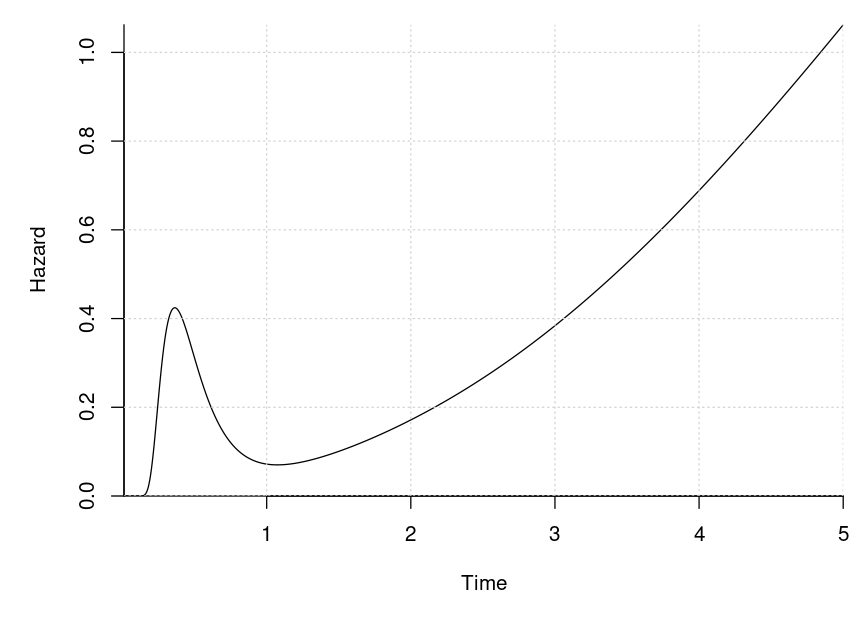
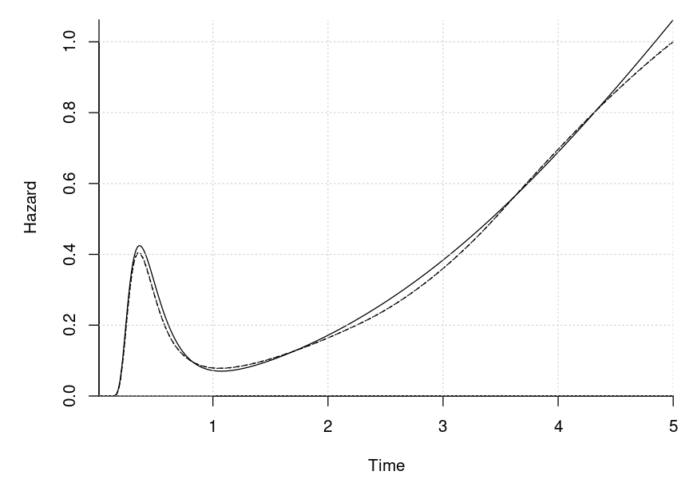
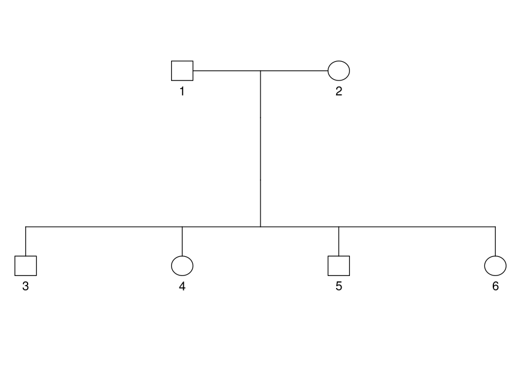
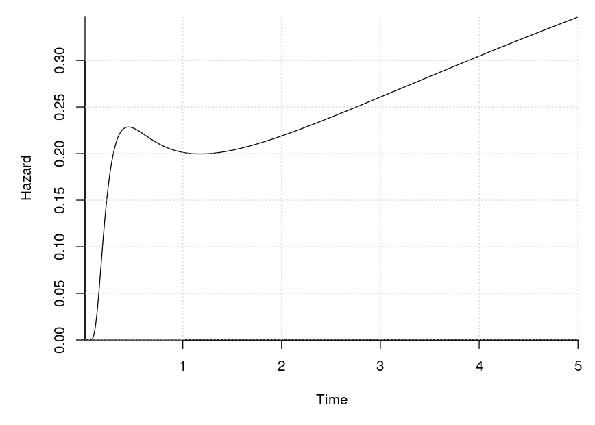
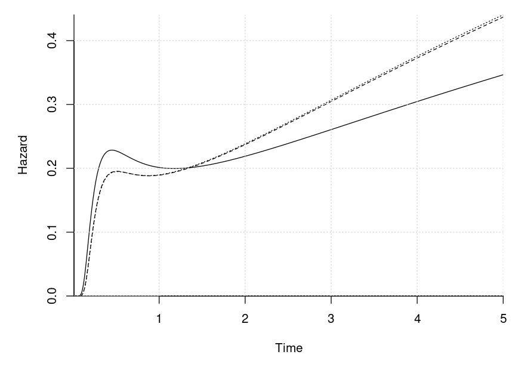
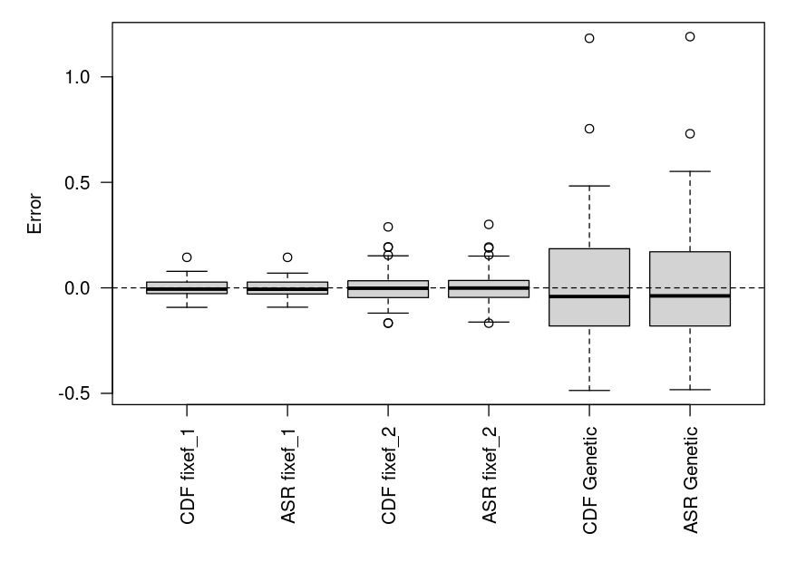

# Mixed Generalized Survival Models

We simulate from

) 
  &= \vec x_{ij}(t)^\top\vec\beta + \vec z_{ij}^\top\vec u_i \\
\vec U_i &\sim N(\vec 0, \Sigma) 
\end{align*}
")

subject to independent censoring and estimate the model. The conditional
hazard of the model is

 = 
  \vec x_{ij}'(t)^\top\vec\beta
  \frac{\phi(-\vec x_{ij}(t)^\top\vec\beta - \vec z_{ij}^\top\vec u_i)}
       {\Phi(-\vec x_{ij}(t)^\top\vec\beta - \vec z_{ij}^\top\vec u_i)}
")

The model can also be viewed as the survival time being distributed such
that

^\top\vec\beta = -\vec z_{ij}^\top\vec u_i + \epsilon_{ij}
")

where

is standard normally distributed. A special case is
 = (\log(t), \vec a_{ij}^\top)^\top")
for some covariates
.
Thus is a log-normal distribution and a particular of an accelerated
failure time.

The code to do the stimulation and to assign the model parameters is
given below.

``` r
# computes the time-varying fixed effects
x <- \(v) { v <- log(v); cbind(1, v, v^3) }
xp <- \(v) { v_org <- v; v <- log(v); cbind(0, 1, 3 * v^2) / v_org }

# generates the time-invariant covariates
gen_cov <- \(n) cbind(rnorm(n), runif(n) > .5)

# the fixed effects coefficients (beta)
beta <- c(-1, .25, .4, .5, 1)

admin_cens <- 5 # the administrative censoring time

# plot of the hazard when the other fixed effects are zero
par(mar = c(5, 5, 1, 1))
seq(1e-2, admin_cens, length.out = 1000) |>
  (\(vs)
   plot(vs, 
        {
          beta_use <- head(beta, -2)
          eta <- x(vs) %*% beta_use
          eta_p <- xp(vs) %*% beta_use
          eta_p * exp(dnorm(-eta, log = TRUE) - pnorm(-eta, log = TRUE))
        }, 
        xlim = c(1e-2, admin_cens), xlab = "Time", ylab = "Hazard", bty = "l", 
        xaxs = "i", yaxs = "i", type = "l")
  )()

grid()
```



``` r
# generates the random effect covariates
gen_rng_cov <- \(n) cbind(1, rnorm(n))

# the random effect covariance matrix
Sigma <- structure(c(0.96725, -0.1505, -0.1505, 0.27875), .Dim = c(2L, 2L))

# simulates a given number of clusters
sim_dat <- \(n_clusters)
  lapply(seq_len(n_clusters), \(id) {
    n_members <- sample.int(9L, 1L) + 2L
    U <- drop(mvtnorm::rmvnorm(1, sigma = Sigma))
    X <- gen_cov(n_members)
    Z <- gen_rng_cov(n_members)
    
    # find the event times
    offset <- X %*% tail(beta, NCOL(X)) + Z %*% U
    
    beta_use <- head(beta, -NCOL(X))
    y <- sapply(offset, \(o){
      rng <- runif(1)
      res <- uniroot(\(ti) rng - pnorm(-o - x(ti) %*% beta_use), 
                     c(1e-32, 10000), 
                     tol = 1e-10)
      res$root
    })
    
    cens <- pmin(admin_cens, runif(n_members, 0, 2 * admin_cens))
    
    colnames(X) <- paste0("X", 1:NCOL(X))
    colnames(Z) <- paste0("Z", 1:NCOL(Z))
    
    out <- list(event = y < cens, y = pmin(y, cens), X = X, Z = Z, 
                id = rep(id, n_members))
    
    c(out, list(df = do.call(cbind, out)))
  })
```

Next, we simulate from the model and estimate the model.

``` r
# simulate the data
set.seed(8401834)
dat <- sim_dat(2000L)
dat_full <- lapply(dat, `[[`, "df") |> do.call(what = rbind) |> data.frame()

mean(dat_full$event) # fraction of observed events
#> [1] 0.6672
NROW(dat_full) # number of observations
#> [1] 13923
# quantiles of the observed event times
subset(dat_full, event > 0)$y |> 
  quantile(probs = seq(0, 1, length.out = 11))
#>      0%     10%     20%     30%     40%     50%     60%     70%     80%     90% 
#> 0.07917 0.20883 0.26261 0.32910 0.42824 0.69067 1.74864 2.55597 3.24702 4.01113 
#>    100% 
#> 4.99897

# fit the model with the stochastic spherical-radial rules
library(mixprobit)
system.time(
  res_sr <- fit_mgsm(
    formula = Surv(y, event) ~ X1 + X2, data = dat_full, id = id,
    rng_formula = ~ Z2, maxpts = c(1000L, 10000L), df = 8L, 
    method = "adaptive_spherical_radial"))
#>    user  system elapsed 
#> 142.710   0.003 142.716

# fit the model with the CDF approach
system.time(
  res_cdf <- fit_mgsm(
    formula = Surv(y, event) ~ X1 + X2, data = dat_full, id = id,
    rng_formula = ~ Z2, maxpts = c(1000L, 10000L), df = 8L, 
    method = "cdf_approach"))
#>    user  system elapsed 
#>   63.63    0.00   63.63
```

The results are shown below.

``` r
# the estimates are shown below
rbind(`Estimate spherical radial` = res_sr$beta_fixef, 
      `Estimate CDF` = res_cdf$beta_fixef,
      Truth = c(beta[1], tail(beta, 2)))
#>                             [,1]   [,2]   [,3]
#> Estimate spherical radial -1.057 0.4883 0.9921
#> Estimate CDF              -1.161 0.4879 0.9916
#> Truth                     -1.000 0.5000 1.0000

res_sr$Sigma # estimated covariance matrix
#>         [,1]    [,2]
#> [1,]  0.9802 -0.1632
#> [2,] -0.1632  0.2835
res_cdf$Sigma # estimated covariance matrix
#>         [,1]    [,2]
#> [1,]  0.9799 -0.1647
#> [2,] -0.1647  0.2849
Sigma # the true covariance matrix
#>         [,1]    [,2]
#> [1,]  0.9673 -0.1505
#> [2,] -0.1505  0.2787

# plot of the estimated hazard and the true hazard when the other fixed effects
# are zero
vs <- seq(1e-2, admin_cens, length.out = 1000)
# computes the hazard
cmp_haz <- \(x, xp, beta_use, offset = 0)
  sapply(vs, \(v){
    eta <- x(v) %*% beta_use + offset
    eta_p <- xp(v) %*% beta_use
    eta_p * exp(dnorm(-eta, log = TRUE) - pnorm(-eta, log = TRUE))
  })
  
Xt_spline <- res_cdf$spline$basis
Xt_spline_prime <- res_cdf$spline$d_basis

par(mar = c(5, 5, 1, 1))
matplot(
  vs, cbind(
    cmp_haz(x, xp, head(beta, -2)),
    cmp_haz(Xt_spline, Xt_spline_prime, res_sr$beta_spline, 
            res_sr$beta_fixef[1]),
    cmp_haz(Xt_spline, Xt_spline_prime, res_cdf$beta_spline, 
            res_cdf$beta_fixef[1])),
  type = "l", bty = "l", lty = 1:3, 
  col = "Black", xlab = "Time", ylab = "Hazard", xaxs = "i", yaxs = "i")
grid()
```



``` r
# the maximum likelihood
print(res_sr$logLik, digits = 8)
#> [1] -12536.992
print(res_cdf$logLik, digits = 8)
#> [1] -12534.568

# can be compared with say a Weibull model without the random effects
survreg(Surv(y, event) ~ X1 + X2, data = dat_full) |> logLik()
#> 'log Lik.' -18255 (df=4)
```

``` r
# compare the variance on the log marginal likelihood of the two methods 
# while tracking the computation time
system.time(
  func_ests <- sapply(1:20, \(s) res_sr $fn(res_sr$optim$par, seed = s)))
#>    user  system elapsed 
#>   9.739   0.000   9.739
sd(func_ests)
#> [1] 0.01358
system.time(
  func_ests <- sapply(1:20, \(s) res_cdf$fn(res_sr$optim$par, seed = s)))
#>    user  system elapsed 
#>   9.782   0.000   9.783
sd(func_ests)
#> [1] 0.008076
```

## Pedigree Data

A special class of mixed models have

^\top\vec\beta = \epsilon_{ij} + \sum_{k = 1}^K u_{ijk}")

where

}\left(\vec 0, \sigma_k^2 C_{ik}\right)")

where  is the
number of members of cluster
 and the
s
are know correlation matrices. A special example is where the
th effect is a genetic
effect. The proportion of variance of each effect is


which for a genetic effect is called the heritability.

We will simulate families with a random number of children. An example
of such a family with four children is shown below.

``` r
# create the family we will use
fam <- data.frame(id = 1:6, sex = rep(1:2, 3L),
                  father = c(NA, NA, rep(1L, 4L)), 
                  mother = c(NA, NA, rep(2L, 4L)))

# plot the pedigree
library(kinship2)
ped <- with(fam, pedigree(id = id, dadid = father, momid = mother, sex = sex))
plot(ped)
```



The code to do the stimulation and to assign the model parameters is
given below. We simulate both a genetic effect and a childhood
environment effect. Thus
.

``` r
# computes the time-varying fixed effects
x <- \(v) { v <- log(v); cbind(1, v, v^3) }
xp <- \(v) { v_org <- v; v <- log(v); cbind(0, 1, 3 * v^2) / v_org }

# the fixed effects coefficients (beta)
beta <- c(-1, .7, .1, .5, 1)

admin_cens <- 5 # the administrative censoring time

# plot of the hazard when the other fixed effects are zero
par(mar = c(5, 5, 1, 1))
seq(1e-2, admin_cens, length.out = 1000) |>
  (\(vs)
   plot(vs, 
        {
          beta_use <- head(beta, -2)
          eta <- x(vs) %*% beta_use
          eta_p <- xp(vs) %*% beta_use
          eta_p * exp(dnorm(-eta, log = TRUE) - pnorm(-eta, log = TRUE))
        }, 
        xlim = c(1e-2, admin_cens), xlab = "Time", ylab = "Hazard", bty = "l", 
        xaxs = "i", yaxs = "i", type = "l")
  )()
grid()
```



``` r
# the scale parameters
sigs <- c(Genetic = 1.5, Environment = 0.5)

# the proportion of variance
c(sigs, Individual = 1) / c(sum(sigs) + 1)
#>     Genetic Environment  Individual 
#>      0.5000      0.1667      0.3333

# simulates a given number of clusters
sim_dat <- \(n_clusters)
  lapply(seq_len(n_clusters), \(id) {
    # sample the number of children and construct the scale matrices
    n_children <- sample.int(6L, 1L)
    n_members <- n_children + 2L
    sex <- c(1:2, sample.int(2L, n_children, replace = TRUE))
    
    fam <- data.frame(
      id = seq_len(n_members), sex = sex,
      father = c(NA, NA, rep(1L, n_children)), 
      mother = c(NA, NA, rep(2L, n_children)))
    ped <- with(fam, pedigree(
      id = id, dadid = father, momid = mother, sex = sex))
    
    genentic_mat <- 2 * kinship(ped)
    env_mat <- diag(n_children + 2L)
    env_mat[3:n_members, 3:n_members] <- 1
    
    # get the covariance matrix and sample the random effects and the 
    # covariates
    sigma <- diag(n_members) + sigs[1] * genentic_mat + sigs[2] * env_mat
    U <- drop(mvtnorm::rmvnorm(1, sigma = sigma))
    X <- cbind(continous = rnorm(n_members), sex = sex == 1)
    
    # find the event times
    offset <- X %*% tail(beta, NCOL(X)) + U
    
    beta_use <- head(beta, -NCOL(X))
    y <- sapply(offset, \(o){
      rng <- runif(1)
      res <- uniroot(\(ti) rng - pnorm(-o - x(ti) %*% beta_use), 
                     c(1e-32, 10000), 
                     tol = 1e-10)
      res$root
    })
    
    cens <- pmin(admin_cens, runif(n_members, 0, 2 * admin_cens))
    
    X <- cbind(intercept = 1, X)
    
    out <- list(
      event = as.numeric(y < cens), y = pmin(y, cens), X = X, 
      id = rep(id, n_members), 
      scale_mats = list(genetic = genentic_mat, environment = env_mat))
  })
```

A data set is sampled below and a few summary statistics are shown.

``` r
# sample a data set
set.seed(26218609)
dat <- sim_dat(2000L)

# fraction of observed events
sapply(dat, `[[`, "event") |> unlist() |> mean()
#> [1] 0.6008

# the number of observations
sapply(dat, `[[`, "event") |> unlist() |> length()
#> [1] 11011

# quantiles of the observed event times
lapply(dat, \(x) x$y[x$event]) |> unlist() |>
  quantile(probs = seq(0, 1, length.out = 11))
#>        0%       10%       20%       30%       40%       50%       60%       70% 
#> 0.0004151 0.0976126 0.1480287 0.2199829 0.3237706 0.5365080 0.9711412 1.7312081 
#>       80%       90%      100% 
#> 2.7580866 4.4679331 5.0000000
```

The model is fitted below.

``` r
# fit the model with the stochastic spherical-radial rules
library(mixprobit)
system.time(
  res_sr <- fit_mgsm_pedigree(
    data = dat, maxpts = c(1000L, 10000L), df = 5L, 
    method = "adaptive_spherical_radial"))
#>    user  system elapsed 
#> 355.780   0.008 355.821

# fit the model with the CDF approach
system.time(
  res_cdf <- fit_mgsm_pedigree(
    data = dat, maxpts = c(1000L, 10000L), df = 5L,
    method = "cdf_approach"))
#>    user  system elapsed 
#>   34.17    0.00   34.17
```

The results are shown below.

``` r
# the estimates are shown below
rbind(`Estimate spherical radial` = res_sr$beta_fixef, 
      `Estimate CDF` = res_cdf$beta_fixef,
      Truth = c(beta[1], tail(beta, 2)))
#>                             [,1]   [,2]   [,3]
#> Estimate spherical radial -1.191 0.5173 0.9860
#> Estimate CDF              -1.209 0.5187 0.9861
#> Truth                     -1.000 0.5000 1.0000

res_sr$sigs # estimated scale parameters
#> [1] 1.5323 0.5175
res_cdf$sigs # estimated scale parameters
#> [1] 1.5605 0.5126
sigs
#>     Genetic Environment 
#>         1.5         0.5

# plot of the estimated hazard and the true hazard when the other fixed effects
# are zero
vs <- seq(1e-2, admin_cens, length.out = 1000)
# computes the hazard
cmp_haz <- \(x, xp, beta_use, offset = 0)
  sapply(vs, \(v){
    eta <- x(v) %*% beta_use + offset
    eta_p <- xp(v) %*% beta_use
    eta_p * exp(dnorm(-eta, log = TRUE) - pnorm(-eta, log = TRUE))
  })
  
Xt_spline <- res_cdf$spline$basis
Xt_spline_prime <- res_cdf$spline$d_basis

par(mar = c(5, 5, 1, 1))
matplot(
  vs, cbind(
    cmp_haz(x, xp, head(beta, -2)),
    cmp_haz(Xt_spline, Xt_spline_prime, res_sr$beta_spline, 
            res_sr$beta_fixef[1]),
    cmp_haz(Xt_spline, Xt_spline_prime, res_cdf$beta_spline, 
            res_cdf$beta_fixef[1])),
  type = "l", bty = "l", lty = 1:3, 
  col = "Black", xlab = "Time", ylab = "Hazard", xaxs = "i", yaxs = "i")
grid()
```



``` r
# the maximum likelihood
print(res_sr$logLik, digits = 8)
#> [1] -11049.134
print(res_cdf$logLik, digits = 8)
#> [1] -11038.756
```

``` r
# compare the variance on the log marginal likelihood of the two methods 
# while tracking the computation time
system.time(
  func_ests <- sapply(1:20, \(s) res_sr $fn(res_sr$optim$par, seed = s)))
#>    user  system elapsed 
#>   74.05    0.00   74.05
sd(func_ests)
#> [1] 0.1949
system.time(
  func_ests <- sapply(1:20, \(s) res_cdf$fn(res_sr$optim$par, seed = s)))
#>    user  system elapsed 
#>   7.982   0.000   7.983
sd(func_ests)
#> [1] 0.01048
```

## Simulation Study

We run simulation study using in a simplified model without the genetic
effect below.

``` r
# the simulation function we will use
sigs <- c(Genetic = 1.5)

sim_dat <- \(n_clusters)
  lapply(seq_len(n_clusters), \(id) {
    # sample the number of children and construct the scale matrices
    n_children <- sample.int(6L, 1L)
    n_members <- n_children + 2L
    sex <- c(1:2, sample.int(2L, n_children, replace = TRUE))
    
    fam <- data.frame(
      id = seq_len(n_members), sex = sex,
      father = c(NA, NA, rep(1L, n_children)), 
      mother = c(NA, NA, rep(2L, n_children)))
    ped <- with(fam, pedigree(
      id = id, dadid = father, momid = mother, sex = sex))
    
    genentic_mat <- 2 * kinship(ped)
    
    # get the covariance matrix and sample the random effects and the 
    # covariates
    sigma <- diag(n_members) + sigs[1] * genentic_mat
    U <- drop(mvtnorm::rmvnorm(1, sigma = sigma))
    X <- cbind(continous = rnorm(n_members), sex = sex == 1)
    
    # find the event times
    offset <- X %*% tail(beta, NCOL(X)) + U
    
    beta_use <- head(beta, -NCOL(X))
    y <- sapply(offset, \(o){
      rng <- runif(1)
      res <- uniroot(\(ti) rng - pnorm(-o - x(ti) %*% beta_use), 
                     c(1e-32, 10000), 
                     tol = 1e-10)
      res$root
    })
    
    cens <- pmin(admin_cens, runif(n_members, 0, 2 * admin_cens))
    
    X <- cbind(intercept = 1, X)
    
    out <- list(
      event = as.numeric(y < cens), y = pmin(y, cens), X = X, 
      id = rep(id, n_members), scale_mats = list(genetic = genentic_mat))
  })
  
# the seeds we will use
seeds <- c(8401826L, 19570958L, 87207905L, 39109909L, 99443018L, 2376809L, 47711086L, 31776421L, 25001561L, 52480852L, 60995910L, 21615146L, 94750831L, 93554588L, 34801146L, 36420473L, 22444614L, 75001896L, 24531192L, 80062842L, 2550195L, 53048710L, 85436064L, 34437762L, 69997970L, 1398478L, 91388403L, 73915718L, 64407295L, 99315526L, 55230929L, 65254925L, 78593369L, 5490535L, 68973709L, 16502678L, 48015260L, 40584496L, 40234129L, 21559783L, 55991123L, 56211248L, 40530496L, 64880106L, 73843004L, 70419165L, 86063754L, 8426283L, 62523674L, 76475834L, 18648984L, 32812748L, 33439015L, 35109557L, 64695510L, 89300314L, 67141661L, 54871836L, 86274621L, 29495382L, 98744647L, 70279529L, 87794930L, 95918838L, 16179951L, 14344327L, 7258644L, 24703384L, 70432309L, 59709907L, 90392706L, 6833276L, 81342050L, 79794195L, 17842594L, 27444067L, 44945811L, 68154408L, 39539322L, 43510922L, 47071732L, 65301241L, 43997413L, 27680735L, 27550685L, 9154686L, 65359476L, 68151567L, 75590209L, 32994761L, 23446289L, 42236969L, 64634732L, 19941161L, 27046869L, 37687425L, 20225748L, 57217006L, 65626553L, 56052853L)

# get the simulation results
sim_res <- lapply(seeds, \(seed){
  res_file <- file.path("cache-mgsm", "pedigree", sprintf("%d.RDS", seed))
  if(!file.exists(res_file)){
    set.seed(seed)
    dat <- sim_dat(500L)
    
    comp_n_take_time <- \(method){
      cmp_time <- system.time(
        res <- fit_mgsm_pedigree(
          data = dat, maxpts = c(1000L, 10000L), df = 5L, 
          method = method))
      res$time <- cmp_time
      res
    }
    
    res_sr <- comp_n_take_time("adaptive_spherical_radial")
    res_cdf <- comp_n_take_time("cdf_approach")
    res_cdf$max_ll_rev <- res_cdf$fn(res_sr$optim$par)
    res_sr$max_ll_rev <- res_sr$fn(res_cdf$optim$par)
    
    saveRDS(list(CDF = res_cdf, `Adaptive Spherical Radial` = res_sr),
            res_file)
  }
  
  res <- readRDS(res_file)
  print_as_message <- \(x, digits = NULL){
    if(!is.null(digits)){
      old_digits <- options()$digits
      on.exit(options(digits = old_digits))
      options(digits = digits)
    }
    message(paste0(capture.output(x), collapse = "\n"))
  }
    
  message("\n\nComputation time")
  sapply(res, \(x) unname(x$time["elapsed"])) |> print_as_message()
  
  message("\nEstiamtes")
  sapply(res, \(x) tail(x$beta_fixef, 2)) |> 
    t() |> rbind(Truth = tail(beta, 2)) |> 
    print_as_message()
  
  sapply(res, `[[`, "sigs") |> c(Truth = unname(sigs)) |> 
     print_as_message()
  
  message("\nMaximum log-likelihood")
  sapply(res, \(x) -x$optim$value) |> print_as_message(digits = 10)
  -sapply(res, `[[`, "max_ll_rev") |> print_as_message(digits = 10)
  
  res
})
```

Results from the simulation study is summarized below

``` r
# compute the bias
ests <- sapply(
  sim_res, simplify = "array",
  \(x) sapply(x, \(z) c(z$beta_fixef[2:3], z$sigs)))

dimnames(ests)[[1]] <- c("fixef_1", "fixef_2", "Genetic")
error <- ests - c(tail(beta, 2), sigs)

apply(error, 1:2, mean) # the bias estimates
#>               CDF Adaptive Spherical Radial
#> fixef_1 -0.003652                 -0.003842
#> fixef_2 -0.004346                 -0.004701
#> Genetic -0.017812                 -0.020075
apply(error, 1:2, sd) / sqrt(dim(error)[3]) # the standard errors
#>              CDF Adaptive Spherical Radial
#> fixef_1 0.004359                  0.004351
#> fixef_2 0.008038                  0.008030
#> Genetic 0.026833                  0.026980

# compute the root mean square error
apply(error, 1:2, \(x) sqrt(mean(x^2)))
#>             CDF Adaptive Spherical Radial
#> fixef_1 0.04353                   0.04347
#> fixef_2 0.08009                   0.08003
#> Genetic 0.26758                   0.26920

# box plot of the errors
error <- aperm(error, c(3, 2, 1))
dimnames(error)[[2]][dimnames(error)[[2]] == "Adaptive Spherical Radial"] <- 
  "ASR"

error_flat <- matrix(
  error, dim(error)[1], 
  dimnames = list(NULL, outer(dimnames(error)[[2]], dimnames(error)[[3]], 
                              paste)))
par(mar = c(7, 5, 1, 1))
boxplot(error_flat, ylab = "Error", las = 2)
abline(h = 0, lty = 2)
```



``` r
# statistics for the computation time
comp_time <- sapply(sim_res, \(x) sapply(x, `[[`, "time")["elapsed", ])
rowMeans(comp_time)
#>                       CDF Adaptive Spherical Radial 
#>                     11.07                    120.73
apply(comp_time, 1, sd)
#>                       CDF Adaptive Spherical Radial 
#>                     2.077                    53.818
```
