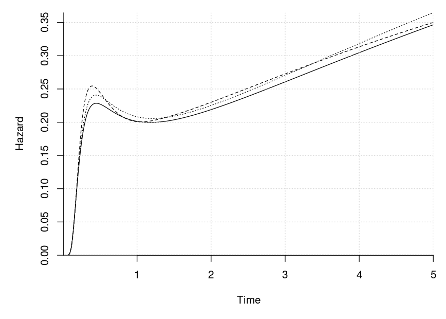

# Mixed Generalized Survival Models

We simulate from

) 
  &= \vec x_{ij}(t)^\top\vec\beta + \vec z_{ij}^\top\vec u_i \\
\vec U_i &\sim N(\vec 0, \Sigma) 
\end{align*}
")

subject to independent censoring and estimate the model. The conditional
hazard of the model is

 = 
  \vec x_{ij}'(t)^\top\vec\beta
  \frac{\phi(-\vec x_{ij}(t)^\top\vec\beta - \vec z_{ij}^\top\vec u_i)}
       {\Phi(-\vec x_{ij}(t)^\top\vec\beta - \vec z_{ij}^\top\vec u_i)}
")

The model can also be viewed as the survival time being distributed such
that

^\top\vec\beta = -\vec z_{ij}^\top\vec u_i + \epsilon_{ij}
")

where

is standard normally distributed. A special case is
 = (\log(t), \vec a_{ij}^\top)^\top")
for some covariates
.
Thus is a log-normal distribution and a particular of an accelerated
failure time.

The code to do the stimulation and to assign the model parameters is
given below.

``` r
# computes the time-varying fixed effects
x <- \(v) { v <- log(v); cbind(1, v, v^3) }
xp <- \(v) { v_org <- v; v <- log(v); cbind(0, 1, 3 * v^2) / v_org }

# generates the time-invariant covariates
gen_cov <- \(n) cbind(rnorm(n), runif(n) > .5)

# the fixed effects coefficients (beta)
beta <- c(-1, .25, .4, .5, 1)

admin_cens <- 5 # the administrative censoring time

# plot of the hazard when the other fixed effects are zero
par(mar = c(5, 5, 1, 1))
seq(1e-2, admin_cens, length.out = 1000) |>
  (\(vs)
   plot(vs, 
        {
          beta_use <- head(beta, -2)
          eta <- x(vs) %*% beta_use
          eta_p <- xp(vs) %*% beta_use
          eta_p * exp(dnorm(-eta, log = TRUE) - pnorm(-eta, log = TRUE))
        }, 
        xlim = c(1e-2, admin_cens), xlab = "Time", ylab = "Hazard", bty = "l", 
        xaxs = "i", yaxs = "i", type = "l")
  )()

grid()
```


``` r
# generates the random effect covariates
gen_rng_cov <- \(n) cbind(1, rnorm(n))

# the random effect covariance matrix
Sigma <- structure(c(0.96725, -0.1505, -0.1505, 0.27875), .Dim = c(2L, 2L))

# simulates a given number of clusters
sim_dat <- \(n_clusters)
  lapply(seq_len(n_clusters), \(id) {
    n_members <- sample.int(9L, 1L) + 2L
    U <- drop(mvtnorm::rmvnorm(1, sigma = Sigma))
    X <- gen_cov(n_members)
    Z <- gen_rng_cov(n_members)
    
    # find the event times
    offset <- X %*% tail(beta, NCOL(X)) + Z %*% U
    
    beta_use <- head(beta, -NCOL(X))
    y <- sapply(offset, \(o){
      rng <- runif(1)
      res <- uniroot(\(ti) rng - pnorm(-o - x(ti) %*% beta_use), 
                     c(1e-32, 10000), 
                     tol = 1e-10)
      res$root
    })
    
    cens <- pmin(admin_cens, runif(n_members, 0, 2 * admin_cens))
    
    colnames(X) <- paste0("X", 1:NCOL(X))
    colnames(Z) <- paste0("Z", 1:NCOL(Z))
    
    out <- list(event = y < cens, y = pmin(y, cens), X = X, Z = Z, 
                id = rep(id, n_members))
    
    c(out, list(df = do.call(cbind, out)))
  })
```

Next, we simulate from the model and estimate the model.

``` r
# simulate the data
set.seed(8401834)
dat <- sim_dat(2000L)
dat_full <- lapply(dat, `[[`, "df") |> do.call(what = rbind) |> data.frame()

mean(dat_full$event) # fraction of observed events
#> [1] 0.6672
NROW(dat_full) # number of observations
#> [1] 13923
# quantiles of the observed event times
subset(dat_full, event > 0)$y |> 
  quantile(probs = seq(0, 1, length.out = 11))
#>      0%     10%     20%     30%     40%     50%     60%     70%     80%     90% 
#> 0.07917 0.20883 0.26261 0.32910 0.42824 0.69067 1.74864 2.55597 3.24702 4.01113 
#>    100% 
#> 4.99897

# fit the model with the stochastic spherical-radial rules
library(mixprobit)
system.time(
  res_sr <- fit_mgsm(
    formula = Surv(y, event) ~ X1 + X2, data = dat_full, id = id,
    rng_formula = ~ Z2, maxpts = c(1000L, 10000L), df = 8L, 
    method = "adaptive_spherical_radial"))
#>    user  system elapsed 
#> 124.803   0.056 125.168

# fit the model with the CDF approach
system.time(
  res_cdf <- fit_mgsm(
    formula = Surv(y, event) ~ X1 + X2, data = dat_full, id = id,
    rng_formula = ~ Z2, maxpts = c(1000L, 10000L), df = 8L, 
    method = "cdf_approach"))
#>    user  system elapsed 
#>   46.70    0.00   46.71
```

The results are shown below.

``` r
# the estimates are shown below
rbind(`Estimate spherical radial` = res_sr$beta_fixef, 
      `Estimate CDF` = res_cdf$beta_fixef,
      Truth = c(beta[1], tail(beta, 2)))
#>                             [,1]   [,2]   [,3]
#> Estimate spherical radial -1.113 0.4882 0.9918
#> Estimate CDF              -1.159 0.4880 0.9916
#> Truth                     -1.000 0.5000 1.0000

res_sr$Sigma # estimated covariance matrix
#>         [,1]    [,2]
#> [1,]  0.9797 -0.1639
#> [2,] -0.1639  0.2841
res_cdf$Sigma # estimated covariance matrix
#>         [,1]    [,2]
#> [1,]  0.9802 -0.1646
#> [2,] -0.1646  0.2850
Sigma # the true covariance matrix
#>         [,1]    [,2]
#> [1,]  0.9673 -0.1505
#> [2,] -0.1505  0.2787

# plot of the estimated hazard and the true hazard when the other fixed effects
# are zero
vs <- seq(1e-2, admin_cens, length.out = 1000)
# computes the hazard
cmp_haz <- \(x, xp, beta_use, offset = 0)
  sapply(vs, \(v){
    eta <- x(v) %*% beta_use + offset
    eta_p <- xp(v) %*% beta_use
    eta_p * exp(dnorm(-eta, log = TRUE) - pnorm(-eta, log = TRUE))
  })
  
Xt_spline <- res_cdf$spline$basis
Xt_spline_prime <- res_cdf$spline$d_basis

par(mar = c(5, 5, 1, 1))
matplot(
  vs, cbind(
    cmp_haz(x, xp, head(beta, -2)),
    cmp_haz(Xt_spline, Xt_spline_prime, res_sr$beta_spline, 
            res_sr$beta_fixef[1]),
    cmp_haz(Xt_spline, Xt_spline_prime, res_cdf$beta_spline, 
            res_cdf$beta_fixef[1])),
  type = "l", bty = "l", lty = 1:3, 
  col = "Black", xlab = "Time", ylab = "Hazard", xaxs = "i", yaxs = "i")
grid()
```


``` r
# the maximum likelihood
print(res_sr$logLik, digits = 8)
#> [1] -12535.365
print(res_cdf$logLik, digits = 8)
#> [1] -12534.595

# can be compared with say a Weibull model without the random effects
survreg(Surv(y, event) ~ X1 + X2, data = dat_full) |> logLik()
#> 'log Lik.' -18255 (df=4)
```

``` r
# compare the variance on the log marginal likelihood of the two methods 
# while tracking the computation time
system.time(
  func_ests <- sapply(1:20, \(s) res_sr $fn(res_sr$optim$par, seed = s)))
#>    user  system elapsed 
#>   9.806   0.000   9.806
sd(func_ests)
#> [1] 0.01302
system.time(
  func_ests <- sapply(1:20, \(s) res_cdf$fn(res_sr$optim$par, seed = s)))
#>    user  system elapsed 
#>   9.835   0.000   9.835
sd(func_ests)
#> [1] 0.008175
```

## Pedigree Data

TODO: add some text on what is happening here.

``` r
# create the family we will use
fam <- data.frame(id = 1:6, sex = rep(1:2, 3L),
                  father = c(NA, NA, rep(1L, 4L)), 
                  mother = c(NA, NA, rep(2L, 4L)))

# plot the pedigree
library(kinship2)
ped <- with(fam, pedigree(id = id, dadid = father, momid = mother, sex = sex))
plot(ped)
```


The code to do the stimulation and to assign the model parameters is
given below.

``` r
# computes the time-varying fixed effects
x <- \(v) { v <- log(v); cbind(1, v, v^3) }
xp <- \(v) { v_org <- v; v <- log(v); cbind(0, 1, 3 * v^2) / v_org }

# the fixed effects coefficients (beta)
beta <- c(-1, .7, .1, .5, 1)

admin_cens <- 5 # the administrative censoring time

# plot of the hazard when the other fixed effects are zero
par(mar = c(5, 5, 1, 1))
seq(1e-2, admin_cens, length.out = 1000) |>
  (\(vs)
   plot(vs, 
        {
          beta_use <- head(beta, -2)
          eta <- x(vs) %*% beta_use
          eta_p <- xp(vs) %*% beta_use
          eta_p * exp(dnorm(-eta, log = TRUE) - pnorm(-eta, log = TRUE))
        }, 
        xlim = c(1e-2, admin_cens), xlab = "Time", ylab = "Hazard", bty = "l", 
        xaxs = "i", yaxs = "i", type = "l")
  )()
grid()
```


``` r
# the scale parameters
sigs <- c(Genetic = 1.5, Environment = 0.5)

# the proportion of variance
c(sigs, Individual = 1) / c(sum(sigs) + 1)
#>     Genetic Environment  Individual 
#>      0.5000      0.1667      0.3333

# simulates a given number of clusters
sim_dat <- \(n_clusters)
  lapply(seq_len(n_clusters), \(id) {
    # sample the number of children and construct the scale matrices
    n_children <- sample.int(6L, 1L)
    n_members <- n_children + 2L
    sex <- c(1:2, sample.int(2L, n_children, replace = TRUE))
    
    fam <- data.frame(
      id = seq_len(n_members), sex = sex,
      father = c(NA, NA, rep(1L, n_children)), 
      mother = c(NA, NA, rep(2L, n_children)))
    ped <- with(fam, pedigree(
      id = id, dadid = father, momid = mother, sex = sex))
    
    genentic_mat <- 2 * kinship(ped)
    env_mat <- diag(n_children + 2L)
    env_mat[3:n_members, 3:n_members] <- 1
    
    # get the covariance matrix and sample the random effects and the 
    # covariates
    sigma <- diag(n_members) + sigs[1] * genentic_mat + sigs[2] * env_mat
    U <- drop(mvtnorm::rmvnorm(1, sigma = sigma))
    X <- cbind(continous = rnorm(n_members), sex = sex == 1)
    
    # find the event times
    offset <- X %*% tail(beta, NCOL(X)) + U
    
    beta_use <- head(beta, -NCOL(X))
    y <- sapply(offset, \(o){
      rng <- runif(1)
      res <- uniroot(\(ti) rng - pnorm(-o - x(ti) %*% beta_use), 
                     c(1e-32, 10000), 
                     tol = 1e-10)
      res$root
    })
    
    cens <- pmin(admin_cens, runif(n_members, 0, 2 * admin_cens))
    
    X <- cbind(intercept = 1, X)
    
    out <- list(
      event = as.numeric(y < cens), y = pmin(y, cens), X = X, 
      id = rep(id, n_members), 
      scale_mats = list(genetic = genentic_mat, environment = env_mat))
  })
```

``` r
# sample a data set
set.seed(26218609)
dat <- sim_dat(500L)

# fraction of observed events
sapply(dat, `[[`, "event") |> unlist() |> mean()
#> [1] 0.5993

# the number of observations
sapply(dat, `[[`, "event") |> unlist() |> length()
#> [1] 2760

# quantiles of the observed event times
lapply(dat, \(x) x$y[x$event]) |> unlist() |>
  quantile(probs = seq(0, 1, length.out = 11))
#>      0%     10%     20%     30%     40%     50%     60%     70%     80%     90% 
#> 0.03953 0.10240 0.14757 0.21593 0.32108 0.50543 0.90110 1.60993 2.71703 4.19804 
#>    100% 
#> 5.00000
```

``` r
# fit the model with the stochastic spherical-radial rules
library(mixprobit)
system.time(
  res_sr <- fit_mgsm_pedigree(
    data = dat, maxpts = c(1000L, 10000L), df = 5L, 
    method = "adaptive_spherical_radial"))
#>    user  system elapsed 
#> 117.661   0.003 117.667

# fit the model with the CDF approach
system.time(
  res_cdf <- fit_mgsm_pedigree(
    data = dat, maxpts = c(1000L, 10000L), df = 5L,
    method = "cdf_approach"))
#>    user  system elapsed 
#>   6.326   0.000   6.326
```

The results are shown below.

``` r
# the estimates are shown below
rbind(`Estimate spherical radial` = res_sr$beta_fixef, 
      `Estimate CDF` = res_cdf$beta_fixef,
      Truth = c(beta[1], tail(beta, 2)))
#>                             [,1]   [,2]  [,3]
#> Estimate spherical radial -1.324 0.5392 1.080
#> Estimate CDF              -1.326 0.5403 1.083
#> Truth                     -1.000 0.5000 1.000

res_sr$sigs # estimated scale parameters
#>   [9,]  [10,] 
#> 2.2690 0.4733
res_cdf$sigs # estimated scale parameters
#>   [9,]  [10,] 
#> 2.3083 0.4816
sigs
#>     Genetic Environment 
#>         1.5         0.5

# plot of the estimated hazard and the true hazard when the other fixed effects
# are zero
vs <- seq(1e-2, admin_cens, length.out = 1000)
# computes the hazard
cmp_haz <- \(x, xp, beta_use, offset = 0)
  sapply(vs, \(v){
    eta <- x(v) %*% beta_use + offset
    eta_p <- xp(v) %*% beta_use
    eta_p * exp(dnorm(-eta, log = TRUE) - pnorm(-eta, log = TRUE))
  })
  
Xt_spline <- res_cdf$spline$basis
Xt_spline_prime <- res_cdf$spline$d_basis

par(mar = c(5, 5, 1, 1))
matplot(
  vs, cbind(
    cmp_haz(x, xp, head(beta, -2)),
    cmp_haz(Xt_spline, Xt_spline_prime, res_sr$beta_spline, 
            res_sr$beta_fixef[1]),
    cmp_haz(Xt_spline, Xt_spline_prime, res_cdf$beta_spline, 
            res_cdf$beta_fixef[1])),
  type = "l", bty = "l", lty = 1:3, 
  col = "Black", xlab = "Time", ylab = "Hazard", xaxs = "i", yaxs = "i")
grid()
```



``` r
# the maximum likelihood
print(res_sr$logLik, digits = 8)
#> [1] -2720.6343
print(res_cdf$logLik, digits = 8)
#> [1] -2720.7268
```

``` r
# compare the variance on the log marginal likelihood of the two methods 
# while tracking the computation time
system.time(
  func_ests <- sapply(1:20, \(s) res_sr $fn(res_sr$optim$par, seed = s)))
#>    user  system elapsed 
#>   20.47    0.00   20.47
sd(func_ests)
#> [1] 0.1729
system.time(
  func_ests <- sapply(1:20, \(s) res_cdf$fn(res_sr$optim$par, seed = s)))
#>    user  system elapsed 
#>   2.525   0.000   2.526
sd(func_ests)
#> [1] 0.005468
```
