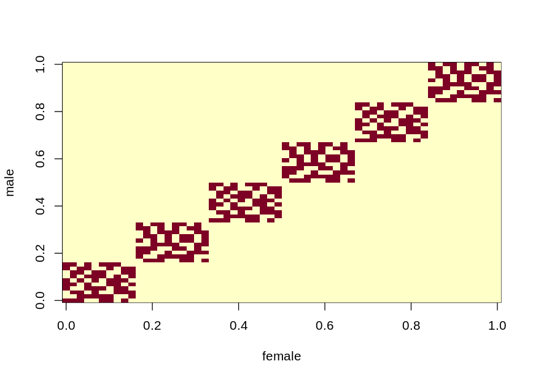
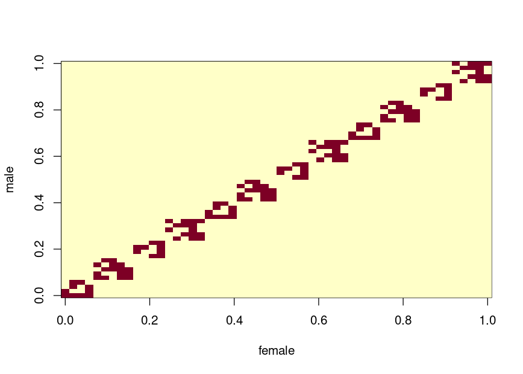

# Salamander Data Set

Load the data

``` r
sala <- read.csv("salam.csv", header = TRUE, sep = "")
head(sala)
#>   y wsm wsf female male
#> 1 1   0   0      1    1
#> 2 1   0   0      1    4
#> 3 1   0   0      1    5
#> 4 0   1   0      1    6
#> 5 1   1   0      1    9
#> 6 1   1   0      1   10

sala <- within(sala, {
  female <- as.factor(female)
  male   <- as.factor(male) 
})
```

Assign cluster (TODO: we must be able to this in a smart way…)

``` r
sala$cl <- with(sala, {
  cl <- rep(NA_integer_, length(female))
  
  grp <- 0L
  repeat {
    # take first NA
    grp <- grp + 1L
    cur <- which(is.na(cl))
    if(length(cur) == 0L)
      # not any left. Thus return
      break
    
    new_members <- cur[1L]
    repeat {
      cl[new_members] <- grp
      male_in_grp    <- male  [new_members]
      females_in_grp <- female[new_members]
      
      # find mates of the new members
      new_members <- which(
        ((male %in% male_in_grp) | (female %in% females_in_grp)) & 
          is.na(cl))
      if(length(new_members) == 0L)
        break
    }
  }
  
  cl
})

# turns out that the data was already sorted...
stopifnot(!is.unsorted(sala$cl))
with(sala, {
  female <- as.integer(female)
  male   <- as.integer(male)
  
  p <- length(unique(female))
  stopifnot(length(unique(male)) == p)
  
  X <- matrix(0L, p, p)
  for(i in 1:length(female))
    X[female[i], male[i]] <- 1L
  
  # show plot of males and females that mate
  image(X, xlab = "female", ylab = "male")
})
```



``` r
# get summary stats for clusters
local({
  sum_dat <- sapply(split(sala, sala$cl), function(x){
    p <- length(unique(x$female))
    q <- length(unique(x$male))
    
    c(`# observations (n)` = NROW(x), `# random effects (p)` = p + q)
  })
  dimnames(sum_dat) <- structure(dimnames(sum_dat), 
                                 names = c("Stat", "Cluster"))
  t(sum_dat)
})
#>        Stat
#> Cluster # observations (n) # random effects (p)
#>       1                 60                   20
#>       2                 60                   20
#>       3                 60                   20
#>       4                 60                   20
#>       5                 60                   20
#>       6                 60                   20
```

Assign the formulas that we need

``` r
# Elements: 
#   X: fixed effect formula.
#   Z: random effect formula.
frm <- list(X = ~ wsm * wsf, Z = ~ female + male - 1)
```

## Fit Model Without Random Effects

``` r
summary(glm_fit <- glm(update(frm$X, y ~ .), binomial("probit"), sala))
#> 
#> Call:
#> glm(formula = update(frm$X, y ~ .), family = binomial("probit"), 
#>     data = sala)
#> 
#> Deviance Residuals: 
#>    Min      1Q  Median      3Q     Max  
#>  -1.48   -1.27    0.90    0.90    1.76  
#> 
#> Coefficients:
#>             Estimate Std. Error z value Pr(>|z|)    
#> (Intercept)    0.431      0.137    3.15   0.0016 ** 
#> wsm           -0.291      0.190   -1.53   0.1264    
#> wsf           -1.233      0.202   -6.10    1e-09 ***
#> wsm:wsf        1.524      0.278    5.49    4e-08 ***
#> ---
#> Signif. codes:  0 '***' 0.001 '**' 0.01 '*' 0.05 '.' 0.1 ' ' 1
#> 
#> (Dispersion parameter for binomial family taken to be 1)
#> 
#>     Null deviance: 498.17  on 359  degrees of freedom
#> Residual deviance: 445.57  on 356  degrees of freedom
#> AIC: 453.6
#> 
#> Number of Fisher Scoring iterations: 4

logLik(glm_fit)
#> 'log Lik.' -222.8 (df=4)
```

## lmec

Will not work as the `varstruct` argument can only be `"unstructured"`
or `"diagonal"`.

## Stan

Here is the Stan file we use.

``` stan
data {
  int<lower=0> J;          // number of mating pairs
  int<lower=0> K;          // number of females (and number of males)
  int y[J];                // indicator for mating (0=no, 1=yes)
  vector[J] wsm;           // indicator for whether the male is white side (1) or rough side (0)
  vector[J] wsf;           // indicator for whether the female is white side (1) or rough side (0)
  int male[J];             // index for jth male
  int female[J];           // index for jth female
}
parameters {
  real beta[4];            // fixed effects
  real<lower=0> sigma[2];  // sd for male and female random effects, respectively
  vector[K] u;             // random effect for kth male
  vector[K] v;             // random effect for kth female
}
transformed parameters {
  vector[J] theta;
  theta = beta[1] + beta[2] * wsm + beta[3] * wsf + beta[4] * wsf .* wsm +
    u[male] + v[female];
}
model {
  y ~ bernoulli(Phi(theta));
  target += normal_lpdf(u | 0, sigma[1]);
  target += normal_lpdf(v | 0, sigma[2]);
}
```

Next, we fit the model and show the model estimates.

``` r
library(rstan)
options(mc.cores = parallel::detectCores(logical = FALSE))
rstan_options(auto_write = TRUE)
```

``` r
stan_fit <- within(list(), {
  sala <- as.list(sala)
  sala <- within(sala, {
    J <- length(y)
    K <- length(unique(female))
    female <- as.integer(female)
    male   <- as.integer(male)
  })
  stopifnot(sala$K == length(unique(sala$male)))
  
  fit <- stan(
    file = "salamander.stan", # Stan program
    data = sala,              # named list of data
    chains = 4L,              # number of Markov chains
    warmup = 10000L,          # number of warmup iterations per chain
    iter = 20000L,            # total number of iterations per chain
    cores = 2L,               # number of cores (could use one per chain)
    refresh = 0L,             # no progress shown
    seed = 91154163L)
  
  print(fit, pars = c("beta", "sigma"))
})
#> Inference for Stan model: salamander.
#> 4 chains, each with iter=20000; warmup=10000; thin=1; 
#> post-warmup draws per chain=10000, total post-warmup draws=40000.
#> 
#>           mean se_mean   sd  2.5%   25%   50%   75% 97.5% n_eff Rhat
#> beta[1]   0.63       0 0.26  0.14  0.45  0.62  0.80  1.15 16478    1
#> beta[2]  -0.43       0 0.29 -1.02 -0.62 -0.43 -0.23  0.14 20650    1
#> beta[3]  -1.81       0 0.35 -2.53 -2.04 -1.80 -1.57 -1.16 12027    1
#> beta[4]   2.23       0 0.38  1.52  1.97  2.22  2.47  2.99 12028    1
#> sigma[1]  0.72       0 0.16  0.42  0.60  0.71  0.82  1.06  5041    1
#> sigma[2]  0.77       0 0.17  0.47  0.65  0.76  0.87  1.13  5605    1
#> 
#> Samples were drawn using NUTS(diag_e) at Tue Dec 21 17:06:40 2021.
#> For each parameter, n_eff is a crude measure of effective sample size,
#> and Rhat is the potential scale reduction factor on split chains (at 
#> convergence, Rhat=1).
```

## glmer (Laplace Approximation)

We only use the Laplace approximation from `glmer` as adaptive
Gauss–Hermite quadrature is not available with crossed random effects
(and would take forever with this data set).

``` r
library(lme4)
```

``` r
glmer_fit <- within(list(), {
  frm_use <- y ~ wsm * wsf + (1 | female) + (1 | male)
  fit_laplace <- glmer(frm_use, sala, binomial("probit"))

  msg <- "Laplace fit"
  cat(msg, "\n", rep("-", nchar(msg)), "\n", sep ="")
  print(fit_laplace)
  
  # AGHQ does not work...
  try(fit_aghq <- glmer(frm_use, sala, binomial("probit"), nAGQ = 5L))
})
#> Laplace fit
#> -----------
#> Generalized linear mixed model fit by maximum likelihood (Laplace
#>   Approximation) [glmerMod]
#>  Family: binomial  ( probit )
#> Formula: y ~ wsm * wsf + (1 | female) + (1 | male)
#>    Data: sala
#>      AIC      BIC   logLik deviance df.resid 
#>    432.2    455.5   -210.1    420.2      354 
#> Random effects:
#>  Groups Name        Std.Dev.
#>  female (Intercept) 0.626   
#>  male   (Intercept) 0.576   
#> Number of obs: 360, groups:  female, 60; male, 60
#> Fixed Effects:
#> (Intercept)          wsm          wsf      wsm:wsf  
#>       0.601       -0.419       -1.731        2.140  
#> Error in updateGlmerDevfun(devfun, glmod$reTrms, nAGQ = nAGQ) : 
#>   nAGQ > 1 is only available for models with a single, scalar random-effects term
```

## CDF Approximation and Genz & Monahan Approximation

Fit models with the CDF approximation like in Pawitan et al. (2004) and
the method by Genz and Monahan (1999).

``` r
library(mixprobit)
library(parallel)
```

<!-- knitr::opts_knit$set(output.dir = ".") -->
<!-- knitr::load_cache("cdf_arpx", path = "cache-salamander/") -->

``` r
mix_prob_fit <- within(list(), {
  # setup cluster
  n_threads <- 6L
  cl <- makeCluster(n_threads)
  on.exit(stopCluster(cl))
  
  # run fit to get starting values
  pre_fit <- glm(update(frm$X, y ~ .), family = binomial("probit"), sala)
  X_terms <- delete.response(terms(pre_fit))
  
  # get data for each cluster
  dat <- lapply(split(sala, sala$cl), function(cl_dat)
    within(list(), {
      cl_dat$female <- droplevels(cl_dat$female)
      cl_dat$male   <- droplevels(cl_dat$male)
      
      y <- cl_dat$y 
      Z <- t(model.matrix(frm$Z, cl_dat))
      X <-   model.matrix(X_terms, cl_dat)
      
      p <- NROW(Z)
      is_male <- which(grepl("^male", rownames(Z)))
      var_idx <- as.integer(grepl("^male", rownames(Z)))
  }))
  
  # starting values
  beta <- pre_fit$coefficients
  fnscale <- abs(c(logLik(pre_fit)))
  q <- length(beta)
  par <- c(beta, log(c(.1, .1)))
  
  # negative log-likelihood function
  seed_arg <- 1L
  ll_func <- function(par, seed = seed_arg, maxpts = 100000L, abseps = -1, 
                      releps = 1e-2, meth){
    if(!is.null(seed))
      set.seed(seed)
    clusterSetRNGStream(cl)
    beta <-          head(par,  q)
    vars  <- exp(2 * tail(par, -q))
    clusterExport(
      cl, c("beta", "vars", "maxpts", "abseps", "releps", "meth"), 
      environment())
    
    ll_terms <- parSapply(cl, dat, function(cl_dat){
      with(cl_dat, {
        eta <- drop(X %*% beta)
        Sigma <- diag(nrow(Z))
        
        diag(Sigma)[-is_male] <- vars[1L]
        diag(Sigma)[ is_male] <- vars[2L]
        
        out <- try(meth(
            y = y, eta = eta, Sigma = Sigma, Z = Z, maxpts = maxpts, 
            abseps = abseps, releps = releps))
        
        if(inherits(out, "try-error"))
          return(c(ll = NA_real_, err = NA_real_, inform = 99L))
        
        c(ll = log(c(out)), err = attr(out, "error"), 
          inform = attr(out, "inform"))
      })
    })
    
    inform <- ll_terms["inform", ]
    if(any(inform > 0))
      warning(paste(
        "Got these inform values: ", 
        paste0(unique(inform), collapse = ", ")))
    
    -sum(ll_terms["ll", ])
  }
  
  # gradient of negative log-likelihood function
  ll_func_gr <- function(par, seed = seed_arg, maxpts = 100000L, abseps = -1,
                         releps = 1e-2, meth){
    if(!is.null(seed))
      set.seed(seed)
    clusterSetRNGStream(cl)
    beta <-          head(par,  q)
    vars  <- exp(2 * tail(par, -q))
    clusterExport(cl, c("beta", "vars", "maxpts", "abseps", "releps", "meth"),
                  environment())
  
    ll_terms <- parSapply(cl, dat, function(cl_dat){
      with(cl_dat, {
        eta <- drop(X %*% beta)
        Sigma <- diag(nrow(Z))
  
        diag(Sigma)[-is_male] <- vars[1L]
        diag(Sigma)[ is_male] <- vars[2L]
  
        out <- try(meth(
          y = y, eta = eta, X = t(X), Sigma = Sigma, Z = Z, maxpts = maxpts,
          abseps = abseps, releps = releps))
  
        q <- NCOL(X)
        if(inherits(out, "try-error"))
          return(c(derivs = rep(NA_real_, q + 2L), inform = 99L))
  
        # get the needed elements
        l_est <- out[1L]
        derivs <- out[-1L] / l_est
  
        d_beta  <- head(derivs, q)
  
        d_Sigma <- tail(derivs, -q)
        d_Sigma_diag <- d_Sigma[cumsum(1:nrow(Z))]
        d_s_log <- numeric(2)
        d_s_log[1L] <- sum(d_Sigma_diag[-is_male]) * 2 * vars[1L]
        d_s_log[2L] <- sum(d_Sigma_diag[ is_male]) * 2 * vars[2L]
  
        c(derivs = c(d_beta, d_s_log), inform = attr(out, "inform"))
      })
    })
  
    inform <- ll_terms["inform", ]
    if(any(inform > 0))
      warning(paste(
        "Got these inform values: ",
        paste0(unique(inform), collapse = ", ")))
  
    nr <- NROW(ll_terms)
    -rowSums(ll_terms[-nr, , drop = FALSE])
  }
  
  # C++ version
  cpp_ptr     <- mixprobit:::aprx_binary_mix_cdf_get_ptr(
    data = dat, n_threads = n_threads)
  cpp_ptr_grad <- mixprobit:::aprx_binary_mix_cdf_get_ptr(
    data = dat, n_threads = n_threads, gradient = TRUE)
  
  ll_cpp <- function(par, seed = seed_arg, maxpts = 100000L, abseps = -1, 
                     releps = 1e-2, gradient = FALSE){
    if(!is.null(seed))
      set.seed(seed)
    
    beta    <- head(par,  q)
    log_sds <- tail(par, -q)
    
    out <- mixprobit:::aprx_binary_mix_cdf_eval(
      ptr = if(gradient) cpp_ptr_grad else cpp_ptr, beta = beta, 
      log_sds = log_sds, maxpts = maxpts, abseps = abseps, releps = releps)
    
    if(gradient)
      -out[-1L] else -out
  }
  ll_cpp_grad <- ll_cpp
  formals(ll_cpp_grad)$gradient <- TRUE
  
  # use the methods to find the optimal parameters
  take_time <- function(expr){
    cat("Running:", sep = "\n",
        paste0("  ", deparse(substitute(expr)), collapse = "\n"), "")
    
    ti <- eval(bquote(system.time(out <- .(substitute(expr)))), 
               parent.frame())
    cat("\n")
    stopifnot(is.list(out) && is.null(out$time))
    out$time <- ti
    out$used_gr <- !is.null(substitute(expr)$gr)
    out
  }
  
  # set formals on optim
  opt_use <- optim
  formals(opt_use)[c("method", "control")] <- list(
    "BFGS", list(trace = 3L, fnscale = fnscale))

  # TODO: move this to a test of gradients to a unit test
  local({
    par <- par + rnorm(par, sd = .1)
    tol <- .Machine$double.eps^(1/3)
    cpp_grad <- drop(
      ll_cpp_grad(par, maxpts = 250000L, releps = tol))
    num_grad <- drop(numDeriv::jacobian(
      function(x) ll_cpp(x, maxpts = 250000L, releps = 1e-4), par, 
      method.args = list(eps = tol)))
    if(!isTRUE(
      ae_res <- all.equal(cpp_grad, num_grad, tolerance = tol^(1/2)))){
        msg <- c(sprintf("%s returned:", sQuote("all.equal")), 
                 paste0("  ", ae_res))
        bx <- paste0(rep("=", max(nchar(msg))), collapse = "")
        cat(bx, msg, bx, "", sep = "\n")
      } else
        cat("Gradient test passed\n")
    
    GM_meth <- mixprobit:::aprx_binary_mix
    formals(GM_meth)$is_adaptive <- TRUE
    GM_meth_gr <- mixprobit:::aprx_jac_binary_mix
    formals(GM_meth_gr)$is_adaptive <- TRUE
    
    ll_grad <- ll_func_gr(par, meth = GM_meth_gr, maxpts = 10000L)
    num_grad <- drop(numDeriv::jacobian(
      function(x) ll_func(x, meth = GM_meth, maxpts = 10000L), par))
    if(!isTRUE(
      ae_res <- all.equal(ll_grad, num_grad, tolerance = tol^(1/2), 
                          check.attributes = FALSE))){
        msg <- c(sprintf("%s returned (GM):", sQuote("all.equal")), 
                 paste0("  ", ae_res))
        bx <- paste0(rep("=", max(nchar(msg))), collapse = "")
        cat(bx, msg, bx, "", sep = "\n")
      } else
        cat("Gradient test passed (GM)\n")
  })
  browser()
  
  # first make a few quick fits with a low error or number of samples
  fit_CDF_cpp_fast <- take_time(opt_use(
    par, ll_cpp , maxpts = 5000L, releps = .1, gr = ll_cpp_grad))
  
  # Setup method to use an adaptive approach and create a wrapper function
  # for the gradient
  GM_meth <- mixprobit:::aprx_binary_mix
  formals(GM_meth)$is_adaptive <- TRUE 
  GM_meth_gr <- mixprobit:::aprx_jac_binary_mix
  formals(GM_meth_gr)$is_adaptive <- TRUE
  gr <- function(...){
    args <- list(...)
    args$meth <- GM_meth_gr
    do.call(ll_func_gr, args)
  }
  
  fit_Genz_Monahan_fast <- take_time(opt_use(
    par, ll_func, gr, maxpts = 1000L, releps = .1,
    meth = GM_meth))
  
  # then use a lower error or more samples starting from the previous 
  # estimate
  eps_use <- 1e-4
  cdf_par <- fit_CDF_cpp_fast$par
  fit_CDF_cpp <- take_time(opt_use(
    cdf_par, ll_cpp , maxpts = 100000L, releps = eps_use, gr = ll_cpp_grad))
  fit_CDF_cpp_wo_grad <- take_time(opt_use(
    cdf_par, ll_cpp , maxpts = 100000L, releps = eps_use))
  fit_CDF <- take_time(opt_use(
    cdf_par, ll_func, maxpts = 100000L, releps = eps_use,
    meth = mixprobit:::aprx_binary_mix_cdf))

  gmo_start <- fit_Genz_Monahan_fast$par
  fit_Genz_Monahan <-  take_time(opt_use(
    gmo_start, ll_func, gr, maxpts = 100000L, releps = eps_use,
    meth = GM_meth))
  
  # add q to output
  fit_CDF_cpp_fast$q <- fit_Genz_Monahan_fast$q <- fit_CDF_cpp$q <- 
    fit_CDF$q <- fit_Genz_Monahan$q <- fit_CDF_cpp_wo_grad$q <- q
})
#> Gradient test passed
#> Gradient test passed (GM)
#> Called from: eval(substitute(expr), e)
#> debug at <text>#209: fit_CDF_cpp_fast <- take_time(opt_use(par, ll_cpp, maxpts = 5000L, 
#>     releps = 0.1, gr = ll_cpp_grad))
#> Running:
#>   opt_use(par, ll_cpp, maxpts = 5000L, releps = 0.1, gr = ll_cpp_grad)
#> 
#> initial  value 0.993383 
#> iter  10 value 0.941301
#> iter  20 value 0.928813
#> iter  30 value 0.928774
#> final  value 0.928767 
#> converged
#> 
#> debug at <text>#214: GM_meth <- mixprobit:::aprx_binary_mix
#> debug at <text>#215: formals(GM_meth)$is_adaptive <- TRUE
#> debug at <text>#216: GM_meth_gr <- mixprobit:::aprx_jac_binary_mix
#> debug at <text>#217: formals(GM_meth_gr)$is_adaptive <- TRUE
#> debug at <text>#218: gr <- function(...) {
#>     args <- list(...)
#>     args$meth <- GM_meth_gr
#>     do.call(ll_func_gr, args)
#> }
#> debug at <text>#224: fit_Genz_Monahan_fast <- take_time(opt_use(par, ll_func, gr, 
#>     maxpts = 1000L, releps = 0.1, meth = GM_meth))
#> Running:
#>   opt_use(par, ll_func, gr, maxpts = 1000L, releps = 0.1, meth = GM_meth)
#> 
#> initial  value 0.993383 
#> iter  10 value 0.934767
#> iter  20 value 0.928882
#> iter  30 value 0.928225
#> iter  40 value 0.928219
#> final  value 0.928219 
#> converged
#> 
#> debug at <text>#230: eps_use <- 1e-04
#> debug at <text>#231: cdf_par <- fit_CDF_cpp_fast$par
#> debug at <text>#232: fit_CDF_cpp <- take_time(opt_use(cdf_par, ll_cpp, maxpts = 100000L, 
#>     releps = eps_use, gr = ll_cpp_grad))
#> Running:
#>   opt_use(cdf_par, ll_cpp, maxpts = 100000L, releps = eps_use, 
#>       gr = ll_cpp_grad)
#> 
#> initial  value 0.928804 
#> iter  10 value 0.928576
#> final  value 0.928564 
#> converged
#> 
#> debug at <text>#234: fit_CDF_cpp_wo_grad <- take_time(opt_use(cdf_par, ll_cpp, maxpts = 100000L, 
#>     releps = eps_use))
#> Running:
#>   opt_use(cdf_par, ll_cpp, maxpts = 100000L, releps = eps_use)
#> 
#> initial  value 0.928804 
#> iter  10 value 0.928617
#> final  value 0.928577 
#> converged
#> 
#> debug at <text>#236: fit_CDF <- take_time(opt_use(cdf_par, ll_func, maxpts = 100000L, 
#>     releps = eps_use, meth = mixprobit:::aprx_binary_mix_cdf))
#> Running:
#>   opt_use(cdf_par, ll_func, maxpts = 100000L, releps = eps_use, 
#>       meth = mixprobit:::aprx_binary_mix_cdf)
#> 
#> initial  value 0.928758 
#> final  value 0.928757 
#> converged
#> 
#> debug at <text>#240: gmo_start <- fit_Genz_Monahan_fast$par
#> debug at <text>#241: fit_Genz_Monahan <- take_time(opt_use(gmo_start, ll_func, gr, 
#>     maxpts = 100000L, releps = eps_use, meth = GM_meth))
#> Running:
#>   opt_use(gmo_start, ll_func, gr, maxpts = 100000L, releps = eps_use, 
#>       meth = GM_meth)
#> 
#> initial  value 0.928557 
#> final  value 0.928557 
#> converged
#> 
#> debug at <text>#246: fit_CDF_cpp_fast$q <- fit_Genz_Monahan_fast$q <- fit_CDF_cpp$q <- fit_CDF$q <- fit_Genz_Monahan$q <- fit_CDF_cpp_wo_grad$q <- q
```

Show the estimates of the methods. The `_cpp` function differs by using
an almost purely C++ implementation which supports computation in
parallel.

``` r
local({
  show_res <- function(fit){
    nam <- deparse(substitute(fit))
    cat("\n", nam, "\n", rep("-", nchar(nam)), "\n", sep = "")
    
    cat("\nFixed effects\n")
    q <- fit$q
    print(head(fit$par,  q))
    
    cat("\nRandom effect standard deviations")
    print(exp(tail(fit$par, -q)))
    
    fit_time <- fit$time["elapsed"]
    used_gr <- fit$used_gr
    fit_per_eval <- if(used_gr)
      fit_time / fit$counts["function"] else 
        fit_time / (fit$counts["function"] + fit$counts["gradient"] * 2L * 
                      length(fit$par))
    fit_per_grad <- if(used_gr)
      fit_time / fit$counts["gradient"] else NA_real_
      
    cat(sprintf("\nLog-likelihood estimate %.2f\nComputation time %.2f/%.2f (seconds total/per function evaluation)\n", 
                -fit$value, fit_time, fit_per_eval))
    cat("The latter time is not comparable for methods that do not use numerical derivatives\n")
  }
  
  with(mix_prob_fit, {
    show_res(fit_CDF_cpp_fast)
    show_res(fit_Genz_Monahan_fast)
    show_res(fit_CDF)
    show_res(fit_CDF_cpp)
    show_res(fit_CDF_cpp_wo_grad)
    show_res(fit_Genz_Monahan)
  })
})
#> 
#> fit_CDF_cpp_fast
#> ----------------
#> 
#> Fixed effects
#> (Intercept)         wsm         wsf     wsm:wsf 
#>      0.5840     -0.3892     -1.6414      2.0409 
#> 
#> Random effect standard deviations              
#> 0.6790 0.6494 
#> 
#> Log-likelihood estimate -206.92
#> Computation time 2.63/0.02 (seconds total/per function evaluation)
#> The latter time is not comparable for methods that do not use numerical derivatives
#> 
#> fit_Genz_Monahan_fast
#> ---------------------
#> 
#> Fixed effects
#> (Intercept)         wsm         wsf     wsm:wsf 
#>      0.6173     -0.4280     -1.7192      2.1237 
#> 
#> Random effect standard deviations              
#> 0.7077 0.6781 
#> 
#> Log-likelihood estimate -206.80
#> Computation time 11.02/0.02 (seconds total/per function evaluation)
#> The latter time is not comparable for methods that do not use numerical derivatives
#> 
#> fit_CDF
#> -------
#> 
#> Fixed effects
#> (Intercept)         wsm         wsf     wsm:wsf 
#>      0.5843     -0.3889     -1.6420      2.0405 
#> 
#> Random effect standard deviations              
#> 0.6794 0.6492 
#> 
#> Log-likelihood estimate -206.92
#> Computation time 42.51/0.64 (seconds total/per function evaluation)
#> The latter time is not comparable for methods that do not use numerical derivatives
#> 
#> fit_CDF_cpp
#> -----------
#> 
#> Fixed effects
#> (Intercept)         wsm         wsf     wsm:wsf 
#>      0.6163     -0.4278     -1.7139      2.1177 
#> 
#> Random effect standard deviations              
#> 0.7041 0.6759 
#> 
#> Log-likelihood estimate -206.87
#> Computation time 28.50/0.84 (seconds total/per function evaluation)
#> The latter time is not comparable for methods that do not use numerical derivatives
#> 
#> fit_CDF_cpp_wo_grad
#> -------------------
#> 
#> Fixed effects
#> (Intercept)         wsm         wsf     wsm:wsf 
#>      0.5967     -0.4011     -1.6976      2.0993 
#> 
#> Random effect standard deviations              
#> 0.7076 0.6820 
#> 
#> Log-likelihood estimate -206.88
#> Computation time 137.84/0.53 (seconds total/per function evaluation)
#> The latter time is not comparable for methods that do not use numerical derivatives
#> 
#> fit_Genz_Monahan
#> ----------------
#> 
#> Fixed effects
#> (Intercept)         wsm         wsf     wsm:wsf 
#>      0.6173     -0.4289     -1.7188      2.1243 
#> 
#> Random effect standard deviations              
#> 0.7086 0.6799 
#> 
#> Log-likelihood estimate -206.87
#> Computation time 8.02/0.12 (seconds total/per function evaluation)
#> The latter time is not comparable for methods that do not use numerical derivatives
```

I am not sure but I suspect that the CDF approximation is more precise.

## Small Clusters

We artificially increase the number of clusters by removing mating pairs
to grasp the effect on the computation time. First, we remove the pairs.

``` r
sala <- local({
  new_dat <- lapply(split(sala, sala$cl), function(cl_dat){
    male   <- as.integer(cl_dat$male)
    female <- as.integer(cl_dat$female)
    
    # the data is ordered such that the vsm == 0 is first. Thus, we re-order
    # the data
    stopifnot(!is.unsorted(tapply(cl_dat$wsm, male  , unique)), 
              !is.unsorted(tapply(cl_dat$wsf, female, unique)), 
              max(female) == max(male), 
              min(female) == min(male))
    
    idx_vals <- min(female):max(female)
    new_idx <- rep(NA_integer_, length(idx_vals))
    
    is_odd <- (idx_vals %% 2L) == 1L
    res <- sum(is_odd)
    new_idx[ is_odd] <- idx_vals[1:res]
    new_idx[!is_odd] <- idx_vals[setdiff(seq_along(idx_vals), 1:res)]
    
    female <- idx_vals[match(female, new_idx)]
    male   <- idx_vals[match(male  , new_idx)]
    
    # from groups
    denom <- as.integer(ceiling(length(idx_vals) / 2L))
    keep <- (female %/% denom) == (male %/% denom)
    
    cl_dat$male   <- male
    cl_dat$female <- female
    cl_dat <- cl_dat[keep, ]
    cl_dat <- cl_dat[order(cl_dat$female), ]
    cl_dat
  })
  
  out <- do.call(rbind, new_dat)
  out$female <- as.factor(out$female)
  out$male   <- as.factor(out$male)
  out
})
```

``` r
sala$cl <- with(sala, {
  cl <- rep(NA_integer_, length(female))
  
  grp <- 0L
  repeat {
    # take first NA
    grp <- grp + 1L
    cur <- which(is.na(cl))
    if(length(cur) == 0L)
      # not any left. Thus return
      break
    
    new_members <- cur[1L]
    repeat {
      cl[new_members] <- grp
      male_in_grp    <- male  [new_members]
      females_in_grp <- female[new_members]
      
      # find mates of the new members
      new_members <- which(
        ((male %in% male_in_grp) | (female %in% females_in_grp)) & 
          is.na(cl))
      if(length(new_members) == 0L)
        break
    }
  }
  
  cl
})

# turns out that the data was already sorted...
stopifnot(!is.unsorted(sala$cl))
with(sala, {
  female <- as.integer(female)
  male   <- as.integer(male)
  
  p <- length(unique(female))
  stopifnot(length(unique(male)) == p)
  
  X <- matrix(0L, p, p)
  for(i in 1:length(female))
    X[female[i], male[i]] <- 1L
  
  # show plot of males and females that mate
  image(X, xlab = "female", ylab = "male")
})
```



``` r
# get summary stats for clusters
local({
  sum_dat <- sapply(split(sala, sala$cl), function(x){
    p <- length(unique(x$female))
    q <- length(unique(x$male))
    
    c(`# observations (n)` = NROW(x), `# random effects (p)` = p + q)
  })
  dimnames(sum_dat) <- structure(dimnames(sum_dat), 
                                 names = c("Stat", "Cluster"))
  t(sum_dat)
})
#>        Stat
#> Cluster # observations (n) # random effects (p)
#>      1                  10                    8
#>      2                  16                   10
#>      3                   9                    8
#>      4                  15                   10
#>      5                  10                    8
#>      6                  16                   10
#>      7                   9                    8
#>      8                  15                   10
#>      9                  10                    8
#>      10                 16                   10
#>      11                  9                    8
#>      12                 15                   10
```

Then we re-run the estimation.

``` r
mix_prob_fit <- within(list(), {
  # setup cluster
  n_threads <- 6L
  cl <- makeCluster(n_threads)
  on.exit(stopCluster(cl))
  
  # run fit to get starting values
  pre_fit <- glm(update(frm$X, y ~ .), family = binomial("probit"), sala)
  X_terms <- delete.response(terms(pre_fit))
  
  # get data for each cluster
  dat <- lapply(split(sala, sala$cl), function(cl_dat)
    within(list(), {
      cl_dat$female <- droplevels(cl_dat$female)
      cl_dat$male   <- droplevels(cl_dat$male)
      
      y <- cl_dat$y 
      Z <- t(model.matrix(frm$Z, cl_dat))
      X <-   model.matrix(X_terms, cl_dat)
      
      p <- NROW(Z)
      is_male <- which(grepl("^male", rownames(Z)))
      var_idx <- as.integer(grepl("^male", rownames(Z)))
  }))
  
  # starting values
  beta <- pre_fit$coefficients
  fnscale <- abs(c(logLik(pre_fit)))
  q <- length(beta)
  par <- c(beta, log(c(.1, .1)))
  
  # negative log-likelihood function
  seed_arg <- 1L
  ll_func <- function(par, seed = seed_arg, maxpts = 100000L, abseps = -1, 
                      releps = 1e-2, meth){
    if(!is.null(seed))
      set.seed(seed)
    clusterSetRNGStream(cl)
    beta <-          head(par,  q)
    vars  <- exp(2 * tail(par, -q))
    clusterExport(
      cl, c("beta", "vars", "maxpts", "abseps", "releps", "meth"), 
      environment())
    
    ll_terms <- parSapply(cl, dat, function(cl_dat){
      with(cl_dat, {
        eta <- drop(X %*% beta)
        Sigma <- diag(nrow(Z))
        
        diag(Sigma)[-is_male] <- vars[1L]
        diag(Sigma)[ is_male] <- vars[2L]
        
        out <- try(meth(
            y = y, eta = eta, Sigma = Sigma, Z = Z, maxpts = maxpts, 
            abseps = abseps, releps = releps))
        
        if(inherits(out, "try-error"))
          return(c(ll = NA_real_, err = NA_real_, inform = 99L))
        
        c(ll = log(c(out)), err = attr(out, "error"), 
          inform = attr(out, "inform"))
      })
    })
    
    inform <- ll_terms["inform", ]
    if(any(inform > 0))
      warning(paste(
        "Got these inform values: ", 
        paste0(unique(inform), collapse = ", ")))
    
    -sum(ll_terms["ll", ])
  }
  
  # gradient of negative log-likelihood function
  ll_func_gr <- function(par, seed = seed_arg, maxpts = 100000L, abseps = -1,
                         releps = 1e-2, meth){
    if(!is.null(seed))
      set.seed(seed)
    clusterSetRNGStream(cl)
    beta <-          head(par,  q)
    vars  <- exp(2 * tail(par, -q))
    clusterExport(cl, c("beta", "vars", "maxpts", "abseps", "releps", "meth"),
                  environment())
  
    ll_terms <- parSapply(cl, dat, function(cl_dat){
      with(cl_dat, {
        eta <- drop(X %*% beta)
        Sigma <- diag(nrow(Z))
  
        diag(Sigma)[-is_male] <- vars[1L]
        diag(Sigma)[ is_male] <- vars[2L]
  
        out <- try(meth(
          y = y, eta = eta, X = t(X), Sigma = Sigma, Z = Z, maxpts = maxpts,
          abseps = abseps, releps = releps))
  
        q <- NCOL(X)
        if(inherits(out, "try-error"))
          return(c(derivs = rep(NA_real_, q + 2L), inform = 99L))
  
        # get the needed elements
        l_est <- out[1L]
        derivs <- out[-1L] / l_est
  
        d_beta  <- head(derivs, q)
  
        d_Sigma <- tail(derivs, -q)
        d_Sigma_diag <- d_Sigma[cumsum(1:nrow(Z))]
        d_s_log <- numeric(2)
        d_s_log[1L] <- sum(d_Sigma_diag[-is_male]) * 2 * vars[1L]
        d_s_log[2L] <- sum(d_Sigma_diag[ is_male]) * 2 * vars[2L]
  
        c(derivs = c(d_beta, d_s_log), inform = attr(out, "inform"))
      })
    })
  
    inform <- ll_terms["inform", ]
    if(any(inform > 0))
      warning(paste(
        "Got these inform values: ",
        paste0(unique(inform), collapse = ", ")))
  
    nr <- NROW(ll_terms)
    -rowSums(ll_terms[-nr, , drop = FALSE])
  }
  
  # C++ version
  cpp_ptr     <- mixprobit:::aprx_binary_mix_cdf_get_ptr(
    data = dat, n_threads = n_threads)
  cpp_ptr_grad <- mixprobit:::aprx_binary_mix_cdf_get_ptr(
    data = dat, n_threads = n_threads, gradient = TRUE)
  
  ll_cpp <- function(par, seed = seed_arg, maxpts = 100000L, abseps = -1, 
                     releps = 1e-2, gradient = FALSE){
    if(!is.null(seed))
      set.seed(seed)
    
    beta    <- head(par,  q)
    log_sds <- tail(par, -q)
    
    out <- mixprobit:::aprx_binary_mix_cdf_eval(
      ptr = if(gradient) cpp_ptr_grad else cpp_ptr, beta = beta, 
      log_sds = log_sds, maxpts = maxpts, abseps = abseps, releps = releps)
    
    if(gradient)
      -out[-1L] else -out
  }
  ll_cpp_grad <- ll_cpp
  formals(ll_cpp_grad)$gradient <- TRUE
  
  # use the methods to find the optimal parameters
  take_time <- function(expr){
    cat("Running:", sep = "\n",
        paste0("  ", deparse(substitute(expr)), collapse = "\n"), "")
    
    ti <- eval(bquote(system.time(out <- .(substitute(expr)))), 
               parent.frame())
    cat("\n")
    stopifnot(is.list(out) && is.null(out$time))
    out$time <- ti
    out$used_gr <- !is.null(substitute(expr)$gr)
    out
  }
  
  # set formals on optim
  opt_use <- optim
  formals(opt_use)[c("method", "control")] <- list(
    "BFGS", list(trace = 3L, fnscale = fnscale))

  # TODO: move this to a test of gradients to a unit test
  local({
    par <- par + rnorm(par, sd = .1)
    tol <- .Machine$double.eps^(1/3)
    cpp_grad <- drop(
      ll_cpp_grad(par, maxpts = 250000L, releps = tol))
    num_grad <- drop(numDeriv::jacobian(
      function(x) ll_cpp(x, maxpts = 250000L, releps = 1e-4), par, 
      method.args = list(eps = tol)))
    if(!isTRUE(
      ae_res <- all.equal(cpp_grad, num_grad, tolerance = tol^(1/2)))){
        msg <- c(sprintf("%s returned:", sQuote("all.equal")), 
                 paste0("  ", ae_res))
        bx <- paste0(rep("=", max(nchar(msg))), collapse = "")
        cat(bx, msg, bx, "", sep = "\n")
      } else
        cat("Gradient test passed\n")
    
    GM_meth <- mixprobit:::aprx_binary_mix
    formals(GM_meth)$is_adaptive <- TRUE
    GM_meth_gr <- mixprobit:::aprx_jac_binary_mix
    formals(GM_meth_gr)$is_adaptive <- TRUE
    
    ll_grad <- ll_func_gr(par, meth = GM_meth_gr, maxpts = 10000L)
    num_grad <- drop(numDeriv::jacobian(
      function(x) ll_func(x, meth = GM_meth, maxpts = 10000L), par))
    if(!isTRUE(
      ae_res <- all.equal(ll_grad, num_grad, tolerance = tol^(1/2), 
                          check.attributes = FALSE))){
        msg <- c(sprintf("%s returned (GM):", sQuote("all.equal")), 
                 paste0("  ", ae_res))
        bx <- paste0(rep("=", max(nchar(msg))), collapse = "")
        cat(bx, msg, bx, "", sep = "\n")
      } else
        cat("Gradient test passed (GM)\n")
  })
  browser()
  
  # first make a few quick fits with a low error or number of samples
  fit_CDF_cpp_fast <- take_time(opt_use(
    par, ll_cpp , maxpts = 5000L, releps = .1, gr = ll_cpp_grad))
  
  # Setup method to use an adaptive approach and create a wrapper function
  # for the gradient
  GM_meth <- mixprobit:::aprx_binary_mix
  formals(GM_meth)$is_adaptive <- TRUE 
  GM_meth_gr <- mixprobit:::aprx_jac_binary_mix
  formals(GM_meth_gr)$is_adaptive <- TRUE
  gr <- function(...){
    args <- list(...)
    args$meth <- GM_meth_gr
    do.call(ll_func_gr, args)
  }
  
  fit_Genz_Monahan_fast <- take_time(opt_use(
    par, ll_func, gr, maxpts = 1000L, releps = .1,
    meth = GM_meth))
  
  # then use a lower error or more samples starting from the previous 
  # estimate
  eps_use <- 1e-4
  cdf_par <- fit_CDF_cpp_fast$par
  fit_CDF_cpp <- take_time(opt_use(
    cdf_par, ll_cpp , maxpts = 100000L, releps = eps_use, gr = ll_cpp_grad))
  fit_CDF_cpp_wo_grad <- take_time(opt_use(
    cdf_par, ll_cpp , maxpts = 100000L, releps = eps_use))
  fit_CDF <- take_time(opt_use(
    cdf_par, ll_func, maxpts = 100000L, releps = eps_use,
    meth = mixprobit:::aprx_binary_mix_cdf))

  gmo_start <- fit_Genz_Monahan_fast$par
  fit_Genz_Monahan <-  take_time(opt_use(
    gmo_start, ll_func, gr, maxpts = 100000L, releps = eps_use,
    meth = GM_meth))
  
  # add q to output
  fit_CDF_cpp_fast$q <- fit_Genz_Monahan_fast$q <- fit_CDF_cpp$q <- 
    fit_CDF$q <- fit_Genz_Monahan$q <- fit_CDF_cpp_wo_grad$q <- q
})
#> Gradient test passed
#> Gradient test passed (GM)
#> Called from: eval(substitute(expr), e)
#> debug at <text>#209: fit_CDF_cpp_fast <- take_time(opt_use(par, ll_cpp, maxpts = 5000L, 
#>     releps = 0.1, gr = ll_cpp_grad))
#> Running:
#>   opt_use(par, ll_cpp, maxpts = 5000L, releps = 0.1, gr = ll_cpp_grad)
#> 
#> initial  value 0.998361 
#> iter  10 value 0.989991
#> iter  20 value 0.985346
#> iter  30 value 0.982752
#> iter  40 value 0.982460
#> final  value 0.982451 
#> converged
#> 
#> debug at <text>#214: GM_meth <- mixprobit:::aprx_binary_mix
#> debug at <text>#215: formals(GM_meth)$is_adaptive <- TRUE
#> debug at <text>#216: GM_meth_gr <- mixprobit:::aprx_jac_binary_mix
#> debug at <text>#217: formals(GM_meth_gr)$is_adaptive <- TRUE
#> debug at <text>#218: gr <- function(...) {
#>     args <- list(...)
#>     args$meth <- GM_meth_gr
#>     do.call(ll_func_gr, args)
#> }
#> debug at <text>#224: fit_Genz_Monahan_fast <- take_time(opt_use(par, ll_func, gr, 
#>     maxpts = 1000L, releps = 0.1, meth = GM_meth))
#> Running:
#>   opt_use(par, ll_func, gr, maxpts = 1000L, releps = 0.1, meth = GM_meth)
#> 
#> initial  value 0.998363 
#> iter  10 value 0.992215
#> iter  20 value 0.985614
#> iter  30 value 0.982880
#> iter  40 value 0.982303
#> final  value 0.982297 
#> converged
#> 
#> debug at <text>#230: eps_use <- 1e-04
#> debug at <text>#231: cdf_par <- fit_CDF_cpp_fast$par
#> debug at <text>#232: fit_CDF_cpp <- take_time(opt_use(cdf_par, ll_cpp, maxpts = 100000L, 
#>     releps = eps_use, gr = ll_cpp_grad))
#> Running:
#>   opt_use(cdf_par, ll_cpp, maxpts = 100000L, releps = eps_use, 
#>       gr = ll_cpp_grad)
#> 
#> initial  value 0.982558 
#> iter  10 value 0.982466
#> final  value 0.982465 
#> converged
#> 
#> debug at <text>#234: fit_CDF_cpp_wo_grad <- take_time(opt_use(cdf_par, ll_cpp, maxpts = 100000L, 
#>     releps = eps_use))
#> Running:
#>   opt_use(cdf_par, ll_cpp, maxpts = 100000L, releps = eps_use)
#> 
#> initial  value 0.982558 
#> iter  10 value 0.982472
#> final  value 0.982464 
#> converged
#> 
#> debug at <text>#236: fit_CDF <- take_time(opt_use(cdf_par, ll_func, maxpts = 100000L, 
#>     releps = eps_use, meth = mixprobit:::aprx_binary_mix_cdf))
#> Running:
#>   opt_use(cdf_par, ll_func, maxpts = 100000L, releps = eps_use, 
#>       meth = mixprobit:::aprx_binary_mix_cdf)
#> 
#> initial  value 0.982558 
#> iter  10 value 0.982469
#> iter  20 value 0.982462
#> final  value 0.982462 
#> converged
#> 
#> debug at <text>#240: gmo_start <- fit_Genz_Monahan_fast$par
#> debug at <text>#241: fit_Genz_Monahan <- take_time(opt_use(gmo_start, ll_func, gr, 
#>     maxpts = 100000L, releps = eps_use, meth = GM_meth))
#> Running:
#>   opt_use(gmo_start, ll_func, gr, maxpts = 100000L, releps = eps_use, 
#>       meth = GM_meth)
#> 
#> initial  value 0.982466 
#> iter  10 value 0.982463
#> final  value 0.982463 
#> converged
#> 
#> debug at <text>#246: fit_CDF_cpp_fast$q <- fit_Genz_Monahan_fast$q <- fit_CDF_cpp$q <- fit_CDF$q <- fit_Genz_Monahan$q <- fit_CDF_cpp_wo_grad$q <- q
```

``` r
local({
  show_res <- function(fit){
    nam <- deparse(substitute(fit))
    cat("\n", nam, "\n", rep("-", nchar(nam)), "\n", sep = "")
    
    cat("\nFixed effects\n")
    q <- fit$q
    print(head(fit$par,  q))
    
    cat("\nRandom effect standard deviations")
    print(exp(tail(fit$par, -q)))
    
    fit_time <- fit$time["elapsed"]
    used_gr <- fit$used_gr
    fit_per_eval <- if(used_gr)
      fit_time / fit$counts["function"] else 
        fit_time / (fit$counts["function"] + fit$counts["gradient"] * 2L * 
                      length(fit$par))
    fit_per_grad <- if(used_gr)
      fit_time / fit$counts["gradient"] else NA_real_
      
    cat(sprintf("\nLog-likelihood estimate %.2f\nComputation time %.2f/%.2f (seconds total/per function evaluation)\n", 
                -fit$value, fit_time, fit_per_eval))
    cat("The latter time is not comparable for methods that do not use numerical derivatives\n")
  }
  
  with(mix_prob_fit, {
    show_res(fit_CDF_cpp_fast)
    show_res(fit_Genz_Monahan_fast)
    show_res(fit_CDF)
    show_res(fit_CDF_cpp)
    show_res(fit_CDF_cpp_wo_grad)
    show_res(fit_Genz_Monahan)
  })
})
#> 
#> fit_CDF_cpp_fast
#> ----------------
#> 
#> Fixed effects
#> (Intercept)         wsm         wsf     wsm:wsf 
#>      0.4083     -0.1858     -1.2719      1.3875 
#> 
#> Random effect standard deviations              
#> 0.5885 0.4733 
#> 
#> Log-likelihood estimate -92.03
#> Computation time 0.53/0.01 (seconds total/per function evaluation)
#> The latter time is not comparable for methods that do not use numerical derivatives
#> 
#> fit_Genz_Monahan_fast
#> ---------------------
#> 
#> Fixed effects
#> (Intercept)         wsm         wsf     wsm:wsf 
#>      0.4098     -0.1935     -1.2753      1.3993 
#> 
#> Random effect standard deviations              
#> 0.6246 0.5035 
#> 
#> Log-likelihood estimate -92.01
#> Computation time 13.96/0.02 (seconds total/per function evaluation)
#> The latter time is not comparable for methods that do not use numerical derivatives
#> 
#> fit_CDF
#> -------
#> 
#> Fixed effects
#> (Intercept)         wsm         wsf     wsm:wsf 
#>      0.4057     -0.1872     -1.2695      1.3903 
#> 
#> Random effect standard deviations              
#> 0.6202 0.4952 
#> 
#> Log-likelihood estimate -92.03
#> Computation time 79.25/0.26 (seconds total/per function evaluation)
#> The latter time is not comparable for methods that do not use numerical derivatives
#> 
#> fit_CDF_cpp
#> -----------
#> 
#> Fixed effects
#> (Intercept)         wsm         wsf     wsm:wsf 
#>      0.4061     -0.1833     -1.2684      1.3819 
#> 
#> Random effect standard deviations              
#> 0.6189 0.4920 
#> 
#> Log-likelihood estimate -92.03
#> Computation time 6.91/0.22 (seconds total/per function evaluation)
#> The latter time is not comparable for methods that do not use numerical derivatives
#> 
#> fit_CDF_cpp_wo_grad
#> -------------------
#> 
#> Fixed effects
#> (Intercept)         wsm         wsf     wsm:wsf 
#>      0.4061     -0.1832     -1.2692      1.3849 
#> 
#> Random effect standard deviations              
#> 0.6201 0.4968 
#> 
#> Log-likelihood estimate -92.03
#> Computation time 28.51/0.13 (seconds total/per function evaluation)
#> The latter time is not comparable for methods that do not use numerical derivatives
#> 
#> fit_Genz_Monahan
#> ----------------
#> 
#> Fixed effects
#> (Intercept)         wsm         wsf     wsm:wsf 
#>      0.4067     -0.1887     -1.2715      1.3933 
#> 
#> Random effect standard deviations              
#> 0.6216 0.4961 
#> 
#> Log-likelihood estimate -92.03
#> Computation time 9.07/0.05 (seconds total/per function evaluation)
#> The latter time is not comparable for methods that do not use numerical derivatives
```

## References

<div id="refs" class="references csl-bib-body hanging-indent">

<div id="ref-Genz99" class="csl-entry">

Genz, Alan, and John Monahan. 1999. “A Stochastic Algorithm for
High-Dimensional Integrals over Unbounded Regions with Gaussian Weight.”
*Journal of Computational and Applied Mathematics* 112 (1): 71–81.
https://doi.org/<https://doi.org/10.1016/S0377-0427(99)00214-9>.

</div>

<div id="ref-Pawitan04" class="csl-entry">

Pawitan, Y., M. Reilly, E. Nilsson, S. Cnattingius, and P. Lichtenstein.
2004. “Estimation of Genetic and Environmental Factors for Binary Traits
Using Family Data.” *Statistics in Medicine* 23 (3): 449–65.
<https://doi.org/10.1002/sim.1603>.

</div>

</div>
