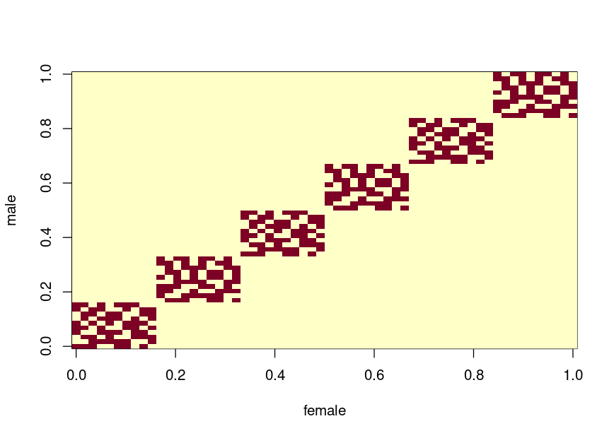

Salamander Data Set
===================

Load the data

``` r
sala <- read.csv("salam.csv", header = TRUE, sep = "")
head(sala)
#>   y wsm wsf female male
#> 1 1   0   0      1    1
#> 2 1   0   0      1    4
#> 3 1   0   0      1    5
#> 4 0   1   0      1    6
#> 5 1   1   0      1    9
#> 6 1   1   0      1   10

sala <- within(sala, {
  female <- as.factor(female)
  male   <- as.factor(male) 
})
```

Assign cluster (TODO: we must be able to this in a smart way...)

``` r
sala$cl <- with(sala, {
  cl <- rep(NA_integer_, length(female))
  
  grp <- 0L
  repeat {
    # take first NA
    grp <- grp + 1L
    cur <- which(is.na(cl))
    if(length(cur) == 0L)
      # not any left. Thus return
      break
    
    new_members <- cur[1L]
    repeat {
      cl[new_members] <- grp
      male_in_grp    <- male  [new_members]
      females_in_grp <- female[new_members]
      
      # find mates of the new members
      new_members <- which(
        ((male %in% male_in_grp) | (female %in% females_in_grp)) & 
          is.na(cl))
      if(length(new_members) == 0L)
        break
    }
  }
  
  cl
})

# turns out that the data was already sorted...
stopifnot(!is.unsorted(sala$cl))
with(sala, {
  female <- as.integer(female)
  male   <- as.integer(male)
  
  p <- length(unique(female))
  stopifnot(length(unique(male)) == p)
  
  X <- matrix(0L, p, p)
  for(i in 1:length(female))
    X[female[i], male[i]] <- 1L
  
  # show plot of males and females that mate
  image(X, xlab = "female", ylab = "male")
})
```



Assign the formulas that we need

``` r
# Elements: 
#   X: fixed effect formula.
#   Z: random effect formula.
frm <- list(X = ~ wsm * wsf, Z = ~ female + male - 1)
```

Fit Model Without Random Effects
--------------------------------

``` r
summary(glm_fit <- glm(update(frm$X, y ~ .), binomial("probit"), sala))
#> 
#> Call:
#> glm(formula = update(frm$X, y ~ .), family = binomial("probit"), 
#>     data = sala)
#> 
#> Deviance Residuals: 
#>    Min      1Q  Median      3Q     Max  
#>  -1.48   -1.27    0.90    0.90    1.76  
#> 
#> Coefficients:
#>             Estimate Std. Error z value Pr(>|z|)    
#> (Intercept)    0.431      0.137    3.15   0.0016 ** 
#> wsm           -0.291      0.190   -1.53   0.1264    
#> wsf           -1.233      0.202   -6.10    1e-09 ***
#> wsm:wsf        1.524      0.278    5.49    4e-08 ***
#> ---
#> Signif. codes:  0 '***' 0.001 '**' 0.01 '*' 0.05 '.' 0.1 ' ' 1
#> 
#> (Dispersion parameter for binomial family taken to be 1)
#> 
#>     Null deviance: 498.17  on 359  degrees of freedom
#> Residual deviance: 445.57  on 356  degrees of freedom
#> AIC: 453.6
#> 
#> Number of Fisher Scoring iterations: 4

logLik(glm_fit)
#> 'log Lik.' -222.8 (df=4)
```

lmec
----

Will not work as the `varstruct` argument can only be `"unstructured"` or `"diagonal"`.

Stan
----

Here is the Stan file we use.

``` stan
data {
  int<lower=0> J;          // number of mating pairs
  int<lower=0> K;          // number of females (and number of males)
  int y[J];                // indicator for mating (0=no, 1=yes)
  vector[J] wsm;           // indicator for whether the male is white side (1) or rough side (0)
  vector[J] wsf;           // indicator for whether the female is white side (1) or rough side (0)
  int male[J];             // index for jth male
  int female[J];           // index for jth female
}
parameters {
  real beta[4];            // fixed effects
  real<lower=0> sigma[2];  // sd for male and female random effects, respectively
  vector[K] u;             // random effect for kth male
  vector[K] v;             // random effect for kth female
}
transformed parameters {
  vector[J] theta;
  theta = beta[1] + beta[2] * wsm + beta[3] * wsf + beta[4] * wsf .* wsm +
    u[male] + v[female];
}
model {
  y ~ bernoulli(Phi(theta));
  target += normal_lpdf(u | 0, sigma[1]);
  target += normal_lpdf(v | 0, sigma[2]);
}
```

Next, we fit the model and show the model estimates.

``` r
library(rstan)
options(mc.cores = parallel::detectCores(logical = FALSE))
rstan_options(auto_write = TRUE)
```

``` r
stan_fit <- within(list(), {
  sala <- as.list(sala)
  sala <- within(sala, {
    J <- length(y)
    K <- length(unique(female))
    female <- as.integer(female)
    male   <- as.integer(male)
  })
  stopifnot(sala$K == length(unique(sala$male)))
  
  fit <- stan(
    file = "salamander.stan", # Stan program
    data = sala,              # named list of data
    chains = 4L,              # number of Markov chains
    warmup = 10000L,          # number of warmup iterations per chain
    iter = 20000L,            # total number of iterations per chain
    cores = 2L,               # number of cores (could use one per chain)
    refresh = 0L,             # no progress shown
    seed = 91154163L)
  
  print(fit, pars = c("beta", "sigma"))
})
#> Inference for Stan model: salamander.
#> 4 chains, each with iter=20000; warmup=10000; thin=1; 
#> post-warmup draws per chain=10000, total post-warmup draws=40000.
#> 
#>           mean se_mean   sd  2.5%   25%   50%   75% 97.5% n_eff Rhat
#> beta[1]   0.62       0 0.26  0.13  0.45  0.62  0.79  1.15 14508    1
#> beta[2]  -0.43       0 0.29 -1.02 -0.62 -0.43 -0.23  0.14 19425    1
#> beta[3]  -1.81       0 0.35 -2.54 -2.03 -1.80 -1.57 -1.15 10552    1
#> beta[4]   2.22       0 0.38  1.51  1.96  2.22  2.47  2.98 11073    1
#> sigma[1]  0.72       0 0.16  0.42  0.60  0.71  0.82  1.06  4804    1
#> sigma[2]  0.76       0 0.17  0.45  0.65  0.75  0.87  1.13  4811    1
#> 
#> Samples were drawn using NUTS(diag_e) at Mon Feb  3 16:31:54 2020.
#> For each parameter, n_eff is a crude measure of effective sample size,
#> and Rhat is the potential scale reduction factor on split chains (at 
#> convergence, Rhat=1).
```

glmer (Laplace Approximation)
-----------------------------

We only use the Laplace approximation from `glmer` as adaptive Gauss–Hermite quadrature is not available with crossed random effects (and would take forever with this data set).

``` r
library(lme4)
```

``` r
glmer_fit <- within(list(), {
  frm_use <- y ~ wsm * wsf + (1 | female) + (1 | male)
  fit_laplace <- glmer(frm_use, sala, binomial("probit"))

  msg <- "Laplace fit"
  cat(msg, "\n", rep("-", nchar(msg)), "\n", sep ="")
  print(fit_laplace)
  
  # AGHQ does not work...
  try(fit_aghq <- glmer(frm_use, sala, binomial("probit"), nAGQ = 5L))
})
#> Laplace fit
#> -----------
#> Generalized linear mixed model fit by maximum likelihood (Laplace
#>   Approximation) [glmerMod]
#>  Family: binomial  ( probit )
#> Formula: y ~ wsm * wsf + (1 | female) + (1 | male)
#>    Data: sala
#>      AIC      BIC   logLik deviance df.resid 
#>    432.2    455.5   -210.1    420.2      354 
#> Random effects:
#>  Groups Name        Std.Dev.
#>  female (Intercept) 0.626   
#>  male   (Intercept) 0.576   
#> Number of obs: 360, groups:  female, 60; male, 60
#> Fixed Effects:
#> (Intercept)          wsm          wsf      wsm:wsf  
#>       0.601       -0.419       -1.731        2.140  
#> Error in updateGlmerDevfun(devfun, glmod$reTrms, nAGQ = nAGQ) : 
#>   nAGQ > 1 is only available for models with a single, scalar random-effects term
```

CDF Approximation and Genz & Monahan Approximation
--------------------------------------------------

Fit models with the CDF approximation like in Pawitan et al. (2004) and the method by Genz and Monahan (1999).

``` r
library(mixprobit)
library(parallel)
```

<!-- knitr::opts_knit$set(output.dir = ".") -->
<!-- knitr::load_cache("cdf_arpx", path = "cache-salamander/") -->
``` r
mix_prob_fit <- within(list(), {
  # setup cluster
  n_threads <- 6L
  cl <- makeCluster(n_threads)
  on.exit(stopCluster(cl))
  
  # run fit to get starting values
  pre_fit <- glm(update(frm$X, y ~ .), family = binomial("probit"), sala)
  X_terms <- delete.response(terms(pre_fit))
  
  # get data for each cluster
  dat <- lapply(split(sala, sala$cl), function(cl_dat)
    within(list(), {
      cl_dat$female <- droplevels(cl_dat$female)
      cl_dat$male   <- droplevels(cl_dat$male)
      
      y <- cl_dat$y 
      Z <- t(model.matrix(frm$Z, cl_dat))
      X <-   model.matrix(X_terms, cl_dat)
      
      p <- NROW(Z)
      is_male <- which(grepl("^male", rownames(Z)))
      var_idx <- as.integer(grepl("^male", rownames(Z)))
  }))
  
  # starting values
  beta <- pre_fit$coefficients
  fnscale <- abs(c(logLik(pre_fit)))
  q <- length(beta)
  par <- c(beta, log(c(.1, .1)))
  
  # negative log-likelihood function
  ll_func <- function(par, seed = 1L, maxpts = 100000L, abseps = -1, 
                      releps = 1e-2, meth){
    if(!is.null(seed))
      set.seed(seed)
    clusterSetRNGStream(cl)
    beta <-          head(par,  q)
    vars  <- exp(2 * tail(par, -q))
    clusterExport(cl, c("beta", "vars", "maxpts", "abseps", "releps"), 
                  environment())
    
    ll_terms <- parSapply(cl, dat, function(cl_dat){
      with(cl_dat, {
        eta <- drop(X %*% beta)
        Sigma <- diag(nrow(Z))
        
        diag(Sigma)[-is_male] <- vars[1L]
        diag(Sigma)[ is_male] <- vars[2L]
        
        out <- if(identical(mixprobit:::aprx_binary_mix_cdf, meth))
          meth(
            y = y, eta = eta, Sigma = Sigma, Z = Z, maxpts = maxpts, 
            abseps = abseps, releps = releps)
        else if(identical(mixprobit:::aprx_binary_mix, meth))
          meth(
            y = y, eta = eta, Sigma = Sigma, Z = Z, mxvals = maxpts, 
            epsabs = abseps, epsrel = releps, key = 2L)
        else
          stop("method not implemented")
        
        c(ll = log(c(out)), err = attr(out, "error"), 
          inform = attr(out, "inform"))
      })
    })
    
    inform <- ll_terms["inform", ]
    if(any(inform > 0))
      warning(paste(
        "Got these inform values: ", 
        paste0(unique(inform), collapse = ", ")))
    
    -sum(ll_terms["ll", ])
  }
  
  # C++ version
  ll_cpp <- function(par, seed = 1L, maxpts = 100000L, abseps = -1, 
                     releps = 1e-2){
    if(!is.null(seed))
      set.seed(seed)
    
    beta    <- head(par,  q)
    log_sds <- tail(par, -q)
    
    out <- mixprobit:::aprx_binary_mix_cdf_salamander(
      data = dat, beta = beta, log_sds = log_sds, n_threads = n_threads, 
      maxpts = maxpts, abseps = abseps, releps = releps)
    
    -out
  }
  
  # use the methods to find the optimal parameters
  take_time <- function(expr){
    ti <- eval(bquote(system.time(out <- .(substitute(expr)))), 
               parent.frame())
    stopifnot(is.list(out) && is.null(out$time))
    out$time <- ti
    out
  }
  
  fit_CDF_cpp <- take_time(optim(
    par, ll_cpp, method = "BFGS", 
    control = list(trace = 3L, fnscale = fnscale)))
  fit_CDF_cpp$q <- q
  fit_CDF <- take_time(optim(
    par, ll_func, method = "BFGS", meth = mixprobit:::aprx_binary_mix_cdf,
    control = list(trace = 3L, fnscale = fnscale)))
  fit_CDF$q <- q
  fit_Genz_Monahan <- take_time(optim(
    par, ll_func, method = "BFGS", meth = mixprobit:::aprx_binary_mix,
    control = list(trace = 3L, fnscale = fnscale)))
  fit_Genz_Monahan$q <- q
})
#> initial  value 0.993384 
#> iter  10 value 0.932613
#> iter  20 value 0.929376
#> iter  30 value 0.928726
#> final  value 0.928548 
#> converged
#> initial  value 0.993384 
#> iter  10 value 0.935562
#> final  value 0.930485 
#> converged
#> initial  value 0.993384 
#> iter  10 value 0.938278
#> iter  20 value 0.931070
#> iter  30 value 0.931060
#> final  value 0.931059 
#> converged
```

Show the estimates of the methods.

``` r
local({
  show_res <- function(fit){
    nam <- deparse(substitute(fit))
    cat("\n", nam, "\n", rep("-", nchar(nam)), "\n", sep = "")
    
    cat("\nFixed effects\n")
    q <- fit$q
    print(head(fit$par,  q))
    
    cat("\nRandom effect standard deviations")
    print(exp(tail(fit$par, -q)))
    
    cat(sprintf("\nLog-likelihood estimate %.2f\nComputation time %.2f (seconds)\n", 
                -fit$value, fit$time["elapsed"]))
    cat("\n")
  }
  
  with(mix_prob_fit, show_res(fit_CDF))
  with(mix_prob_fit, show_res(fit_CDF_cpp))
  with(mix_prob_fit, show_res(fit_Genz_Monahan))
})
#> 
#> fit_CDF
#> -------
#> 
#> Fixed effects
#> (Intercept)         wsm         wsf     wsm:wsf 
#>      0.5085     -0.2670     -1.5778      1.8248 
#> 
#> Random effect standard deviations              
#> 0.6723 0.6236 
#> 
#> Log-likelihood estimate -207.30
#> Computation time 120.41 (seconds)
#> 
#> 
#> fit_CDF_cpp
#> -----------
#> 
#> Fixed effects
#> (Intercept)         wsm         wsf     wsm:wsf 
#>      0.5877     -0.3930     -1.6894      2.0879 
#> 
#> Random effect standard deviations              
#> 0.7132 0.6772 
#> 
#> Log-likelihood estimate -206.87
#> Computation time 269.62 (seconds)
#> 
#> 
#> fit_Genz_Monahan
#> ----------------
#> 
#> Fixed effects
#> (Intercept)         wsm         wsf     wsm:wsf 
#>      0.5774     -0.4255     -1.6516      2.1044 
#> 
#> Random effect standard deviations              
#> 0.7116 0.6756 
#> 
#> Log-likelihood estimate -207.43
#> Computation time 370.20 (seconds)
```

I am not sure but I suspect that the CDF approximation is more precise.

References
----------

Genz, Alan, and John Monahan. 1999. “A Stochastic Algorithm for High-Dimensional Integrals over Unbounded Regions with Gaussian Weight.” *Journal of Computational and Applied Mathematics* 112 (1): 71–81. doi:[https://doi.org/10.1016/S0377-0427(99)00214-9](https://doi.org/https://doi.org/10.1016/S0377-0427(99)00214-9).

Pawitan, Y., M. Reilly, E. Nilsson, S. Cnattingius, and P. Lichtenstein. 2004. “Estimation of Genetic and Environmental Factors for Binary Traits Using Family Data.” *Statistics in Medicine* 23 (3): 449–65. doi:[10.1002/sim.1603](https://doi.org/10.1002/sim.1603).
